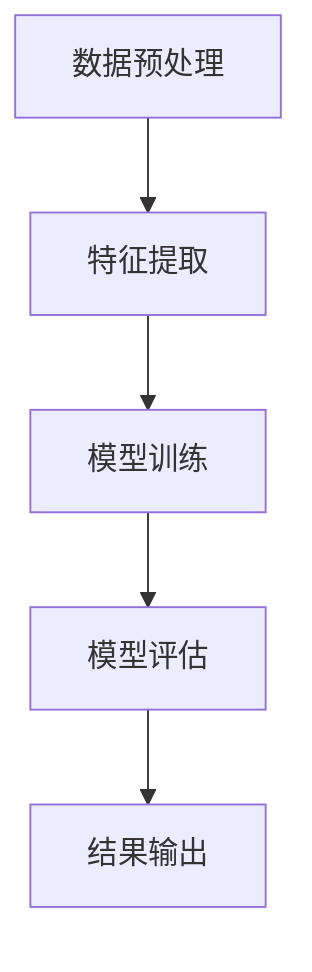
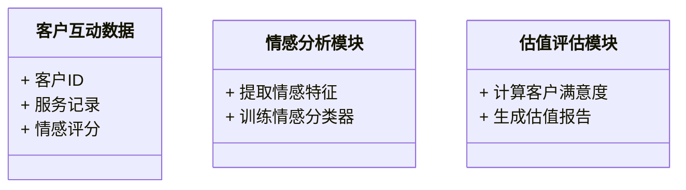

                 


# 企业估值中的情感AI客户服务平台评估

**关键词：企业估值、情感AI、客户服务平台、情感计算、人工智能、客户满意度**

**摘要：**  
本文探讨了在企业估值过程中，如何利用情感AI技术对客户服务平台进行评估。通过分析情感AI的核心概念、算法原理、系统架构以及实际项目案例，本文旨在为企业提供一种基于情感计算的客户服务平台评估方法，从而更准确地评估企业价值。文章结合理论与实践，详细介绍了情感AI在企业估值中的应用，为相关领域提供了有价值的参考。

---

## 目录

### 第一部分：背景介绍

#### 1.1 情感AI与客户服务平台的基本概念  
- 情感计算的定义  
- 客户服务平台的功能与重要性  
- 情感AI在客户服务平台中的应用

#### 1.2 问题背景  
- 传统企业估值方法的局限性  
- 客户满意度对企业估值的影响  
- 情感AI在企业估值中的必要性

#### 1.3 问题描述  
- 客户互动数据的复杂性  
- 如何量化客户情感数据对企业价值的影响

#### 1.4 问题解决方法  
- 引入情感AI技术  
- 构建情感AI驱动的客户服务平台评估模型

#### 1.5 边界与外延  
- 情感AI的应用范围  
- 系统的局限性与适用场景

#### 1.6 核心要素  
- 数据采集  
- 情感分析模型  
- 客户满意度评分

---

### 第二部分：核心概念与联系

#### 2.1 情感AI的核心概念  
- 情感计算的基本原理  
- 情感特征的提取方法  
- 情感分类算法

#### 2.2 情感AI与客户服务平台的联系  
- 情感AI如何改善客户体验  
- 情感数据如何影响企业估值

#### 2.3 情感AI系统的ER图  
```mermaid
er
    title 情感AI系统ER图
    Customer客户 --> ServiceRecord服务记录：一对一
    ServiceRecord服务记录 --> EmotionalData情感数据：一对多
    Customer客户 --> EmotionalData情感数据：一对多
    Customer客户 --> ServiceRepresentative服务代表：一对多
```

#### 2.4 情感分析方法对比  
| 方法         | 描述                                                                 | 优缺点                     |
|--------------|----------------------------------------------------------------------|---------------------------|
| 基于规则     | 使用预定义规则进行情感分类                                           | 简单易实现，但灵活性差       |
| 机器学习     | 使用训练数据训练模型进行情感分类                                     | 高度可定制，但需要大量数据   |
| 深度学习     | 使用神经网络进行情感分类                                             | 高精度，但计算资源消耗大     |

---

### 第三部分：算法原理讲解

#### 3.1 情感分类算法流程  


#### 3.2 情感分类代码实现  
```python
from sklearn.feature_extraction.text import TfidfVectorizer
from sklearn.svm import SVC
from sklearn.pipeline import Pipeline

# 数据预处理
X = ["客户反馈文本1", "客户反馈文本2", ...]
y = [1, 0, 1, ...]  # 1表示正面，0表示负面

# 特征提取与模型训练
model = Pipeline([
    ('tfidf', TfidfVectorizer()),
    ('svc', SVC())
])
model.fit(X, y)

# 模型预测
print(model.predict(["新的客户反馈文本"])[0])
```

#### 3.3 情感分类的数学模型  
朴素贝叶斯分类器的公式：  
$$ P(y|x) = \frac{P(x|y)P(y)}{P(x)} $$  
其中，$y$ 是情感类别（正面或负面），$x$ 是客户反馈文本。

---

### 第四部分：系统分析与架构设计

#### 4.1 问题场景介绍  
- 企业如何利用情感AI评估其客户服务平台  
- 系统目标：提升客户满意度，优化企业估值模型

#### 4.2 系统功能设计  


#### 4.3 系统架构设计  


#### 4.4 系统接口设计  
```mermaid
sequence
    title 系统交互流程
    用户发送反馈 --> API Gateway
    API Gateway --> Service Layer
    Service Layer --> 情感分析模块
    情感分析模块 --> 估值评估模块
    估值评估模块 --> 用户返回结果
```

---

### 第五部分：项目实战

#### 5.1 环境安装  
- 安装Python、scikit-learn、spaCy等工具

#### 5.2 核心代码实现  
```python
import spacy

# 数据预处理
nlp = spacy.load("en_core_web_sm")
doc = nlp("客户反馈文本")

# 特征提取
features = [token.text for token in doc]

# 模型训练与评估
from sklearn.model_selection import train_test_split
from sklearn.metrics import accuracy_score

X_train, X_test, y_train, y_test = train_test_split(features, labels, test_size=0.2)
model.fit(X_train, y_train)
print(accuracy_score(model.predict(X_test), y_test))
```

#### 5.3 项目总结  
- 成功实现情感AI驱动的客户服务平台评估  
- 可能的改进方向：引入更复杂的模型，如BERT

---

### 第六部分：最佳实践与小结

#### 6.1 总结  
- 情感AI在企业估值中的重要性  
- 系统设计与实现的关键点

#### 6.2 注意事项  
- 数据质量的重要性  
- 模型选择与优化

#### 6.3 拓展阅读  
- 推荐相关书籍和论文

---

**作者：AI天才研究院/AI Genius Institute & 禅与计算机程序设计艺术 /Zen And The Art of Computer Programming**

