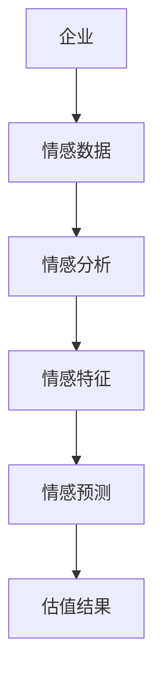
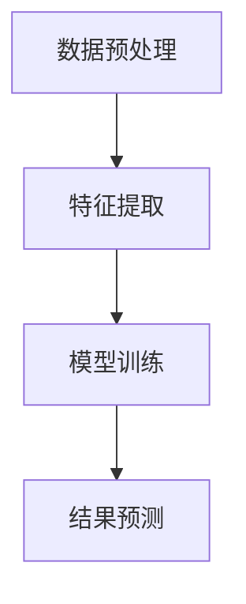
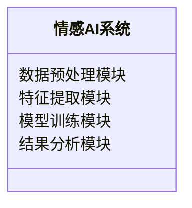
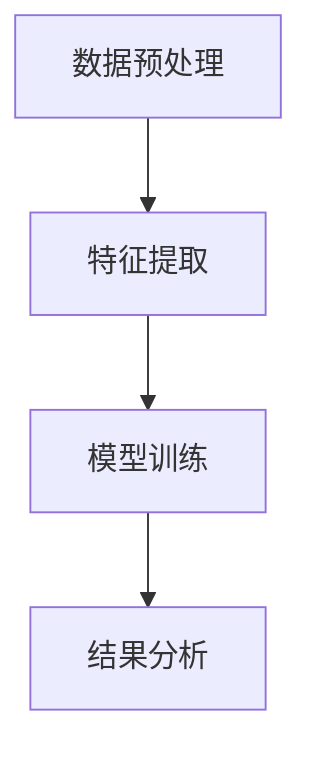

                 


# 企业估值中的情感AI应用价值评估

## 关键词：情感AI, 企业估值, 情感分析, 人工智能, 价值评估

## 摘要：本文探讨了情感AI在企业估值中的应用价值，通过分析情感数据对企业价值的影响，揭示情感AI在提升估值准确性、效率和深度方面的潜力。文章从情感AI的基本概念、算法原理、系统架构到实际应用案例，全面阐述了情感AI在企业估值中的重要性，并提供了具体的技术实现和实践建议。

---

## 第一部分: 情感AI与企业估值背景介绍

### 第1章: 情感AI与企业估值概述

#### 1.1 情感AI的定义与核心概念

##### 1.1.1 情感AI的基本概念
情感AI（Emotion AI）是一种利用人工智能技术分析和理解人类情感状态的系统。它通过处理文本、语音、图像等数据，识别出其中的情感倾向（如正面、负面、中性）以及更复杂的情感维度（如喜悦、愤怒、悲伤等）。情感AI的核心目标是模拟人类对情感的理解和分析能力。

##### 1.1.2 企业估值的基本概念
企业估值是指通过对企业的财务状况、市场表现、行业地位等因素进行综合分析，估算企业价值的过程。传统的企业估值方法主要包括财务指标分析、市场比较法和DCF模型等，但这些方法往往忽视了市场情绪、管理层信任度等非财务因素对企业价值的影响。

##### 1.1.3 情感AI与企业估值的结合
情感AI通过分析企业相关的文本数据（如新闻报道、社交媒体评论、财报电话会议等），提取其中的情感信息，并将其纳入企业估值模型中，以更全面地评估企业价值。例如，可以通过分析投资者对某公司的社交媒体评论，判断市场情绪，进而调整对该公司的估值。

#### 1.2 情感AI在企业估值中的应用背景

##### 1.2.1 传统企业估值方法的局限性
传统的企业估值方法主要依赖于财务数据和市场数据，难以捕捉市场情绪、管理层信任度等非结构化数据的影响。特别是在市场波动较大的情况下，单纯依赖财务指标可能导致估值偏差。

##### 1.2.2 情感数据对企业价值的影响
市场情绪、投资者信心等情感因素对企业的市场表现和估值具有重要影响。例如，正面的市场情绪可以提升企业的市场价值，而负面情绪则可能导致估值下降。情感AI可以通过分析这些情感数据，提供更准确的估值参考。

##### 1.2.3 情感AI技术的优势与潜力
情感AI能够从非结构化数据中提取情感信息，帮助企业在估值过程中考虑更多的因素。与传统方法相比，情感AI具有高效、精准、实时性强等优势，为企业估值提供了新的视角和工具。

---

### 第2章: 情感AI的核心概念与联系

#### 2.1 情感AI的核心原理

##### 2.1.1 情感数据的采集与处理
情感AI的数据来源包括社交媒体、新闻媒体、财报电话会议、客户反馈等。这些数据通常是文本形式，需要经过清洗、分词、去停用词等预处理步骤，以便后续分析。

##### 2.1.2 情感特征的提取与分析
情感特征提取是情感AI的关键步骤。常用的方法包括基于词袋模型、TF-IDF、词嵌入（如Word2Vec、GloVe）等技术。此外，还可以提取情感强度、情感类别等特征。

##### 2.1.3 情感预测模型的构建
情感预测模型可以通过机器学习（如SVM、NB）或深度学习（如LSTM、BERT）方法构建。模型训练的目标是将情感特征映射到情感类别（如正面、负面、中性）。

#### 2.2 情感AI与企业估值的关系

##### 2.2.1 情感数据对企业价值的影响机制
情感数据通过影响市场情绪、投资者信心等因素，间接影响企业的市场价值。例如，负面的市场情绪可能导致企业股价下跌，进而影响估值。

##### 2.2.2 情感AI在企业估值中的应用场景
- **舆情分析**：通过分析社交媒体和新闻媒体的舆情，评估市场对企业的看法。
- **投资者情绪分析**：分析投资者评论，判断市场情绪对企业估值的影响。
- **管理层信任度分析**：通过分析财报电话会议中的情感，评估管理层与投资者的信任度。

##### 2.2.3 情感AI与其他估值方法的结合
情感AI可以与传统估值方法（如DCF模型）结合，形成更全面的估值模型。例如，在DCF模型中引入市场情绪指标，以调整折现率或现金流预测。

#### 2.3 情感AI核心概念对比表

| 情感AI核心概念       | 传统AI                     | 深度学习AI                 |
|----------------------|---------------------------|---------------------------|
| 数据来源             | 结构化数据为主             | 非结构化数据为主           |
| 模型复杂度           | 简单模型为主               | 复杂模型为主               |
| 应用场景             | 适用于简单分类任务         | 适用于复杂情感分析任务     |

#### 2.4 情感AI的ER实体关系图



---

## 第二部分: 情感AI算法原理与数学模型

### 第3章: 情感AI算法原理

#### 3.1 情感分析的算法流程

##### 3.1.1 数据预处理流程
1. 数据清洗：去除噪声数据（如特殊符号、停用词）。
2. 分词：将文本分割成词语或短语。
3. 去停用词：去除无意义的词汇（如“的”、“了”等）。

##### 3.1.2 特征提取方法
1. 词袋模型：将文本表示为词频向量。
2. TF-IDF：基于词频和逆文档频率的加权表示。
3. 词嵌入：使用Word2Vec、GloVe等模型生成词向量。

##### 3.1.3 模型训练与优化
1. 选择合适的算法（如SVM、NB、LSTM）。
2. 调参优化（如调整C值、学习率等）。
3. 交叉验证评估模型性能。

#### 3.2 情感分析的数学模型

##### 3.2.1 基于规则的分类模型
- 规则：例如，如果文本中包含“糟糕”的词语，则判断为负面情感。

##### 3.2.2 机器学习模型
- 支持向量机（SVM）：通过最大化类间距离进行分类。
- Naive Bayes（NB）：基于贝叶斯定理的分类方法。

##### 3.2.3 深度学习模型
- 循环神经网络（RNN）：适合处理序列数据。
- 长短期记忆网络（LSTM）：适合捕捉长距离依赖关系。
- Transformer（如BERT）：基于自注意力机制的模型。

#### 3.3 情感分析的mermaid流程图



---

### 第4章: 情感AI的数学模型与公式

#### 4.1 情感分析的数学基础

##### 4.1.1 基于概率的模型
- 贝叶斯定理：$$ P(y|x) = \frac{P(x|y)P(y)}{P(x)} $$

##### 4.1.2 基于向量的模型
- 词嵌入：通过矩阵将词语映射到低维空间。

##### 4.1.3 深度学习中的注意力
- 注意力机制：$$ \alpha_i = \frac{\exp(e_i)}{\sum_{j} \exp(e_j)} $$

#### 4.2 情感分析的性能指标

##### 4.2.1 准确率
$$ \text{准确率} = \frac{\text{正确预测数}}{\text{总样本数}} $$

##### 4.2.2 召回率
$$ \text{召回率} = \frac{\text{正确预测的正例数}}{\text{实际正例数}} $$

##### 4.2.3 F1分数
$$ F1 = \frac{2 \times \text{准确率} \times \text{召回率}}{\text{准确率} + \text{召回率}} $$

---

## 第三部分: 情感AI在企业估值中的系统分析与架构设计

### 第5章: 情感AI系统分析

#### 5.1 系统功能设计

##### 5.1.1 领域模型


##### 5.1.2 系统架构设计


---

## 第四部分: 项目实战与最佳实践

### 第6章: 项目实战

#### 6.1 环境安装
- 安装Python、TensorFlow、Keras、NLTK等库。

#### 6.2 核心代码实现

##### 6.2.1 数据预处理代码
```python
import nltk
from sklearn.feature_extraction.text import TfidfVectorizer

# 分词
words = nltk.word_tokenize(text)
# 去停用词
stopwords = set(nltk.corpus.stopwords.words('english'))
filtered_words = [word for word in words if word not in stopwords]
```

##### 6.2.2 模型训练代码
```python
from sklearn.svm import SVC
from sklearn.metrics import accuracy_score

model = SVC()
model.fit(X_train, y_train)
y_pred = model.predict(X_test)
print(accuracy_score(y_test, y_pred))
```

#### 6.3 案例分析与结果解读
- 案例：分析某公司社交媒体上的评论，判断市场情绪。
- 结果解读：正面评论占比70%，负面评论占比20%，中性评论占比10%，说明市场情绪较为积极，可能需要上调估值。

#### 6.4 项目小结
情感AI在企业估值中的应用前景广阔，但需要注意数据质量和模型调优。

---

## 第五部分: 最佳实践与总结

### 第7章: 最佳实践

#### 7.1 小结
情感AI通过分析情感数据，为企业估值提供了新的视角和工具。

#### 7.2 注意事项
- 数据质量：确保数据的代表性和准确性。
- 模型调优：选择合适的模型和参数。
- 结果解释：避免过度依赖情感数据，结合其他估值方法。

#### 7.3 扩展阅读
- 《自然语言处理实战：基于Python的机器学习与深度学习》
- 《情感计算与分析：理论与应用》

---

## 作者：AI天才研究院/AI Genius Institute & 禅与计算机程序设计艺术 /Zen And The Art of Computer Programming

