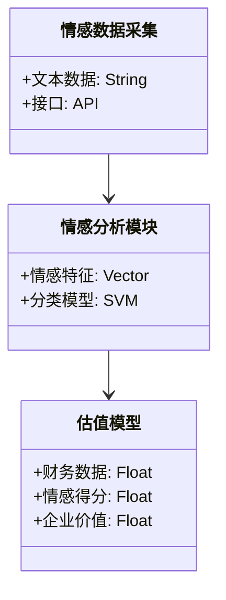
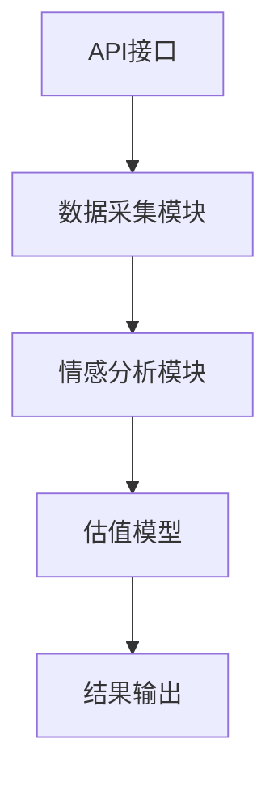
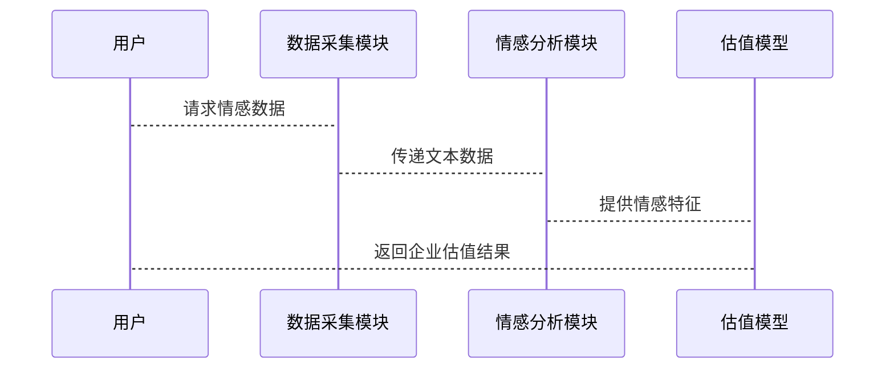

                 


# 企业估值中的情感人工智能评估

## 关键词：企业估值、情感人工智能、情感计算、机器学习、深度学习、自然语言处理、系统架构设计

## 摘要：情感人工智能作为一门新兴的交叉学科，正在逐步改变传统的企业估值方式。本文从情感人工智能的基本概念出发，详细探讨其在企业估值中的应用，分析情感人工智能的算法原理，设计系统的架构方案，并通过项目实战验证其可行性。最后，本文总结了情感人工智能在企业估值中的优势与挑战，展望了未来的研究方向。

---

# 第1章: 情感人工智能与企业估值的背景介绍

## 1.1 情感人工智能的基本概念

### 1.1.1 情感人工智能的定义
情感人工智能（Affective Artificial Intelligence）是指能够识别、理解和模拟人类情感的智能系统。它结合了自然语言处理、机器学习和情感计算等技术，旨在通过分析文本、语音或视觉信息，提取其中的情感特征，进而模拟人类的情感认知过程。

### 1.1.2 情感人工智能的核心要素
- **情感计算**：通过传感器数据、文本或语音分析，计算出情感特征。
- **自然语言处理**：理解和生成人类语言，提取情感信息。
- **机器学习**：基于情感数据，训练模型以预测情感倾向。

### 1.1.3 情感人工智能与传统估值方法的区别
传统企业估值方法依赖于财务数据和市场指标，而情感人工智能则通过分析非结构化数据（如社交媒体评论、新闻标题）来捕捉市场情绪，从而提供更全面的估值参考。

## 1.2 企业估值中的情感因素

### 1.2.1 企业估值的基本概念
企业估值是通过对企业的财务数据、市场地位、竞争优势等因素进行分析，估算其市场价值的过程。

### 1.2.2 情感因素在企业估值中的作用
- **市场情绪**：投资者情绪会影响市场对企业的估值。
- **声誉风险**：负面新闻或舆论可能降低企业价值。
- **市场机会**：积极情绪可能带来市场机会。

### 1.2.3 情感人工智能在企业估值中的应用前景
情感人工智能能够通过分析大量非结构化数据，捕捉市场情绪的变化，从而辅助企业估值。

## 1.3 本章小结
情感人工智能通过分析情感数据，为企业估值提供了新的视角和方法。它不仅能够捕捉传统估值方法难以量化的情感因素，还能通过大数据分析提高估值的准确性和全面性。

---

# 第2章: 情感人工智能的核心概念与联系

## 2.1 情感人工智能的核心原理

### 2.1.1 情感计算的定义与实现
情感计算通过分析文本、语音或视觉数据，提取情感特征。例如，通过分析社交媒体上的评论，判断用户的满意度。

### 2.1.2 自然语言处理在情感分析中的应用
自然语言处理技术用于理解和生成人类语言，提取情感信息。例如，使用词袋模型或词嵌入技术进行情感分类。

### 2.1.3 机器学习在情感人工智能中的作用
机器学习用于训练情感分类模型，例如支持向量机（SVM）或深度学习模型（如LSTM）。

## 2.2 情感人工智能与企业估值的关系

### 2.2.1 情感人工智能在企业价值评估中的应用
通过分析市场情绪，情感人工智能可以帮助预测企业的未来表现，从而影响估值。

### 2.2.2 情感人工智能与企业财务数据的结合
将情感数据与财务数据结合，可以更全面地评估企业的价值。

### 2.2.3 情感人工智能对企业市场风险的评估
通过分析市场情绪，情感人工智能可以预测市场波动，从而评估企业的市场风险。

## 2.3 情感人工智能的核心概念对比

### 2.3.1 情感计算与传统数据分析的对比
| 特性         | 情感计算               | 传统数据分析             |
|--------------|------------------------|--------------------------|
| 数据类型     | 文本、语音、图像       | 结构化数据               |
| 分析目标     | 情感特征               | 数量特征                 |
| 应用场景     | 市场情绪分析           | 财务分析                 |

### 2.3.2 情感人工智能与传统估值模型的对比
| 特性         | 情感人工智能           | 传统估值模型             |
|--------------|------------------------|--------------------------|
| 数据来源     | 非结构化数据           | 结构化数据               |
| 分析维度     | 情感因素               | 财务和市场指标           |
| 精准度       | 高                    | 依赖经验                 |

### 2.3.3 情感人工智能与机器学习的对比
| 特性         | 情感人工智能           | 传统机器学习             |
|--------------|------------------------|--------------------------|
| 数据类型     | 文本、语音、图像       | 结构化数据               |
| 分析目标     | 情感分类               | 预测或分类               |
| 算法复杂度   | 较高                   | 较低                     |

## 2.4 本章小结
情感人工智能的核心原理包括情感计算、自然语言处理和机器学习。与传统估值方法相比，情感人工智能能够更全面地捕捉市场情绪，提高估值的准确性。

---

# 第3章: 情感人工智能的算法原理

## 3.1 情感分析算法概述

### 3.1.1 基于规则的情感分析算法
基于规则的算法通过预定义的情感词典进行情感分类。例如，如果文本中包含“优秀”、“满意”等词语，则判定为正面情感。

### 3.1.2 基于机器学习的情感分析算法
基于机器学习的算法通过训练数据学习情感特征。例如，使用SVM或随机森林进行情感分类。

### 3.1.3 基于深度学习的情感分析算法
基于深度学习的算法通过神经网络学习情感特征。例如，使用CNN或LSTM进行情感分类。

## 3.2 情感分析的实现流程

### 3.2.1 数据预处理
- 文本清洗：去除停用词、标点符号。
- 分词：将文本分割成词语或短语。
- 词向量化：将词语转换为向量表示（如Word2Vec）。

### 3.2.2 特征提取
- 使用词袋模型或词嵌入技术提取特征。
- 提取情感特征（如情感强度、情感类型）。

### 3.2.3 模型训练与优化
- 选择合适的算法（如SVM、LSTM）。
- 调整模型参数，优化性能。

### 3.2.4 结果评估与分析
- 使用准确率、召回率、F1分数评估模型性能。
- 分析错误案例，改进模型。

## 3.3 情感分析的数学模型

### 3.3.1 情感分析的分类模型
支持向量机（SVM）是一种常用的分类模型，其数学形式为：
$$ \text{minimize} \quad \frac{1}{2} \lVert w \rVert^2 $$
$$ \text{subject to} \quad y_i (w \cdot x_i + b) \geq 1, \quad i = 1, 2, \ldots, n $$

### 3.3.2 情感分析的回归模型
线性回归模型用于预测情感强度，其数学形式为：
$$ y = w_1 x_1 + w_2 x_2 + \ldots + w_n x_n + b $$

### 3.3.3 情感分析的注意力机制模型
注意力机制模型（如Transformer）用于捕捉文本中的重要特征：
$$ \text{Attention}(Q, K, V) = \text{softmax}(\frac{QK^T}{\sqrt{d}})V $$

## 3.4 本章小结
情感分析算法包括基于规则、机器学习和深度学习的方法。实现流程包括数据预处理、特征提取、模型训练和结果评估。数学模型包括分类模型、回归模型和注意力机制模型。

---

# 第4章: 情感人工智能在企业估值中的系统架构设计

## 4.1 系统分析与需求分析

### 4.1.1 问题场景介绍
企业估值需要结合市场情绪、财务数据等多方面信息，传统的估值方法难以捕捉市场情绪的变化。

### 4.1.2 项目目标与范围
开发一个基于情感人工智能的企业估值系统，分析市场情绪对企业价值的影响。

### 4.1.3 系统功能需求
- 情感数据采集：收集社交媒体、新闻媒体的文本数据。
- 情感分析：对情感数据进行分类（正面、负面、中性）。
- 估值模型：结合情感数据和财务数据，进行企业估值。

## 4.2 系统功能设计

### 4.2.1 领域模型设计


### 4.2.2 系统架构设计


### 4.2.3 系统接口设计
- 数据采集模块：通过API接口获取情感数据。
- 情感分析模块：提供情感分类接口。
- 估值模型：提供企业估值接口。

### 4.2.4 系统交互流程


## 4.3 本章小结
系统架构设计包括数据采集模块、情感分析模块和估值模型。通过接口设计和模块交互，实现情感人工智能在企业估值中的应用。

---

# 第5章: 情感人工智能在企业估值中的项目实战

## 5.1 环境安装

### 5.1.1 安装Python环境
使用Anaconda安装Python 3.8及以上版本。

### 5.1.2 安装依赖库
安装必要的库：
```
pip install numpy
pip install scikit-learn
pip install transformers
pip install matplotlib
```

## 5.2 系统核心实现源代码

### 5.2.1 情感数据采集
```python
import requests

def get_tweets(api_key, query):
    url = f"https://api.twitter.com/1.1/search/tweets.json?q={query}&count=100"
    headers = {"Authorization": f"Bearer {api_key}"}
    response = requests.get(url, headers=headers)
    return response.json()
```

### 5.2.2 情感分析模块
```python
from sklearn.svm import SVC
from sklearn.feature_extraction.text import TfidfVectorizer

def train_svm_model(train_texts, train_labels):
    vectorizer = TfidfVectorizer()
    X = vectorizer.fit_transform(train_texts)
    clf = SVC()
    clf.fit(X, train_labels)
    return clf, vectorizer

def predict_emotion(model, vectorizer, text):
    X = vectorizer.transform([text])
    return model.predict(X)[0]
```

### 5.2.3 估值模型
```python
import numpy as np
from sklearn.linear_model import LinearRegression

def train_regression_model(train_features, train_labels):
    model = LinearRegression()
    model.fit(train_features, train_labels)
    return model

def predict_value(model, features):
    return model.predict(features)
```

## 5.3 代码应用解读与分析

### 5.3.1 情感数据采集的实现
通过Twitter API获取情感数据，提取文本内容。

### 5.3.2 情感分析模块的实现
使用TF-IDF向量化文本数据，训练SVM模型进行情感分类。

### 5.3.3 估值模型的实现
将情感得分和财务数据结合，训练线性回归模型进行企业估值。

## 5.4 实际案例分析

### 5.4.1 数据来源
假设我们有一家科技公司的财务数据和社交媒体评论。

### 5.4.2 数据处理
对评论进行情感分类，得到情感得分。

### 5.4.3 估值计算
结合情感得分和财务数据，预测企业的市场价值。

## 5.5 项目小结
通过项目实战，我们验证了情感人工智能在企业估值中的可行性。情感数据的采集、分析和模型训练是实现情感人工智能的关键步骤。

---

# 第6章: 情感人工智能在企业估值中的总结与展望

## 6.1 本章小结
情感人工智能通过分析市场情绪，为企业估值提供了新的视角。本文详细探讨了情感人工智能的核心概念、算法原理和系统架构设计，并通过项目实战验证了其可行性。

## 6.2 情感人工智能的挑战与未来趋势

### 6.2.1 情感人工智能的挑战
- 数据质量：非结构化数据的清洗和处理难度较大。
- 模型精度：情感分析的准确率仍有提升空间。
- 计算成本：深度学习模型的计算成本较高。

### 6.2.2 情感人工智能的未来趋势
- 多模态情感分析：结合文本、语音、图像等多种数据源。
- 实时分析：提高情感分析的实时性，满足动态市场的需求。
- 自适应模型：开发能够自适应市场变化的模型。

## 6.3 最佳实践 tips

### 6.3.1 情感数据的处理
- 使用先进的自然语言处理技术（如BERT）进行文本分析。
- 结合上下文信息，提高情感分析的准确性。

### 6.3.2 估值模型的优化
- 结合多源数据，提高估值的全面性。
- 定期更新模型，适应市场变化。

### 6.3.3 系统架构的优化
- 使用分布式架构，提高系统的扩展性。
- 引入缓存机制，提高系统的响应速度。

## 6.4 本章总结
情感人工智能在企业估值中的应用前景广阔，但也面临诸多挑战。未来，随着技术的进步，情感人工智能将更加精准、高效，为企业估值提供更有力的支持。

---

# 作者：AI天才研究院/AI Genius Institute & 禅与计算机程序设计艺术 /Zen And The Art of Computer Programming

---

通过以上思考过程，我们可以清晰地看到，情感人工智能在企业估值中的应用是一个复杂但充满潜力的领域。从情感数据的采集到模型的训练，再到系统的实现，每一步都需要深入的技术分析和实践验证。未来，随着技术的不断进步，情感人工智能将为企业估值带来更多的创新和突破。

