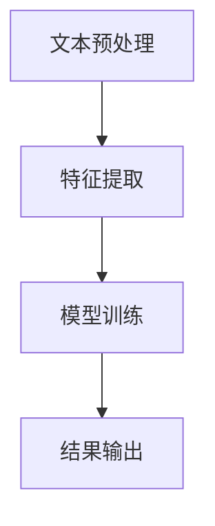
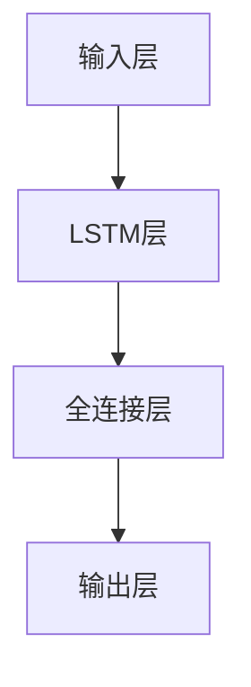
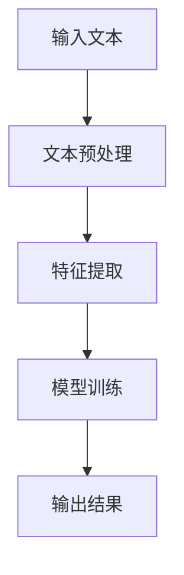
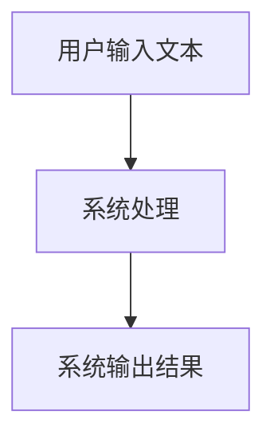

                 


# 企业估值中的情感计算技术应用评估

> **关键词**：企业估值，情感计算，自然语言处理，机器学习，文本挖掘，情感分析，投资决策

> **摘要**：随着人工智能技术的快速发展，情感计算在企业估值中的应用越来越受到关注。本文详细探讨了情感计算技术在企业估值中的核心概念、算法原理、系统架构以及实际应用。通过分析文本数据中的情感信息，结合财务数据，本文提出了一种基于情感计算的企业估值模型，并通过实际案例展示了其在投资决策中的价值。文章还讨论了情感计算技术在企业估值中的优势与挑战，并展望了未来的研究方向。

---

## 第1章 情感计算与企业估值的背景介绍

### 1.1 情感计算的基本概念

#### 1.1.1 情感计算的定义
情感计算（Affective Computing）是人工智能领域的一个重要分支，旨在通过分析和理解人类的情感信息，模拟人类的情感认知过程。情感计算的核心目标是将人类的情感状态转化为可计算的数字化表示。

#### 1.1.2 情感计算的核心要素
情感计算涉及以下几个关键要素：
1. **情感信息的采集**：通过文本、语音、图像等多模态数据获取情感信息。
2. **情感特征的提取**：从原始数据中提取与情感相关的特征，如关键词、语调、表情等。
3. **情感分析模型**：基于机器学习或深度学习算法，对情感特征进行分类和预测。
4. **情感数据的可视化**：将情感信息以图表形式展示，便于理解和分析。

#### 1.1.3 情感计算与企业估值的关系
企业估值是投资决策中的核心环节，传统估值方法主要依赖财务数据和市场指标。然而，市场参与者的主观情绪（如投资者信心、市场情绪）对企业估值有着重要影响。情感计算技术可以通过分析新闻、社交媒体、行业报告等文本数据中的情感信息，为企业的估值提供更全面的参考。

### 1.2 企业估值的传统方法与挑战

#### 1.2.1 传统企业估值方法概述
传统企业估值方法主要包括：
1. **DCF模型**：基于现金流折现法，预测企业未来现金流并进行贴现。
2. **相对估值法**：通过比较可比企业的估值指标（如市盈率、市净率）进行估值。
3. **资产重估法**：基于企业资产的账面价值进行调整。

#### 1.2.2 传统方法的局限性
传统估值方法的局限性主要体现在以下几个方面：
1. **主观性**：估值结果依赖于分析师的判断，可能存在主观偏差。
2. **数据局限**：主要依赖财务数据，难以捕捉市场情绪对企业价值的影响。
3. **实时性**：传统方法难以实时更新，难以应对市场的快速变化。

#### 1.2.3 情感计算技术如何弥补传统方法的不足
情感计算技术可以通过分析市场参与者的文本数据，提取情感信息，并将其融入估值模型中。例如：
1. **新闻情绪分析**：分析财经新闻的情绪倾向，预测市场走势。
2. **社交媒体情绪分析**：通过分析投资者在社交媒体上的评论，评估市场情绪对企业价值的影响。
3. **行业报告情绪分析**：通过分析行业报告中的情感信息，评估行业景气度对企业估值的影响。

---

## 第2章 情感计算的核心概念与技术原理

### 2.1 情感计算的基本原理

#### 2.1.1 情感分析的定义
情感分析是情感计算的核心任务之一，旨在判断文本中表达的情感倾向。情感分析的结果通常分为积极、消极和中性三种。

#### 2.1.2 情感分析的分类
情感分析可以分为以下几种类型：
1. **整体情感分析**：对整段文本的情感倾向进行分类。
2. **细粒度情感分析**：对文本中的特定情感维度（如喜悦、愤怒、悲伤）进行分类。
3. ** Aspect-based 情感分析**：针对文本中的具体方面（如产品质量、服务态度）进行情感分析。

#### 2.1.3 情感分析的流程
情感分析的典型流程包括：
1. **文本预处理**：去除停用词、分词、词干提取等。
2. **特征提取**：提取文本中的情感相关特征，如关键词、情感词典中的词汇。
3. **模型训练**：基于机器学习或深度学习算法，训练情感分类模型。
4. **结果评估**：通过准确率、召回率等指标评估模型性能。

### 2.2 情感计算的关键技术

#### 2.2.1 自然语言处理（NLP）在情感计算中的应用
NLP技术在情感计算中的应用包括：
1. **文本分词**：将文本分割成词语或短语。
2. **情感词典构建**：构建包含情感词汇的词典，用于情感特征提取。
3. **句法分析**：分析句子的语法结构，提取情感特征。

#### 2.2.2 机器学习在情感计算中的应用
机器学习在情感计算中的应用包括：
1. **特征工程**：将文本数据转换为数值特征，如TF-IDF向量。
2. **模型训练**：使用分类算法（如SVM、随机森林、神经网络）训练情感分类模型。
3. **模型优化**：通过交叉验证、网格搜索等方法优化模型参数。

#### 2.2.3 情感计算的数学模型与算法
情感计算的数学模型通常基于概率论和统计学方法。例如，情感分类可以使用朴素贝叶斯算法，其核心公式为：
$$ P(y|x) = \frac{P(x|y)P(y)}{P(x)} $$
其中，$P(y|x)$ 是给定文本$x$的条件下，情感类别$y$的概率。

### 2.3 情感计算的系统架构

#### 2.3.1 系统功能设计
情感计算系统的功能模块包括：
1. **文本预处理模块**：负责文本的清洗和分词。
2. **特征提取模块**：提取情感相关特征。
3. **模型训练模块**：训练情感分类模型。
4. **结果输出模块**：输出情感分析结果。

#### 2.3.2 系统架构设计
以下是情感计算系统的架构图：



---

## 第3章 情感计算在企业估值中的应用

### 3.1 企业文本数据的获取与处理

#### 3.1.1 文本数据的来源
企业文本数据的主要来源包括：
1. **财经新闻**：如金融时报、华尔街日报等。
2. **社交媒体**：如Twitter、LinkedIn等平台上的用户评论。
3. **行业报告**：如券商研究报告、行业分析报告。

#### 3.1.2 文本数据的清洗与预处理
文本清洗的主要步骤包括：
1. **去除停用词**：如“的”、“是”等无意义词汇。
2. **分词处理**：将文本分割成词语或短语。
3. **去标点符号**：去除文本中的标点符号。

#### 3.1.3 文本数据的特征提取
特征提取的主要方法包括：
1. **TF-IDF**：计算每个词语在文本中的重要性。
2. **Word2Vec**：将词语映射为向量表示。
3. **情感词典特征**：基于情感词典提取情感相关特征。

### 3.2 情感分析模型的构建与训练

#### 3.2.1 情感分析模型的训练流程
情感分析模型的训练流程包括：
1. **数据标注**：对文本数据进行人工标注，标注情感类别。
2. **特征提取**：将文本数据转换为数值特征向量。
3. **模型训练**：使用机器学习算法训练情感分类模型。
4. **模型评估**：通过交叉验证评估模型性能。

#### 3.2.2 情感分析模型的评估与优化
模型评估的主要指标包括：
1. **准确率**：分类正确的样本比例。
2. **召回率**：真实情感类别被正确分类的比例。
3. **F1值**：准确率和召回率的调和平均值。

#### 3.2.3 情感分析模型的部署与应用
情感分析模型可以通过API接口对外提供服务，例如：
1. **实时情感分析**：对实时文本数据进行情感分析。
2. **批量情感分析**：对批量文本数据进行情感分析。

### 3.3 情感计算与企业估值的结合

#### 3.3.1 情感数据对企业估值的影响
情感数据可以影响企业的估值，例如：
1. **市场情绪对企业价值的影响**：市场情绪可以通过情感分析提取，并融入估值模型中。
2. **投资者信心与企业估值**：投资者信心可以通过社交媒体上的评论分析得出，并影响企业的估值。

#### 3.3.2 情感数据与财务数据的结合方法
情感数据与财务数据的结合方法包括：
1. **加权融合**：将情感数据与财务数据按权重融合，计算综合估值。
2. **多因子模型**：将情感数据作为因子之一，纳入多因子估值模型中。

#### 3.3.3 情感计算在企业估值中的实际案例
以下是一个实际案例：

**案例**：某科技公司的情感分析与估值
1. **数据来源**：社交媒体评论、财经新闻。
2. **情感分析**：分析文本数据，提取情感特征。
3. **估值模型**：结合情感数据和财务数据，预测企业价值。

---

## 第4章 情感计算技术的算法实现

### 4.1 情感计算的算法原理

#### 4.1.1 基于规则的情感分析
基于规则的情感分析通过匹配情感词典中的词汇，判断文本的情感倾向。例如：
1. **情感词典构建**：构建包含情感词汇的词典，如“高兴”、“悲伤”等。
2. **情感强度计算**：根据情感词汇的强度，计算文本的整体情感倾向。

#### 4.1.2 基于机器学习的情感分析
基于机器学习的情感分析通过训练分类模型，自动判断文本的情感倾向。例如：
1. **特征提取**：将文本数据转换为特征向量。
2. **模型训练**：使用SVM、随机森林等算法训练分类模型。

#### 4.1.3 深度学习在情感分析中的应用
深度学习通过神经网络模型（如LSTM、BERT）进行情感分析，能够捕捉文本的语义信息。例如：
1. **文本表示**：使用词嵌入技术（如Word2Vec、GloVe）表示文本。
2. **模型训练**：使用深度学习模型进行情感分类。

### 4.2 情感计算的数学模型与公式

#### 4.2.1 基于概率的模型
基于概率的模型通常使用贝叶斯定理进行情感分类。例如，朴素贝叶斯分类器的公式为：
$$ P(y|x) = \frac{P(x|y)P(y)}{P(x)} $$

#### 4.2.2 基于深度学习的模型
深度学习模型通常使用神经网络进行情感分类。例如，LSTM模型的结构如下：



---

## 第5章 情感计算在企业估值中的系统架构与设计

### 5.1 系统功能设计

#### 5.1.1 系统功能模块
情感计算系统的功能模块包括：
1. **文本预处理模块**：负责文本的清洗和分词。
2. **特征提取模块**：提取情感相关特征。
3. **模型训练模块**：训练情感分类模型。
4. **结果输出模块**：输出情感分析结果。

#### 5.1.2 系统功能流程
以下是系统功能流程图：



### 5.2 系统架构设计

#### 5.2.1 系统架构图
以下是系统的架构图：


#### 5.2.2 系统接口设计
系统接口设计包括：
1. **输入接口**：接收文本数据。
2. **输出接口**：输出情感分析结果。

### 5.3 系统交互设计

#### 5.3.1 系统交互流程
以下是系统交互流程图：



#### 5.3.2 系统交互步骤
系统交互步骤包括：
1. **用户输入文本**：用户通过界面或API输入文本数据。
2. **系统处理文本**：系统对文本进行预处理、特征提取和模型训练。
3. **系统输出结果**：系统输出情感分析结果。

---

## 第6章 情感计算在企业估值中的项目实战

### 6.1 项目环境搭建

#### 6.1.1 环境要求
项目环境要求包括：
1. **操作系统**：Windows、Linux或macOS。
2. **编程语言**：Python 3.6及以上版本。
3. **相关库**：如NLTK、Scikit-learn、TensorFlow等。

#### 6.1.2 环境安装
以下是安装环境的代码示例：

```python
# 安装NLTK
pip install nltk

# 安装Scikit-learn
pip install scikit-learn

# 安装TensorFlow
pip install tensorflow
```

### 6.2 系统核心实现

#### 6.2.1 文本预处理代码
以下是文本预处理的代码示例：

```python
import nltk
from sklearn.feature_extraction.text import TfidfVectorizer

# 文本预处理
def preprocess(text):
    # 分词
    words = nltk.word_tokenize(text)
    # 去除停用词
    stopwords = set(nltk.corpus.stopwords.words('english'))
    filtered_words = [word for word in words if word.lower() not in stopwords]
    # 词干提取
    stemmer = nltk.PorterStemmer()
    stemmed_words = [stemmer.stem(word) for word in filtered_words]
    return ' '.join(stemmed_words)

# 特征提取
vectorizer = TfidfVectorizer()
X = vectorizer.fit_transform(preprocessed_texts)
```

#### 6.2.2 情感分类模型实现
以下是情感分类模型的代码示例：

```python
from sklearn.svm import SVC
from sklearn.metrics import accuracy_score

# 训练模型
model = SVC()
model.fit(X_train, y_train)

# 模型预测
y_pred = model.predict(X_test)
print('准确率：', accuracy_score(y_test, y_pred))
```

### 6.3 实际案例分析

#### 6.3.1 案例背景
以某科技公司为例，分析其社交媒体评论和新闻报道，评估市场情绪对企业估值的影响。

#### 6.3.2 数据收集与处理
1. **数据收集**：收集社交媒体评论和财经新闻。
2. **数据清洗**：去除停用词、标点符号等。
3. **特征提取**：使用TF-IDF提取文本特征。

#### 6.3.3 情感分析与估值
通过情感分析模型，预测市场情绪对企业估值的影响，并结合财务数据进行综合评估。

### 6.4 项目小结

#### 6.4.1 项目总结
通过项目实战，验证了情感计算技术在企业估值中的有效性。情感分析模型能够有效捕捉市场情绪，为企业估值提供额外信息。

#### 6.4.2 项目经验
项目中需要注意以下几点：
1. **数据质量**：确保数据来源可靠，避免噪声干扰。
2. **模型优化**：通过交叉验证优化模型性能。
3. **结果解释**：对情感分析结果进行合理解释，避免误用。

---

## 第7章 总结与展望

### 7.1 总结
本文详细探讨了情感计算技术在企业估值中的应用，提出了基于情感计算的企业估值模型，并通过实际案例展示了其在投资决策中的价值。情感计算技术能够有效捕捉市场情绪，为企业的估值提供更全面的参考。

### 7.2 未来展望
未来的研究方向包括：
1. **多模态情感分析**：结合文本、语音、图像等多种数据源，提升情感分析的准确性。
2. **实时情感监控**：开发实时情感监控系统，及时捕捉市场情绪变化。
3. **情感计算与区块链结合**：利用区块链技术，构建去中心化的情感数据分析平台。

---

## 作者：AI天才研究院/AI Genius Institute & 禅与计算机程序设计艺术/Zen And The Art of Computer Programming

