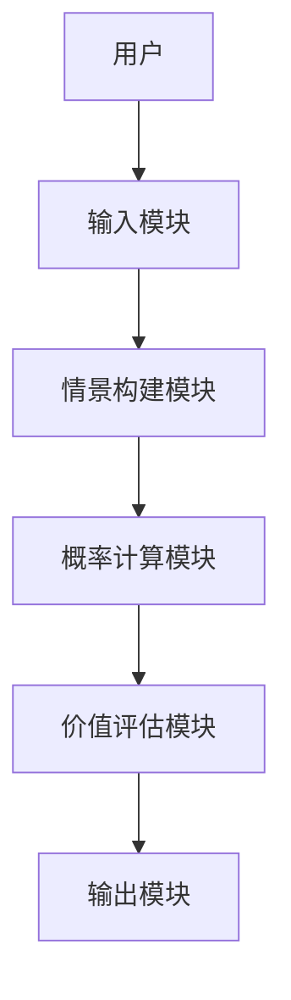
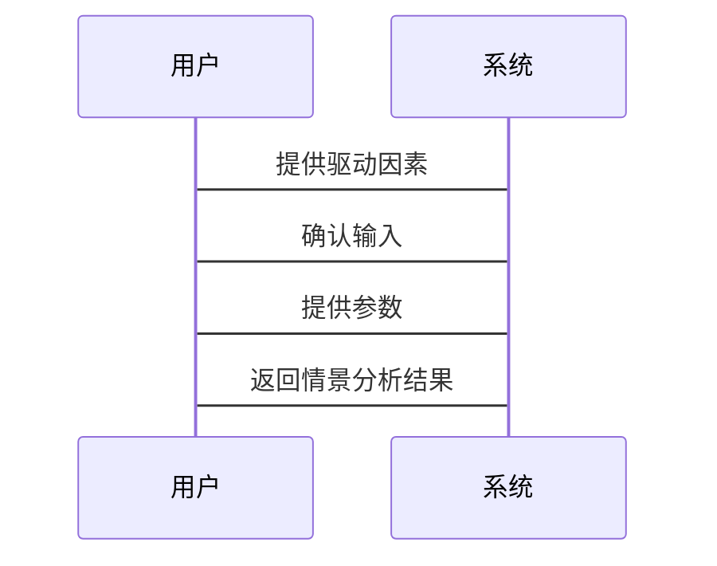

                 


# 企业估值中的情景分析技巧

> 关键词：企业估值，情景分析，数学模型，算法，系统架构，投资决策

> 摘要：本文深入探讨了情景分析在企业估值中的应用，结合数学模型和算法，详细讲解了如何构建情景分析框架，评估不同情景下的企业价值。通过实际案例分析和系统架构设计，展示了情景分析在投资决策中的实际应用价值。

---

# 第一部分: 企业估值中的情景分析概述

## 第1章: 情景分析的基本概念

### 1.1 什么是情景分析

#### 1.1.1 情景分析的定义
情景分析（Scenario Analysis）是一种评估方法，通过构建不同的未来情景，分析企业在不同条件下的表现，从而帮助投资者做出更全面的估值决策。情景分析不仅关注最优情况，还考虑可能的风险和不确定性。

#### 1.1.2 情景分析的作用
- 帮助企业在复杂环境中制定策略。
- 识别潜在风险和机会。
- 提供更全面的估值参考。

#### 1.1.3 情景分析与传统估值方法的区别
传统估值方法通常基于历史数据和简单假设，而情景分析通过构建多维度的情景，考虑更多变量的相互作用，提供更动态的估值结果。

### 1.2 企业估值中的情景分析

#### 1.2.1 企业估值的基本概念
企业估值是对企业整体价值的评估，通常包括资产、收益、现金流等因素。

#### 1.2.2 情景分析在企业估值中的应用
情景分析可以帮助企业在不同经济环境下评估其价值，为投资决策提供支持。

#### 1.2.3 情景分析的核心要素
- 驱动因素：影响企业价值的关键变量，如市场需求、成本变化。
- 情景构建：将驱动因素分为不同情景，如乐观、中性、悲观。
- 概率分析：评估每种情景发生的可能性。

---

## 第2章: 情景分析的背景与应用

### 2.1 企业估值的挑战

#### 2.1.1 传统估值方法的局限性
传统方法通常假设市场环境稳定，忽视了不确定性对企业价值的影响。

#### 2.1.2 不确定性对企业估值的影响
经济波动、政策变化等因素会导致企业价值波动，情景分析能帮助应对这些不确定性。

#### 2.1.3 情景分析的必要性
通过构建多情景模型，情景分析能够全面评估企业价值，帮助投资者做出更合理的决策。

### 2.2 情景分析的背景

#### 2.2.1 经济环境的不确定性
全球经济波动、地缘政治风险等因素增加了企业估值的复杂性。

#### 2.2.2 行业变化对企业估值的影响
行业趋势变化会影响企业的收入和成本，情景分析能帮助评估这些变化的影响。

#### 2.2.3 情景分析在企业战略中的作用
情景分析不仅是估值工具，还是企业制定战略的重要工具，帮助企业在复杂环境中制定应对策略。

### 2.3 情景分析的应用领域

#### 2.3.1 投资决策中的情景分析
投资者可以通过情景分析评估不同投资项目的潜在回报和风险。

#### 2.3.2 并购与重组中的情景分析
企业在并购过程中，可以通过情景分析评估目标企业的价值和潜在风险。

#### 2.3.3 风险管理中的情景分析
企业可以利用情景分析识别和评估潜在风险，制定风险管理策略。

---

## 第3章: 情景分析的核心概念与联系

### 3.1 情景分析的核心概念

#### 3.1.1 情景分析的驱动因素
驱动因素是影响企业价值的关键变量，如市场需求、成本、政策变化等。

#### 3.1.2 情景分析的关键假设
情景分析基于一定的假设，如市场增长率、利率变化等，这些假设会影响情景的构建和结果。

#### 3.1.3 情景分析的变量关系
变量之间的关系需要清晰定义，例如收入增长与成本变化的关系。

### 3.2 情景分析的核心要素

#### 3.2.1 情景构建的逻辑框架
情景构建需要遵循逻辑顺序，从驱动因素出发，逐步构建不同情景。

#### 3.2.2 情景分析的数学模型
数学模型是情景分析的核心，用于量化不同情景对企业价值的影响。

#### 3.2.3 情景分析的可视化工具
可视化工具如图表可以帮助更好地理解和传达情景分析的结果。

### 3.3 情景分析与企业估值的关系

#### 3.3.1 情景分析如何影响企业估值
情景分析通过构建不同情景，评估企业价值的可能范围，帮助投资者做出更全面的决策。

#### 3.3.2 情景分析与企业价值创造的关系
情景分析不仅评估当前价值，还帮助企业识别创造价值的机会。

#### 3.3.3 情景分析的动态调整机制
情景分析可以根据实际情况进行动态调整，确保模型的准确性和适用性。

---

# 第二部分: 情景分析的数学模型与算法

## 第4章: 情景分析的数学模型

### 4.1 概率分布与情景分析

#### 4.1.1 概率分布的基本概念
概率分布描述了随机变量可能的取值及其概率，常用于情景分析中的变量建模。

#### 4.1.2 情景分析中的概率计算
通过概率计算，情景分析可以量化不同情景对企业价值的影响。

#### 4.1.3 概率分布的应用
在情景分析中，概率分布用于描述驱动因素的变化范围和可能性。

### 4.2 情景分析的数学模型

#### 4.2.1 线性回归模型
线性回归模型用于分析变量之间的线性关系，帮助构建情景模型。

#### 4.2.2 蒙特卡洛模拟
蒙特卡洛模拟通过随机抽样，评估不同情景对企业价值的影响，提供概率分布结果。

#### 4.2.3 决策树分析
决策树分析将不同情景和决策路径可视化，帮助投资者做出最优决策。

---

## 第5章: 情景分析的算法实现

### 5.1 情景分析算法概述

#### 5.1.1 情景分析算法的步骤
1. 确定驱动因素
2. 构建情景
3. 计算概率
4. 评估价值

#### 5.1.2 算法实现的关键点
- 变量的选择和建模
- 情景的构建和分类
- 概率的计算和分配

### 5.2 情景分析的算法实现

#### 5.2.1 基于蒙特卡洛模拟的算法
```python
import numpy as np
import pandas as pd

def monte_carlo_simulation(drivers, scenarios=1000):
    driver_values = {}
    for driver in drivers:
        driver_values[driver] = np.random.rand(scenarios)
    return driver_values
```

#### 5.2.2 决策树分析的算法实现
```python
def decision_tree_analysis(nodes, branches):
    for node in nodes:
        for branch in branches:
            calculate_value(node, branch)
```

### 5.3 情景分析的数学公式

#### 5.3.1 蒙特卡洛模拟的概率公式
$$ P(x) = \sum_{i=1}^{n} P(x_i) $$

#### 5.3.2 决策树分析的价值公式
$$ V = \sum_{i=1}^{n} P_i \times V_i $$

---

## 第6章: 系统架构与实现

### 6.1 情景分析系统的架构设计

#### 6.1.1 系统功能设计
- 情景构建模块
- 概率计算模块
- 价值评估模块

#### 6.1.2 系统架构图


#### 6.1.3 系统接口设计
- 输入接口：接收驱动因素和参数
- 输出接口：显示情景分析结果

### 6.2 系统交互设计

#### 6.2.1 用户与系统交互流程


---

## 第7章: 项目实战与案例分析

### 7.1 项目背景

#### 7.1.1 项目目标
构建一个基于情景分析的企业估值系统。

#### 7.1.2 项目需求
- 支持多种情景构建
- 提供概率计算功能
- 输出详细分析报告

### 7.2 核心实现

#### 7.2.1 环境安装
```bash
pip install numpy pandas matplotlib
```

#### 7.2.2 核心代码实现
```python
import numpy as np
import pandas as pd

def build_scenario_matrix(drivers, scenarios=1000):
    matrix = pd.DataFrame()
    for driver in drivers:
        matrix[driver] = np.random.rand(scenarios)
    return matrix
```

#### 7.2.3 代码解读与分析
- `build_scenario_matrix`函数生成驱动因素的随机值矩阵，用于构建不同情景。

### 7.3 案例分析

#### 7.3.1 案例背景
某科技公司面临市场需求波动，希望通过情景分析评估其估值。

#### 7.3.2 数据收集与处理
收集历史数据和市场分析报告，提取关键驱动因素。

#### 7.3.3 情景构建与分析
构建乐观、中性、悲观三种情景，计算每种情景下的企业价值。

### 7.4 项目小结

#### 7.4.1 项目成果
成功构建情景分析系统，为企业估值提供有力支持。

#### 7.4.2 项目经验
- 情景构建需要准确选择驱动因素
- 概率计算需要合理分配情景可能性

---

## 第8章: 最佳实践与注意事项

### 8.1 最佳实践

#### 8.1.1 情景构建的技巧
- 确保驱动因素的全面性
- 合理分配情景的概率

#### 8.1.2 模型选择的建议
- 根据具体情况选择合适的算法
- 定期更新模型参数

### 8.2 小结

#### 8.2.1 情景分析的核心价值
情景分析通过构建多维度的情景，帮助企业全面评估价值，支持决策。

#### 8.2.2 情景分析的未来发展
随着技术进步，情景分析将更加智能化和个性化。

### 8.3 注意事项

#### 8.3.1 数据质量的重要性
确保数据准确，避免错误分析。

#### 8.3.2 模型的适用性
根据具体情况选择合适的模型，避免过度复杂。

#### 8.3.3 情景的动态调整
根据实际情况及时调整情景和模型，确保分析结果的有效性。

---

# 作者：AI天才研究院 & 禅与计算机程序设计艺术

