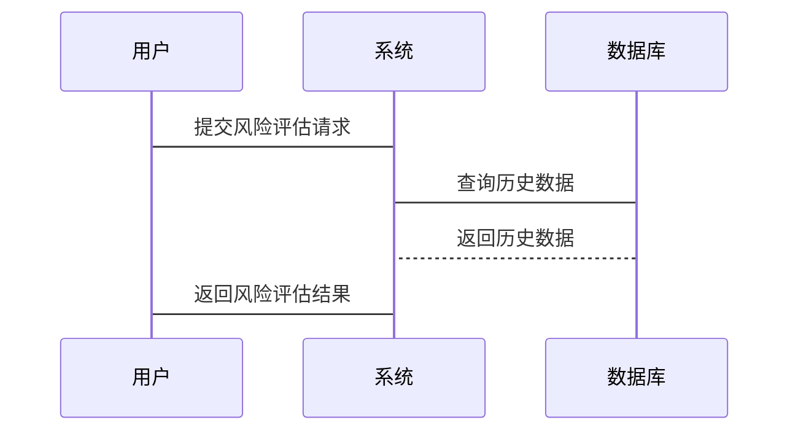

                 


# 企业估值中的技术迭代风险分析

**关键词**：企业估值，技术迭代，风险分析，算法原理，系统架构

**摘要**：技术迭代是企业在数字化转型和市场竞争中不可避免的一部分，但其带来的风险却常常被低估。本文系统性地探讨了技术迭代风险在企业估值中的重要性，分析了其核心概念、算法原理、系统架构，并通过实际案例展示了如何在企业估值中有效识别和管理技术迭代风险。文章最后总结了技术迭代风险分析的关键点，并展望了未来的研究方向。

---

## 第1章: 技术迭代风险的背景与概念

### 1.1 技术迭代的基本概念

#### 1.1.1 技术迭代的定义
技术迭代是指在企业运营过程中，由于技术的进步、市场需求的变化或竞争环境的波动，企业需要不断更新技术、产品和服务的过程。技术迭代的核心在于“变化”，这种变化可能是渐进的，也可能是颠覆性的。

#### 1.1.2 技术迭代的核心特征
- **连续性**：技术迭代是一个持续的过程，而非一次性事件。
- **不确定性**：每一次技术迭代都可能带来新的风险和机会。
- **关联性**：技术迭代往往与企业的战略目标、市场环境和竞争对手的行动密切相关。

#### 1.1.3 技术迭代与企业发展的关系
技术迭代是企业发展的驱动力。通过技术迭代，企业可以优化产品、降低成本、提升效率，从而在市场竞争中占据优势。然而，技术迭代也可能带来成本增加、技术瓶颈或市场适应性不足的风险。

---

### 1.2 技术迭代风险的定义与分类

#### 1.2.1 技术迭代风险的定义
技术迭代风险是指企业在技术迭代过程中，由于技术选择不当、市场需求变化或技术更新失败等原因，导致企业价值下降或损失的风险。

#### 1.2.2 技术迭代风险的主要类型
| 类型              | 描述                                                                 |
|-------------------|----------------------------------------------------------------------|
| 技术可行性风险    | 技术方案在实施过程中可能遇到的技术障碍或失败。                          |
| 市场适应性风险    | 技术迭代后的产品或服务无法满足市场需求或无法与竞争对手的产品竞争。        |
| 成本风险          | 技术迭代可能导致研发成本、维护成本或替换成本的增加。                      |
| 时间风险          | 技术迭代所需的时间超过预期，导致企业错失市场机会。                        |
| 竞争风险          | 技术迭代可能引发竞争对手的技术反击，进一步加剧市场竞争。                  |

#### 1.2.3 技术迭代风险的特征与影响
- **特征**：技术迭代风险具有动态性、复杂性和不可预测性。
- **影响**：技术迭代风险可能影响企业的财务表现、市场地位和长期发展潜力。

---

### 1.3 企业估值中的技术迭代风险

#### 1.3.1 技术迭代风险在企业估值中的重要性
技术迭代风险是企业估值的重要组成部分。在企业估值过程中，投资者需要考虑技术迭代带来的潜在风险，以评估企业的未来盈利能力。

#### 1.3.2 技术迭代风险对企业价值的影响
技术迭代风险可能通过影响企业的收入、成本和竞争优势，进而影响企业的估值。例如，如果企业未能及时适应技术变化，可能导致产品过时、市场份额流失，从而降低企业价值。

#### 1.3.3 技术迭代风险的量化与评估
技术迭代风险的量化可以通过概率论和统计学方法实现。例如，可以使用蒙特卡洛模拟方法，模拟不同技术迭代路径下的企业价值变化，从而评估技术迭代风险对企业估值的影响。

---

## 第2章: 技术迭代风险的核心概念与联系

### 2.1 技术迭代风险的核心原理

#### 2.1.1 技术迭代风险的形成机制
技术迭代风险的形成机制包括技术本身的变化、市场需求的变化以及企业内部管理能力的不足。这些因素共同作用，可能导致技术迭代失败或成本超支。

#### 2.1.2 技术迭代风险与企业生命周期的关系
在企业生命周期的不同阶段，技术迭代风险的表现形式有所不同。例如，在初创阶段，技术迭代风险主要集中在技术创新和市场适应性；在成熟阶段，技术迭代风险则更多地体现在技术维护和成本控制。

#### 2.1.3 技术迭代风险的动态变化特征
技术迭代风险是一个动态变化的过程。随着技术的进步和市场的变化，技术迭代风险的来源和影响也在不断变化。

---

### 2.2 技术迭代风险的核心要素

#### 2.2.1 技术创新的不确定性
技术创新的不确定性是技术迭代风险的重要来源。企业在进行技术创新时，可能面临技术失败、市场需求不足或技术被替代的风险。

#### 2.2.2 市场需求的变化
市场需求的变化是技术迭代风险的另一个重要来源。如果企业未能准确预测市场需求的变化，可能导致技术迭代失败或产品过时。

#### 2.2.3 竞争环境的波动
竞争环境的波动也可能导致技术迭代风险。例如，竞争对手的技术创新可能迫使企业加快技术迭代速度，从而增加技术迭代风险。

---

### 2.3 技术迭代风险与其他风险的关系

#### 2.3.1 技术迭代风险与市场风险
技术迭代风险与市场风险密切相关。市场需求的变化可能直接影响技术迭代的成败，从而影响企业估值。

#### 2.3.2 技术迭代风险与运营风险
技术迭代风险与运营风险也密切相关。技术迭代可能涉及企业运营模式的改变，从而影响企业的运营效率和成本。

#### 2.3.3 技术迭代风险与财务风险
技术迭代风险可能通过影响企业的收入、成本和资本支出，进而影响企业的财务状况，增加财务风险。

---

## 第3章: 技术迭代风险的算法原理与数学模型

### 3.1 技术迭代风险的评估方法

#### 3.1.1 风险评估的基本原理
技术迭代风险的评估方法包括定性分析和定量分析。定性分析主要通过专家判断和案例分析，而定量分析则通过数学模型和统计方法。

#### 3.1.2 技术迭代风险的量化指标
- **技术迭代失败概率（TIFP）**：技术迭代失败的可能性。
- **技术迭代成本超支率（TICER）**：技术迭代成本超出预算的可能性。
- **技术迭代收益损失率（TILR）**：技术迭代带来的收益损失的可能性。

#### 3.1.3 技术迭代风险的评估模型
- **线性回归模型**：通过历史数据，建立技术迭代风险与企业价值变化的线性关系。
- **贝叶斯网络模型**：通过概率推理，评估技术迭代风险对企业价值的影响。

---

### 3.2 技术迭代风险的数学模型

#### 3.2.1 技术迭代风险的线性回归模型
线性回归模型可以表示为：
$$ V = \beta_0 + \beta_1 R + \epsilon $$
其中，\( V \) 表示企业价值，\( R \) 表示技术迭代风险，\( \epsilon \) 为误差项。

#### 3.2.2 技术迭代风险的马尔可夫链模型
马尔可夫链模型可以用来描述技术迭代风险的状态转移过程：
$$ P_{ij} = \text{概率从状态 } i \text{ 转移到状态 } j $$

#### 3.2.3 技术迭代风险的贝叶斯网络模型
贝叶斯网络模型通过概率推理，评估技术迭代风险对企业价值的影响。例如，可以使用JAGS或Stan等工具进行贝叶斯分析。

---

## 第4章: 技术迭代风险的系统分析与架构设计

### 4.1 系统分析

#### 4.1.1 系统功能设计
- **需求分析**：分析技术迭代风险的来源和影响。
- **功能模块**：包括风险识别、风险评估、风险监控和风险应对。
- **用户角色**：包括企业高管、技术团队和财务团队。

#### 4.1.2 系统架构设计
系统架构设计采用分层架构，包括数据层、业务逻辑层和用户界面层。

#### 4.1.3 系统交互设计
使用Mermaid序列图描述系统交互过程：


---

## 第5章: 技术迭代风险的项目实战

### 5.1 环境安装

#### 5.1.1 系统环境
- 操作系统：Linux/Windows/MacOS
- 开发工具：Python/Java/C++
- 数据库：MySQL/PostgreSQL
- 分析工具：R/Python（pandas, numpy）

#### 5.1.2 依赖安装
安装必要的Python库：
```bash
pip install numpy pandas scikit-learn matplotlib
```

---

### 5.2 系统核心实现源代码

#### 5.2.1 技术迭代风险评估代码
```python
import numpy as np
from sklearn.linear_model import LinearRegression

# 示例数据
X = np.array([[1], [2], [3], [4], [5]])
y = np.array([2, 3, 5, 6, 8])

# 模型训练
model = LinearRegression()
model.fit(X, y)

# 风险评估
def estimate_risk(feature):
    return model.predict(feature)
```

#### 5.2.2 技术迭代风险监控代码
```python
import matplotlib.pyplot as plt

# 示例数据
X = np.array([[1], [2], [3], [4], [5]])
y = np.array([2, 3, 5, 6, 8])

# 模型训练
model = LinearRegression()
model.fit(X, y)

# 风险监控
plt.scatter(X, y)
plt.plot(X, model.predict(X), color='red')
plt.show()
```

---

## 第6章: 总结与展望

### 6.1 总结
技术迭代风险是企业在估值过程中必须重视的重要因素。通过系统的分析和有效的管理，企业可以降低技术迭代风险，提升企业价值。

### 6.2 展望
未来的研究可以进一步探索技术迭代风险的动态变化规律，以及如何在复杂多变的市场环境中更好地应对技术迭代风险。

---

## 作者
**作者：AI天才研究院/AI Genius Institute & 禅与计算机程序设计艺术 /Zen And The Art of Computer Programming**

---

通过以上内容，您是否对“企业估值中的技术迭代风险分析”有了更深入的理解？如需进一步探讨或获取更多资料，请随时联系。

