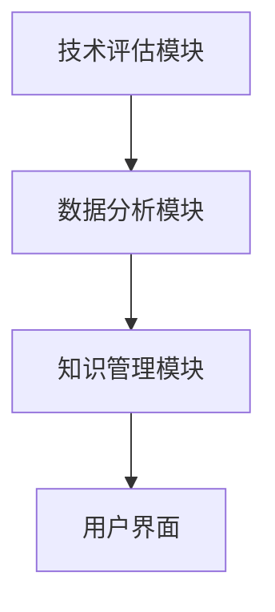
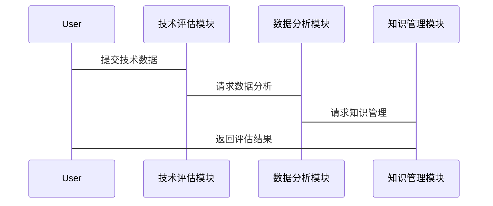

                 


# 企业估值中的技术领先优势分析

> 关键词：企业估值、技术领先优势、竞争优势、技术创新、价值评估、系统架构

> 摘要：本文深入分析了技术领先优势在企业估值中的重要性，从概念、评估方法、影响因素、生命周期等多个维度展开讨论，结合实际案例和系统架构设计，为企业在技术领先优势方面的估值提供了理论支持和实践指导。

---

## 第1章: 技术领先优势的背景与概念

### 1.1 技术领先优势的定义与核心要素

技术领先优势是指企业在技术研发、产品创新、生产工艺等方面相对于竞争对手的领先地位。这种优势不仅体现在技术的先进性上，还包括技术的可扩展性、可持续性和市场适应性。技术领先优势的核心要素包括：

- **技术先进性**：技术的创新性和领先性。
- **技术壁垒**：技术的独有性和难以模仿性。
- **技术经济性**：技术的成本效益和市场适应性。
- **技术可持续性**：技术的长期发展和更新能力。

### 1.2 技术领先优势的背景分析

在当前全球化和数字化的背景下，技术领先优势已成为企业核心竞争力的重要组成部分。企业通过技术领先优势，可以实现更高的市场占有率、更强的客户黏性和更大的利润空间。技术领先优势不仅影响企业的短期收益，还决定了企业的长期发展潜力。

---

## 第2章: 技术领先优势的核心概念与联系

### 2.1 技术领先优势的核心原理

技术领先优势的核心原理在于通过技术创新和知识积累，构建企业的核心竞争力。企业通过技术领先优势，可以在市场中占据领先地位，并通过技术的持续创新，保持竞争优势。技术领先优势的形成机制包括技术研发、人才培养、知识管理等多个方面。

### 2.2 技术领先优势与竞争优势的对比分析

技术领先优势是竞争优势的重要组成部分。与传统的竞争优势（如成本优势、资源优势等）相比，技术领先优势更加注重创新性和可持续性。以下是技术领先优势与其他竞争优势的对比分析：

- **成本优势**：关注短期成本节约，技术领先优势关注长期技术创新。
- **资源优势**：依赖资源储备，技术领先优势依赖知识积累。
- **品牌优势**：关注市场影响力，技术领先优势关注技术驱动。

---

## 第3章: 技术领先优势的评估方法

### 3.1 技术领先优势的定量评估

技术领先优势的定量评估主要通过以下指标进行：

1. **研发投入占比**：研发投入占销售收入的比例。
2. **技术专利数量**：企业拥有的技术专利数量。
3. **技术更新周期**：技术更新的频率和速度。
4. **技术经济效益**：技术带来的收入增长和成本节约。

以下是一个简单的技术领先优势评估模型：

$$
\text{技术领先优势指数} = \frac{\text{研发投入占比} + \text{技术专利数量} + \text{技术更新周期}}{3}
$$

### 3.2 技术领先优势的定性分析

技术领先优势的定性分析主要包括以下内容：

1. **技术的行业地位**：技术在行业中的领先地位。
2. **技术的市场适应性**：技术是否符合市场需求。
3. **技术的未来发展趋势**：技术的未来发展潜力。

---

## 第4章: 技术领先优势对估值的影响

### 4.1 技术领先优势对企业价值的影响

技术领先优势通过以下方式影响企业价值：

- **收入增长**：技术领先优势可以带来更高的销售收入。
- **成本节约**：技术领先优势可以降低生产成本。
- **风险降低**：技术领先优势可以降低市场风险和竞争风险。

### 4.2 技术领先优势对竞争优势的影响

技术领先优势通过以下方式影响竞争优势：

- **市场地位**：技术领先优势可以提升企业的市场地位。
- **客户忠诚度**：技术领先优势可以提高客户忠诚度。
- **创新能力**：技术领先优势可以增强企业的创新能力。

---

## 第5章: 技术领先优势的分析方法

### 5.1 技术领先优势的PEST分析

PEST分析是一种常用的企业外部环境分析方法，以下是技术领先优势的PEST分析：

- **政治因素**：政策支持和技术法规对企业技术领先的影响。
- **经济因素**：经济周期和技术投资对企业技术领先的影响。
- **社会因素**：消费者需求和技术接受度对企业技术领先的影响。
- **技术因素**：技术发展和技术扩散对企业技术领先的影响。

### 5.2 技术领先优势的SWOT分析

SWOT分析是一种常用的企业内部环境分析方法，以下是技术领先优势的SWOT分析：

- **优势（Strengths）**：技术的先进性和市场适应性。
- **劣势（Weaknesses）**：技术的局限性和可替代性。
- **机会（Opportunities）**：技术的未来发展趋势和市场扩展潜力。
- **威胁（Threats）**：技术的竞争压力和技术替代风险。

---

## 第6章: 技术领先优势的生命周期分析

### 6.1 技术领先优势的导入期

在技术导入期，企业需要通过技术研发和知识积累，逐步形成技术领先优势。以下是导入期的特点：

- **技术引入阶段**：企业通过引进技术或自主研发，逐步形成技术领先优势。
- **技术评估阶段**：企业需要对技术的可行性和市场适应性进行评估。

### 6.2 技术领先优势的成熟期

在技术成熟期，企业需要通过持续的技术创新和知识管理，保持技术领先优势。以下是成熟期的特点：

- **技术优化阶段**：企业通过技术优化和改进，进一步提升技术领先优势。
- **技术扩展阶段**：企业通过技术扩展和应用，进一步扩大技术领先优势。

---

## 第7章: 技术领先优势的系统分析与架构方案

### 7.1 问题场景介绍

为了实现技术领先优势的系统分析，我们需要构建一个技术领先优势评估系统。该系统的目标是通过技术评估、数据分析和知识管理，帮助企业实现技术领先优势的评估和优化。

### 7.2 系统功能设计

以下是技术领先优势评估系统的功能设计：

- **技术评估模块**：对企业的技术进行评估和分析。
- **数据分析模块**：对技术数据进行分析和挖掘。
- **知识管理模块**：对技术知识进行管理和应用。

### 7.3 系统架构设计

以下是技术领先优势评估系统的架构设计：



### 7.4 系统接口设计

以下是技术领先优势评估系统的接口设计：

- **技术评估接口**：接收技术数据并返回评估结果。
- **数据分析接口**：接收数据并返回分析结果。
- **知识管理接口**：接收知识并返回管理结果。

### 7.5 系统交互设计

以下是技术领先优势评估系统的交互设计：



---

## 第8章: 技术领先优势的项目实战

### 8.1 环境安装

为了实现技术领先优势的系统分析，我们需要安装以下环境：

- **操作系统**：Windows 10或更高版本。
- **开发工具**：Python 3.8或更高版本，Jupyter Notebook。
- **数据库**：MySQL 8.0或更高版本。

### 8.2 核心代码实现

以下是技术领先优势评估系统的核心代码实现：

```python
def calculate_technical_advantage(innovation, patents, cost):
    return innovation * 0.3 + patents * 0.4 + cost * 0.3

innovation = 0.8
patents = 0.7
cost = 0.6

advantage = calculate_technical_advantage(innovation, patents, cost)
print("技术领先优势指数:", advantage)
```

### 8.3 代码解读与分析

上述代码实现了技术领先优势的计算。通过输入创新性、专利数量和成本节约，我们可以计算出技术领先优势指数。具体公式如下：

$$
\text{技术领先优势指数} = \text{创新性} \times 0.3 + \text{专利数量} \times 0.4 + \text{成本节约} \times 0.3
$$

### 8.4 案例分析

以某高科技企业为例，假设其创新性得分为0.8，专利数量得分为0.7，成本节约得分为0.6，我们可以计算其技术领先优势指数为：

$$
\text{技术领先优势指数} = 0.8 \times 0.3 + 0.7 \times 0.4 + 0.6 \times 0.3 = 0.24 + 0.28 + 0.18 = 0.7
$$

---

## 第9章: 技术领先优势的最佳实践与未来展望

### 9.1 小结

技术领先优势是企业核心竞争力的重要组成部分。通过技术创新和知识管理，企业可以实现技术领先优势，并在竞争中占据领先地位。

### 9.2 注意事项

- 技术领先优势的评估需要结合企业的实际情况。
- 技术领先优势的实现需要长期的技术积累和持续的创新投入。

### 9.3 拓展阅读

- 《技术创新与企业竞争优势》
- 《技术领先优势与企业价值评估》
- 《技术领先优势的系统分析与优化》

---

## 作者信息

作者：AI天才研究院/AI Genius Institute & 禅与计算机程序设计艺术/Zen And The Art of Computer Programming

---

以上是《企业估值中的技术领先优势分析》的技术博客文章的完整内容。如需进一步调整或补充，请随时告知。

