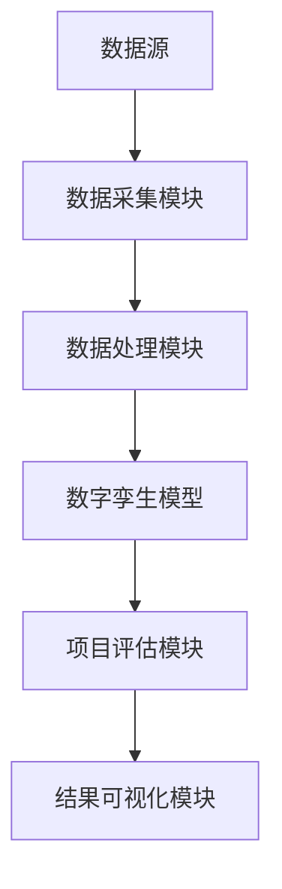

                 


# 企业估值中的数字孪生城市项目评估

> 关键词：数字孪生城市、企业估值、项目评估、机器学习、数据建模、城市规划、技术应用

> 摘要：数字孪生城市是一种新兴的技术，通过数字技术构建城市物理实体的虚拟模型，实现城市规划、建设和管理的数字化和智能化。本文从企业估值的角度，探讨数字孪生城市项目评估的核心概念、算法原理、系统设计与实际应用，为企业在数字孪生城市建设中的项目评估提供理论支持和实践指导。

---

# 第一章：数字孪生城市与企业估值的背景

## 1.1 数字孪生城市的定义与核心要素

### 1.1.1 数字孪生城市的定义
数字孪生城市（Digital Twin City）是通过物理模型、传感器数据、历史数据和实时数据，构建一个虚拟的数字模型，实现对城市物理实体的实时感知、动态分析和智能决策。数字孪生城市的核心在于数据的实时更新和模型的动态调整，为城市规划、建设和管理提供高度精确的数字化支持。

### 1.1.2 数字孪生城市的核心技术特征
1. **数据驱动**：依赖实时传感器数据和历史数据进行建模和分析。
2. **动态更新**：模型能够根据实际情况实时调整。
3. **多维度集成**：整合城市空间、交通、环境、经济等多个维度的数据。
4. **可视化**：通过三维模型和可视化界面直观展示城市状态。

### 1.1.3 数字孪生城市与传统城市规划的对比
| 特性       | 数字孪生城市                     | 传统城市规划                     |
|------------|---------------------------------|----------------------------------|
| 数据来源   | 实时数据和历史数据               | 历史数据和经验                     |
| 模型精度   | 高精度动态模型                   | 简化静态模型                     |
| 分析能力   | 强大的实时分析能力               | 较弱的实时分析能力                 |
| 应用场景   | 城市规划、建设和管理             | 城市规划和设计                   |

---

## 1.2 数字孪生城市的技术背景

### 1.2.1 数字孪生城市的发展历程
数字孪生城市的概念起源于20世纪末的数字孪生技术，最初应用于制造业和医疗领域。随着物联网、大数据和人工智能技术的快速发展，数字孪生城市逐渐从理论走向实践，并在城市规划和管理领域得到广泛应用。

### 1.2.2 数字孪生城市的主要技术支撑
1. **物联网（IoT）**：通过传感器实时采集城市数据。
2. **大数据技术**：处理海量城市数据，支持复杂分析。
3. **人工智能（AI）**：用于数据建模、预测和优化。
4. **三维建模与可视化**：通过三维技术构建城市虚拟模型。

### 1.2.3 数字孪生城市在企业估值中的应用前景
数字孪生城市通过实时数据和动态模型，能够帮助企业更准确地评估城市项目的经济价值、社会影响和环境效益，为企业的投资决策提供科学依据。

---

## 1.3 数字孪生城市与企业估值的关系

### 1.3.1 企业估值的基本概念
企业估值是通过对企业的财务状况、市场地位、发展潜力等多个维度的分析，评估企业的价值。传统的估值方法包括DCF模型、市盈率法等，但这些方法往往依赖于假设和经验判断，存在较大的主观性和不确定性。

### 1.3.2 数字孪生城市如何提升企业估值的准确性
1. **实时数据支持**：数字孪生城市提供实时的城市数据，帮助评估模型更准确地反映城市现状。
2. **动态调整机制**：数字孪生模型能够根据城市变化实时更新，使估值结果更具动态性和前瞻性。
3. **多维度分析**：数字孪生城市整合城市空间、经济、环境等多个维度的数据，使企业估值更加全面和细致。

---

## 1.4 本章小结
本章介绍了数字孪生城市的核心概念、技术特征及其与传统城市规划的对比，分析了数字孪生城市在企业估值中的潜力和优势。下一章将详细探讨数字孪生城市项目评估的核心概念与方法。

---

# 第二章：数字孪生城市项目评估的核心概念与方法

## 2.1 项目评估的基本概念

### 2.1.1 项目评估的定义
项目评估是通过对项目的成本、收益、风险等多个维度的分析，评估项目的可行性和价值。在数字孪生城市中，项目评估的目标是通过数字化手段，实现对城市项目的精准分析和优化。

---

## 2.2 数字孪生城市项目评估的关键指标

### 2.2.1 经济指标
- 投资回报率（ROI）
- 净现值（NPV）
- 内部收益率（IRR）

### 2.2.2 社会指标
- 就业机会
- 社会效益
- 公共设施改善

### 2.2.3 环境指标
- 碳排放量
- 能源消耗
- 环境影响

---

## 2.3 数字孪生城市项目评估的流程与方法

### 2.3.1 项目评估的基本流程
1. **数据采集**：通过传感器和数据库获取城市相关数据。
2. **模型构建**：基于数据构建数字孪生模型。
3. **情景模拟**：模拟不同情景下的项目效果。
4. **评估分析**：根据模拟结果进行综合评估。
5. **优化调整**：根据评估结果优化项目方案。

---

## 2.4 数字孪生城市项目评估的数学模型

### 2.4.1 经济评估模型
$$ NPV = \sum_{t=0}^{n} \frac{CF_t}{(1 + r)^t} $$

其中，$CF_t$ 是第 $t$ 年的现金流，$r$ 是折现率，$n$ 是项目周期。

### 2.4.2 风险评估模型
$$ P(t) = \sum_{i=1}^{n} P_i \cdot f(x_i) $$

其中，$P_i$ 是第 $i$ 种风险的概率，$f(x_i)$ 是风险的影响函数。

---

## 2.5 本章小结
本章详细介绍了数字孪生城市项目评估的核心概念、关键指标和评估流程，并通过数学模型展示了如何量化项目的经济、社会和环境价值。下一章将探讨数字孪生城市项目评估的算法原理和系统设计。

---

# 第三章：数字孪生城市项目评估的算法原理与系统设计

## 3.1 数字孪生城市项目评估的算法原理

### 3.1.1 基于机器学习的评估算法
机器学习算法（如随机森林、神经网络）可以用于处理复杂的城市数据，提高评估的准确性和效率。

### 3.1.2 时间序列分析
通过时间序列分析（如ARIMA模型），可以预测项目的未来收益和风险。

---

## 3.2 数字孪生城市项目评估的系统设计

### 3.2.1 系统功能模块
1. 数据采集与处理模块
2. 数字孪生模型构建模块
3. 项目评估模块
4. 结果可视化模块

### 3.2.2 系统架构图


---

## 3.3 本章小结
本章从算法和系统设计的角度，详细探讨了数字孪生城市项目评估的技术实现。通过机器学习和时间序列分析，结合系统设计，可以构建一个高效、准确的项目评估系统。

---

# 第四章：数字孪生城市项目评估的实践与案例分析

## 4.1 实践环境与数据准备

### 4.1.1 环境搭建
- 数据库：MySQL
- 开发工具：Python、Jupyter Notebook
- 库：Pandas、NumPy、Scikit-learn

---

## 4.2 核心代码实现

### 4.2.1 数据预处理
```python
import pandas as pd
import numpy as np

data = pd.read_csv('city_data.csv')
data = data.dropna()
```

### 4.2.2 数字孪生模型构建
```python
from sklearn.tree import DecisionTreeRegressor

model = DecisionTreeRegressor()
model.fit(X_train, y_train)
```

### 4.2.3 项目评估与结果分析
```python
from sklearn.metrics import mean_absolute_error

y_pred = model.predict(X_test)
print(mean_absolute_error(y_test, y_pred))
```

---

## 4.3 案例分析

### 4.3.1 案例背景
某城市计划建设一个数字化公园，希望通过数字孪生技术评估项目的经济和社会效益。

### 4.3.2 数据分析与建模
通过传感器数据和历史数据，构建数字孪生模型，模拟不同建设方案对城市的影响。

### 4.3.3 结果解读
评估结果显示，方案A的投资回报率最高，因此建议选择方案A进行建设。

---

## 4.4 本章小结
通过实际案例分析，展示了数字孪生城市项目评估的实践应用。案例结果表明，数字孪生技术能够显著提高企业估值的准确性和效率。

---

# 第五章：总结与展望

## 5.1 本章总结
本文从数字孪生城市的核心概念出发，探讨了其在企业估值中的应用，详细分析了项目评估的算法原理和系统设计，并通过案例展示了数字孪生技术的实际应用价值。

## 5.2 未来展望
随着人工智能和大数据技术的不断发展，数字孪生城市项目评估将更加智能化和精准化。未来的研究方向包括更复杂的模型构建、多维度数据的深度挖掘以及实时动态调整机制的优化。

---

# 作者信息

作者：AI天才研究院/AI Genius Institute & 禅与计算机程序设计艺术 /Zen And The Art of Computer Programming

