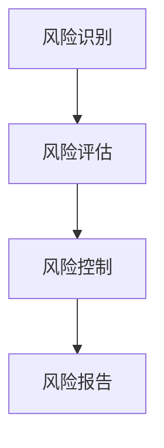

                 

# 企业估值中的数据安全能力评估

> 关键词：企业估值，数据安全，能力评估，风险管理，数据资产

> 摘要：本文探讨了在企业估值过程中，数据安全能力评估的重要性及其对企业价值的影响。通过分析数据安全能力评估的核心概念、理论基础、系统架构及实战案例，本文旨在为企业提供一种系统化的方法来评估和提升其数据安全能力，从而更准确地进行企业估值。

---

## 第1章: 数据安全与企业估值的关联性

### 1.1 数据安全对企业价值的影响

#### 1.1.1 数据资产在企业价值中的地位

数据资产是现代企业最重要的资产之一。企业的数据资产包括客户信息、交易记录、知识产权等，这些数据不仅影响企业的运营效率，还决定了企业的市场竞争力。数据资产的价值体现在其对业务决策的支持、对客户关系的维护以及对创新的推动上。

#### 1.1.2 数据安全对企业经营风险的控制作用

数据安全能力是企业抵御数据泄露、网络攻击等风险的核心能力。随着数字化转型的推进，数据成为企业的命脉，数据安全能力的强弱直接影响企业的经营风险。强大的数据安全能力可以降低企业的法律风险、财务损失和声誉损失，从而提升企业的整体价值。

#### 1.1.3 数据安全能力与企业估值的正向关系

数据安全能力越强，企业越能保护其数据资产，降低风险，从而在估值时获得更高的评分。投资者和市场通常会将数据安全能力作为企业价值的重要评估指标。因此，数据安全能力的提升能够直接推动企业估值的提升。

---

### 1.2 企业估值的基本概念与方法

#### 1.2.1 企业估值的定义与核心要素

企业估值是指通过对企业的财务状况、市场地位、成长潜力等多方面因素的综合评估，确定企业价值的过程。核心要素包括收入、利润、资产、负债、品牌影响力等。

#### 1.2.2 常见企业估值方法概述

常见的企业估值方法包括：

1. **市盈率法（P/E）**：基于企业的利润和市盈率进行估值。
2. **市净率法（P/B）**：基于企业的资产净值和市净率进行估值。
3. **现金流折现法（DCF）**：基于未来现金流的现值进行估值。

#### 1.2.3 数据安全能力在估值中的特殊地位

数据安全能力作为一项隐性资产，虽然不易直接量化，但其对企业价值的影响不容忽视。特别是在数据驱动的经济模式下，数据安全能力已经成为企业核心竞争力的重要组成部分。

---

### 1.3 数据安全能力评估的必要性

#### 1.3.1 数据驱动经济时代的特点

在数据驱动的经济时代，数据已成为企业最重要的生产资料。企业的数据处理能力、数据存储能力以及数据安全能力直接影响其在市场中的竞争力。

#### 1.3.2 数据泄露对企业估值的影响

数据泄露可能导致企业面临巨额罚款、客户流失和声誉损失，从而显著降低企业估值。因此，数据安全能力的强弱直接影响企业的市场价值。

#### 1.3.3 数据安全能力评估的行业趋势

随着数据泄露事件的频发，企业对数据安全能力的要求越来越高。越来越多的投资者和分析师开始关注企业的数据安全能力，并将其作为估值的重要依据。

---

### 1.4 本章小结

本章重点探讨了数据安全与企业估值之间的关联性。数据安全能力不仅是企业抵御风险的核心能力，也是影响企业价值的重要因素。在数据驱动的经济时代，数据安全能力评估已经成为企业估值不可或缺的一部分。

---

## 第2章: 数据安全能力评估的核心概念

### 2.1 数据安全能力评估的定义与目标

#### 2.1.1 数据安全能力评估的定义

数据安全能力评估是指通过对企业在数据保护、风险管理、安全技术等方面的能力进行系统化评估，确定企业数据安全水平的过程。

#### 2.1.2 评估目标的层次化结构

数据安全能力评估的目标可以分为三个层次：

1. **技术层面**：评估企业的技术能力，包括数据加密、访问控制等。
2. **管理层面**：评估企业的管理制度，包括安全策略、人员培训等。
3. **应用层面**：评估企业的实际应用效果，包括数据泄露事件的应对能力等。

#### 2.1.3 评估的核心原则与约束条件

数据安全能力评估的核心原则包括客观性、全面性、可操作性和持续性。评估过程中需要遵循相关法律法规和行业标准，确保评估的合法性和合规性。

---

### 2.2 数据安全能力评估的关键维度

#### 2.2.1 技术能力维度

技术能力维度包括数据加密技术、访问控制技术、身份认证技术等。这些技术能力是企业数据安全的基础。

#### 2.2.2 管理能力维度

管理能力维度包括安全策略、人员管理、应急预案等。这些管理能力决定了企业数据安全的组织和执行能力。

#### 2.2.3 应用能力维度

应用能力维度包括数据安全的应用场景、应用效果等。这些能力体现了企业数据安全的实际应用价值。

---

### 2.3 数据安全能力与企业估值的关系模型

#### 2.3.1 模型的构建逻辑

数据安全能力与企业估值的关系可以通过以下步骤构建：

1. **数据安全能力评估**：对企业在数据安全技术、管理、应用等方面的能力进行评估。
2. **风险评估**：基于数据安全能力评估结果，评估企业的数据安全风险。
3. **估值调整**：根据风险评估结果，调整企业的估值。

#### 2.3.2 关键变量之间的关系

数据安全能力（S）与企业估值（V）之间的关系可以表示为：
$$ V = f(S, R) $$
其中，$R$ 表示其他影响企业估值的因素。

---

### 2.4 核心概念对比分析

#### 2.4.1 数据安全能力与数据治理能力的对比

数据安全能力主要关注数据的保护和风险管理，而数据治理能力则包括数据的分类、存储、共享等更广泛的内容。数据安全能力是数据治理能力的重要组成部分。

#### 2.4.2 数据安全能力与信息技术能力的对比

信息技术能力是企业技术能力的总称，包括硬件、软件、网络等方面的能力。数据安全能力是信息技术能力的重要组成部分，但更专注于数据的保护。

#### 2.4.3 数据安全能力与企业风险管理能力的对比

企业风险管理能力是企业全面风险管理的核心能力，包括财务风险、市场风险、操作风险等方面。数据安全能力是企业风险管理能力的重要组成部分，专注于数据相关的风险。

---

### 2.5 本章小结

本章详细介绍了数据安全能力评估的核心概念，包括定义、目标、关键维度以及与企业估值的关系。通过对比分析，明确了数据安全能力在企业风险管理中的地位和作用。

---

## 第3章: 数据安全能力评估的理论基础

### 3.1 数据安全能力评估的理论框架

#### 3.1.1 信息安全管理理论

信息安全管理理论是数据安全能力评估的理论基础之一。该理论强调通过技术和管理手段，确保信息的机密性、完整性和可用性。

#### 3.1.2 信息风险评估理论

信息风险评估理论关注数据资产面临的各种风险，包括技术风险、管理风险和操作风险。通过对风险的识别和评估，制定相应的风险管理策略。

#### 3.1.3 数据价值评估理论

数据价值评估理论强调数据资产的经济价值，通过量化数据资产的价值，确定其对企业整体价值的贡献。

---

### 3.2 数据安全能力评估的数学模型

#### 3.2.1 数据安全能力指数模型

数据安全能力指数模型是一个综合评估企业数据安全能力的数学模型。公式如下：
$$ S = \sum_{i=1}^{n} w_i \cdot C_i $$
其中，$S$ 表示数据安全能力指数，$w_i$ 表示第$i$个评估维度的权重，$C_i$ 表示第$i$个评估维度的评分。

---

### 3.3 数据安全能力评估的算法原理

#### 3.3.1 基于风险的数据安全评估算法

基于风险的数据安全评估算法通过识别和评估数据资产面临的风险，计算数据安全能力指数。流程如下：

1. **风险识别**：识别数据资产面临的风险。
2. **风险评估**：评估每个风险的影响程度和发生概率。
3. **风险控制**：制定风险控制策略。
4. **风险报告**：生成风险评估报告。

---

### 3.4 本章小结

本章介绍了数据安全能力评估的理论基础，包括信息安全管理理论、信息风险评估理论和数据价值评估理论。同时，提出了一个数据安全能力指数模型，并通过mermaid流程图展示了基于风险的评估算法。

---

## 第4章: 数据安全能力评估的系统架构

### 4.1 系统功能模块设计

#### 4.1.1 数据采集模块

数据采集模块负责收集企业的数据资产信息，包括数据类型、存储位置、访问权限等。

#### 4.1.2 风险评估模块

风险评估模块基于收集的数据资产信息，评估数据资产面临的风险，并计算数据安全能力指数。

#### 4.1.3 评估报告模块

评估报告模块生成数据安全能力评估报告，包括评估结果、风险分析和改进建议。

---

### 4.2 系统架构设计

---

### 4.3 系统接口设计

#### 4.3.1 数据采集接口

数据采集接口负责与企业信息系统对接，获取数据资产信息。

#### 4.3.2 评估结果接口

评估结果接口将数据安全能力评估结果返回给用户或其他系统。

---

### 4.4 本章小结

本章详细描述了数据安全能力评估系统的架构设计，包括功能模块设计、系统架构图以及接口设计。

---

## 第5章: 数据安全能力评估的项目实战

### 5.1 项目背景与目标

#### 5.1.1 项目背景

某企业计划通过提升数据安全能力来提高其市场估值。为此，企业决定进行数据安全能力评估，并根据评估结果制定改进措施。

#### 5.1.2 项目目标

1. 评估企业的数据安全能力。
2. 识别数据资产面临的风险。
3. 提出改进建议。

---

### 5.2 项目实施步骤

#### 5.2.1 数据采集

通过问卷调查、系统日志分析等方式，收集企业的数据资产信息。

#### 5.2.2 风险评估

基于数据采集结果，评估数据资产面临的风险，并计算数据安全能力指数。

#### 5.2.3 评估报告

根据风险评估结果，生成数据安全能力评估报告，并提出改进建议。

---

### 5.3 项目小结

通过该项目，企业成功识别了数据资产面临的风险，并根据评估结果制定了改进措施。数据安全能力的提升显著增强了企业的市场竞争力，提高了企业的估值。

---

## 第6章: 数据安全能力评估的总结与展望

### 6.1 本章总结

数据安全能力评估是企业估值的重要组成部分。通过系统化的评估方法，企业可以全面了解自身的数据安全能力，并根据评估结果制定改进措施，从而提升企业的整体价值。

---

### 6.2 未来展望

随着数据驱动经济的进一步发展，数据安全能力评估将变得更加重要。未来，企业需要更加注重数据安全能力的建设，并将其作为企业核心竞争力的重要组成部分。

---

## 作者：AI天才研究院/AI Genius Institute & 禅与计算机程序设计艺术 /Zen And The Art of Computer Programming

---

**摘要**：本文探讨了在企业估值过程中，数据安全能力评估的重要性及其对企业价值的影响。通过分析数据安全能力评估的核心概念、理论基础、系统架构及实战案例，本文旨在为企业提供一种系统化的方法来评估和提升其数据安全能力，从而更准确地进行企业估值。

---

**关键词**：企业估值，数据安全，能力评估，风险管理，数据资产

