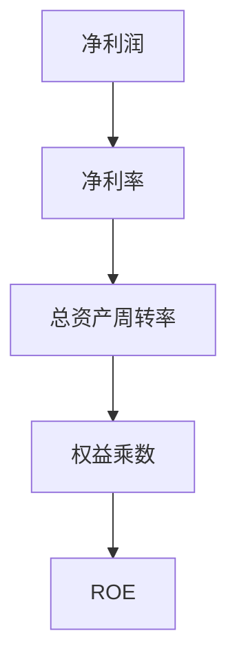
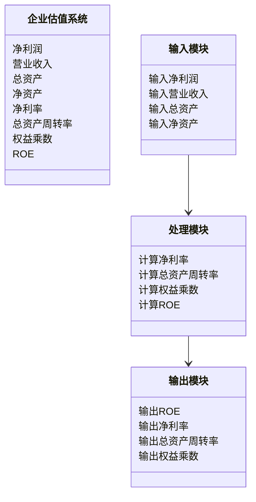

                 


# 企业估值中的杜邦分析法

> 关键词：杜邦分析法, 企业估值, 净资产收益率, 财务分析, 投资决策

> 摘要：杜邦分析法是一种经典的财务分析方法，通过将净资产收益率（ROE）分解为净利率、总资产周转率和权益乘数三个关键指标，帮助企业深入分析盈利能力、运营效率和财务杠杆。本文将从杜邦分析法的背景、核心概念、数学模型、系统架构设计、项目实战等多个维度，全面解读其在企业估值中的应用，并通过具体案例分析，展示如何利用杜邦分析法提升企业估值的准确性和科学性。

---

## 第一部分：杜邦分析法的背景与核心概念

### 第1章：杜邦分析法的起源与发展

#### 1.1 杜邦分析法的提出背景
杜邦分析法（DuPont Analysis）是一种经典的财务分析方法，由美国杜邦公司于1924年首次提出。该方法通过分解净资产收益率（ROE）为多个关键指标，帮助企业管理者更好地理解企业的盈利能力和运营效率。

#### 1.2 杜邦分析法的核心思想
杜邦分析法的核心思想是将ROE分解为三个关键因素：净利率（Net Profit Margin）、总资产周转率（Total Asset Turnover）和权益乘数（Equity Multiplier）。通过分析这三个指标，可以揭示企业在盈利能力、资产利用效率和财务杠杆方面的优势与不足。

#### 1.3 杜邦分析法的发展历程
杜邦分析法自提出以来，不断完善和发展，成为现代财务分析的重要工具之一。随着企业经营环境的变化，杜邦分析法也逐渐融入更多的现代财务指标和分析方法，广泛应用于企业估值、投资决策等领域。

---

### 第2章：杜邦分析法的核心概念

#### 2.1 净资产收益率（ROE）
净资产收益率（ROE）是衡量企业盈利能力的重要指标，计算公式为：
$$ROE = \frac{净利润}{净资产}$$
ROE越高，表明企业利用股东权益创造利润的能力越强。

#### 2.2 净利率（Net Profit Margin）
净利率是净利润与营业收入的比率，计算公式为：
$$净利率 = \frac{净利润}{营业收入}$$
净利率反映了企业在销售过程中的盈利效率。

#### 2.3 总资产周转率（Total Asset Turnover）
总资产周转率是营业收入与总资产的比率，计算公式为：
$$总资产周转率 = \frac{营业收入}{总资产}$$
总资产周转率衡量了企业资产的使用效率。

#### 2.4 权益乘数（Equity Multiplier）
权益乘数是总资产与净资产的比率，计算公式为：
$$权益乘数 = \frac{总资产}{净资产}$$
权益乘数反映了企业的财务杠杆程度。

---

## 第二部分：杜邦分析法的数学模型与算法原理

### 第3章：杜邦分析法的数学模型

杜邦分析法的核心公式为：
$$ROE = 净利率 \times 总资产周转率 \times 权益乘数$$

通过将ROE分解为这三个因素，可以深入分析企业盈利能力的来源。

#### 3.1 ROE分解模型的流程图
以下是一个杜邦分析法的分解过程示意图：



#### 3.2 杜邦分析法的数学公式
通过杜邦分析法，可以将ROE分解为以下三个部分：
1. 净利率（Net Profit Margin）：$$净利率 = \frac{净利润}{营业收入}$$
2. 总资产周转率（Total Asset Turnover）：$$总资产周转率 = \frac{营业收入}{总资产}$$
3. 权益乘数（Equity Multiplier）：$$权益乘数 = \frac{总资产}{净资产}$$

ROE的最终计算公式为：
$$ROE = 净利率 \times 总资产周转率 \times 权益乘数$$

---

### 第4章：杜邦分析法的系统架构设计

#### 4.1 系统功能设计
以下是杜邦分析法在企业估值系统中的功能模块设计：



---

### 第5章：杜邦分析法的项目实战

#### 5.1 项目背景与目标
以某制造企业为例，分析其2022年的财务数据，利用杜邦分析法进行企业估值。

#### 5.2 项目环境与工具
- 数据来源：企业2022年财务报表
- 工具：Python编程语言，Pandas数据处理库，Matplotlib可视化库

#### 5.3 代码实现
以下是实现杜邦分析法的Python代码：

```python
import pandas as pd
import matplotlib.pyplot as plt

# 输入数据
net_profit = 100  # 净利润（万元）
revenue = 500     # 营业收入（万元）
total_assets = 800  # 总资产（万元）
net_assets = 400     # 净资产（万元）

# 计算净利率
net_margin = net_profit / revenue
print(f"净利率 = {net_margin}")

# 计算总资产周转率
total_assets_turnover = revenue / total_assets
print(f"总资产周转率 = {total_assets_turnover}")

# 计算权益乘数
equity_multiplier = total_assets / net_assets
print(f"权益乘数 = {equity_multiplier}")

# 计算ROE
roe = net_margin * total_assets_turnover * equity_multiplier
print(f"ROE = {roe}")

# 可视化
plt.figure(figsize=(10, 6))
plt.bar(["净利率", "总资产周转率", "权益乘数"], [net_margin, total_assets_turnover, equity_multiplier])
plt.title("杜邦分析法分解")
plt.show()
```

#### 5.4 数据分析与结果解读
通过上述代码计算得出：
- 净利率 = 0.2
- 总资产周转率 = 0.625
- 权益乘数 = 2
- ROE = 0.2 × 0.625 × 2 = 0.25（25%）

---

## 第三部分：总结与展望

### 第6章：杜邦分析法的应用总结
杜邦分析法通过分解ROE，帮助企业深入分析盈利能力、资产利用效率和财务杠杆，为投资决策提供有力支持。

### 第7章：未来展望
随着大数据和人工智能技术的发展，杜邦分析法将与现代数据分析工具相结合，为企业估值提供更加精准和全面的分析。

---

## 作者：AI天才研究院/AI Genius Institute & 禅与计算机程序设计艺术 /Zen And The Art of Computer Programming

