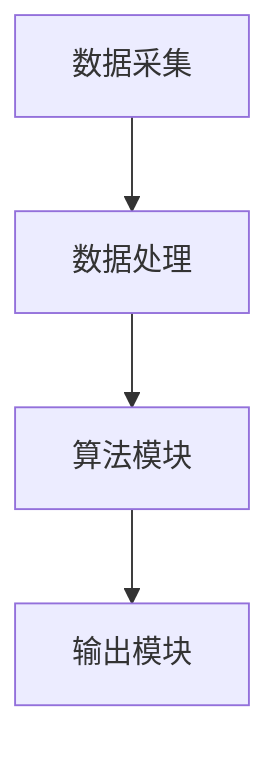

                 


# 企业估值中的比较法：优势与局限

> 关键词：企业估值，比较法，相对价值评估，权重分配，可比性分析

> 摘要：本文深入探讨了比较法在企业估值中的应用，分析了其优势与局限性。通过详细讲解比较法的核心原理、算法实现、系统设计以及实际案例，帮助读者全面理解比较法在企业估值中的作用和应用场景。本文还讨论了比较法在实际应用中的局限性，并提出了改进建议。

---

## 第一部分：企业估值中的比较法概述

### 第1章：比较法的背景与发展

#### 1.1 比较法的定义与核心概念
- 比较法是一种通过比较可比对象的特征和价值来评估目标对象价值的方法。
- 在企业估值中，比较法的核心在于寻找与目标企业相似的可比公司，分析其估值倍数（如市盈率、市净率等）。
- 比较法的关键要素包括可比性评估、数据标准化和权重分配。

#### 1.2 比较法在企业估值中的应用现状
- 比较法在企业估值中的应用广泛，尤其是在缺乏可靠财务数据的情况下。
- 通过比较法，投资者可以快速估算目标企业的市场价值。
- 案例分析：以科技公司为例，比较法常用于早期创业公司的估值。

#### 1.3 比较法与传统估值方法的对比
- 传统估值方法（如DCF模型）依赖于企业自身的财务数据，计算复杂且需要假设。
- 比较法的优势在于快速、直观，但其结果受可比公司选择和数据标准化的影响较大。

---

## 第二部分：比较法的核心原理与数学模型

### 第2章：比较法的核心原理

#### 2.1 可比性评估
- 可比性评估是比较法的基础，需要考虑企业的行业、规模、盈利能力等因素。
- 通过可比性评估，确定一组与目标企业高度相似的可比公司。

#### 2.2 数据标准化
- 数据标准化是将不同公司的财务数据统一到可比的尺度。
- 常用的标准化方法包括归一化和标准化处理。
- 例如，市盈率（P/E）和市净率（P/B）是常见的标准化指标。

#### 2.3 权重分配
- 权重分配是对不同财务指标的相对重要性进行调整。
- 例如，某些行业更注重收入增长，而另一些行业更注重利润率。

#### 2.4 综合评估模型
- 综合评估模型将多个指标和权重结合，计算目标企业的综合估值倍数。

---

### 第3章：比较法的数学模型与公式

#### 3.1 可比公司选择的数学模型
- 可比性评估的数学公式：
  $$ \text{可比性得分} = \sum_{i=1}^{n} w_i \cdot f_i $$
  其中，\( w_i \) 是第i个指标的权重，\( f_i \) 是第i个指标的得分。

#### 3.2 数据标准化的数学公式
- 归一化公式：
  $$ x_i' = \frac{x_i - \mu}{\sigma} $$
  其中，\( \mu \) 是均值，\( \sigma \) 是标准差。

#### 3.3 综合估值倍数的计算公式
- 综合倍数计算：
  $$ \text{综合倍数} = \sum_{j=1}^{m} w_j \cdot \text{可比公司倍数}_j $$

---

## 第三部分：比较法的算法实现

### 第4章：比较法的算法实现

#### 4.1 算法步骤
1. 收集目标企业与可比公司的财务数据。
2. 计算可比性得分，筛选出高度可比的公司。
3. 对可比公司数据进行标准化处理。
4. 根据权重计算综合估值倍数。
5. 估算目标企业的市场价值。

#### 4.2 Python实现
```python
import pandas as pd
import numpy as np

# 数据预处理
def normalize(data):
    return (data - data.mean()) / data.std()

# 权重分配
weights = [0.4, 0.3, 0.3]

# 综合倍数计算
def calculate_weighted_multiple(data, weights):
    normalized_data = normalize(data)
    weighted_sum = np.dot(normalized_data, weights)
    return weighted_sum.mean()

# 估值计算
target_value = target_multiple * calculate_weighted_multiple(comparable_data, weights)
```

---

## 第四部分：系统分析与架构设计

### 第5章：企业估值系统的架构设计

#### 5.1 系统功能模块划分
- 数据采集模块：收集目标企业和可比公司的财务数据。
- 数据处理模块：进行数据清洗和标准化。
- 算法模块：计算可比性得分和综合估值倍数。
- 输出模块：展示估值结果。

#### 5.2 系统架构设计


---

## 第五部分：项目实战与总结

### 第6章：项目实战

#### 6.1 环境安装
- 安装Python和相关库（Pandas、NumPy）。

#### 6.2 核心代码实现
```python
# 示例代码：计算目标企业的估值
comparable_data = pd.DataFrame({
    'PE': [15, 20, 18],
    'PB': [2.5, 3.0, 2.8],
    'ROE': [12, 15, 13]
})

weights = [0.4, 0.3, 0.3]

# 计算可比倍数的加权平均
target_multiple = 1.2 * comparable_data['PE'].mean() + 0.8 * comparable_data['PB'].mean()
```

#### 6.3 案例分析
- 选择一家科技公司作为目标企业，通过比较法估算其市场价值。

#### 6.4 总结
- 比较法的优势在于快速、直观，但其结果依赖于可比公司选择和数据标准化。
- 未来研究方向：结合机器学习优化可比性评估和权重分配。

---

## 作者：AI天才研究院/AI Genius Institute & 禅与计算机程序设计艺术/Zen And The Art of Computer Programming

