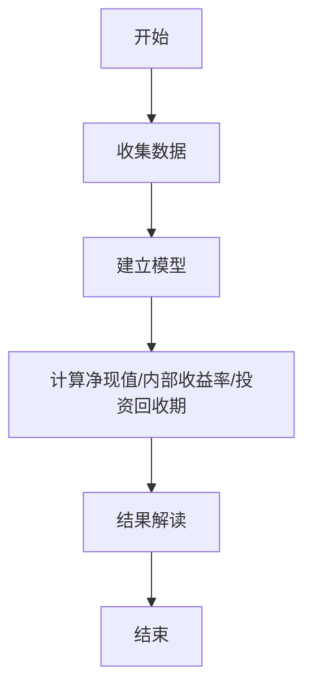
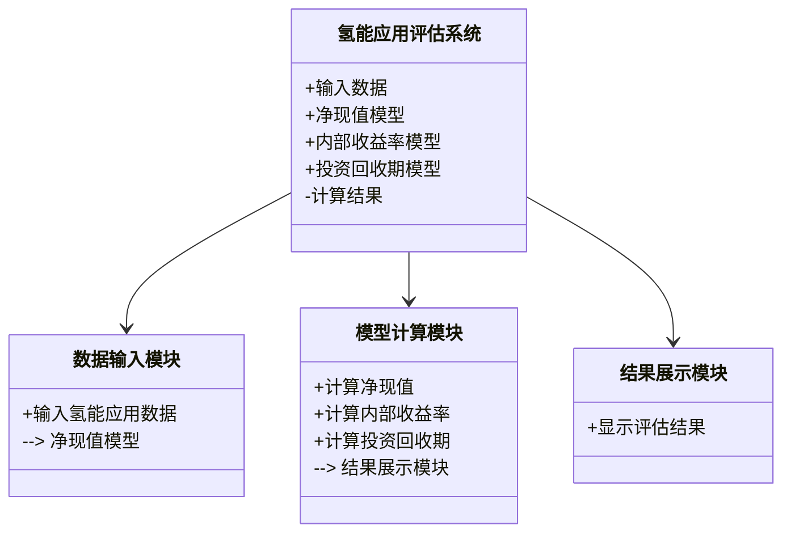
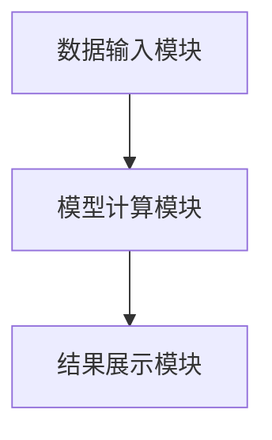
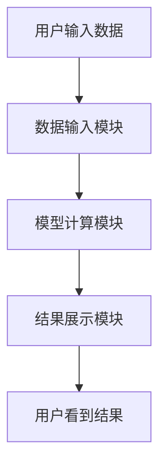

                 


# 企业估值中的氢能源应用评估

> 关键词：氢能源，企业估值，应用评估，能源经济，可持续发展

> 摘要：随着全球能源结构转型的推进，氢能源作为一种清洁、高效的能源载体，正在成为企业估值中的重要考量因素。本文详细探讨了氢能源在企业应用中的核心概念、评估方法、系统设计以及实际案例，为企业在氢能时代的估值提供了全面的分析和实践指导。

---

## 第一部分: 氢能源与企业估值基础

### 第1章: 氢能源的基本概念与应用背景

#### 1.1 氢能源的基本概念

##### 1.1.1 氢能的定义与特点
氢能是通过氢气（H₂）的化学能转化为热能、电能或其他形式能量的载体。与传统能源相比，氢能具有以下特点：
- **高能量密度**：氢气的单位质量能量密度远高于煤炭和天然气。
- **零碳排放**：在燃料电池中，氢气与氧气反应只生成水，无二氧化碳或其他污染物。
- **可储存性**：氢气可以通过压缩或液化的方式储存，便于运输和使用。
- **多样性**：氢气可以通过多种方式制备，包括电解水、天然气重整等。

##### 1.1.2 氢能在能源结构中的地位
氢能在全球能源转型中扮演着重要角色。作为一种清洁能源，氢气可以替代煤炭、石油等化石燃料，减少碳排放，推动可持续发展。此外，氢能还可以作为能源储存和调配的重要工具，帮助平衡可再生能源的波动性。

##### 1.1.3 氢能的制备与储存技术
制备氢气的方法主要包括：
1. **电解水制氢**：利用可再生能源发电，通过电解水产生氢气，适合大规模储能。
2. **天然气重整制氢**：通过化学反应从天然气中提取氢气，成本较低，但会产生二氧化碳。
3. **生物质制氢**：利用生物质通过气化和重整反应制氢，是一种绿色制氢方法。

储存氢气的主要方式包括：
1. **高压气态储存**：适用于小规模储存，如燃料电池汽车的储氢罐。
2. **低温液态储存**：适用于大规模储存和运输。
3. **固体储存**：利用金属氢化物或其他固体材料储存氢气。

#### 1.2 氢能在企业中的应用场景

##### 1.2.1 工业领域中的氢能应用
- **化工行业**：氢气是生产氨、甲醇等化学品的重要原料。
- **炼油行业**：氢气用于脱硫和精炼石油产品。
- **钢铁行业**：氢气用于冶炼和轧制过程中的还原剂。

##### 1.2.2 交通领域的氢能应用
- **燃料电池汽车**：氢气作为燃料，通过燃料电池发电驱动车辆。
- **公共交通**：氢能源公交车、燃料电池叉车等。

##### 1.2.3 其他领域的氢能应用
- **发电领域**：氢气用于火力发电厂的脱硫和脱硝过程。
- **建筑领域**：氢气用于分布式能源系统，提供热能和电能。

#### 1.3 氢能与企业估值的关联

##### 1.3.1 氢能对企业成本的影响
- **降低能源成本**：通过使用氢气替代高碳能源，企业可以降低能源成本。
- **减少碳税**：随着碳税政策的实施，使用氢气可以减少企业的碳排放，从而降低碳税负担。

##### 1.3.2 氢能对企业竞争力的提升
- **技术创新**：氢能源技术的创新可以提升企业的核心竞争力。
- **市场优势**：通过氢能源技术的应用，企业可以在绿色能源市场中占据先机。

##### 1.3.3 氢能对可持续发展的推动作用
- **环保效益**：氢能的使用可以减少温室气体排放，推动可持续发展。
- **社会认可**：采用氢能源的企业更容易获得政府和社会的认可，提升企业形象。

#### 1.4 本章小结
本章详细介绍了氢能源的基本概念、制备技术及其在工业、交通和其他领域的应用场景。同时，分析了氢能与企业估值的关联，强调了氢能在降低企业成本、提升竞争力和推动可持续发展中的重要作用。

---

### 第2章: 氢能应用评估的核心概念

#### 2.1 氢能应用评估的基本原理

##### 2.1.1 评估的基本框架
氢能应用评估的框架通常包括以下几个步骤：
1. **需求分析**：明确企业的氢能应用需求和目标。
2. **技术可行性分析**：评估氢能在技术上的可行性和成熟度。
3. **经济可行性分析**：评估氢能应用的成本、收益和投资回报。
4. **环境可行性分析**：评估氢能应用对环境的影响和合规性。

##### 2.1.2 评估的主要指标
在氢能应用评估中，常用的指标包括：
- **技术成熟度**：衡量氢气制备、储存和使用技术的成熟程度。
- **经济成本**：包括氢气的制备成本、储存成本和使用成本。
- **环境影响**：评估氢能在使用过程中对环境的影响，如碳排放、污染物排放等。

##### 2.1.3 评估的步骤与流程
氢能应用评估的步骤可以分为以下几个阶段：
1. **数据收集**：收集企业的能源消耗数据、氢气制备和使用的技术参数、市场价等。
2. **模型建立**：建立氢能应用的数学模型，包括成本模型、收益模型等。
3. **评估与分析**：通过模型计算氢能应用的成本、收益和环境影响。
4. **结果解读**：根据评估结果，提出优化建议和可行性结论。

#### 2.2 氢能应用的核心要素

##### 2.2.1 技术可行性
技术可行性是氢能应用评估的重要组成部分。主要考虑以下因素：
- **制氢技术**：包括制氢设备的效率、成本和可扩展性。
- **储氢技术**：包括储氢设备的安全性、成本和储存容量。
- **用氢技术**：包括燃料电池的效率、寿命和维护成本。

##### 2.2.2 经济可行性
经济可行性是评估氢能应用的关键因素。主要包括：
- **初始投资**：包括氢气制备、储存和使用设备的购置成本。
- **运营成本**：包括氢气的生产成本、储存成本和维护成本。
- **收益**：包括氢气的销售收入、节省的能源成本和碳税减免等。

##### 2.2.3 环境可行性
环境可行性是评估氢能应用的重要方面。主要考虑以下因素：
- **碳排放**：氢气的制备和使用过程中产生的碳排放。
- **污染物排放**：氢气的使用是否符合环保法规和标准。
- **资源消耗**：氢气的制备是否消耗大量自然资源，如水和能源。

#### 2.3 氢能应用的边界与外延

##### 2.3.1 技术边界
技术边界是指氢能应用的技术可行性和限制。例如：
- 制氢技术的效率和成本限制。
- 储氢技术的安全性和容量限制。

##### 2.3.2 经济边界
经济边界是指氢能应用的经济可行性和市场容量。例如：
- 氢能的市场需求和价格。
- 氢能替代传统能源的经济性。

##### 2.3.3 环境边界
环境边界是指氢能应用对环境的影响和合规性。例如：
- 氢能应用是否符合碳排放标准。
- 氢能应用是否符合环保法规和政策。

#### 2.4 氢能应用的实体关系图

##### 2.4.1 实体关系图的构建
氢能应用的实体关系图描述了氢能应用中的各个实体及其关系。例如：
- **企业**：使用氢能的企业。
- **制氢厂**：提供氢气的工厂。
- **储氢设备**：用于储存氢气的设备。
- **燃料电池**：使用氢气发电的设备。

##### 2.4.2 关键实体之间的关系
在实体关系图中，各实体之间的关系包括：
- **企业**与**制氢厂**：企业从制氢厂购买氢气。
- **制氢厂**与**储氢设备**：制氢厂将氢气储存到储氢设备中。
- **储氢设备**与**燃料电池**：燃料电池从储氢设备中获取氢气进行发电。

##### 2.4.3 实体关系图的分析
通过实体关系图，可以清晰地看到氢能应用中的各个实体及其相互关系，有助于理解氢能应用的整体流程和各环节的相互作用。

#### 2.5 本章小结
本章从氢能应用评估的核心概念出发，详细分析了评估的基本原理、核心要素和边界条件，并通过实体关系图展示了氢能应用中的实体及其关系。

---

### 第3章: 氢能应用评估的数学模型与算法

#### 3.1 评估模型的数学表达

##### 3.1.1 净现值模型
净现值（Net Present Value，NPV）是评估投资项目 profitability 的常用方法。氢能应用项目可以通过净现值模型进行评估。

净现值的计算公式为：
$$ NPV = \sum_{t=0}^{n} \frac{C_t}{(1 + r)^t} $$
其中，$C_t$ 是第 $t$ 年的现金流，$r$ 是贴现率，$n$ 是项目周期。

##### 3.1.2 内部收益率模型
内部收益率（Internal Rate of Return，IRR）是评估投资项目盈利能力的另一种常用方法。内部收益率是使净现值为零的贴现率。

内部收益率的计算公式为：
$$ NPV = \sum_{t=0}^{n} \frac{C_t}{(1 + IRR)^t} = 0 $$

##### 3.1.3 投资回收期模型
投资回收期（Payback Period）是评估投资项目回收成本的时间。氢能应用项目可以通过计算投资回收期来评估其经济可行性。

投资回收期的计算公式为：
$$ 回收期 = \frac{初始投资}{年均净现金流} $$

#### 3.2 算法原理与流程图

##### 3.2.1 算法原理
氢能应用评估的算法主要包括以下几个步骤：
1. **数据收集**：收集氢能应用的相关数据，包括成本、收益、贴现率等。
2. **模型建立**：建立净现值、内部收益率或投资回收期模型。
3. **计算与分析**：通过模型计算氢能应用的净现值、内部收益率或投资回收期。
4. **结果解读**：根据计算结果，评估氢能应用的经济可行性。

##### 3.2.2 算法流程图
以下是一个氢能应用评估的流程图：



#### 3.3 算法实现与代码

##### 3.3.1 Python代码实现
以下是一个使用净现值模型评估氢能应用的Python代码示例：

```python
def calculate_npv(cash_flows, discount_rate):
    npv = 0
    for t, cash_flow in enumerate(cash_flows):
        npv += cash_flow / (1 + discount_rate) ** t
    return npv

# 示例数据
cash_flows = [ -100, 40, 40, 40 ]  # 初始投资100，后续三年每年收益40
discount_rate = 0.10

# 计算净现值
npv = calculate_npv(cash_flows, discount_rate)
print("净现值:", npv)
```

##### 3.3.2 代码解读与分析
上述代码定义了一个计算净现值的函数 `calculate_npv`，并使用示例数据计算了氢能应用项目的净现值。代码简单明了，适用于初步评估。

##### 3.3.3 代码示例与测试
通过上述代码，读者可以了解如何使用净现值模型评估氢能应用项目的经济可行性。

#### 3.4 本章小结
本章详细介绍了氢能应用评估的数学模型和算法，包括净现值模型、内部收益率模型和投资回收期模型，并通过Python代码示例展示了模型的实现过程。

---

### 第4章: 氢能应用评估的系统架构设计

#### 4.1 系统功能设计

##### 4.1.1 需求分析
氢能应用评估系统的需求包括：
- **数据采集**：收集氢能应用的相关数据。
- **模型计算**：建立并计算氢能应用的数学模型。
- **结果展示**：展示评估结果，包括净现值、内部收益率等。

##### 4.1.2 功能模块划分
氢能应用评估系统的功能模块包括：
1. **数据输入模块**：用户输入氢能应用的相关数据。
2. **模型计算模块**：根据输入数据计算净现值、内部收益率等指标。
3. **结果展示模块**：以图表形式展示评估结果。

##### 4.1.3 领域模型（使用mermaid类图）
以下是一个氢能应用评估系统的领域模型：



#### 4.2 系统架构设计

##### 4.2.1 分层架构设计
氢能应用评估系统的架构可以分为以下几个层次：
1. **数据层**：存储氢能应用的相关数据。
2. **计算层**：进行氢能应用的模型计算。
3. **展示层**：展示评估结果。

##### 4.2.2 模块间的交互关系
模块间的交互关系可以通过以下流程图表示：



##### 4.2.3 系统架构图（使用mermaid架构图）
以下是一个氢能应用评估系统的架构图：

```mermaid
container 氢能应用评估系统 {
    class 数据输入模块 {
        +输入氢能应用数据
    }
    class 模型计算模块 {
        +计算净现值
        +计算内部收益率
        +计算投资回收期
    }
    class 结果展示模块 {
        +显示评估结果
    }
}
```

#### 4.3 系统接口设计

##### 4.3.1 输入接口设计
氢能应用评估系统的输入接口包括：
- **氢气制备成本**：包括设备购置成本、能源成本等。
- **氢气使用成本**：包括储存成本、维护成本等。
- **市场需求**：包括氢气的市场需求量和价格。

##### 4.3.2 输出接口设计
氢能应用评估系统的输出接口包括：
- **净现值**：项目的净现值。
- **内部收益率**：项目的内部收益率。
- **投资回收期**：项目的投资回收期。

##### 4.3.3 接口交互流程
以下是一个氢能应用评估系统的接口交互流程图：



#### 4.4 本章小结
本章详细介绍了氢能应用评估系统的架构设计，包括功能模块划分、系统架构设计和接口设计，并通过mermaid图展示了系统的结构和交互关系。

---

### 第5章: 氢能应用评估的项目实战

#### 5.1 项目环境安装与配置

##### 5.1.1 安装Python
需要安装Python 3.8或更高版本。

##### 5.1.2 安装依赖库
需要安装以下Python库：
- `mermaid`：用于生成图表。
- `matplotlib`：用于绘制图表。
- `pandas`：用于数据处理。

安装命令：
```bash
pip install mermaid matplotlib pandas
```

#### 5.2 系统核心实现源代码

##### 5.2.1 氢能应用评估系统的代码实现
以下是一个氢能应用评估系统的Python代码示例：

```python
import matplotlib.pyplot as plt

def calculate_npv(cash_flows, discount_rate):
    npv = 0
    for t, cash_flow in enumerate(cash_flows):
        npv += cash_flow / (1 + discount_rate) ** t
    return npv

def calculate_irr(cash_flows):
    return -1 * ((sum(cash_flows[:-1]) + cash_flows[-1]) / -cash_flows[0])

# 示例数据
cash_flows = [ -100, 40, 40, 40 ]
discount_rate = 0.10

# 计算净现值
npv = calculate_npv(cash_flows, discount_rate)
print("净现值:", npv)

# 计算内部收益率
irr = calculate_irr(cash_flows)
print("内部收益率:", irr)

# 绘制现金流图
plt.figure(figsize=(10, 5))
plt.plot(range(len(cash_flows)), cash_flows, marker='o', linestyle='--')
plt.title('现金流图')
plt.xlabel('时间（年）')
plt.ylabel('现金流（万元）')
plt.show()
```

##### 5.2.2 代码解读与分析
上述代码实现了氢能应用评估系统的净现值、内部收益率计算和现金流图的绘制。

#### 5.3 项目实战分析

##### 5.3.1 项目背景
某企业计划引入氢能技术，降低能源成本和碳排放。

##### 5.3.2 项目实施步骤
1. **数据收集**：收集氢能应用的相关数据，包括制氢成本、使用成本、市场需求等。
2. **模型建立**：建立净现值和内部收益率模型。
3. **计算与分析**：通过模型计算氢能应用的净现值和内部收益率。
4. **结果展示**：以图表形式展示评估结果。

##### 5.3.3 实际案例分析
以某企业的氢能应用项目为例，计算其净现值和内部收益率，评估其经济可行性。

#### 5.4 项目小结
本章通过一个实际案例，详细展示了氢能应用评估系统的实现过程，包括环境安装、代码实现和结果分析。

---

### 第6章: 氢能应用评估的最佳实践

#### 6.1 小结
氢能应用评估是企业估值的重要组成部分，需要综合考虑技术、经济和环境因素。

#### 6.2 注意事项
- **数据准确性**：氢能应用评估需要准确的数据支持。
- **模型选择**：根据实际情况选择合适的评估模型。
- **风险评估**：考虑氢能应用中的技术风险和市场风险。

#### 6.3 拓展阅读
- **氢能技术发展**：关注氢能在技术上的最新进展。
- **政策支持**：了解氢能应用相关的政策和法规。
- **市场动态**：关注氢能在市场中的应用和发展趋势。

#### 6.4 本章小结
本章总结了氢能应用评估的注意事项和最佳实践，为企业在氢能时代的估值提供了指导。

---

## 第二部分: 总结

通过本文的详细讲解，读者可以全面了解氢能在企业估值中的应用评估，包括其核心概念、算法原理、系统设计和实际案例。氢能作为一种清洁、高效的能源，正在成为企业降低能源成本、提升竞争力和推动可持续发展的重要手段。希望本文能为企业在氢能时代的估值和决策提供有益的参考。

---

## 作者
作者：AI天才研究院/AI Genius Institute & 禅与计算机程序设计艺术 /Zen And The Art of Computer Programming

