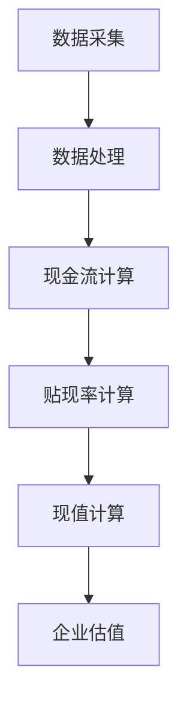
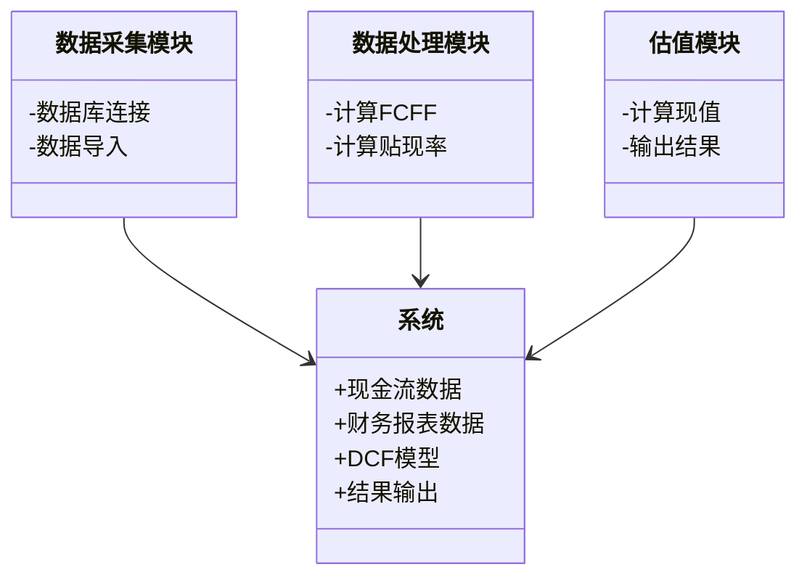

                 


# 企业估值中的现金流量分析

## 关键词：企业估值、现金流分析、DCF模型、财务分析、投资评估

## 摘要：现金流量分析是企业估值的核心方法之一，通过对企业的现金流进行详细分析，可以准确评估其内在价值。本文从现金流的基本概念出发，深入探讨现金流分析的理论基础、DCF模型的原理与应用、系统架构设计，以及实际项目中的现金流分析与评估。通过丰富的案例分析和详细的数学模型推导，帮助读者掌握企业估值中的现金流分析方法。

---

# 第一部分：现金流分析的背景与重要性

## 第1章：现金流分析的基本概念

### 1.1 现金流的定义与分类

现金流是指企业在一定时期内通过经营或其他活动所获得或支出的现金和现金等价物的流入和流出。根据来源和用途，现金流可以分为三类：

1. **经营活动现金流**：企业日常经营活动中产生的现金流，包括销售商品、提供服务等。
2. **投资活动现金流**：与企业投资相关的现金流，包括购买或出售资产、投资于其他公司等。
3. **筹资活动现金流**：与企业筹资活动相关的现金流，包括发行债券、偿还贷款、分红等。

### 1.2 现金流在企业估值中的作用

现金流是企业价值的核心驱动因素。通过分析现金流，可以评估企业的盈利能力和成长潜力。具体来说：

1. **反映企业的真实 profitability**：现金流比利润更能反映企业的实际盈利能力，因为利润可能包含大量非现金项目。
2. **评估企业的成长性**：通过分析自由现金流（FCFF），可以评估企业未来的增长潜力。
3. **支持企业估值模型**：现金流是Discounted Cash Flow（DCF）模型的核心输入。

### 1.3 现金流分析的边界与外延

现金流分析的边界包括：

1. **时间范围**：通常包括未来5-10年的预测期和一个永续期。
2. **假设条件**：包括稳定增长率、永续增长率、贴现率等。
3. **行业特性**：不同行业的现金流特征不同，例如制造业和服务业的现金流模式差异较大。

### 1.4 现金流分析的核心要素

1. **时间价值**：现金流的时间价值是通过贴现率计算的，未来的现金流需要折现到当前时点。
2. **风险调整**：高风险的现金流需要更高的贴现率，反之亦然。
3. **可预测性**：现金流的预测越准确，估值结果越可靠。

---

## 第2章：现金流分析的理论基础

### 2.1 现金流的现值理论

现值理论是现金流分析的核心。现值公式为：

$$ PV = \frac{FV}{(1 + r)^n} $$

其中：
- \( PV \)：现值
- \( FV \)：未来价值
- \( r \)：贴现率
- \( n \)：时间期限

### 2.2 现金流的时间价值与风险评估

时间价值是指资金随着时间的推移而产生的价值变化。风险评估是通过贴现率调整现金流的现值。

### 2.3 贴现率的确定

贴现率是现金流分析的关键参数。通常使用加权平均资本成本（WACC）作为贴现率。

$$ WACC = w_d \cdot r_d + w_l \cdot r_l \cdot (1 - t) $$

其中：
- \( w_d \)：债务权重
- \( r_d \)：债务成本
- \( w_l \)：股权权重
- \( r_l \)：股权成本
- \( t \)：税率

---

## 第3章：现金流分析的系统架构

### 3.1 数据采集与处理

现金流分析系统需要采集企业的财务报表数据，包括利润表、资产负债表和现金流量表。

### 3.2 系统架构设计

1. 数据采集模块：
   - 从财务报表中提取现金流数据。
2. 数据处理模块：
   - 计算自由现金流（FCFF）。
3. 估值模块：
   - 使用DCF模型计算企业价值。

### 3.3 系统流程图



---

# 第二部分：DCF模型的原理与应用

## 第4章：DCF模型的核心原理

### 4.1 DCF模型的定义

DCF模型是基于现金流的现值计算企业价值的模型。公式如下：

$$ TV = \sum_{t=1}^{n} \frac{CF_t}{(1 + r)^t} + \frac{TV}{(1 + r)^n} $$

其中：
- \( TV \)：终值
- \( CF_t \)：第\( t \)年的现金流
- \( r \)：贴现率
- \( n \)：预测期

### 4.2 自由现金流的计算

自由现金流（FCFF）公式为：

$$ FCFF = EBIT(1 - t) + Depreciation - Capital Expenditure $$

其中：
- \( EBIT \)：息税前利润
- \( t \)：税率
- \( Depreciation \)：折旧
- \( Capital Expenditure \)：资本支出

### 4.3 DCF模型的步骤

1. 预测未来现金流。
2. 计算终值。
3. 计算现值。
4. 加上股权价值。

---

## 第5章：DCF模型的实际应用

### 5.1 案例分析：亚马逊的DCF估值

假设亚马逊的自由现金流为 $100 million，增长率5%，贴现率10%。计算其企业价值：

$$ TV = \frac{100}{0.10 - 0.05} = 2000 million $$

### 5.2 实际操作中的注意事项

1. 确保现金流预测的准确性。
2. 合理选择贴现率。
3. 考虑行业特性和企业风险。

---

# 第三部分：现金流分析的系统实现

## 第6章：现金流分析的系统实现

### 6.1 系统需求分析

1. 数据采集：从财务报表中提取现金流数据。
2. 数据处理：计算自由现金流和贴现率。
3. 估值计算：使用DCF模型计算企业价值。

### 6.2 系统架构设计



### 6.3 系统实现

1. 环境配置：
   - Python 3.8+
   - Pandas、NumPy、Matplotlib
2. 数据采集：
   ```python
   import pandas as pd
   df = pd.read_csv('cash_flow.csv')
   ```
3. 数据处理：
   ```python
   def calculate_fcff(EBIT, tax_rate, depreciation, capital_expenditure):
       return EBIT * (1 - tax_rate) + depreciation - capital_expenditure
   ```
4. 估值计算：
   ```python
   def dcf_model(cash_flow, discount_rate, growth_rate):
       TV = cash_flow * (1 + growth_rate) / (discount_rate - growth_rate)
       PV = TV / (1 + discount_rate) ** len(cash_flow)
       return PV
   ```

---

## 第7章：现金流分析的高级主题

### 7.1 现金流分析中的杠杆效应

杠杆效应会影响企业的现金流和估值。高杠杆意味着更高的财务风险，但可能带来更高的回报。

### 7.2 非正常现金流的处理

对于一次性现金流，例如重组成本，需要单独处理。

### 7.3 国际业务的现金流分析

国际业务需要考虑汇率风险和税收政策。

### 7.4 并购重组中的现金流分析

并购重组需要重新评估现金流和贴现率。

---

## 第8章：现金流分析的注意事项与最佳实践

### 8.1 注意事项

1. 确保数据的准确性。
2. 合理选择贴现率。
3. 考虑行业特性和企业风险。

### 8.2 最佳实践

1. 使用专业的财务软件。
2. 定期更新现金流数据。
3. 结合其他估值方法。

---

## 附录：现金流分析工具

### 附录A：Python代码示例

```python
import pandas as pd
import numpy as np

def calculate_wacc(weights, cost, tax_rate):
    return np.sum(weights * cost * (1 - tax_rate))

weights = [0.5, 0.5]
cost = [0.05, 0.10]
tax_rate = 0.2
wacc = calculate_wacc(weights, cost, tax_rate)
print(f"Weighted Average Cost of Capital: {wacc:.2%}")
```

### 附录B：参考文献

1. 肖星. 《财务报表分析与经营决策》
2. 罗伯特·希勒. 《金融与经济周期》

---

## 作者：AI天才研究院/AI Genius Institute & 禅与计算机程序设计艺术/Zen And The Art of Computer Programming

---

**全文完**

