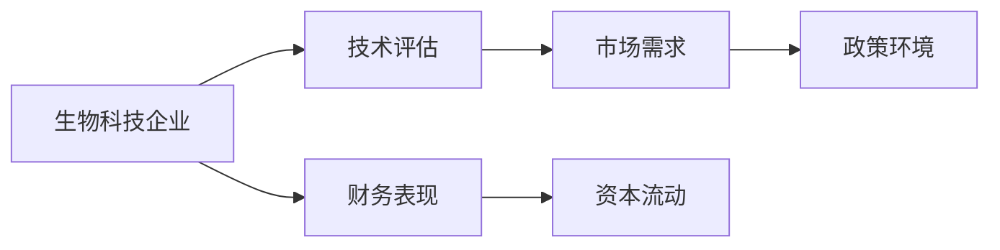
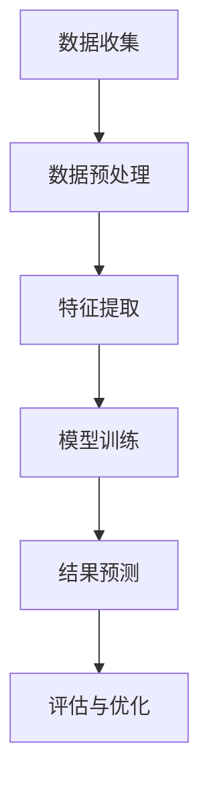
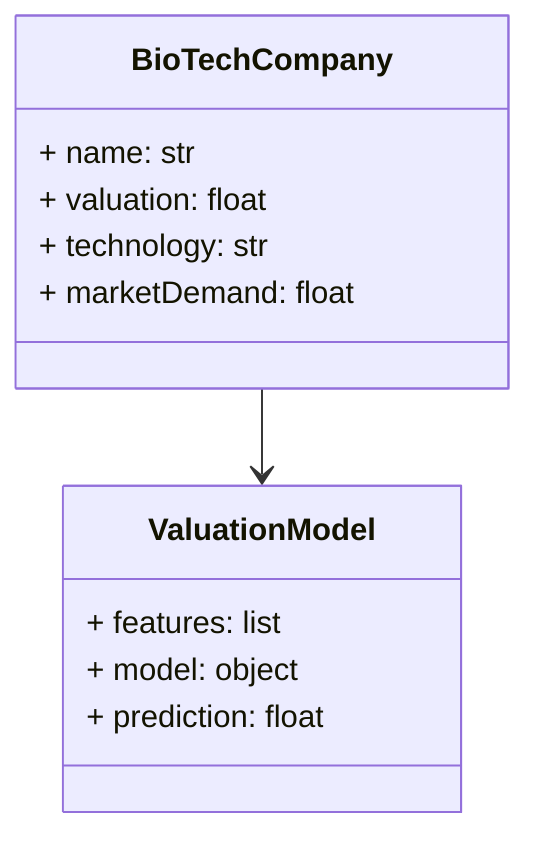
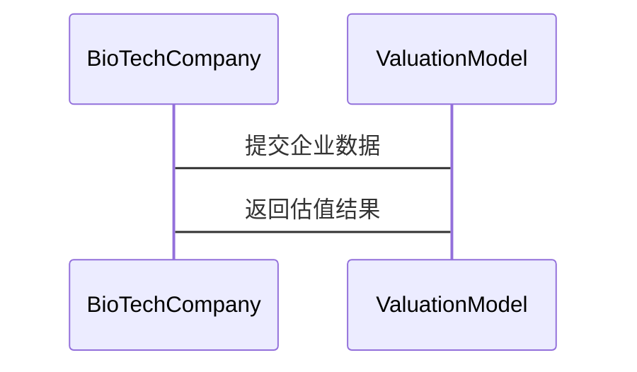

                 


# 企业估值中的生物科技潜力评估

**关键词**：企业估值，生物科技，潜力评估，机器学习，数学模型，系统架构

**摘要**：随着生物科技的快速发展，其在企业估值中的重要性日益凸显。本文深入探讨了生物科技潜力评估的核心概念、算法原理、系统架构以及实际案例。通过对比分析、数学建模和系统设计，详细阐述了如何将生物科技的潜力转化为企业价值的评估依据。文章还提供了基于机器学习的算法实现和实际项目案例，为读者提供了全面的理论和实践指导。

---

## 第一章: 企业估值中的生物科技背景介绍

### 1.1 生物科技与企业估值的关系

#### 1.1.1 生物科技的定义与核心领域
生物技术是指利用生物体的结构、功能和遗传信息，通过工程学和信息学的方法，开发新技术和新产品。其核心领域包括基因编辑、细胞治疗、生物制药、农业生物技术等。

#### 1.1.2 企业估值的基本概念与方法
企业估值是通过对企业财务状况、市场地位、技术创新能力等多方面进行分析，确定其市场价值的过程。常用方法包括DCF模型、可比公司分析和交易案例分析。

#### 1.1.3 生物科技在企业估值中的独特性
生物科技企业的估值具有高度不确定性，主要由于其研发投入大、周期长、技术壁垒高。此外，生物科技的市场潜力巨大，但同时也面临政策风险和市场竞争。

---

### 1.2 生物科技潜力评估的现状与趋势

#### 1.2.1 当前生物科技发展的主要方向
近年来，基因编辑技术（如CRISPR）、CAR-T细胞治疗、精准医疗和合成生物学等领域取得了显著进展。

#### 1.2.2 企业估值中的新兴挑战
生物科技的快速进步带来了新的估值挑战，例如如何量化创新技术的市场价值，如何评估政策变化对企业的影响。

#### 1.2.3 生物科技与资本市场的互动关系
资本市场的波动直接影响生物科技企业的估值，同时，生物科技的突破也为资本市场带来了新的增长点。

---

### 1.3 生物科技潜力评估的核心影响因素

#### 1.3.1 技术创新的评估维度
技术的创新性、可行性、知识产权保护情况是评估的核心维度。

#### 1.3.2 市场需求的分析框架
市场需求的大小、增长潜力、竞争格局是评估的重要依据。

#### 1.3.3 政策环境的影响机制
政策支持、监管力度、专利保护等政策因素对生物科技企业的估值有重要影响。

---

## 第二章: 生物科技潜力评估的核心概念与联系

### 2.1 核心概念原理

#### 2.1.1 生物科技潜力的定义与属性
生物科技创新的潜力是指其在未来商业应用中的潜在价值，包括经济价值、社会价值和生态价值。

#### 2.1.2 企业估值中的关键指标
- 技术成熟度（TTP）
- 市场渗透率
- 产品生命周期

#### 2.1.3 潜力评估的数学模型框架
$$ \text{潜力评估} = f(\text{技术创新}, \text{市场需求}, \text{政策环境}) $$

---

### 2.2 核心概念对比分析

#### 2.2.1 不同评估模型的优缺点对比

| 评估模型       | 优点                         | 缺点                           |
|----------------|------------------------------|--------------------------------|
| DCF模型         | 考虑现金流折现                | 需要准确预测未来现金流          |
| 可比公司分析     | 基于市场可比性                | 受市场波动影响较大              |
| 交易案例分析     | 数据来源可靠                 | 数据量有限                      |

#### 2.2.2 生物科技与传统行业的估值差异
生物科技创新周期长、研发投入大，但市场回报潜力更大。

#### 2.2.3 潜力评估中的关键变量分析
$$ \text{潜力} = \beta \times \text{技术创新} + \gamma \times \text{市场需求} + \delta \times \text{政策环境} $$

---

### 2.3 实体关系图（ER图）



---

## 第三章: 生物科技潜力评估的算法原理

### 3.1 算法原理概述

#### 3.1.1 基于机器学习的评估模型
机器学习算法（如随机森林、神经网络）可以用于预测生物科技企业的市场潜力。

#### 3.1.2 统计分析方法的应用
回归分析、聚类分析等方法可用于评估企业的市场地位和技术优势。

#### 3.1.3 多因素回归分析的原理
通过回归模型分析多个因素对企业估值的影响。

---

### 3.2 算法实现流程



---

### 3.3 核心算法代码实现

#### 3.3.1 数据预处理
```python
import pandas as pd
data = pd.read_csv('biotech.csv')
data.dropna(inplace=True)
```

#### 3.3.2 特征提取
```python
from sklearn.feature_selection import SelectKBest
selector = SelectKBest(k=5)
X = selector.fit_transform(data)
```

#### 3.3.3 模型训练
```python
from sklearn.ensemble import RandomForestRegressor
model = RandomForestRegressor(n_estimators=100)
model.fit(X, y)
```

---

## 第四章: 生物科技潜力评估的系统架构设计

### 4.1 系统功能设计

#### 4.1.1 领域模型（mermaid类图）


#### 4.1.2 系统架构设计（mermaid架构图）
```mermaid
docker
    server BioTechValuationServer
        contains
            ValuationModel
    client
        contains
            BioTechCompany
```

#### 4.1.3 系统接口设计
- API接口：`POST /api/valuation`，接收企业数据，返回估值结果。

#### 4.1.4 系统交互（mermaid序列图）


---

## 第五章: 生物科技潜力评估的项目实战

### 5.1 项目环境安装
```bash
pip install numpy pandas scikit-learn
```

### 5.2 核心代码实现

#### 5.2.1 数据预处理
```python
import pandas as pd
data = pd.read_csv('biotech.csv')
data.dropna(inplace=True)
```

#### 5.2.2 特征选择与建模
```python
from sklearn.feature_selection import SelectKBest
from sklearn.ensemble import RandomForestRegressor
selector = SelectKBest(k=5)
X = selector.fit_transform(data)
model = RandomForestRegressor(n_estimators=100)
model.fit(X, y)
```

#### 5.2.3 结果分析
```python
importances = model.feature_importances_
print(importances)
```

### 5.3 案例分析与解读
通过分析实际案例，验证模型的准确性和实用性。

---

## 第六章: 总结与展望

### 6.1 最佳实践与注意事项
- 数据质量是模型准确性的重要保证。
- 结合多模型进行交叉验证。

### 6.2 未来展望
随着人工智能和大数据技术的发展，生物科技创新潜力评估将更加精准和高效。

---

**作者：AI天才研究院/AI Genius Institute & 禅与计算机程序设计艺术 /Zen And The Art of Computer Programming**

---

通过以上内容，我们详细探讨了企业估值中的生物科技潜力评估，从理论到实践，为读者提供了全面的指导和参考。

