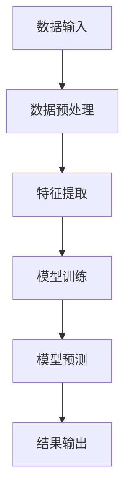
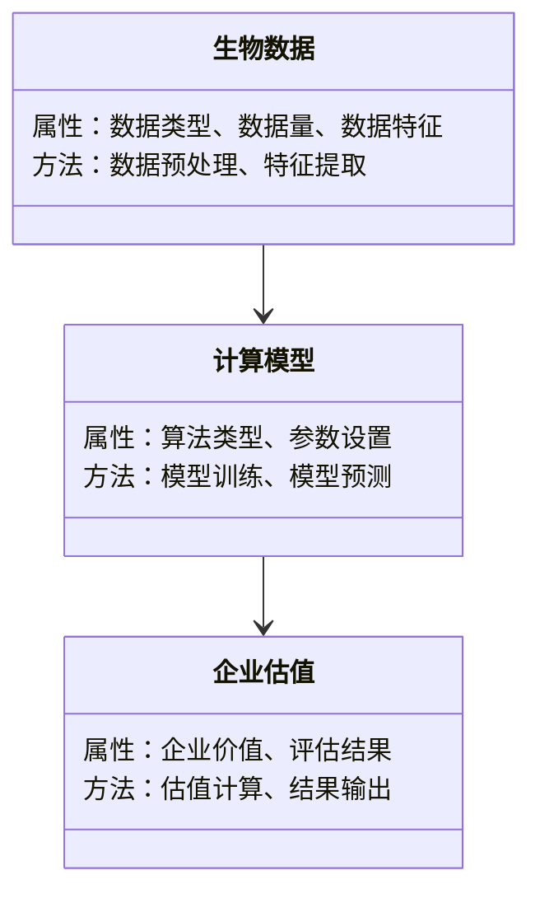
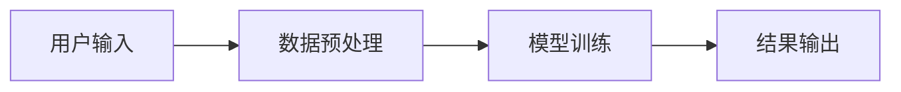
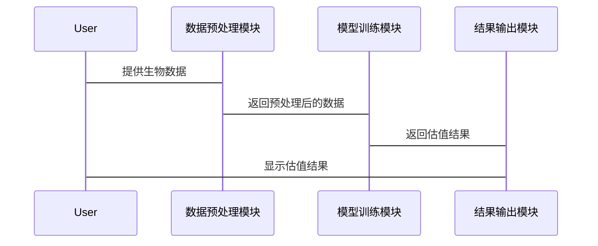

                 


# 企业估值中的生物计算技术潜力评估

> **关键词**：生物计算技术，企业估值，潜力评估，数据挖掘，算法模型，系统架构

> **摘要**：随着生物技术与信息技术的深度融合，生物计算技术在企业估值中的应用潜力逐渐显现。本文从生物计算技术的基本概念出发，结合企业估值的核心原理，详细分析了生物计算技术在企业估值中的应用场景、算法原理、数学模型以及系统架构设计。通过实际案例分析和项目实战，本文展示了如何利用生物计算技术提升企业估值的准确性与效率，并提出了相关的最佳实践与未来发展建议。

---

## 第一章：生物计算技术的基本概念

### 1.1 生物计算技术的定义与特点
#### 1.1.1 生物计算技术的定义
生物计算技术是指利用生物分子（如DNA、RNA、蛋白质等）作为信息处理的基本单元，结合计算科学的方法，对生物数据进行分析、处理和应用的技术。其核心在于通过生物分子的特性和相互作用，构建信息处理系统。

#### 1.1.2 生物计算技术的核心特点
1. **生物分子的多样性**：生物分子具有多样化的结构和功能，能够用于信息存储和处理。
2. **计算的并行性**：生物分子可以在同一时间进行大量的并行计算，极大地提高了计算效率。
3. **自组装能力**：生物分子能够通过自组装形成复杂的结构，无需外部干预。

#### 1.1.3 生物计算技术与传统计算技术的区别
| **方面** | **生物计算技术** | **传统计算技术** |
|----------|------------------|------------------|
| 数据存储 | 生物分子（如DNA） | 电子存储设备（如硬盘） |
| 计算速度 | 高度并行，快速处理 | 单线程处理，速度受限 |
| 能耗 | 低能耗 | 高能耗 |

### 1.2 企业估值的基本原理
#### 1.2.1 企业估值的定义与方法
企业估值是指对企业整体或部分股权的价值进行评估的过程。传统的企业估值方法主要包括财务指标分析、市场比较法和DCF模型等。

#### 1.2.2 传统企业估值模型的优缺点
1. **优点**：
   - 数据来源丰富，易于获取。
   - 方法成熟，结果具有较高的可比性。
2. **缺点**：
   - 忽略了企业内部创新能力和核心竞争力的动态变化。
   - 无法充分考虑企业的生物技术资产价值。

#### 1.2.3 生物计算技术在企业估值中的潜在应用
生物计算技术可以通过分析企业的生物技术资产（如基因数据、蛋白质网络等），评估其潜在价值，从而为企业估值提供新的视角。

---

## 第二章：生物计算技术与企业估值的结合

### 2.1 生物数据的特征与挑战
#### 2.1.1 生物数据的多样性
生物数据包括基因序列、蛋白质结构、代谢网络等多种形式，具有高度的复杂性和多样性。

#### 2.1.2 生物数据的复杂性
生物数据的复杂性主要体现在其非线性关系和多层次结构上，这使得传统的线性模型难以有效处理。

#### 2.1.3 生物数据的隐私性
生物数据涉及个人隐私问题，数据的安全性和合规性是生物计算技术应用中的重要挑战。

### 2.2 生物计算技术在企业估值中的应用场景
#### 2.2.1 基因组数据分析与企业价值评估
通过分析企业的基因组数据，评估其在疾病治疗、农业改良等领域的潜在价值。

#### 2.2.2 蛋白质相互作用网络与企业竞争力分析
利用蛋白质相互作用网络，评估企业的创新能力和技术领先性。

#### 2.2.3 生物标志物的发现与企业风险评估
通过发现特定的生物标志物，评估企业在疾病诊断、药物研发等领域的潜在风险。

### 2.3 生物计算技术与企业估值的边界与外延
#### 2.3.1 生物计算技术的适用范围
生物计算技术适用于涉及生物技术资产的企业，如制药公司、农业科技公司等。

#### 2.3.2 企业估值的边界条件
1. 数据的完整性和准确性。
2. 技术的可实现性和商业化潜力。

#### 2.3.3 生物计算技术的潜在扩展领域
1. 个性化医疗。
2. 精准农业。
3. 环境监测与治理。

---

## 第三章：生物计算技术的核心概念与联系

### 3.1 生物计算技术的核心原理
#### 3.1.1 生物数据的处理流程
1. 数据采集：通过实验手段获取生物数据。
2. 数据预处理：对数据进行清洗和标准化。
3. 数据分析：利用算法对数据进行建模和预测。
4. 数据可视化：将分析结果以图形化的方式展示。

#### 3.1.2 生物计算技术的关键算法
- **支持向量机（SVM）**：用于分类和回归分析。
- **随机森林（Random Forest）**：用于特征选择和分类。
- **深度学习（Deep Learning）**：用于复杂模式的识别。

#### 3.1.3 生物计算技术的数学模型
$$ y = f(x) $$
其中，$y$ 表示企业估值，$x$ 表示生物数据，$f$ 表示生物计算模型。

### 3.2 核心概念的对比分析
#### 3.2.1 生物数据与传统数据的对比
| **方面** | **生物数据** | **传统数据** |
|----------|--------------|--------------|
| 数据类型 | 序列数据、结构数据 | 数值数据、文本数据 |
| 数据量 | 大数据 | 中小数据 |
| 数据复杂性 | 高 | 低 |

#### 3.2.2 生物计算技术与传统计算技术的对比
| **方面** | **生物计算技术** | **传统计算技术** |
|----------|------------------|------------------|
| 数据处理能力 | 高度并行 | 单线程 |
| 数据存储 | 生物分子 | 电子设备 |
| 能耗 | 低 | 高 |

---

## 第四章：生物计算技术的算法原理

### 4.1 算法原理概述
生物计算技术的核心算法包括支持向量机、随机森林和深度学习等。这些算法通过处理生物数据，帮助企业估值。

#### 4.1.1 支持向量机（SVM）
$$ \text{目标函数：} \quad \max \left( \frac{1}{2} \|w\|^2 \right) $$
$$ \text{约束条件：} \quad y_i (w \cdot x_i + b) \geq 1 $$

#### 4.1.2 随机森林（Random Forest）
$$ \text{特征重要性：} \quad \text{基于决策树的分裂次数计算} $$

#### 4.1.3 深度学习（Deep Learning）
$$ \text{神经网络结构：} \quad x \rightarrow \text{隐藏层} \rightarrow y $$

### 4.2 算法流程图


### 4.3 算法实现的Python代码示例
```python
from sklearn import svm
import numpy as np

# 数据准备
X = np.array([[1, 2], [3, 4], [5, 6]])
y = np.array([0, 1, 0])

# 模型训练
model = svm.SVC()
model.fit(X, y)

# 模型预测
print(model.predict(X))
```

---

## 第五章：生物计算技术的数学模型与公式

### 5.1 数学模型概述
生物计算技术的数学模型主要用于生物数据的分析和处理。常见的模型包括线性回归、逻辑回归和神经网络等。

#### 5.1.1 线性回归模型
$$ y = \beta_0 + \beta_1 x + \epsilon $$

#### 5.1.2 逻辑回归模型
$$ p = \frac{e^{\beta_0 + \beta_1 x}}{1 + e^{\beta_0 + \beta_1 x}} $$

#### 5.1.3 神经网络模型
$$ y = \sigma(w \cdot x + b) $$
其中，$\sigma$ 表示激活函数，$w$ 表示权重，$x$ 表示输入，$b$ 表示偏置。

---

## 第六章：生物计算技术的系统架构设计

### 6.1 系统功能设计
#### 6.1.1 领域模型


#### 6.1.2 系统架构


#### 6.1.3 接口设计
1. 数据接口：提供生物数据的输入和输出接口。
2. 模型接口：提供计算模型的调用接口。
3. 结果接口：提供估值结果的展示接口。

#### 6.1.4 交互序列图


---

## 第七章：生物计算技术的项目实战

### 7.1 项目背景
以一家生物制药公司为例，评估其在癌症治疗领域的潜在价值。

### 7.2 环境安装
1. 安装Python和相关库（如scikit-learn、numpy）。
2. 安装生物数据处理工具（如生物信息学软件）。

### 7.3 核心代码实现
```python
import pandas as pd
from sklearn.ensemble import RandomForestClassifier

# 数据加载
data = pd.read_csv('biological_data.csv')

# 特征选择
features = data.drop('target', axis=1)
target = data['target']

# 模型训练
model = RandomForestClassifier(n_estimators=100)
model.fit(features, target)

# 模型预测
predictions = model.predict(features)
print("预测结果：", predictions)
```

### 7.4 案例分析
通过对某生物制药公司的基因组数据进行分析，评估其在癌症治疗领域的潜在价值。

---

## 第八章：最佳实践与总结

### 8.1 最佳实践
1. 确保生物数据的隐私性和安全性。
2. 选择合适的生物计算算法和模型。
3. 定期更新模型和数据。

### 8.2 小结
生物计算技术在企业估值中的应用潜力巨大，能够帮助企业更好地评估其生物技术资产的价值。

### 8.3 注意事项
1. 生物数据的复杂性和多样性可能增加计算的难度。
2. 模型的准确性和可解释性是应用中的关键问题。

### 8.4 拓展阅读
1. 《生物信息学导论》
2. 《机器学习实战》
3. 《企业估值方法论》

---

## 作者信息

作者：AI天才研究院/AI Genius Institute & 禅与计算机程序设计艺术/Zen And The Art of Computer Programming

