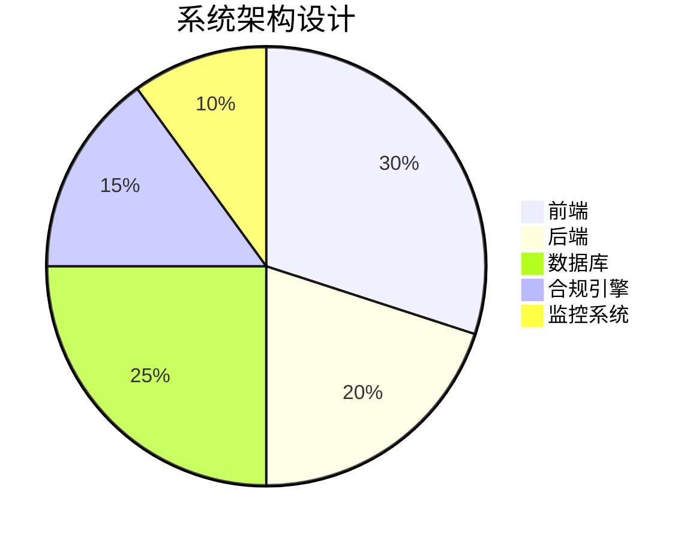
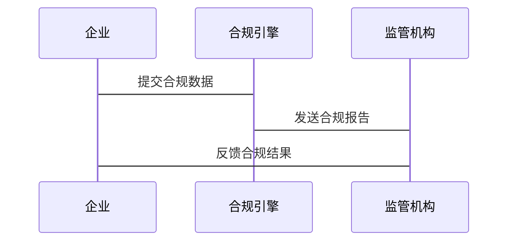

                 


# 《企业估值中的监管合规成本分析》

> 关键词：企业估值，监管合规，合规成本，监管框架，成本分析

> 摘要：本文系统性地分析了企业在估值过程中面临的监管合规成本问题。通过深入探讨监管合规成本的核心概念、算法原理、数学模型及系统架构，结合实际案例分析，全面解析了监管合规成本对企业估值的影响。本文旨在为企业提供一套科学的监管合规成本分析方法，帮助企业更准确地评估企业价值。

---

## 第一部分: 监管合规成本的背景与概述

### 第1章: 监管合规成本的核心概念与问题背景

#### 1.1 监管合规成本的定义与背景
##### 1.1.1 什么是监管合规成本
监管合规成本是指企业在遵守相关法律法规、行业标准及监管要求的过程中所产生的各种成本，包括直接成本（如法律咨询费用、系统开发费用）和间接成本（如时间成本、机会成本）。

##### 1.1.2 监管合规成本的背景与重要性
随着全球化和数字化的深入发展，企业面临的监管环境日益复杂。监管合规成本已成为企业估值的重要组成部分，尤其是在金融、科技和制造等行业，合规成本占企业总成本的比例越来越高。

##### 1.1.3 监管合规成本的边界与外延
监管合规成本的边界包括企业为满足监管要求而产生的所有直接和间接成本，其外延则涉及企业内部治理、外部审计、信息披露等多个方面。

#### 1.2 企业估值中的监管合规成本问题
##### 1.2.1 企业估值的基本概念
企业估值是通过对企业的财务状况、市场表现、管理团队等多方面进行综合评估，确定企业的市场价值。

##### 1.2.2 监管合规成本对估值的影响
监管合规成本直接影响企业的净利润和现金流，从而影响企业的估值。合规成本的高低取决于企业的业务模式、所处行业及监管环境。

##### 1.2.3 问题解决的思路与方法
通过建立监管合规成本的数学模型，结合行业基准数据，对企业估值中的合规成本进行科学评估和调整。

#### 1.3 监管合规成本的核心要素与概念结构
##### 1.3.1 监管合规成本的核心要素
- **监管要求**：包括法律法规、行业标准等。
- **合规投入**：包括人力、物力、财力等方面的投入。
- **合规效果**：包括合规的效率、质量等。

##### 1.3.2 监管合规成本的概念结构
监管合规成本是企业为了满足监管要求而产生的各项成本，其概念结构包括输入（监管要求）、过程（合规措施）和输出（合规成本）三部分。

##### 1.3.3 监管合规成本与其他成本的关系
监管合规成本与其他成本（如运营成本、管理成本）既有区别又有联系，合规成本是企业总成本的重要组成部分。

#### 1.4 本章小结
本章从定义、背景、核心要素等方面系统性地介绍了监管合规成本的概念，为后续分析奠定了基础。

---

### 第2章: 监管合规成本的核心概念与联系

#### 2.1 监管合规成本的核心原理
##### 2.1.1 监管合规成本的形成机制
企业为了满足监管要求，需要投入大量资源，这些资源的投入形成了合规成本。

##### 2.1.2 监管合规成本的计算方法
合规成本的计算需要考虑企业规模、行业特点、监管要求等多个因素。

##### 2.1.3 监管合规成本的动态变化
随着监管环境的变化，合规成本也会动态调整，企业需要及时应对。

#### 2.2 监管合规成本的关键属性特征对比
##### 2.2.1 监管合规成本的属性特征
| 特性 | 描述 |
|------|------|
| 强制性 | 由监管机构强制要求 |
| 灵活性 | 根据企业具体情况调整 |
| 持续性 | 需要长期投入 |

##### 2.2.2 监管合规成本与其他成本的对比
- **与运营成本对比**：合规成本是企业非核心业务成本，而运营成本是核心业务成本。
- **与管理成本对比**：合规成本属于管理成本的一部分，但具有更强的外部性。

##### 2.2.3 监管合规成本的量化指标
- 直接成本：法律咨询费、系统开发费。
- 间接成本：员工培训时间、管理精力投入。

#### 2.3 监管合规成本的ER实体关系图
```mermaid
er
  actor 监管机构
  actor 企业
  actor 第三方合规机构
  entity 监管要求
  entity 合规成本
  entity 企业估值
  relation 监管机构-监管要求
  relation 企业-监管要求
  relation 企业-合规成本
  relation 合规成本-企业估值
```

#### 2.4 本章小结
本章通过对比分析和实体关系图，详细阐述了监管合规成本的核心概念与联系。

---

### 第3章: 监管合规成本的算法原理与数学模型

#### 3.1 监管合规成本的算法原理
##### 3.1.1 监管合规成本的计算方法
- **成本分摊法**：将合规成本分摊到相关业务单元。
- **标杆法**：通过行业对标确定合规成本的合理范围。

##### 3.1.2 监管合规成本的分类算法
根据成本性质进行分类，如固定成本、变动成本。

##### 3.1.3 监管合规成本的预测模型
使用时间序列分析法预测未来合规成本。

#### 3.2 监管合规成本的数学模型与公式
##### 3.2.1 监管合规成本的基本公式
$$C_{\text{合规}} = \sum_{i=1}^{n} c_i$$
其中，$c_i$ 表示第i项合规成本，$n$ 是成本项数。

##### 3.2.2 监管合规成本的预测公式
$$C_{\text{预测}} = \alpha \cdot C_{\text{当前}} + \beta \cdot t$$
其中，$\alpha$ 和 $\beta$ 是模型参数，$t$ 是时间变量。

#### 3.3 本章小结
本章通过数学模型和算法原理，详细分析了监管合规成本的计算方法和预测模型。

---

## 第二部分: 监管合规成本的系统分析与架构设计

### 第4章: 监管合规成本的系统架构设计

#### 4.1 问题场景介绍
企业面临复杂的监管环境，需要通过系统化的方法来管理和优化合规成本。

#### 4.2 系统功能设计
- **合规要求管理**：识别和解析监管要求。
- **成本计算模块**：自动计算合规成本。
- **合规监控系统**：实时监控合规状态。

#### 4.3 系统架构设计


#### 4.4 系统接口设计
- **API接口**：与第三方合规机构对接。
- **数据接口**：与企业财务系统对接。

#### 4.5 系统交互设计


#### 4.6 本章小结
本章通过系统架构设计，展示了如何通过信息化手段优化监管合规成本管理。

---

## 第三部分: 监管合规成本的项目实战

### 第5章: 项目实战分析

#### 5.1 环境安装与配置
- 安装Python开发环境。
- 配置数据库和API接口。

#### 5.2 核心实现代码
```python
def calculate_compliance_cost(regulations, compliance_measures):
    cost = 0
    for reg in regulations:
        for measure in compliance_measures:
            if measure.applicable_to(reg):
                cost += measure.cost
    return cost

# 示例：金融行业合规成本计算
class ComplianceMeasure:
    def __init__(self, name, cost):
        self.name = name
        self.cost = cost
        self.applicable = True

regulations = [
    "反洗钱法",
    "数据保护法",
    "金融消费者保护法"
]

measures = [
    ComplianceMeasure("反洗钱系统开发", 500000),
    ComplianceMeasure("数据加密措施", 300000),
    ComplianceMeasure("客户身份验证", 200000)
]

total_cost = calculate_compliance_cost(regulations, measures)
print(f"总合规成本为: ${total_cost}")
```

#### 5.3 代码解读与分析
- **函数 `calculate_compliance_cost`**：计算合规成本的主函数，遍历所有监管要求和合规措施，判断措施是否适用于该监管要求，适用于则累加成本。
- **类 `ComplianceMeasure`**：表示一个合规措施，包含名称、成本和适用性。

#### 5.4 实际案例分析
以某金融企业为例，计算其合规成本，并分析不同措施对总成本的影响。

#### 5.5 本章小结
本章通过具体代码实现，展示了如何将监管合规成本的理论应用于实际项目。

---

## 第四部分: 结论与展望

### 第6章: 结论与展望

#### 6.1 本章总结
监管合规成本是企业估值的重要组成部分，通过科学的方法和系统化的设计，可以有效降低合规成本，提升企业价值。

#### 6.2 未来展望
随着监管环境的不断变化，监管合规成本分析需要更加智能化和动态化，未来可以通过AI技术进一步优化合规成本的计算和管理。

---

## 作者：AI天才研究院/AI Genius Institute & 禅与计算机程序设计艺术 /Zen And The Art of Computer Programming

---

**注意**：以上目录和内容仅为示例，实际撰写时需要根据具体情况进行调整和补充。

