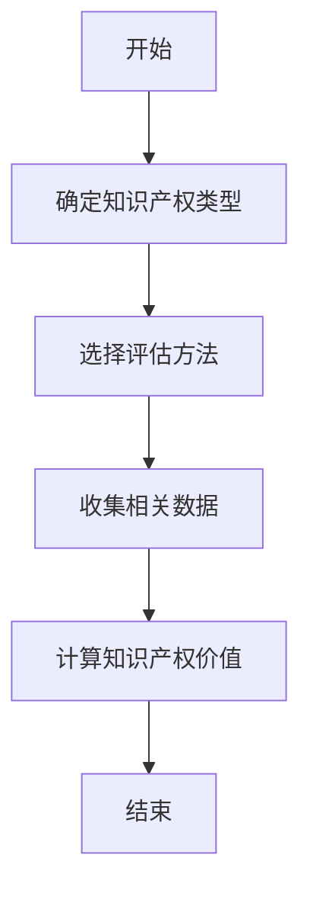
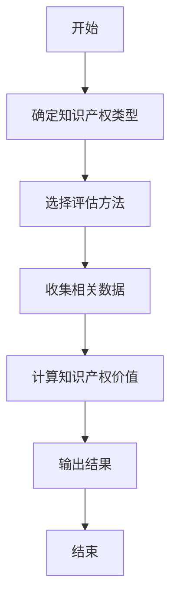
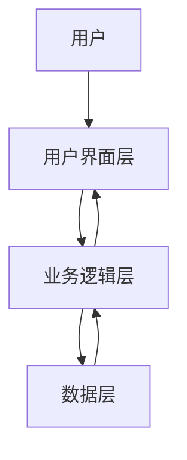
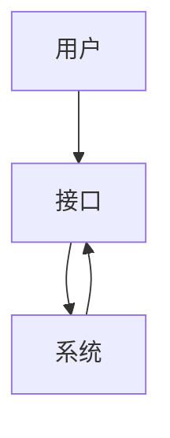
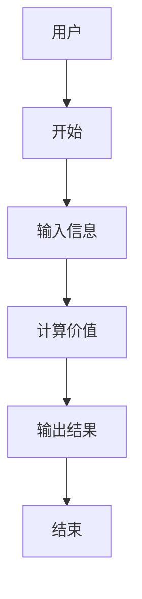

                 


# 企业估值中的知识产权价值法

## 关键词：知识产权，企业估值，价值评估，数学模型，算法原理

## 摘要：  
知识产权在企业估值中扮演着越来越重要的角色。本文将系统地介绍知识产权价值法的基本原理、核心概念、算法模型以及实际应用。通过详细分析知识产权在企业估值中的重要性，结合具体的案例和数学模型，本文将为读者提供一个全面的视角，帮助其更好地理解如何在企业估值中准确评估知识产权的价值。

---

## 第1章：知识产权与企业估值的背景介绍

### 1.1 知识产权的基本概念

#### 1.1.1 知识产权的定义与核心要素
知识产权（Intellectual Property，IP）是指人们对智力劳动成果所享有的权利。它包括专利权、商标权、版权、商业秘密等多种形式。知识产权的核心要素包括：
- **创新性**：知识产权的产生必须基于创新。
- **法律保护**：通过法律手段保护其专有性。
- **经济价值**：知识产权能够为企业创造经济价值。

#### 1.1.2 知识产权的分类与特点
知识产权可以分为两类：
1. **工业产权**：包括专利权、商标权、外观设计权等。
2. **著作权**：包括文学、艺术、音乐、软件等作品的版权。

其特点包括：
- **无形性**：知识产权是一种无形资产。
- **可转让性**：可以通过许可、转让等方式进行交易。
- **时间性**：知识产权的有效期有限，如专利权通常为20年。

#### 1.1.3 知识产权在企业中的作用
知识产权是企业的核心竞争力之一。它不仅能够保护企业的创新成果，还能为企业带来直接的经济收益。例如，专利技术可以转化为产品，从而为企业创造利润。

---

### 1.2 企业估值中的知识产权价值

#### 1.2.1 企业估值的基本概念
企业估值是指通过对企业的财务状况、市场地位、技术水平等因素的综合评估，确定企业的整体价值。企业估值是企业融资、并购、上市等活动中的重要环节。

#### 1.2.2 知识产权在企业估值中的重要性
知识产权是企业的重要资产之一。在企业估值中，知识产权的价值往往占据了相当大的比重。例如，在科技企业中，知识产权（如专利）的价值可能占企业总价值的50%以上。

#### 1.2.3 知识产权价值法的定义与目标
知识产权价值法是一种通过评估知识产权的经济价值，来确定企业整体价值的方法。其目标是将知识产权的价值量化，并将其纳入企业估值的范畴。

---

## 第2章：知识产权价值法的核心概念与联系

### 2.1 知识产权价值法的原理

#### 2.1.1 知识产权价值法的基本原理
知识产权价值法的核心在于将知识产权的价值量化。其基本原理是通过分析知识产权的收益能力、市场竞争力和法律保护状况，确定其经济价值。

#### 2.1.2 知识产权价值法的数学模型与公式
知识产权的价值可以通过以下公式进行估算：
$$ V = \frac{R}{r} $$
其中，\( V \) 是知识产权的价值，\( R \) 是知识产权的年收益，\( r \) 是折现率。

#### 2.1.3 知识产权价值法与企业估值的关系
知识产权价值法是企业估值的重要组成部分。通过对知识产权的价值进行评估，可以更准确地确定企业的整体价值。

---

### 2.2 核心概念对比分析

#### 2.2.1 知识产权与企业价值的对比分析
- **知识产权**：一种无形资产，具有法律保护和经济价值。
- **企业价值**：企业的整体价值，包括有形资产和无形资产。

#### 2.2.2 不同知识产权类型的价值评估方法
- **专利权**：基于收益法进行评估。
- **商标权**：基于市场比较法进行评估。
- **版权**：基于成本法进行评估。

#### 2.2.3 知识产权价值法与其他估值方法的对比
- **收益法**：基于未来收益的折现值进行评估。
- **市场法**：基于市场交易案例进行比较评估。
- **成本法**：基于重置成本进行评估。

---

### 2.3 实体关系图与流程图

#### 2.3.1 知识产权价值法的ER实体关系图

```mermaid
erDiagram
    class 知识产权 {
        名称 : string
        类型 : string
        价值 : float
        期限 : integer
    }
    class 企业 {
        名称 : string
        资产 : string
        价值 : float
    }
    知识产权 --> 企业 : "属于"
```

#### 2.3.2 知识产权价值法的流程图



---

## 第3章：知识产权价值法的算法原理

### 3.1 知识产权价值法的数学模型与公式

#### 3.1.1 基于收益的知识产权价值模型
$$ V = \frac{R}{r} $$
其中，\( R \) 是知识产权的年收益，\( r \) 是折现率。

#### 3.1.2 基于成本的知识产权价值模型
$$ V = C \times (1 + i)^{-n} $$
其中，\( C \) 是初始成本，\( i \) 是折现率，\( n \) 是期限。

#### 3.1.3 基于市场比较的知识产权价值模型
$$ V = \frac{P}{A} \times B $$
其中，\( P \) 是可比交易的平均价格，\( A \) 是可比交易的调整因子，\( B \) 是目标知识产权的调整因子。

---

### 3.2 算法原理与流程

#### 3.2.1 算法原理的详细说明
知识产权价值法的算法原理包括以下步骤：
1. 确定知识产权的类型。
2. 选择合适的评估方法。
3. 收集相关的数据。
4. 计算知识产权的价值。
5. 输出结果。

#### 3.2.2 算法流程的详细步骤


#### 3.2.3 算法的数学推导与公式
$$ V = \frac{R}{r} $$

---

## 第4章：知识产权价值法的系统分析与架构设计

### 4.1 问题场景介绍

#### 4.1.1 企业估值中的知识产权问题
企业在估值时，需要考虑知识产权的价值。知识产权的价值可能影响企业的整体估值。

#### 4.1.2 知识产权价值法的应用场景
知识产权价值法可以应用于企业融资、并购、上市等活动。

---

### 4.2 系统功能设计

#### 4.2.1 知识产权价值评估系统功能模块
- 用户输入模块：输入知识产权的基本信息。
- 评估计算模块：根据输入的信息，计算知识产权的价值。
- 结果输出模块：输出知识产权的价值。

#### 4.2.2 系统功能模块的详细描述
- 用户输入模块：用户输入知识产权的名称、类型、收益等信息。
- 评估计算模块：根据输入的信息，计算知识产权的价值。
- 结果输出模块：输出知识产权的价值，并提供详细的计算过程。

---

### 4.3 系统架构设计

#### 4.3.1 系统架构的分层设计
- 数据层：存储知识产权的基本信息。
- 业务逻辑层：处理用户的输入，并计算知识产权的价值。
- 用户界面层：展示系统的功能界面。

#### 4.3.2 系统架构的详细说明


---

### 4.4 系统接口设计

#### 4.4.1 系统接口的设计原则
- 简单性：接口设计简单明了。
- 可扩展性：接口设计具有可扩展性。
- 安全性：接口设计具有安全性。

#### 4.4.2 系统接口的具体实现


---

### 4.5 系统交互流程图

#### 4.5.1 系统交互流程图的详细说明


#### 4.5.2 系统交互流程图的实现步骤
1. 用户输入知识产权的基本信息。
2. 系统根据输入的信息，计算知识产权的价值。
3. 系统输出知识产权的价值。

---

## 第5章：知识产权价值法的项目实战

### 5.1 环境安装与配置

#### 5.1.1 系统环境的安装与配置
- 操作系统：Windows 10 或更高版本。
- 开发工具：Python 3.8 或更高版本。

#### 5.1.2 开发工具的安装与配置
- 安装Python。
- 安装所需的库，如numpy、pandas、scikit-learn。

---

### 5.2 核心算法实现

#### 5.2.1 核心算法的代码实现
```python
import numpy as np

def calculate_value(revenue, discount_rate):
    return revenue / discount_rate

revenue = 1000000
discount_rate = 0.1

value = calculate_value(revenue, discount_rate)
print("知识产权价值：", value)
```

#### 5.2.2 算法代码的详细解读
- `calculate_value`函数：计算知识产权的价值。
- `revenue`：知识产权的年收益。
- `discount_rate`：折现率。

---

### 5.3 实际案例分析

#### 5.3.1 案例背景介绍
某科技公司拥有一项专利技术，年收益为100万元，折现率为10%。

#### 5.3.2 案例分析与解决
使用知识产权价值法，计算该专利技术的价值：
$$ V = \frac{1000000}{0.1} = 10000000 $$

#### 5.3.3 案例总结与反思
该专利技术的价值为1000万元，占企业总价值的较大比重。知识产权价值法在企业估值中的应用非常重要。

---

## 第6章：知识产权价值法的最佳实践与小结

### 6.1 最佳实践与注意事项

#### 6.1.1 知识产权价值法的最佳实践
- 确保数据的准确性。
- 选择合适的评估方法。
- 定期更新评估结果。

#### 6.1.2 知识产权价值法的注意事项
- 知识产权的价值受市场环境的影响较大。
- 知识产权的价值评估需要结合企业的实际情况。

---

### 6.2 小结与展望

#### 6.2.1 本章内容的小结
本文系统地介绍了知识产权价值法的基本原理、核心概念、算法模型以及实际应用。通过对知识产权的价值进行评估，可以帮助企业在估值中更准确地确定其整体价值。

#### 6.2.2 知识产权价值法的未来展望
随着科技的不断发展，知识产权在企业估值中的重要性将越来越凸显。未来，知识产权价值法将更加精准和多样化。

---

### 6.3 拓展阅读与深入学习

#### 6.3.1 拓展阅读的推荐
- 《知识产权法》
- 《企业估值与财务分析》
- 《知识产权与企业战略》

---

## 作者：AI天才研究院/AI Genius Institute & 禅与计算机程序设计艺术/Zen And The Art of Computer Programming

---

本文通过系统的分析和详细的讲解，帮助读者全面理解知识产权价值法的核心概念和实际应用。希望本文能够为企业的估值活动提供有价值的参考和指导。

