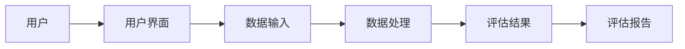
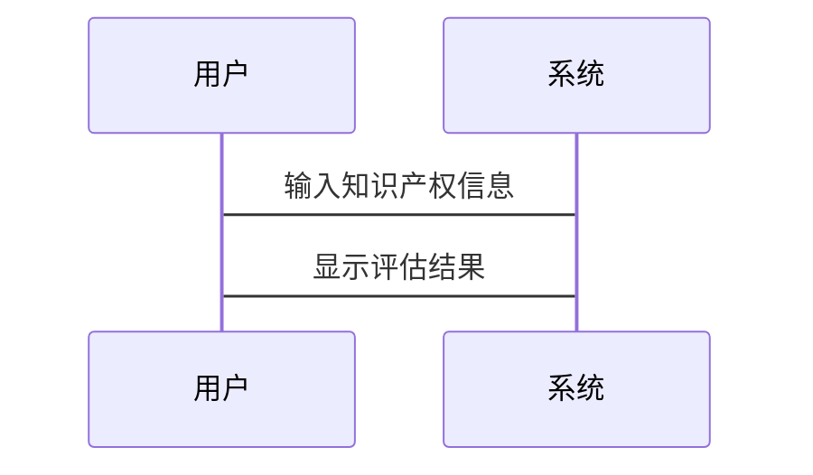

                 


# 企业估值中的知识产权保护评估

## 关键词：知识产权保护、企业估值、法律风险、技术评估、数学模型

## 摘要：  
知识产权保护在企业估值中的作用日益重要。本文从知识产权的基本概念出发，详细探讨了其与企业估值的内在联系，分析了知识产权保护评估的核心概念、技术方法和法律风险，并通过实际案例展示了如何在企业估值中有效评估和管理知识产权保护。文章结合理论与实践，提出了系统化的解决方案和最佳实践，为企业的知识产权保护和估值提供了重要的参考和指导。

---

# 第一章: 知识产权保护与企业估值的概述

## 1.1 知识产权的基本概念

### 1.1.1 知识产权的定义

知识产权（Intellectual Property，简称IP）是指依法保护的创造性成果和标识，包括专利、商标、版权、商业秘密等。这些权利赋予所有者在特定领域内的独占权，保护其智力劳动成果不被他人非法使用或侵权。

### 1.1.2 知识产权的核心要素

- **独占性**：知识产权的所有者享有专有权利，他人未经许可不得使用。
- **时间性**：知识产权的有效期有限，如专利通常为20年，版权则为作者 lifetime plus 50 years。
- **地域性**：知识产权的保护具有地域性，需在特定国家或地区申请和注册。

### 1.1.3 知识产权在企业中的作用

知识产权是企业核心竞争力的重要组成部分，能够通过技术壁垒、品牌价值和商业秘密等方式提升企业市场地位和盈利能力。

## 1.2 企业估值的基本概念

### 1.2.1 企业估值的定义

企业估值是指对企业的整体价值进行评估，通常包括资产、负债、盈利能力、市场地位等多方面因素。

### 1.2.2 企业估值的主要方法

- **资产基础法**：基于企业资产的账面价值进行评估。
- **收益法**：基于企业未来现金流的折现值进行评估。
- **市场法**：通过比较类似企业的市场交易价进行评估。

### 1.2.3 知识产权与企业估值的关系

知识产权作为企业的无形资产，直接影响企业的收益能力和市场竞争力，从而影响整体估值。

## 1.3 知识产权保护评估的背景与意义

### 1.3.1 知识产权保护的重要性

随着知识经济的发展，知识产权保护已成为企业核心竞争力的关键因素。

### 1.3.2 知识产权保护与企业估值的关联

有效的知识产权保护能够提升企业的市场地位和盈利能力，从而提高整体估值。

### 1.3.3 保护知识产权对提升企业估值的作用

通过保护知识产权，企业可以避免技术泄露和侵权风险，确保技术优势和市场地位，从而提升估值。

## 1.4 本章小结

本章介绍了知识产权的基本概念及其在企业中的作用，探讨了企业估值的主要方法，并分析了知识产权保护与企业估值的关系。知识产权保护是提升企业估值的重要因素，需要引起企业的高度重视。

---

# 第二章: 知识产权保护评估的核心概念与联系

## 2.1 知识产权保护的基本原理

### 2.1.1 知识产权保护的法律依据

知识产权保护主要通过专利法、版权法、商标法等法律法规进行。

### 2.1.2 知识产权保护的技术手段

包括加密技术、数字水印、区块链等技术手段，用于防止侵权和保护知识产权。

### 2.1.3 知识产权保护的经济价值

通过保护知识产权，企业可以实现技术垄断和市场优势，创造更大的经济价值。

## 2.2 知识产权保护评估的属性特征对比

### 2.2.1 不同知识产权类型的对比分析

- **专利**：保护发明创造，具有技术壁垒。
- **商标**：保护品牌标识，提升品牌价值。
- **版权**：保护作品的原创性，如软件代码、文学作品等。
- **商业秘密**：保护未公开的技术诀窍和商业策略。

### 2.2.2 保护强度与企业估值的关系

保护强度越高，知识产权的价值越大，企业估值也相应提高。

### 2.2.3 知识产权保护的地域性特征

知识产权保护具有地域性，需在不同国家和地区进行申请和注册。

## 2.3 知识产权保护评估的ER实体关系图

```mermaid
erd
    Customer
    -------------------------
    id: int [PK]
    name: string
    -------------------------

    Product
    -------------------------
    id: int [PK]
    name: string
    price: decimal
    -------------------------

    Order
    -------------------------
    id: int [PK]
    customer_id: int [FK]
    product_id: int [FK]
    order_date: date
    -------------------------
```

## 2.4 本章小结

本章分析了知识产权保护的基本原理和技术手段，探讨了不同知识产权类型的对比分析，强调了保护强度与企业估值的关系，并通过ER实体关系图展示了知识产权保护的结构。

---

# 第三章: 知识产权保护评估的算法原理

## 3.1 知识产权保护评估的数学模型

### 3.1.1 评估指标的定义

- **技术价值**：评估知识产权的技术创新性和实用性。
- **市场价值**：评估知识产权在市场上的应用前景和收益能力。
- **法律价值**：评估知识产权的法律保护力度和稳定性。

### 3.1.2 数学模型的建立

$$ \text{知识产权价值} = f(\text{技术价值}, \text{市场价值}, \text{法律价值}) $$

### 3.1.3 示例计算

假设某项专利的技术价值为80分，市场价值为70分，法律价值为90分，则其综合价值为：

$$ f(80, 70, 90) = 80 \times 0.4 + 70 \times 0.3 + 90 \times 0.3 = 32 + 21 + 27 = 80 $$

## 3.2 算法实现

### 3.2.1 Python实现

```python
def calculate_ip_value(tech_value, market_value, legal_value):
    weight_tech = 0.4
    weight_market = 0.3
    weight_legal = 0.3
    return (tech_value * weight_tech) + (market_value * weight_market) + (legal_value * weight_legal)

# 示例计算
tech = 80
market = 70
legal = 90
value = calculate_ip_value(tech, market, legal)
print(f"知识产权价值：{value}")
```

### 3.2.2 结果分析

通过上述算法，可以计算出知识产权的综合价值，为企业估值提供数据支持。

## 3.3 本章小结

本章通过数学模型和算法实现，展示了如何评估知识产权的综合价值，为企业估值提供了科学依据。

---

# 第四章: 知识产权保护评估的系统分析

## 4.1 系统架构设计

### 4.1.1 系统功能设计

- 用户界面：输入知识产权信息，显示评估结果。
- 数据处理：计算知识产权价值，生成评估报告。
- 数据存储：保存知识产权信息和评估结果。

### 4.1.2 系统架构图



## 4.2 知识产权保护评估的系统实现

### 4.2.1 环境安装

需要安装Python和相关库，如numpy、pandas等。

### 4.2.2 核心代码实现

```python
import numpy as np

def assess_risk(patents, trademarks, copyrights):
    risk_scores = []
    for ip in [patents, trademarks, copyrights]:
        risk = ip * 0.2 + (1 - ip) * 0.8
        risk_scores.append(risk)
    return np.mean(risk_scores)

# 示例计算
patents_score = 90
trademarks_score = 85
copyrights_score = 88
risk_assessment = assess_risk(patents_score, trademarks_score, copyrights_score)
print(f"知识产权保护风险评估：{risk_assessment}")
```

### 4.2.3 系统交互图



## 4.3 本章小结

本章通过系统分析和实现，展示了如何利用技术手段进行知识产权保护评估，为企业提供有效的风险管理和价值评估工具。

---

# 第五章: 知识产权保护评估的项目实战

## 5.1 项目背景与目标

某高科技公司希望对其拥有的专利、商标和版权进行保护评估，以提升企业估值。

## 5.2 项目实施

### 5.2.1 数据收集

收集专利、商标、版权的相关信息，包括技术参数、市场应用和法律保护情况。

### 5.2.2 数据分析

利用数学模型和算法，计算知识产权的综合价值和风险评估。

### 5.2.3 结果展示

生成评估报告，提出保护策略和建议。

## 5.3 实施结果

通过评估，该公司发现其专利和技术诀窍的保护力度不足，建议加强专利申请和保护。

## 5.4 本章小结

本章通过实际案例展示了知识产权保护评估的项目实施过程和结果，为企业提供了可操作的指导。

---

# 第六章: 知识产权保护评估的最佳实践

## 6.1 最佳实践 tips

- 定期进行知识产权评估和更新。
- 加强技术保护和法律咨询。
- 建立完善的知识产权管理体系。

## 6.2 小结

## 6.3 注意事项

- 确保评估模型的科学性和准确性。
- 定期更新评估数据和方法。
- 加强团队合作，整合技术和法律资源。

## 6.4 拓展阅读

建议阅读《知识产权管理与保护》、《企业估值分析》等相关书籍。

---

# 作者：AI天才研究院/AI Genius Institute & 禅与计算机程序设计艺术 /Zen And The Art of Computer Programming

