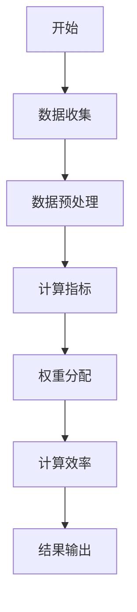
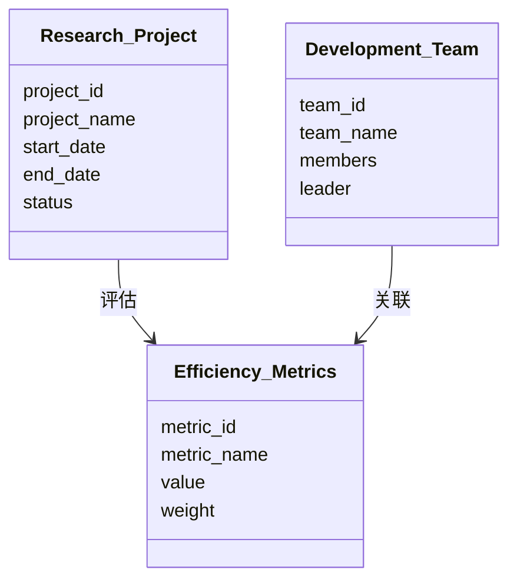
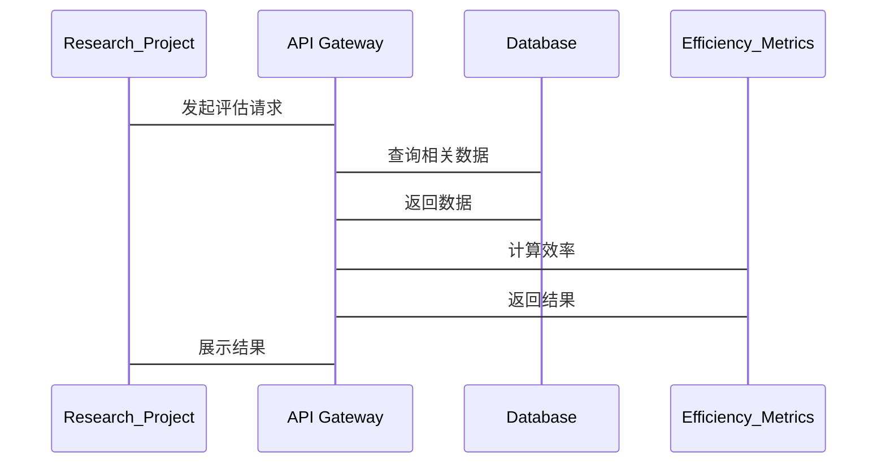

                 


# 企业估值中的研发效率评估

## 关键词：研发效率评估，企业估值，研发效率，指标体系，算法模型，系统架构

## 摘要：企业估值中的研发效率评估是衡量企业技术创新能力和市场竞争力的重要指标。本文从研发效率的核心概念出发，详细分析其与企业估值的关系，构建研发效率评估的指标体系和数学模型，探讨系统架构设计与实现，结合实际案例进行深入剖析，为企业估值提供科学依据。

---

## 第1章: 研发效率评估的背景与重要性

### 1.1 研发效率评估的定义与核心概念

#### 1.1.1 研发效率的定义
研发效率是指企业在一定时间内完成研发任务的质量和速度的综合表现。它衡量了企业在技术创新、产品开发和研发投入之间的平衡能力。

#### 1.1.2 研发效率的核心要素
- **研发周期**：从需求提出到产品交付的时间长度。
- **研发成本**：包括人力、资源和时间的投入。
- **研发成果**：最终产品的质量、创新性和市场竞争力。
- **研发团队效率**：团队成员的协作效率和生产力。

#### 1.1.3 研发效率与企业估值的关系
研发效率直接影响企业的创新能力和市场竞争力，进而影响企业的估值。高效率的研发能够更快地推出优质产品，提升企业市场地位和盈利能力。

### 1.2 研发效率评估的背景与现状

#### 1.2.1 当前企业估值中的挑战
企业估值往往依赖财务数据和市场表现，但忽视了研发效率这一关键因素。随着市场竞争加剧，研发效率成为决定企业长期价值的重要指标。

#### 1.2.2 研发效率评估的必要性
评估研发效率有助于优化资源配置，提高研发产出，增强企业核心竞争力。

#### 1.2.3 行业现状与趋势分析
当前，许多企业开始重视研发效率的评估，但缺乏统一的标准和方法。随着技术进步和数据驱动决策的普及，研发效率评估的需求日益增长。

### 1.3 研发效率评估的目标与意义

#### 1.3.1 评估目标的设定
- 提供科学的评估标准。
- 优化研发流程，降低成本。
- 提高研发团队的生产力。

#### 1.3.2 评估对企业估值的影响
- 提升企业市场价值。
- 优化资源配置，提高投资回报率。
- 增强企业的创新能力和竞争力。

#### 1.3.3 研发效率提升的长期价值
长期来看，高效的研发能够推动企业持续创新，增强抗风险能力，确保企业的长期稳定发展。

### 1.4 本章小结
本章介绍了研发效率评估的定义、核心要素及其与企业估值的关系，强调了研发效率评估的重要性和必要性。

---

## 第2章: 研发效率评估的核心概念与联系

### 2.1 研发效率评估的核心要素

#### 2.1.1 研发周期
研发周期包括需求分析、设计、开发、测试和交付等阶段。缩短周期可以提高效率，但需确保产品质量。

#### 2.1.2 研发成本
研发成本包括人力成本、设备购置和研发投入。成本控制需要平衡投入与产出。

#### 2.1.3 研发成果
成果包括产品的创新性、市场占有率和客户满意度。高质量的成果提升企业竞争力。

#### 2.1.4 研发团队效率
团队效率涉及人员协作、生产力和问题解决能力。高效的团队能够更快完成任务。

### 2.2 研发效率评估的关键指标

#### 2.2.1 指标体系的构建
指标体系应包含周期、成本、成果和团队效率等方面，确保全面评估。

#### 2.2.2 指标权重的确定
权重应根据企业战略和行业特点调整。例如，技术密集型行业可能更重视成果指标。

#### 2.2.3 指标之间的关系
指标之间相互关联，需综合考虑。例如，高成本可能带来高质量成果，需权衡利弊。

### 2.3 研发效率评估的ER实体关系图

```mermaid
erDiagram
    R&D_Efficiency_Evaluation {
        entity Research_Project
        entity Development_Team
        entity Efficiency_Metrics
        Research_Project --> Efficiency_Metrics : 评估
        Development_Team --> Efficiency_Metrics : 关联
    }
```

### 2.4 本章小结
本章详细分析了研发效率评估的核心要素和关键指标，并通过ER图展示了各要素之间的关系。

---

## 第3章: 研发效率评估的算法原理

### 3.1 研发效率评估的数学模型

#### 3.1.1 指标加权模型
$$Efficiency = \sum_{i=1}^{n} w_i \cdot x_i$$
其中，$w_i$ 是第 $i$ 个指标的权重，$x_i$ 是第 $i$ 个指标的值。

### 3.2 算法流程



### 3.3 算法实现代码

```python
def calculate_efficiency(metrics, weights):
    return sum(w * m for w, m in zip(weights, metrics))

# 示例
metrics = [0.8, 0.6, 0.7]
weights = [0.4, 0.3, 0.3]
print(calculate_efficiency(metrics, weights))  # 输出：0.65
```

### 3.4 本章小结
本章通过数学模型和算法流程详细阐述了研发效率评估的方法，展示了如何通过加权模型计算效率。

---

## 第4章: 系统分析与架构设计方案

### 4.1 问题场景介绍
研发效率评估系统需要整合企业研发数据，计算效率指标，辅助企业优化研发流程。

### 4.2 项目介绍
系统旨在帮助企业量化研发效率，提供优化建议。

### 4.3 系统功能设计（领域模型）



### 4.4 系统架构设计


### 4.5 系统接口设计
接口设计包括数据收集、计算和展示模块，确保各部分协同工作。

### 4.6 系统交互设计



### 4.7 本章小结
本章通过系统架构和交互设计，展示了如何实现研发效率评估的自动化和高效管理。

---

## 第5章: 项目实战

### 5.1 环境安装
安装Python、Pandas和Mermaid工具，配置开发环境。

### 5.2 系统核心实现源代码

```python
import pandas as pd

def calculate_efficiency(metrics, weights):
    return sum(w * m for w, m in zip(weights, metrics))

# 数据读取
data = pd.read_csv('研发数据.csv')

# 计算效率
weights = [0.4, 0.3, 0.3]
metrics = data[['周期', '成本', '成果']].values
efficiency = calculate_efficiency(metrics, weights)

# 结果展示
print(efficiency)
```

### 5.3 代码应用解读与分析
代码读取数据，计算效率，并输出结果。通过数据分析，企业可以识别效率瓶颈，优化资源配置。

### 5.4 实际案例分析
以某科技公司为例，分析其研发效率，提出改进建议。

### 5.5 本章小结
本章通过实际案例和代码实现，展示了研发效率评估在实践中的应用。

---

## 第6章: 最佳实践、小结与展望

### 6.1 最佳实践 tips
- 定期评估，持续优化。
- 引入数据可视化工具，提升分析效率。
- 培训研发团队，提高效率意识。

### 6.2 本章小结
研发效率评估是企业估值的重要组成部分，科学的评估方法和系统设计能够有效提升企业研发能力。

### 6.3 展望
未来，随着AI和大数据技术的发展，研发效率评估将更加智能化和精准化。

---

## 作者：AI天才研究院/AI Genius Institute & 禅与计算机程序设计艺术 /Zen And The Art of Computer Programming

---

本文通过系统化的分析和实际案例，深入探讨了企业估值中的研发效率评估。从理论到实践，全面阐述了研发效率的核心要素、评估方法和系统实现，为企业优化研发流程、提升估值提供了科学依据。

