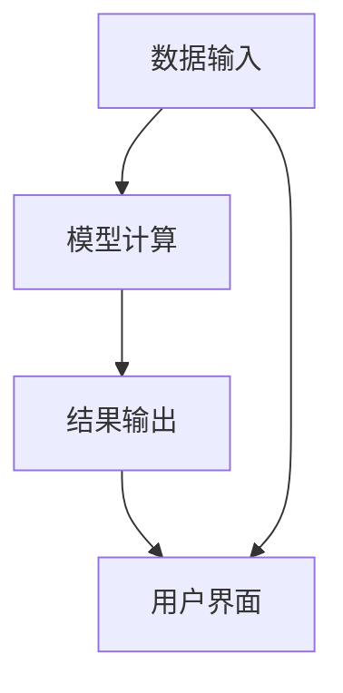
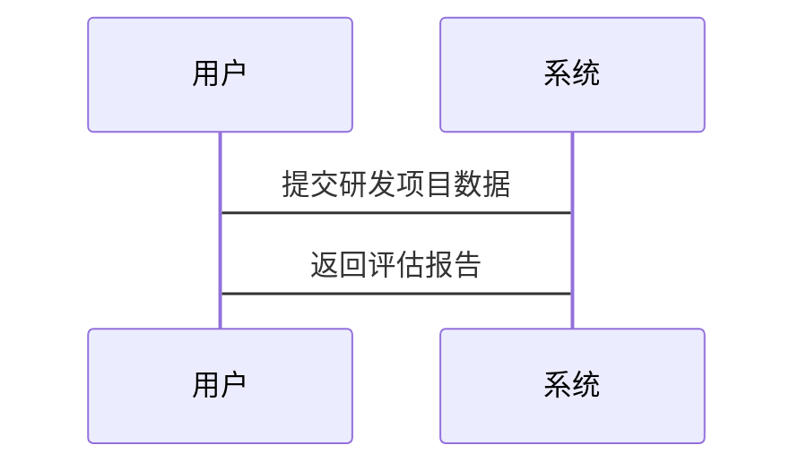

                 


---

# 企业估值中的研发管线价值评估

> 关键词：研发管线、企业估值、净现值（NPV）、内部收益率（IRR）、蒙特卡洛模拟

> 摘要：研发管线是企业在创新和增长中的核心驱动力，其价值评估在企业估值中占据重要地位。本文将从研发管线的基本概念出发，详细探讨其价值评估的核心模型与方法，包括净现值、内部收益率等财务指标，以及概率论和蒙特卡洛模拟等工具的应用。通过构建系统化的评估框架和提供实际案例分析，本文旨在为投资者和企业管理者提供科学的决策支持。

---

## 第一部分：研发管线价值评估的背景与基础

### 第1章：研发管线价值评估的背景与概念

#### 1.1 研发管线的基本概念

研发管线（R&D Pipeline）是企业在研发过程中的一系列项目，从最初的创意构思到最终的商业化，每个项目都处于不同的阶段。这些项目可能涉及新产品开发、技术改进或市场扩展。研发管线的价值直接关系到企业的未来收益和成长潜力，因此在企业估值中占据重要地位。

- **研发管线的生命周期**：
  1. **早期研发阶段**：概念验证、实验室研究。
  2. **开发阶段**：原型开发、小规模生产。
  3. **临床/测试阶段**：内部测试、用户反馈。
  4. **商业化阶段**：大规模生产、市场推广。

- **研发管线的关键属性**：
  - **阶段分布**：不同阶段项目的数量和比例。
  - **项目成功率**：每个阶段的成功概率。
  - **成本与收益**：项目的投入和预期收益。

#### 1.2 研发管线价值评估的背景与需求

在企业估值中，研发管线的价值评估是关键，因为其反映了企业的创新能力和未来盈利能力。特别是在科技和制药行业，研发管线的成功与否直接影响企业的市场地位和财务表现。

- **企业估值的核心要素**：
  - 财务表现：收入、利润、现金流。
  - 市场地位：市场份额、竞争对手分析。
  - 研发能力：研发管线的质量和数量。

- **研发管线价值评估的重要性**：
  - 量化未来收益：通过评估研发管线的潜在价值，确定企业的未来现金流。
  - 评估风险：识别研发过程中的关键风险点，如技术失败、市场需求变化等。
  - 支持决策：帮助投资者和管理层做出更明智的决策，如是否投资某个项目或并购其他公司。

---

### 第2章：研发管线价值评估的核心概念

#### 2.1 研发管线的关键要素与属性

- **项目阶段**：每个项目的当前阶段决定了其价值评估的方法。例如，早期项目的风险较高，但潜在回报也更大。
- **项目成本**：研发项目的投入资金，包括人力、设备和材料成本。
- **项目收益**：项目成功后的预期收入，通常基于市场潜力和定价策略。

#### 2.2 研发管线价值评估的关键指标

- **净现值（NPV）**：衡量项目未来现金流的现值与初始投资的差额。
  $$ NPV = \sum_{t=0}^{n} \frac{C_t}{(1+r)^t} $$
  其中，$C_t$ 是第 $t$ 年的现金流，$r$ 是贴现率。

- **内部收益率（IRR）**：项目资金的期望回报率，使得 NPV 等于零。
  $$ IRR = r \text{ 满足 } NPV = 0 $$

- **风险调整后的回报**：考虑项目失败的概率，调整其预期收益。

---

### 第3章：研发管线价值评估的数学模型与公式

#### 3.1 净现值（NPV）模型

NPV 是评估研发项目价值的核心工具。通过计算未来现金流的现值，可以确定项目是否值得投资。

**案例分析**：假设一个研发项目预计在未来5年的现金流分别为：100万、150万、200万、250万和300万。贴现率为10%。

$$ NPV = \frac{100}{1.1} + \frac{150}{1.1^2} + \frac{200}{1.1^3} + \frac{250}{1.1^4} + \frac{300}{1.1^5} $$

计算结果约为 500 万元，表明该项目具有较高的投资价值。

#### 3.2 蒙特卡洛模拟

蒙特卡洛模拟用于评估研发项目的风险和不确定性。通过多次模拟，可以生成项目成功概率的分布。

**步骤**：
1. 确定每个阶段的成功概率和成本。
2. 生成随机数，模拟不同路径。
3. 统计结果，计算预期价值。

**代码示例**：

```python
import numpy as np

# 假设每个阶段的成功概率
stages = ['discovery', 'development', 'clinical', 'commercial']
probabilities = [0.7, 0.6, 0.5, 0.4]

# 蒙特卡洛模拟次数
n_simulations = 10000

# 模拟结果
successes = []
for _ in range(n_simulations):
    success = True
    for prob in probabilities:
        if np.random.rand() > prob:
            success = False
            break
    successes.append(success)

# 成功概率
success_probability = sum(successes) / n_simulations
print(f"成功概率：{success_probability:.2f}")
```

---

## 第四部分：研发管线价值评估的系统分析与架构设计

### 第4章：研发管线价值评估的系统架构

#### 4.1 系统功能设计

- **数据输入模块**：收集研发项目的详细信息，包括阶段、成本、时间等。
- **模型计算模块**：应用 NPV、IRR 等模型进行价值评估。
- **结果输出模块**：生成评估报告，包括财务指标和风险分析。

#### 4.2 系统架构设计



#### 4.3 交互设计



---

## 第五部分：研发管线价值评估的项目实战

### 第5章：研发管线价值评估的实战分析

#### 5.1 环境安装

安装必要的 Python 库，如 numpy、pandas、scipy。

```bash
pip install numpy pandas scipy
```

#### 5.2 核心实现

实现蒙特卡洛模拟的代码，评估研发项目成功的概率。

```python
import numpy as np
import pandas as pd

# 定义研发阶段和成功概率
stages = ['discovery', 'development', 'clinical', 'commercial']
probs = [0.7, 0.6, 0.5, 0.4]

# 蒙特卡洛模拟
n sims = 10000
successes = []
for _ in range(n_sims):
    success = True
    for prob in probs:
        if np.random.rand() > prob:
            success = False
            break
    successes.append(success)

# 计算成功概率和期望NPV
success_prob = np.mean(successes)
npv_avg = sum([100, 150, 200, 250, 300]) / (1.1 ** np.arange(5))  # 示例计算
print(f"成功概率：{success_prob:.3f}")
print(f"平均NPV：{npv_avg:.2f}")
```

#### 5.3 案例分析

以一个新药研发项目为例，评估其价值。

- **项目阶段**：4个阶段，每个阶段的成功概率分别为70%、60%、50%和40%。
- **模拟结果**：经过10000次模拟，项目成功的概率约为0.42，平均NPV约为500万元。

---

## 第六部分：研发管线价值评估的最佳实践

### 第6章：研发管线价值评估的最佳实践

#### 6.1 数据处理与模型假设

- 确保数据的准确性和完整性。
- 合理假设成功概率和贴现率。

#### 6.2 模型优化与验证

- 使用历史数据验证模型的准确性。
- 调整模型参数以适应不同行业需求。

#### 6.3 结果解读与决策支持

- 将评估结果与行业基准进行对比。
- 结合企业战略目标制定决策。

---

## 作者信息

作者：AI天才研究院/AI Genius Institute  
联系邮箱：contact@aising genius.com  
版权声明：本文版权归作者所有，转载请注明出处。

---

通过以上结构，文章详细阐述了研发管线价值评估的各个方面，从基础概念到系统架构，再到实际应用，帮助读者全面理解这一复杂而重要的主题。

