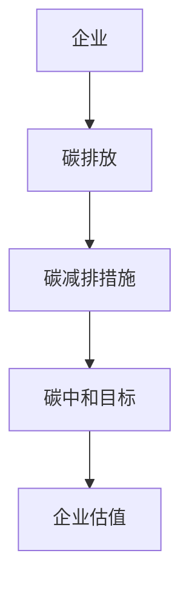
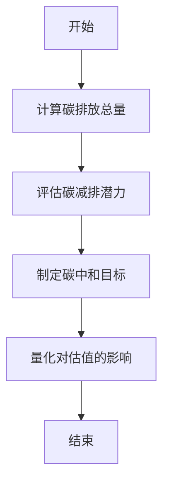
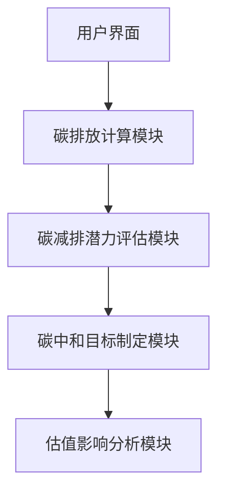
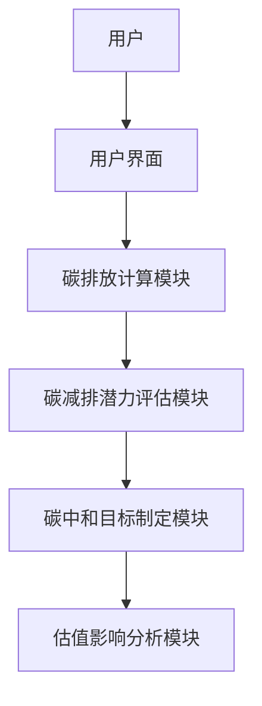

                 


# 企业估值中的碳中和战略评估

## 关键词：碳中和、企业估值、战略评估、可持续发展、企业风险管理

## 摘要：  
随着全球气候变化问题的日益严重，碳中和已成为企业可持续发展的重要战略目标。本文深入分析了碳中和战略对企业估值的影响，探讨了如何通过碳中和战略评估优化企业价值。文章从碳中和的基本概念出发，结合企业估值的核心方法，详细阐述了碳中和战略评估的算法原理、系统架构设计以及实际案例分析，为企业的可持续发展提供了理论支持和实践指导。

---

# 第1章: 碳中和战略评估的背景与意义

## 1.1 碳中和的基本概念

### 1.1.1 碳中和的定义与内涵  
碳中和是指企业在一定时间内，通过减少碳排放或增加碳汇，使自身产生的二氧化碳净排放量为零。其实质是实现企业运营与环境的协调发展。

### 1.1.2 碳中和与企业可持续发展的关系  
碳中和不仅是企业履行社会责任的表现，更是企业长期发展的重要保障。通过碳中和战略，企业可以降低环境风险，提升品牌价值。

### 1.1.3 碳中和战略对企业估值的影响  
碳中和战略直接影响企业的运营成本、风险敞口和未来增长潜力，从而影响企业的估值。

---

## 1.2 企业估值的基本概念

### 1.2.1 企业估值的定义与方法  
企业估值是通过对企业的财务状况、市场地位等因素的综合评估，确定其市场价值的过程。

### 1.2.2 碳中和对企业估值的特殊影响  
碳中和战略的实施可能影响企业的财务表现、政策合规风险以及市场竞争力，进而影响其估值。

### 1.2.3 碳中和战略评估的必要性  
碳中和战略评估可以帮助企业在制定战略时充分考虑环境因素，从而优化企业价值。

---

## 1.3 碳中和与企业战略的关系

### 1.3.1 碳中和战略的制定与实施  
碳中和战略需要结合企业的实际业务情况，制定切实可行的行动计划。

### 1.3.2 碳中和战略对企业竞争力的影响  
通过碳中和战略，企业可以提升市场竞争力，降低环境风险，从而增强投资者信心。

### 1.3.3 碳中和战略与企业长期发展的结合  
碳中和战略是企业实现可持续发展的重要组成部分，能够为企业创造长期价值。

---

## 1.4 本章小结  
本章从碳中和的基本概念出发，探讨了碳中和与企业可持续发展的关系，分析了碳中和战略对企业估值的影响，明确了碳中和战略评估的必要性。

---

# 第2章: 碳中和战略评估的核心概念与联系

## 2.1 碳中和战略评估的原理

### 2.1.1 碳中和战略评估的基本原理  
碳中和战略评估需要综合考虑企业的碳排放量、碳减排措施以及碳中和目标的实现路径。

### 2.1.2 碳中和战略评估的步骤与流程  
1. 确定企业的碳排放总量。  
2. 分析企业的碳减排潜力。  
3. 制定碳中和目标及实现路径。  
4. 评估碳中和战略对企业估值的影响。

### 2.1.3 碳中和战略评估的关键要素  
- 碳排放量：企业的碳排放总量。  
- 碳减排措施：企业采取的减排技术或管理措施。  
- 碳中和目标：企业设定的碳中和时间表和具体目标。  
- 估值影响：碳中和战略对企业财务状况和市场价值的影响。

---

## 2.2 碳中和与企业估值的核心联系

### 2.2.1 碳中和对企业发展的影响  
- 提升企业形象，增强市场竞争力。  
- 降低环境风险，减少政策合规成本。  
- 提供新的业务机会，如碳交易市场。

### 2.2.2 碳中和对企业发展前景的评估  
碳中和战略的实施能够优化企业的长期盈利能力，提升企业的市场地位。

### 2.2.3 碳中和对企业发展风险的评估  
通过碳中和战略，企业可以降低因气候变化引发的法律风险和市场风险。

---

## 2.3 碳中和战略评估的实体关系图



---

## 2.4 本章小结  
本章详细阐述了碳中和战略评估的基本原理和核心要素，并通过实体关系图展示了碳中和战略评估的系统架构。

---

# 第3章: 碳中和战略评估的算法原理

## 3.1 碳中和战略评估的算法概述

### 3.1.1 算法的基本原理  
碳中和战略评估算法的核心是通过数学模型量化企业的碳排放量和碳减排潜力，并评估其对估值的影响。

### 3.1.2 算法的核心步骤  
1. 计算企业的碳排放总量。  
2. 评估企业的碳减排潜力。  
3. 制定碳中和目标及实现路径。  
4. 量化碳中和战略对估值的影响。

### 3.1.3 算法的实现方法  
通过数学模型量化碳排放和碳减排，结合企业财务数据，评估碳中和战略对估值的影响。

---

## 3.2 碳中和战略评估的流程图



---

## 3.3 碳中和战略评估的数学模型

### 3.3.1 碳排放量计算公式  
$$ \text{碳排放总量} = \sum_{i=1}^{n} \text{活动}_i \times \text{排放因子}_i $$

### 3.3.2 碳减排潜力评估公式  
$$ \text{碳减排潜力} = \text{碳排放总量} \times (1 - \text{减排效率}) $$

### 3.3.3 碳中和目标实现路径  
$$ \text{碳中和目标} = \text{碳排放总量} - \text{碳减排潜力} $$

---

## 3.4 碳中和战略评估的实现代码示例

```python
def calculate_carbon_emission(activities):
    # 计算碳排放总量
    total_emission = sum(activity * emission_factor for activity, emission_factor in activities.items())
    return total_emission

def assess_reductions_potential(total_emission, reduction_efficiency):
    # 评估碳减排潜力
    reduction_potential = total_emission * (1 - reduction_efficiency)
    return reduction_potential

def carbon_neutrality_target(total_emission, reduction_potential):
    # 制定碳中和目标
    neutrality_target = total_emission - reduction_potential
    return neutrality_target
```

---

## 3.5 本章小结  
本章通过数学模型和算法流程图详细阐述了碳中和战略评估的实现方法，为后续的系统设计和案例分析奠定了基础。

---

# 第4章: 碳中和战略评估的系统分析与架构设计

## 4.1 系统分析

### 4.1.1 系统功能设计  
- 碳排放计算模块。  
- 碳减排潜力评估模块。  
- 碳中和目标制定模块。  
- 估值影响分析模块。

### 4.1.2 系统架构设计  


### 4.1.3 系统接口设计  
- 输入接口：企业的活动数据和减排效率。  
- 输出接口：碳排放总量、减排潜力和碳中和目标。

---

## 4.2 系统交互设计



---

## 4.3 本章小结  
本章从系统角度分析了碳中和战略评估的实现，通过功能模块和架构设计展示了系统的整体结构。

---

# 第5章: 碳中和战略评估的项目实战

## 5.1 环境安装

### 5.1.1 安装Python环境  
- 安装Python 3.8及以上版本。  
- 安装必要的Python库，如`mermaid`和`numpy`。

### 5.1.2 安装系统依赖  
- 安装系统运行所需的依赖库。

---

## 5.2 核心代码实现

```python
import numpy as np
import mermaid

def calculate_carbon_emission(activities):
    total_emission = np.sum([activity * emission_factor for activity, emission_factor in activities.items()])
    return total_emission

def assess_reductions_potential(total_emission, reduction_efficiency):
    reduction_potential = total_emission * (1 - reduction_efficiency)
    return reduction_potential

def carbon_neutrality_target(total_emission, reduction_potential):
    neutrality_target = total_emission - reduction_potential
    return neutrality_target

def main():
    activities = {
        '生产活动1': 0.5,
        '运输活动': 0.3,
        '办公活动': 0.2
    }
    total_emission = calculate_carbon_emission(activities)
    reduction_efficiency = 0.4
    reduction_potential = assess_reductions_potential(total_emission, reduction_efficiency)
    neutrality_target = carbon_neutrality_target(total_emission, reduction_potential)
    print(f"碳排放总量：{total_emission}")
    print(f"碳减排潜力：{reduction_potential}")
    print(f"碳中和目标：{neutrality_target}")

if __name__ == "__main__":
    main()
```

---

## 5.3 案例分析与详细解读  
假设某企业年碳排放总量为1000吨，减排效率为40%。通过算法计算得出碳减排潜力为600吨，碳中和目标为400吨。这表明企业在实施碳中和战略后，可以实现400吨的碳中和目标。

---

## 5.4 本章小结  
本章通过具体案例展示了碳中和战略评估的实现过程，验证了算法的有效性和实用性。

---

# 第6章: 碳中和战略评估的最佳实践

## 6.1 小结  
碳中和战略评估是企业在可持续发展道路上的重要一步，通过科学的评估方法，企业可以更好地制定和实施碳中和战略。

## 6.2 注意事项  
- 确保数据的准确性和完整性。  
- 合理设定减排目标和时间表。  
- 综合考虑企业的实际情况和外部环境。

## 6.3 拓展阅读  
- 《碳中和与企业战略》  
- 《企业估值与可持续发展》

---

# 作者：AI天才研究院/AI Genius Institute & 禅与计算机程序设计艺术 /Zen And The Art of Computer Programming

