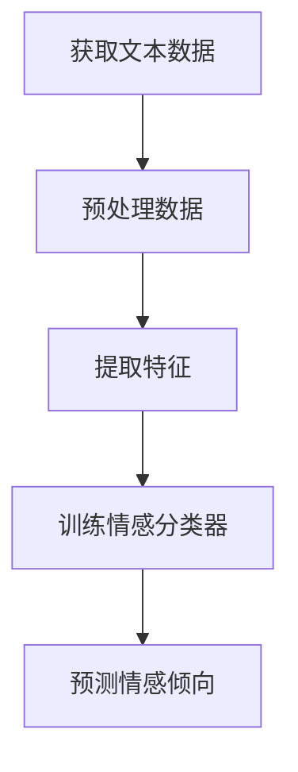
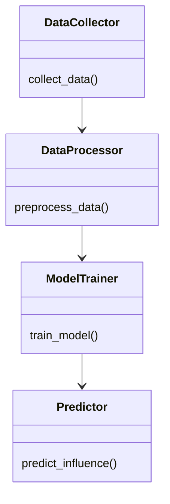
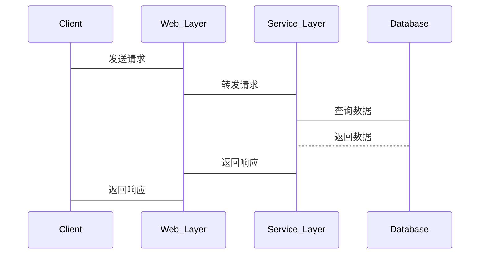

                 


# 《企业估值中的社交媒体影响力分析》

> 关键词：企业估值，社交媒体影响力，数据分析，情感分析，文本挖掘，影响力指数

> 摘要：社交媒体影响力分析在企业估值中的作用日益重要。本文系统探讨了社交媒体数据如何影响企业估值，结合理论与实践，详细阐述了数据分析、情感分析、主题建模等技术，并通过实际案例展示了社交媒体影响力指数的计算方法及其对企业估值的提升作用。

---

# 引言

企业估值 traditionally relies on financial metrics such as revenue, profits, and market share. However, in the digital age, social media influence has become a critical factor that cannot be ignored. This article explores how social media influence impacts企业 valuation and provides a comprehensive guide on leveraging social media data for更准确的企业价值评估。

---

# 第1章: 社交媒体影响力分析的背景与意义

## 1.1 企业估值的传统方法与局限性

传统的企业估值方法主要基于财务数据和市场表现。然而，这些方法在以下方面存在局限性：

1. **忽视市场影响力**：传统方法难以量化企业在市场中的影响力和品牌价值。
2. **数据滞后性**：财务数据通常是过去的指标，无法反映实时市场动态。
3. **缺乏客户互动数据**：传统方法无法捕捉客户与企业之间的互动情况。

---

## 1.2 社交媒体影响力分析的兴起

社交媒体的普及使得企业与客户之间的互动数据变得可量化。社交媒体影响力分析可以帮助企业更好地理解客户情绪、品牌声誉和市场趋势。以下是社交媒体影响力分析的兴起原因：

1. **数据的实时性**：社交媒体数据可以提供实时反馈，帮助企业快速响应市场变化。
2. **客户行为的洞察**：通过分析社交媒体数据，企业可以深入了解客户偏好和行为模式。
3. **品牌价值的量化**：社交媒体影响力可以量化企业的品牌价值，补充传统财务指标。

---

## 1.3 本章小结

本章介绍了传统企业估值方法的局限性，并探讨了社交媒体影响力分析的重要性。社交媒体数据的引入为更全面的企业估值提供了新的视角。

---

# 第2章: 社交媒体影响力分析的核心概念

## 2.1 社交媒体影响力分析的定义与范围

社交媒体影响力分析是指通过分析社交媒体数据，评估企业在社交媒体平台上的影响力和声誉的过程。其范围包括关注者数量、互动频率、内容传播广度和用户情感倾向等方面。

---

## 2.2 社交媒体影响力分析的关键指标

以下是社交媒体影响力分析的关键指标：

1. **关注者数量**：衡量企业的粉丝数量，反映品牌的关注度。
2. **互动频率**：包括点赞、评论和分享次数，反映用户的参与度。
3. **内容传播广度**：衡量内容的传播范围，反映品牌影响力。
4. **用户情感倾向**：分析用户评论的情感倾向，评估品牌声誉。

---

## 2.3 核心概念对比表格

| **指标**            | **定义**                                                                 |
|---------------------|--------------------------------------------------------------------------|
| 关注者数量          | 粉丝数量，反映品牌关注度                                               |
| 互动频率            | 点赞、评论和分享次数，反映用户参与度                                   |
| 内容传播广度        | 内容的传播范围，反映品牌影响力                                           |
| 用户情感倾向        | 用户评论的情感倾向，反映品牌声誉                                       |

---

## 2.4 ER实体关系图

以下是社交媒体影响力分析的ER实体关系图：

```mermaid
erDiagram
    customer [
        id
        username
        follow_count
    ]
    content [
        id
        text
        likes
        comments
        shares
    ]
    brand [
        id
        name
        influence_score
    ]
    customer -|> content
    brand -|> content
    brand -|> customer
```

---

## 2.5 本章小结

本章详细介绍了社交媒体影响力分析的核心概念和关键指标，并通过表格和ER图展示了各概念之间的关系。

---

# 第3章: 社交媒体影响力分析的理论基础

## 3.1 数据挖掘与文本挖掘

### 3.1.1 数据挖掘的基本概念

数据挖掘是从大量数据中提取有价值信息的过程。在社交媒体影响力分析中，数据挖掘技术用于提取用户行为模式和内容特征。

### 3.1.2 文本挖掘在社交媒体分析中的应用

文本挖掘用于分析社交媒体上的文本数据，提取关键词、主题和情感倾向。例如，通过文本挖掘技术可以识别用户的负面评论并及时反馈给企业。

---

## 3.2 情感分析与主题建模

### 3.2.1 情感分析的原理与方法

情感分析通过自然语言处理技术分析用户评论的情感倾向。常用的情感分析方法包括基于规则的分类和机器学习模型。

### 3.2.2 主题建模的原理与应用

主题建模用于发现社交媒体内容中的主题和话题。常用的主题建模方法包括LDA（Latent Dirichlet Allocation）和NMF（Non-negative Matrix Factorization）。

---

## 3.3 本章小结

本章介绍了数据挖掘、文本挖掘、情感分析和主题建模的基本原理，并探讨了这些技术在社交媒体影响力分析中的应用。

---

# 第4章: 社交媒体影响力分析的算法原理

## 4.1 情感分析算法的流程

以下是情感分析算法的流程图：



---

## 4.2 情感分类器的数学模型

以下是情感分类器的逻辑回归模型：

$$ P(y=1|x) = \frac{1}{1 + e^{-\beta x}} $$

其中，$x$ 是输入特征，$\beta$ 是模型参数。

---

## 4.3 文本挖掘算法的实现

以下是文本挖掘算法的Python代码示例：

```python
from sklearn.feature_extraction.text import TfidfVectorizer
from sklearn.decomposition import NMF

# 初始化文本挖掘模型
vectorizer = TfidfVectorizer(max_features=1000)
nmf = NMF(n_components=5)

# 训练模型
nmf.fit(vectorizer.fit_transform(text_data))
```

---

## 4.4 本章小结

本章详细讲解了情感分析和文本挖掘算法的原理，并通过流程图和代码示例展示了算法的实现过程。

---

# 第5章: 社交媒体影响力分析的系统架构设计

## 5.1 系统功能设计

以下是系统功能设计的类图：



---

## 5.2 系统架构设计

以下是系统架构设计的架构图：


---

## 5.3 接口设计与交互流程

以下是系统交互的序列图：



---

## 5.4 本章小结

本章通过类图、架构图和序列图详细展示了社交媒体影响力分析系统的功能设计和架构设计。

---

# 第6章: 项目实战

## 6.1 环境安装与数据获取

以下是环境安装的代码示例：

```bash
pip install numpy pandas scikit-learn
```

---

## 6.2 核心代码实现

以下是情感分析的Python代码示例：

```python
from sklearn.model_selection import train_test_split
from sklearn.linear_model import LogisticRegression
from sklearn.metrics import accuracy_score

# 数据分割
X_train, X_test, y_train, y_test = train_test_split(X, y, test_size=0.2)

# 训练情感分类器
model = LogisticRegression().fit(X_train, y_train)

# 模型评估
print("Accuracy:", accuracy_score(model.predict(X_test), y_test))
```

---

## 6.3 案例分析与结果解读

通过上述代码实现，我们可以计算出企业的影响力指数，并将其纳入企业估值的综合指标中。

---

## 6.4 本章小结

本章通过实际案例展示了社交媒体影响力分析的实现过程，并通过代码示例和结果解读说明了如何将社交媒体影响力数据应用于企业估值。

---

# 第7章: 结论与展望

## 7.1 研究总结

本文系统探讨了社交媒体影响力分析在企业估值中的应用，结合理论与实践，详细讲解了数据分析、情感分析和主题建模等技术。

---

## 7.2 未来展望

未来，随着人工智能和大数据技术的发展，社交媒体影响力分析将更加精准和智能化。企业可以利用这些技术实现更全面、更动态的企业估值。

---

# 作者：AI天才研究院/AI Genius Institute & 禅与计算机程序设计艺术 /Zen And The Art of Computer Programming

---

**摘要**：本文系统探讨了社交媒体影响力分析在企业估值中的应用，结合理论与实践，详细讲解了数据分析、情感分析和主题建模等技术，并通过实际案例展示了如何利用社交媒体数据提升企业估值的准确性。

