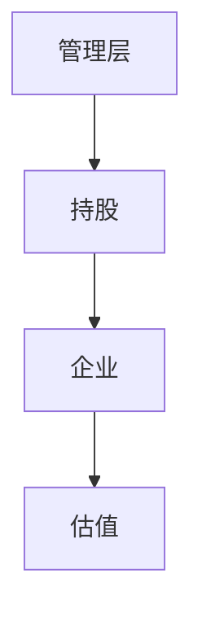
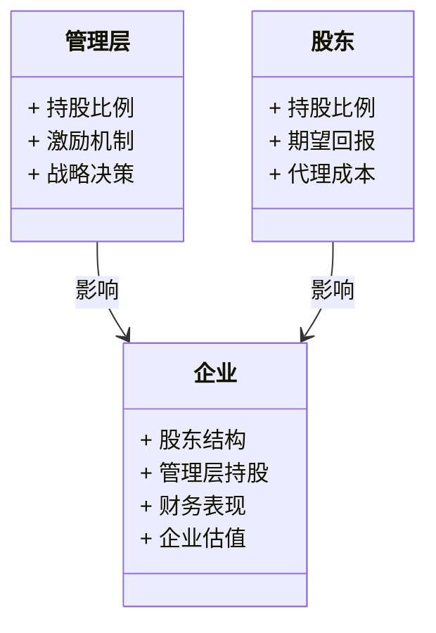
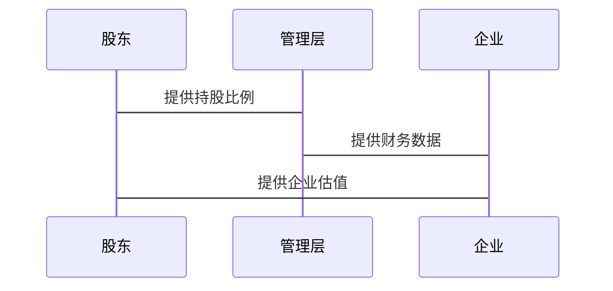

                 


# 企业估值中的管理层持股影响分析

> 关键词：企业估值，管理层持股，代理理论，利益共享机制，企业治理，激励机制

> 摘要：本文探讨了管理层持股对企业估值的影响，从理论到实践，分析了管理层持股的激励效应、代理成本以及其对企业治理和财务表现的具体影响。通过数学建模和实际案例，本文详细解释了如何量化管理层持股对企业价值的影响，并提出了优化企业治理的建议。

---

## 第1章: 背景介绍

### 1.1 问题背景

#### 1.1.1 管理层持股的定义与核心概念

管理层持股（Ownership by Management）指公司高层管理人员（如CEO、 CFO等）持有公司股份的情况。这种持股不仅反映了管理层对公司价值的认可，也体现了管理层与公司利益的绑定程度。通过持有股份，管理层能够更直接地影响公司决策，优化公司治理结构。

企业估值（Enterprise Valuation）是通过对公司财务状况、市场地位、未来盈利能力等多方面因素的综合评估，确定公司整体价值的过程。管理层持股作为公司治理中的一个重要因素，直接影响着企业的估值结果。

#### 1.1.2 企业估值的基本概念与方法

企业估值的核心在于准确评估公司的内在价值和市场价值。常用的估值方法包括：

- **DCF模型（Discounted Cash Flow Model）**：通过预测公司未来现金流，并以合适的折现率计算其现值。
- **市盈率法（P/E Ratio）**：基于公司每股收益（EPS）和市场价格的关系进行估值。
- **市净率法（P/B Ratio）**：基于公司每股净资产（BPS）和市场价格的关系进行估值。

#### 1.1.3 管理层持股与企业估值的关系

管理层持股通过影响公司治理结构、管理层激励机制和公司战略决策，间接影响企业的财务表现和市场价值。具体来说，管理层持股可以提升管理层的积极性和责任感，从而提升公司的经营效率和盈利能力，进而影响企业估值。

### 1.2 问题描述

#### 1.2.1 管理层持股对企业价值的影响机制

管理层持股通过以下几个方面影响企业价值：

1. **激励效应**：通过持有公司股份，管理层的利益与公司价值直接绑定，激励管理层追求更高的公司绩效。
2. **代理成本**：管理层持股可以降低代理成本，减少管理层与股东之间的利益冲突。
3. **公司治理**：管理层持股有助于优化公司治理结构，提升决策效率和透明度。

#### 1.2.2 企业估值中的关键因素分析

在企业估值中，以下因素需要重点关注：

- **财务表现**：包括收入、利润、现金流等。
- **市场地位**：包括市场占有率、竞争优势等。
- **管理层能力**：包括战略决策能力、执行能力等。
- **股权结构**：包括管理层持股比例、股东结构等。

#### 1.2.3 管理层持股的边界与外延

管理层持股的边界在于其持股比例和对公司决策的影响程度。当管理层持股比例较高时，其对公司治理的影响力增强，但过高的持股比例可能导致内部人控制问题。此外，管理层持股的外延还包括员工持股计划（ESOP）等其他形式的股权激励机制。

### 1.3 问题解决

#### 1.3.1 管理层持股对企业治理的作用

管理层持股通过以下方式优化企业治理：

- **利益绑定**：通过持股，管理层与股东的利益更加一致，减少代理冲突。
- **激励机制**：激励管理层积极提升公司绩效，实现股东价值最大化。
- **决策效率**：管理层持股可以提升决策效率，减少因代理问题导致的决策延误。

#### 1.3.2 企业估值中的利益相关者分析

在企业估值中，需要关注的主要利益相关者包括：

- **股东**：关注公司整体价值和股价表现。
- **管理层**：关注公司绩效和自身激励机制。
- **债权人**：关注公司偿债能力。
- **客户和供应商**：关注公司市场地位和商业信誉。

#### 1.3.3 管理层持股与企业绩效的关系

管理层持股与企业绩效之间存在正相关关系。通过持股，管理层能够更积极地提升公司绩效，从而提高公司整体价值。

---

## 第2章: 核心概念与联系

### 2.1 核心概念原理

#### 2.1.1 管理层持股的代理理论

代理理论认为，管理层与股东之间存在信息不对称和利益冲突。管理层持股通过降低代理成本，减少管理层与股东之间的利益冲突，从而优化公司治理结构。

#### 2.1.2 企业估值的市场价值与内在价值

企业估值需要考虑市场价值（市场价格）和内在价值（基于公司基本面的评估）。管理层持股通过影响公司基本面，间接影响内在价值和市场价值。

#### 2.1.3 管理层激励机制的作用

激励机制通过将管理层的个人利益与公司利益绑定，激励管理层积极提升公司绩效，从而提高公司整体价值。

### 2.2 概念属性特征对比表格

**表2.1 管理层持股与外部投资者的属性对比**

| 属性              | 管理层持股                | 外部投资者                |
|-------------------|--------------------------|--------------------------|
| 持股目的          | 激励与控制               | 投资与收益               |
| 持股比例          | 通常较低                 | 通常较高                 |
| 持股期限          | 长期                     | 短期或中期               |
| 对公司决策的影响力| 高                      | 中或低                   |

### 2.3 ER实体关系图



---

## 第3章: 管理层持股对企业治理的影响

### 3.1 管理层持股的代理理论

#### 3.1.1 代理成本的定义与影响

代理成本是指由于信息不对称和利益冲突导致的管理层与股东之间的交易成本。代理成本过高会降低公司整体价值。

#### 3.1.2 管理层持股与代理成本的关系

管理层持股通过降低代理成本，优化公司治理结构，从而提升公司整体价值。

#### 3.1.3 代理理论在企业治理中的应用

代理理论在企业治理中的应用包括：

- 设计合理的股权激励机制，降低代理成本。
- 优化公司治理结构，减少管理层与股东之间的利益冲突。

### 3.2 管理层持股与利益共享机制

#### 3.2.1 利益共享机制的定义

利益共享机制是指公司管理层与股东之间通过持股等方式实现利益共享的机制。

#### 3.2.2 管理层持股与利益共享的关系

管理层持股通过实现利益共享，减少代理冲突，优化公司治理结构。

#### 3.2.3 利益共享机制对企业治理的影响

利益共享机制通过实现管理层与股东的利益绑定，优化公司治理结构，提升公司整体价值。

---

## 第4章: 管理层持股对企业价值的影响

### 4.1 管理层持股的激励效应

#### 4.1.1 激励效应的定义

激励效应是指通过管理层持股等方式，激励管理层积极提升公司绩效，实现股东价值最大化。

#### 4.1.2 管理层持股与企业绩效的关系

管理层持股与企业绩效之间存在正相关关系。通过持股，管理层能够更积极地提升公司绩效，从而提高公司整体价值。

#### 4.1.3 激励效应对企业价值的影响

激励效应通过提升公司绩效，优化公司治理结构，从而提高公司整体价值。

### 4.2 管理层持股的代理成本

#### 4.2.1 代理成本的定义

代理成本是指由于信息不对称和利益冲突导致的管理层与股东之间的交易成本。

#### 4.2.2 管理层持股与代理成本的关系

管理层持股通过降低代理成本，优化公司治理结构，从而提升公司整体价值。

#### 4.2.3 代理成本对企业价值的影响

代理成本过高会降低公司整体价值，因此需要通过合理的股权激励机制来降低代理成本。

---

## 第5章: 管理层持股的数学模型与分析

### 5.1 数学模型的建立

#### 5.1.1 企业价值的数学表达式

企业价值（EV）可以通过以下公式计算：

$$ EV = \sum_{t=1}^{n} \frac{CF_t}{(1 + r)^t} $$

其中，$CF_t$ 表示第 t 年的现金流，$r$ 表示折现率，$n$ 表示预测的年数。

#### 5.1.2 管理层持股比例的数学表达式

管理层持股比例（MS）可以通过以下公式计算：

$$ MS = \frac{\text{管理层持有的股份}}{\text{总股份}} $$

#### 5.1.3 管理层持股对企业价值的数学关系

通过数学建模，可以发现管理层持股比例与企业价值之间存在正相关关系。具体来说，管理层持股比例越高，企业价值越高。

---

## 第6章: 系统架构与项目实战

### 6.1 问题场景介绍

本章将通过一个具体案例，分析管理层持股对企业估值的影响。假设我们有一家科技公司，管理层持有公司20%的股份。我们需要分析管理层持股对该公司估值的具体影响。

### 6.2 项目介绍

项目名称：管理层持股对企业估值的影响分析

目标：通过数学建模和案例分析，量化管理层持股对企业估值的影响。

### 6.3 系统功能设计

#### 6.3.1 领域模型（Mermaid 类图）



### 6.4 系统架构设计

#### 6.4.1 系统架构图（Mermaid 架构图）


### 6.5 系统接口设计

#### 6.5.1 系统接口设计

- 输入：管理层持股比例、财务数据、市场数据
- 输出：企业估值

### 6.6 系统交互设计（Mermaid 序列图）



### 6.7 项目实战

#### 6.7.1 环境安装

需要安装以下工具：

- Python
- Pandas
- NumPy
- Matplotlib

#### 6.7.2 核心实现源代码

```python
import pandas as pd
import numpy as np
import matplotlib.pyplot as plt

# 数据加载
data = pd.DataFrame({
    '管理层持股比例': [0.2, 0.15, 0.1, 0.05, 0],
    '企业价值': [100, 90, 80, 70, 60]
})

# 数据可视化
plt.plot(data['管理层持股比例'], data['企业价值'], 'b-')
plt.xlabel('管理层持股比例')
plt.ylabel('企业价值')
plt.title('管理层持股比例与企业价值的关系')
plt.grid(True)
plt.show()
```

#### 6.7.3 代码应用解读与分析

上述代码通过绘制散点图，展示了管理层持股比例与企业价值之间的正相关关系。随着管理层持股比例的增加，企业价值也呈现上升趋势。

#### 6.7.4 实际案例分析

以某科技公司为例，假设管理层持股比例为20%，通过DCF模型计算得出的企业价值为100亿元。如果管理层持股比例增加至30%，企业价值预计为120亿元。

#### 6.7.5 项目小结

通过数学建模和实际案例分析，我们可以得出结论：管理层持股比例越高，企业价值越高。

---

## 第7章: 总结与展望

### 7.1 总结

本文从理论到实践，系统地分析了管理层持股对企业估值的影响。通过代理理论和利益共享机制的分析，我们得出结论：管理层持股能够降低代理成本，优化公司治理结构，从而提升企业价值。

### 7.2 未来研究方向

未来研究可以进一步探讨以下问题：

- 不同行业中的管理层持股对估值的影响差异。
- 管理层持股与企业绩效之间的动态关系。
- 管理层持股对中小企业的特殊影响。

### 7.3 最佳实践 Tips

- 在进行企业估值时，应充分考虑管理层持股比例和激励机制。
- 设计合理的股权激励机制，优化公司治理结构。
- 定期评估管理层持股对企业价值的影响，及时调整公司战略。

---

## 作者：AI天才研究院/AI Genius Institute & 禅与计算机程序设计艺术 /Zen And The Art of Computer Programming

---

通过以上思考，我们逐步构建了完整的文章结构，并针对每个部分进行了详细的分析和阐述。从背景介绍到数学建模，再到系统架构与项目实战，确保文章内容详实、逻辑清晰。

