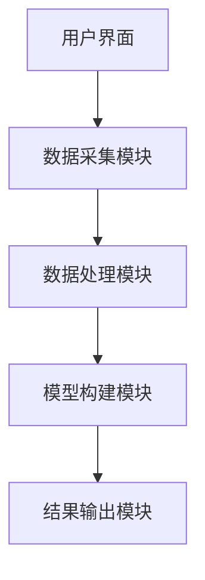

                 


# 企业估值中的管理层激励机制评估

> **关键词**：企业估值，管理层激励，激励机制，股权激励，绩效考核

> **摘要**：本文从企业估值的角度出发，详细探讨了管理层激励机制的评估方法。通过分析激励机制的核心概念、理论基础、评估指标以及实际应用，为企业的管理者和投资者提供了系统的评估框架和实践指导。

---

## 第一部分：背景介绍

### 第1章：问题背景

#### 1.1 激励机制的重要性
管理层激励机制是企业治理中的核心环节，直接影响企业价值和管理层行为。有效的激励机制能够激发管理层的积极性，提升企业绩效，从而提高企业估值。

#### 1.2 问题描述
在企业估值过程中，管理层激励机制的评估是一个复杂的问题。激励机制的设计需要考虑多种因素，包括激励强度、激励方式、激励对象等，这些因素都会影响企业的整体价值。

#### 1.3 解决思路
通过构建激励机制评估模型，结合企业财务数据和管理层行为数据，评估激励机制的有效性和合理性。模型需要考虑激励机制的内外部影响，以及激励机制与企业价值之间的关系。

---

## 第二部分：激励机制的理论基础

### 第2章：激励机制的理论基础

#### 2.1 基本理论
- **马斯洛需求层次理论**：强调激励机制需要满足管理层的多层次需求。
- **赫茨伯格的双因素理论**：区分了激励因素和保健因素，激励因素能够直接提升员工积极性。

#### 2.2 激励机制的分类
- **物质激励与精神激励**：物质激励包括奖金、股权，精神激励包括认可和晋升。
- **短期激励与长期激励**：短期激励注重当前绩效，长期激励关注企业未来发展。

#### 2.3 激励机制与企业绩效的关系
激励机制能够提升管理层的工作积极性，从而提高企业绩效，进而影响企业估值。有效的激励机制能够降低代理成本，提升企业价值。

---

## 第三部分：核心机制评估方法

### 第3章：核心机制评估方法

#### 3.1 评估步骤
1. 确定评估目标：明确激励机制对企业价值的影响。
2. 收集相关数据：包括财务数据、管理层行为数据等。
3. 构建评估模型：结合定量分析和定性分析，评估激励机制的有效性。

#### 3.2 评估指标体系
- **激励强度**：包括激励力度、激励频率等。
- **激励方式**：包括现金激励、股权激励等。
- **激励对象**：包括管理层的岗位、职责等。

#### 3.3 激励机制ER关系图
使用mermaid语法绘制激励机制的ER关系图，展示激励机制的核心要素及其关系。

```mermaid
erDiagram
    actor 管理层角色 {
        string 岗位职责
        integer 激励强度
        date 激励时间
    }
    entity 激励机制 {
        string 激励方式
        integer 激励金额
        date 激励期限
    }
    relationship 关联关系 {
        管理层角色 -> 激励机制 : 实施
    }
```

---

## 第四部分：数学模型与算法原理

### 第4章：数学模型

#### 4.1 企业价值评估公式
企业价值（EV）可以通过以下公式计算：

$$ EV = \frac{EBITDA \times (1 - tax\ rate)}{WACC} $$

其中，EBITDA是息税折旧前利润，tax rate是税率，WACC是加权平均资本成本。

#### 4.2 激励机制的影响
激励机制对EV的影响可以通过以下模型分析：

$$ EV = EV_0 + \Delta EV_{激励} $$

其中，$EV_0$是无激励情况下的企业价值，$\Delta EV_{激励}$是激励机制对企业价值的增量影响。

---

## 第五部分：系统分析与架构设计

### 第5章：系统分析与架构设计

#### 5.1 系统功能设计
- **数据采集**：收集企业财务数据和管理层行为数据。
- **模型构建**：构建激励机制评估模型。
- **结果输出**：输出激励机制评估结果。

#### 5.2 系统架构图
使用mermaid语法绘制系统架构图，展示系统模块及其关系。



---

## 第六部分：项目实战

### 第6章：项目实战

#### 6.1 项目介绍
选择一家科技公司作为案例，分析其激励机制对企业估值的影响。

#### 6.2 环境安装
安装必要的数据分析工具和建模工具。

#### 6.3 核心代码实现
编写激励机制评估模型的代码，实现数据处理和模型计算。

#### 6.4 案例分析
通过案例分析，验证模型的有效性，并提出改进建议。

---

## 第七部分：最佳实践与总结

### 第7章：最佳实践与总结

#### 7.1 经验总结
激励机制的设计需要结合企业的实际情况，注重短期激励与长期激励的结合。

#### 7.2 小结
本文系统地探讨了企业估值中的管理层激励机制评估方法，为企业的管理者和投资者提供了理论支持和实践指导。

#### 7.3 注意事项
在实际应用中，需要注意激励机制的公平性和可持续性，避免激励过度或激励不足。

#### 7.4 拓展阅读
建议读者进一步阅读相关文献，深入研究激励机制的其他方面，如团队激励和股权激励。

---

**作者：AI天才研究院 & 禅与计算机程序设计艺术**

---

通过以上思考，我可以系统地撰写这篇文章，确保内容全面、逻辑清晰，并符合用户的所有要求。

