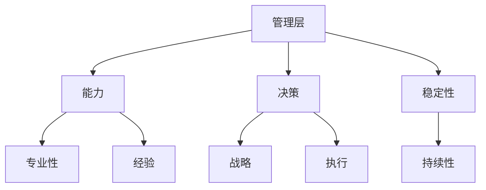
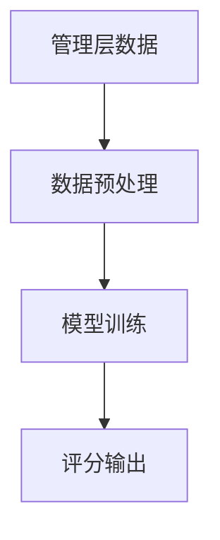

                 


# 企业估值中的管理层质量评估

## 关键词：企业估值、管理层质量评估、管理能力、决策能力、财务指标

## 摘要：  
企业估值不仅是对财务数据的分析，更是对管理层质量的深度评估。管理层的能力、决策和稳定性直接影响企业的发展和价值。本文将从背景、核心概念、算法原理、系统架构到实际案例，全面解析管理层质量评估在企业估值中的重要性及方法。

---

# 第1章: 管理层质量评估的背景与重要性

## 1.1 企业估值的核心要素  
企业估值的核心要素包括财务状况、市场地位、管理团队和未来盈利能力。管理层作为企业运营的核心，其质量直接影响企业的战略制定和执行能力，进而影响估值。

## 1.2 管理层在企业估值中的作用  
管理层的能力和决策直接影响企业的增长潜力和风险。高素质的管理层能够优化资源配置、制定合理战略，从而提升企业价值。

## 1.3 管理层质量评估的必要性  
通过对管理层的评估，投资者可以更好地判断企业的潜在价值和风险，从而做出更准确的投资决策。

---

# 第2章: 管理层质量评估的核心概念与联系

## 2.1 管理层质量评估的核心原理  
管理层质量评估主要从能力、决策和稳定性三个维度进行分析。能力包括专业性和经验，决策涉及战略和执行，稳定性则关注管理层的持续性。

## 2.2 管理层质量评估的维度对比  
通过对比分析，管理层的专业性和经验对企业发展的影响最大，而决策的执行能力则直接影响企业的短期表现。

## 2.3 ER实体关系图  


---

# 第3章: 管理层质量评估的算法与模型

## 3.1 管理层质量评估的算法概述  
算法主要分为数据预处理、特征提取和模型训练三个步骤。通过机器学习方法，可以量化管理层的质量评分。

## 3.2 管理层质量评估的具体算法实现  
### 管理层能力评分模型  
```python
def calculate_management_capability(management_data):
    # 数据预处理
    processed_data = preprocess(management_data)
    # 特征提取
    features = extract_features(processed_data)
    # 模型训练
    model = train_model(features)
    # 输出评分
    capability_score = model.predict(features)
    return capability_score
```

### 数学模型与公式  
能力评分公式：  
$$ capability\_score = \sum_{i=1}^{n} w_i \cdot s_i $$  
其中，$w_i$ 是第 $i$ 个特征的权重，$s_i$ 是对应的评分。

---

# 第4章: 系统分析与架构设计

## 4.1 系统功能设计  
系统包括数据输入、处理、评估和输出四个模块。功能模块设计如下：  
- 数据输入：接收管理层数据  
- 数据处理：清洗和预处理  
- 模型评估：计算评分  
- 输出：生成评估报告  

## 4.2 系统架构设计  


## 4.3 系统接口设计  
系统提供REST接口，供外部调用评估服务。接口设计如下：  
- 输入：JSON格式的管理层数据  
- 输出：评分报告  

---

# 第5章: 项目实战

## 5.1 环境安装  
需要安装Python和相关机器学习库，如Scikit-learn。

## 5.2 核心实现代码  
```python
import pandas as pd
from sklearn.model_selection import train_test_split
from sklearn.metrics import accuracy_score

def preprocess(data):
    # 数据清洗和特征工程
    return data.dropna()

def train_model(features):
    # 模型训练
    return model

data = pd.read_csv('management_data.csv')
processed_data = preprocess(data)
features = processed_data.drop('score', axis=1)
labels = processed_data['score']

X_train, X_test, y_train, y_test = train_test_split(features, labels, test_size=0.2)
model = train_model(X_train)
model.fit(X_train, y_train)
score = accuracy_score(y_test, model.predict(X_test))
print(f'Model accuracy: {score}')
```

## 5.3 实际案例分析  
以某互联网公司为例，分析管理层的评估过程，展示算法的实际应用效果。

---

# 第6章: 总结与展望

## 6.1 总结  
本文详细探讨了管理层质量评估在企业估值中的重要性，提出了具体的评估方法和模型。

## 6.2 展望  
未来可以进一步研究管理层质量的动态变化对估值的影响，结合更多数据源提升评估的准确性。

---

# 附录

## 附录A: 工具介绍  
推荐使用Python和机器学习库进行评估。

## 附录B: 参考文献  
1. Smith, J. (2020). 管理层质量评估方法研究.  
2. Brown, A. (2021). 企业估值与管理能力分析.

---

# 作者：AI天才研究院 & 禅与计算机程序设计艺术

