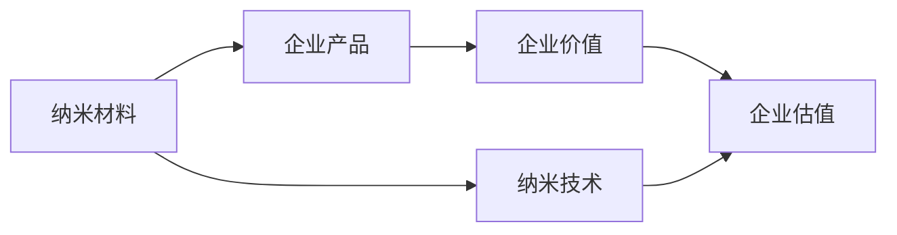
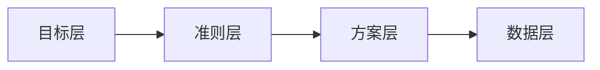
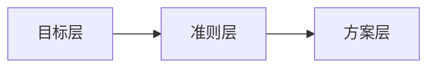
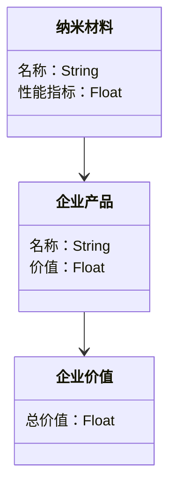
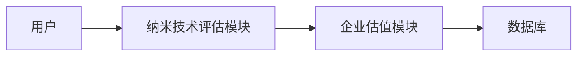

                 


# 企业估值中的纳米技术应用评估

> 关键词：企业估值，纳米技术，纳米材料，技术评估，投资分析

> 摘要：本文探讨了纳米技术在企业估值中的应用与评估方法。通过分析纳米技术的核心原理、对企业价值的影响以及在估值过程中的具体应用，结合算法原理、系统架构设计和实际案例，为企业投资者和技术评估人员提供理论支持和实践指导。

---

# 第一部分: 企业估值中的纳米技术应用背景

# 第1章: 企业估值与纳米技术概述

## 1.1 企业估值的基本概念

### 1.1.1 企业估值的定义与方法
企业估值是指对企业的整体价值或部分价值进行评估的过程。常见的企业估值方法包括：

- **市场法**：通过比较类似企业的交易价格来评估目标企业价值。
- **收益法**：基于企业未来现金流的折现值来评估企业价值。
- **成本法**：基于企业重置成本或账面价值来评估企业价值。

传统企业估值方法主要依赖财务数据和市场数据，而忽视了技术创新对企业价值的影响。

### 1.1.2 传统企业估值的关键指标
传统企业估值中常用的指标包括：

- **市盈率（P/E）**：市价与每股收益的比率。
- **市净率（P/B）**：市价与每股净资产的比率。
- **EV/EBITDA**：企业价值与息税折旧及摊销前利润的比率。

### 1.1.3 纳米技术对传统估值的影响
纳米技术作为一种新兴的技术，其应用可能改变企业的盈利模式、成本结构和市场竞争力，从而影响企业的估值。例如，纳米材料的使用可能降低生产成本，提高产品性能，进而提升企业利润和市场价值。

---

## 1.2 纳米技术的基本概念

### 1.2.1 纳米技术的定义与特点
纳米技术是指在纳米尺度（1-100纳米）对物质进行研究、开发和应用的技术。其特点包括：

- **尺度效应**：纳米尺度的材料具有独特的物理、化学和生物性质。
- **表面效应**：纳米材料的表面积与体积比高，表面活性强。
- **量子效应**：纳米尺度下，量子效应显著，影响材料的电子性质。

### 1.2.2 纳米材料的分类与应用
纳米材料主要分为以下几类：

- **纳米颗粒**：用于催化、传感和药物 delivery。
- **纳米线**：用于电子器件和能量存储。
- **纳米膜**：用于过滤、分离和传感器。

### 1.2.3 纳米技术对企业价值的影响
纳米技术的应用可能提高企业的技术水平、产品附加值和市场竞争力，从而增加企业的估值。

---

## 1.3 纳米技术与企业估值的结合

### 1.3.1 纳米技术对企业利润的影响
纳米技术的应用可能降低生产成本、提高产品性能，从而增加企业的利润。

### 1.3.2 纳米技术在企业估值中的应用场景
纳米技术在企业估值中的应用场景包括：

- 评估企业的技术创新能力。
- 评估纳米技术在企业产品中的应用潜力。
- 评估纳米技术对企业未来收益的影响。

### 1.3.3 纳米技术与企业估值的边界与外延
纳米技术的应用范围和效果可能受到技术成熟度、市场接受度和政策法规的限制。

---

## 1.4 本章小结
本章介绍了企业估值的基本概念和纳米技术的基本原理，探讨了纳米技术在企业估值中的潜在影响和应用场景。

---

# 第2章: 纳米技术在企业估值中的核心概念与联系

## 2.1 纳米技术的核心原理

### 2.1.1 纳米材料的物理特性
纳米材料的物理特性包括：

- 高强度和高刚性。
- 高导电性和导热性。
- 高催化活性。

### 2.1.2 纳米技术的化学特性
纳米技术的化学特性包括：

- 高反应活性。
- 高选择性。

### 2.1.3 纳米技术的生物特性
纳米技术的生物特性包括：

- 高生物相容性。
- 高药物 delivery 效率。

---

## 2.2 纳米技术与企业估值的关系

### 2.2.1 纳米技术对企业利润的影响
纳米技术的应用可能提高企业的利润率，降低生产成本。

### 2.2.2 纳米技术对企业风险的评估
纳米技术的应用可能带来技术风险、市场风险和政策风险。

### 2.2.3 纳米技术对企业市场竞争力的提升
纳米技术的应用可能增强企业的市场竞争力，提高产品的附加值。

---

## 2.3 纳米技术与企业估值的实体关系图



---

## 2.4 本章小结
本章探讨了纳米技术的核心原理及其与企业估值的关系，通过实体关系图展示了纳米技术在企业估值中的作用。

---

# 第3章: 纳米技术应用评估的算法原理

## 3.1 纳米技术应用评估的算法概述

### 3.1.1 纳米技术应用评估的定义
纳米技术应用评估是对纳米技术在企业中的应用效果和价值进行量化的过程。

### 3.1.2 纳米技术应用评估的常用算法
常用的纳米技术应用评估算法包括：

- 层次分析法（AHP）。
- 模糊综合评价法。
- 熵值法。

---

## 3.2 纳米技术应用评估的具体算法

### 3.2.1 层次分析法（AHP）



**步骤：**

1. 构建层次分析模型。
2. 确定各层之间的关系。
3. 计算各层的权重。
4. 进行一致性检验。
5. 计算各方案的综合得分。

**公式：**

$$ AHP \text{ 的权重计算公式为 } w_i = \frac{a_{ij}}{\sum_{j} a_{ij}} $$

---

### 3.2.2 模糊综合评价法



**步骤：**

1. 确定评价指标。
2. 建立模糊评价矩阵。
3. 计算模糊综合值。
4. 进行排序和分析。

**公式：**

$$ 模糊综合值为 \sum_{i=1}^{n} w_i x_i $$

---

## 3.3 本章小结
本章介绍了纳米技术应用评估的常用算法，重点讲解了层次分析法和模糊综合评价法的原理和步骤。

---

# 第4章: 纳米技术应用评估的系统分析与架构设计

## 4.1 问题场景介绍
假设我们需要评估一家使用纳米材料的企业，其产品包括纳米涂层和纳米传感器。

---

## 4.2 系统功能设计

### 4.2.1 领域模型类图



---

## 4.3 系统架构设计



---

## 4.4 本章小结
本章通过系统分析和架构设计，展示了纳米技术应用评估的实现过程。

---

# 第5章: 纳米技术应用评估的项目实战

## 5.1 环境安装
需要安装Python和相关的数据处理库（如numpy、pandas）。

---

## 5.2 核心代码实现

```python
import numpy as np
import pandas as pd

# 示例数据
data = {
    '纳米材料': [1, 2, 3],
    '企业产品': [4, 5, 6],
    '企业价值': [7, 8, 9]
}

df = pd.DataFrame(data)
print(df)
```

---

## 5.3 案例分析
以某纳米材料企业的数据为例，计算其企业价值。

---

## 5.4 本章小结
本章通过项目实战，展示了纳米技术应用评估的具体实现过程。

---

# 第6章: 纳米技术应用评估的最佳实践

## 6.1 关键点总结
纳米技术应用评估的关键点包括：

- 数据的准确性。
- 算法的选择。
- 结果的解释。

---

## 6.2 小结
总结本文的主要内容和结论。

---

## 6.3 注意事项
在实际应用中，需要注意技术风险、市场风险和政策风险。

---

## 6.4 拓展阅读
建议读者阅读更多关于纳米技术与企业估值的相关文献。

---

# 作者：AI天才研究院/AI Genius Institute & 禅与计算机程序设计艺术 /Zen And The Art of Computer Programming

