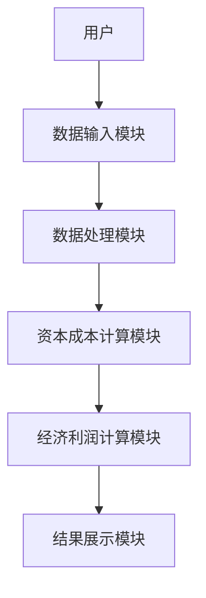
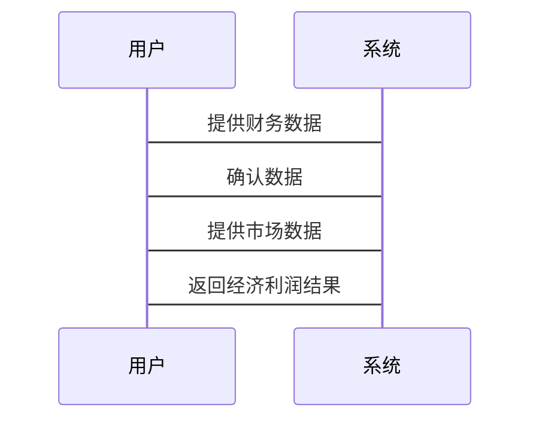

                 


# 企业估值中的经济利润法

> 关键词：企业估值，经济利润法，资本成本，EVA，投资决策，财务分析

> 摘要：经济利润法（Economic Value Added，EVA）是一种基于资本成本的企业估值方法，它通过考虑企业的实际盈利能力和资本成本，提供了一种更为准确的企业价值评估工具。本文将从经济利润法的基本概念出发，逐步深入分析其算法原理、系统架构设计、项目实战应用以及最佳实践，帮助读者全面掌握经济利润法在企业估值中的应用。

---

## 目录

1. **企业估值与经济利润法概述**  
   - 1.1 企业估值的基本概念  
   - 1.2 经济利润法的定义与特点  
   - 1.3 经济利润法的理论基础  

2. **经济利润法的核心公式与计算步骤**  
   - 2.1 经济利润法的核心公式  
   - 2.2 经济利润法的计算步骤  
   - 2.3 经济利润法的优缺点  

3. **经济利润法的数学模型与公式**  
   - 3.1 经济利润法的数学模型  
   - 3.2 净利润的计算公式  
   - 3.3 资本成本的计算公式  
   - 3.4 经济利润法的公式推导  

4. **经济利润法的系统架构设计**  
   - 4.1 问题场景介绍  
   - 4.2 系统功能设计  
   - 4.3 系统架构设计  
   - 4.4 系统接口设计  
   - 4.5 系统交互设计  

5. **经济利润法的项目实战**  
   - 5.1 环境安装与数据准备  
   - 5.2 系统核心实现  
   - 5.3 代码应用解读  
   - 5.4 实际案例分析  

6. **经济利润法的最佳实践与小结**  
   - 6.1 最佳实践总结  
   - 6.2 小结  
   - 6.3 注意事项  
   - 6.4 拓展阅读  

---

## 正文

### 1. 企业估值与经济利润法概述

#### 1.1 企业估值的基本概念
企业估值是通过对企业的财务状况、市场地位、盈利能力等多方面进行分析，估算其市场价值的过程。传统的估值方法包括市盈率法、市净率法、现金流折现法等，但这些方法往往忽视了资本成本的影响。

#### 1.2 经济利润法的定义与特点
经济利润法（EVA）是一种基于资本成本的企业估值方法。与传统方法不同，EVA考虑了企业的实际盈利能力和资本成本之间的关系。其核心思想是：企业的价值取决于其是否能够为股东创造超过资本成本的超额利润。

#### 1.3 经济利润法的理论基础
经济利润法的理论基础主要包括资本资产定价模型（CAPM）和加权平均资本成本（WACC）模型。通过这些模型，我们可以计算出企业的资本成本，并将其与企业的实际利润进行对比，从而得出企业的经济利润。

---

### 2. 经济利润法的核心公式与计算步骤

#### 2.1 经济利润法的核心公式
经济利润法的核心公式可以表示为：
$$ \text{EVA} = \text{净利润} - (\text{资本成本} \times \text{平均资本占用}) $$

#### 2.2 经济利润法的计算步骤
1. **确定企业的资本成本**：使用CAPM或WACC模型计算企业的资本成本。
2. **计算企业的净利润**：根据企业的财务报表，计算净利润。
3. **计算企业的经济利润**：将净利润减去资本成本与平均资本占用的乘积。

#### 2.3 经济利润法的优缺点
- **优点**：经济利润法考虑了资本成本，能够更准确地反映企业的实际盈利能力。
- **缺点**：经济利润法的计算依赖于准确的财务数据和合理的资本成本假设，实际应用中可能存在一定的局限性。

---

### 3. 经济利润法的数学模型与公式

#### 3.1 经济利润法的数学模型
$$ \text{EVA} = \text{净利润} - (\text{资本成本} \times \text{平均资本占用}) $$

#### 3.2 净利润的计算公式
$$ \text{净利润} = \text{营业收入} - \text{营业成本} - \text{税金及附加} - \text{期间费用} $$

#### 3.3 资本成本的计算公式
- **加权平均资本成本（WACC）的计算**：
$$ \text{WACC} = \left( \frac{D}{D+E} \right) \times r_d \times (1 - t) + \left( \frac{E}{D+E} \right) \times r_e $$

---

### 4. 经济利润法的系统架构设计

#### 4.1 问题场景介绍
假设我们正在开发一个企业估值系统，旨在帮助投资者快速计算企业的经济利润。

#### 4.2 系统功能设计
- **模块一**：数据输入与处理模块  
  - 用户输入企业的财务数据和市场数据。
- **模块二**：资本成本计算模块  
  - 使用CAPM或WACC模型计算资本成本。
- **模块三**：经济利润计算模块  
  - 计算企业的经济利润。
- **模块四**：结果展示模块  
  - 显示计算结果，并提供可视化分析。

#### 4.3 系统架构设计


#### 4.4 系统接口设计
- **输入接口**：财务数据接口、市场数据接口
- **输出接口**：经济利润结果接口、可视化报告接口

#### 4.5 系统交互设计


---

### 5. 经济利润法的项目实战

#### 5.1 环境安装与数据准备
- **环境安装**：安装Python和相关库（如pandas、numpy）。
- **数据准备**：收集企业的财务数据和市场数据。

#### 5.2 系统核心实现
```python
import pandas as pd

# 计算净利润
net_income = revenue - cost_of_goods_sold - taxes - operating_expenses

# 计算资本成本
def calculate_wacc(market_value_debt, market_value_equity, cost_of_debt, cost_of_equity, tax_rate):
    wacc = (market_value_debt / (market_value_debt + market_value_equity)) * cost_of_debt * (1 - tax_rate) + \
           (market_value_equity / (market_value_debt + market_value_equity)) * cost_of_equity
    return wacc

# 计算经济利润
economic_profit = net_income - (wacc * average_capital_employed)
```

#### 5.3 代码应用解读
- 上述代码展示了如何使用Python计算企业的经济利润。
- 需要注意的是，资本成本的计算依赖于市场数据和企业财务数据。

#### 5.4 实际案例分析
通过具体案例分析，展示如何使用经济利润法对企业进行估值。

---

### 6. 经济利润法的最佳实践与小结

#### 6.1 最佳实践总结
- 确保财务数据的准确性。
- 合理假设资本成本参数。
- 结合其他估值方法进行交叉验证。

#### 6.2 小结
经济利润法是一种重要的企业估值方法，它通过考虑资本成本，能够更准确地反映企业的实际价值。

#### 6.3 注意事项
- 资本成本的计算需要结合企业的实际情况。
- 经济利润法的结果需要结合市场环境进行分析。

#### 6.4 拓展阅读
- 《企业价值评估：经济利润法的实践应用》
- 《资本资产定价模型：理论与应用》

---

**作者：AI天才研究院/AI Genius Institute & 禅与计算机程序设计艺术 /Zen And The Art of Computer Programming**

