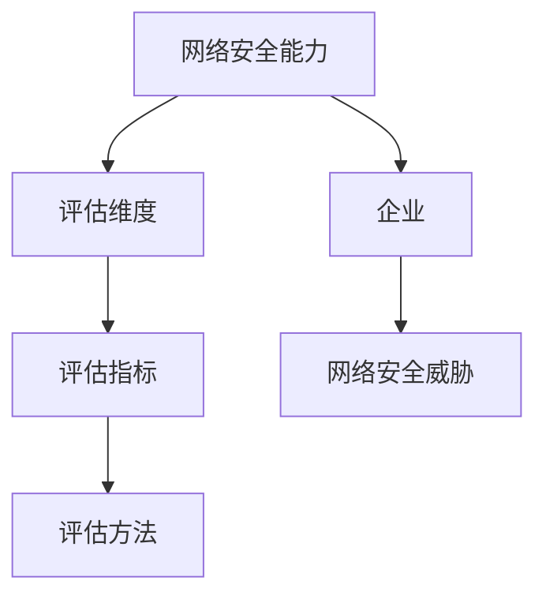
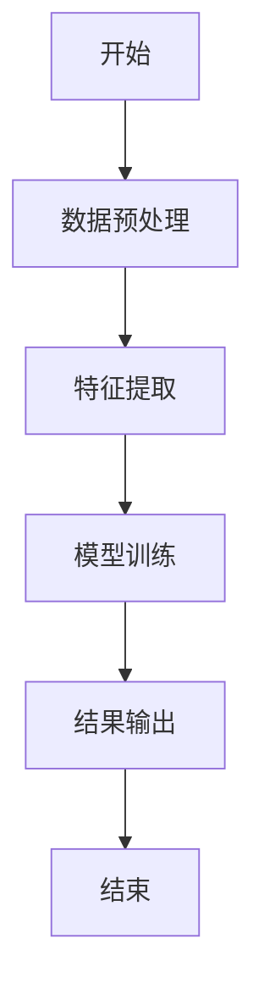
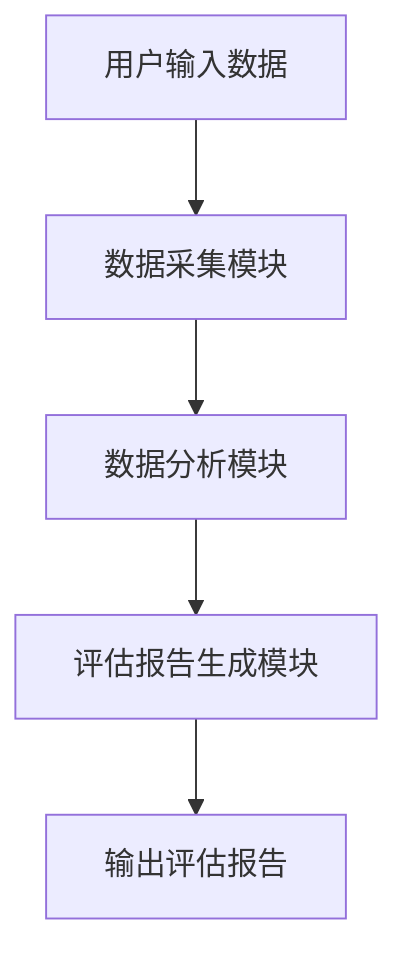
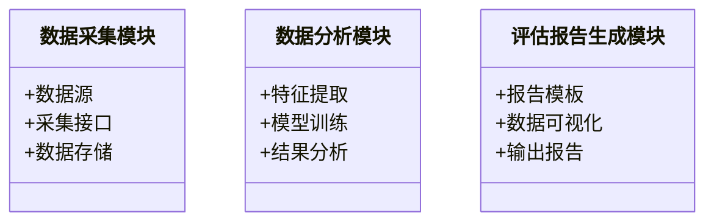
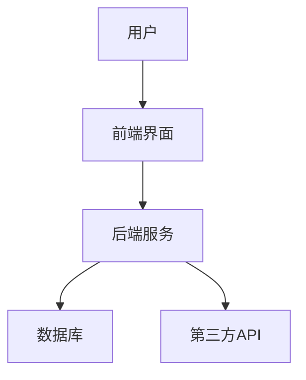
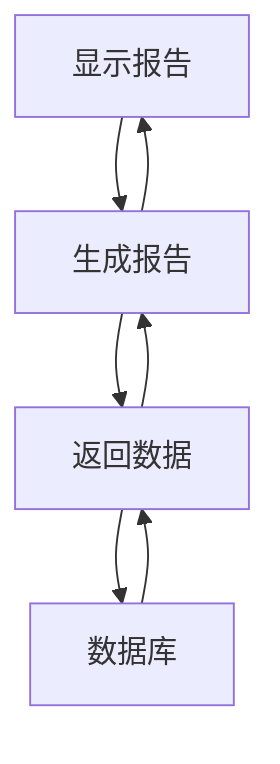

                 


# 《企业估值中的网络安全能力评估》

## 关键词：
- 企业估值
- 网络安全能力
- 评估模型
- 安全威胁
- 评估框架

## 摘要：
网络安全能力评估是企业在数字时代的重要任务之一。随着网络安全威胁的日益复杂化，企业需要通过有效的网络安全能力评估来确保自身信息资产的安全性，并在企业估值中充分体现其网络安全能力的价值。本文从网络安全能力评估的基本概念、核心算法、系统架构、项目实战等方面展开分析，为企业提供全面的网络安全能力评估方法和实践指南。

---

# 第一章: 网络安全能力评估的背景与重要性

## 1.1 企业估值中的网络安全问题背景
### 1.1.1 网络安全对企业估值的影响
企业的网络安全能力直接影响其市场价值。近年来，数据泄露、网络攻击等安全事件频发，这些事件不仅会导致企业的经济损失，还会影响其声誉和客户信任度。因此，网络安全能力已成为企业估值的重要考量因素之一。

### 1.1.2 当前网络安全威胁的现状
当前网络安全威胁呈现多样化、智能化的特点。勒索软件、APT攻击、数据泄露等威胁不仅针对企业内部系统，还可能通过供应链攻击影响第三方合作伙伴。这些威胁对企业运营和财务状况造成直接影响。

### 1.1.3 网络安全能力评估的必要性
企业需要通过网络安全能力评估，全面了解自身在安全防护、威胁检测、应急响应等方面的能力水平。这不仅可以帮助企业识别安全漏洞，还能为其制定有效的安全策略提供依据。

## 1.2 网络安全能力评估的基本概念
### 1.2.1 网络安全能力的定义
网络安全能力是指企业在预防、检测和应对网络安全威胁方面的能力，包括技术能力、管理能力和人员能力。

### 1.2.2 网络安全能力评估的目标
网络安全能力评估的目标是通过量化手段，全面衡量企业在网络安全方面的优势和不足，为企业的安全改进提供方向。

### 1.2.3 网络安全能力评估的边界与外延
网络安全能力评估的边界包括企业的网络基础设施、数据资产、人员培训等方面，而其外延则涉及第三方合作伙伴的安全状况。

## 1.3 网络安全能力评估的框架体系
### 1.3.1 评估框架的核心要素
网络安全能力评估框架的核心要素包括：安全策略、安全技术、安全管理、安全文化和安全合规。

### 1.3.2 评估框架的层次结构
网络安全能力评估框架通常分为战略层、管理层、执行层和技术层四个层次。

### 1.3.3 评估框架的实施步骤
1. 明确评估目标
2. 确定评估范围
3. 设计评估指标
4. 实施评估
5. 分析结果并制定改进计划

## 1.4 网络安全能力评估在企业中的应用
### 1.4.1 企业网络安全能力评估的场景
- 企业上市前的安全评估
- 并购交易中的安全评估
- 内部安全审计
- 第三方供应商安全评估

### 1.4.2 企业网络安全能力评估的流程
1. 确定评估目标和范围
2. 收集相关数据
3. 评估数据分析
4. 评估结果汇报

### 1.4.3 企业网络安全能力评估的挑战
- 数据的准确性和完整性
- 安全威胁的动态变化
- 评估方法的可操作性

## 1.5 本章小结
本章从企业估值的角度，详细介绍了网络安全能力评估的背景、基本概念、框架体系及其在企业中的应用。通过这些内容，读者可以初步了解网络安全能力评估的重要性和实施方法。

---

# 第二章: 网络安全能力评估的核心概念与联系

## 2.1 核心概念原理
### 2.1.1 网络安全能力的评估维度
网络安全能力的评估维度包括：技术能力、管理能力、人员能力和文化能力。

### 2.1.2 网络安全能力的评估指标
网络安全能力的评估指标包括：安全事件响应时间、漏洞修复率、安全培训覆盖率等。

### 2.1.3 网络安全能力的评估方法
网络安全能力的评估方法包括：定性评估和定量评估。

## 2.2 核心概念属性特征对比表
| 概念       | 属性1 | 属性2 | 属性3 |
|------------|-------|-------|-------|
| 评估维度   | 客观性 | 可量化 | 可操作性 |
| 评估指标   | 精准性 | 可扩展性 | 可维护性 |
| 评估方法   | 可行性 | 可重复性 | 可验证性 |

## 2.3 实体关系图（ER图）


## 2.4 本章小结
本章通过对比分析和实体关系图，详细阐述了网络安全能力评估的核心概念及其之间的联系。这些内容为后续的算法设计和系统实现奠定了基础。

---

# 第三章: 网络安全能力评估的算法原理

## 3.1 算法原理概述
### 3.1.1 评估模型的基本结构
网络安全能力评估模型通常包括数据预处理、特征提取、模型训练和结果输出四个部分。

### 3.1.2 评估模型的输入与输出
- 输入：企业的网络安全数据、威胁数据、管理数据
- 输出：网络安全能力的量化评分、改进建议

### 3.1.3 评估模型的训练与优化
通过机器学习算法对历史数据进行训练，优化模型参数，提升评估的准确性。

## 3.2 算法流程图


## 3.3 算法实现细节
### 3.3.1 数据预处理
```python
import pandas as pd
data = pd.read_csv('security_data.csv')
data_clean = data.dropna()
```

### 3.3.2 特征提取
```python
from sklearn.feature_extraction import DictVectorizer
vec = DictVectorizer()
features = vec.fit_transform(data_clean.to_dict('records'))
```

### 3.3.3 模型训练
```python
from sklearn.ensemble import RandomForestRegressor
model = RandomForestRegressor(n_estimators=100)
model.fit(features, labels)
```

### 3.3.4 模型优化
```python
from sklearn.model_selection import GridSearchCV
param_grid = {'n_estimators': [100, 200], 'max_depth': [None, 10]}
grid_search = GridSearchCV(RandomForestRegressor(), param_grid, cv=5)
grid_search.fit(features, labels)
best_model = grid_search.best_estimator_
```

## 3.4 本章小结
本章详细介绍了网络安全能力评估模型的算法原理和实现细节，为后续的系统设计和项目实战提供了理论基础。

---

# 第四章: 网络安全能力评估的系统分析与架构设计

## 4.1 问题场景介绍
网络安全能力评估系统需要解决企业在网络安全威胁检测、防护能力评估等方面的问题。

## 4.2 系统功能设计
### 4.2.1 系统功能模块
- 数据采集模块
- 数据分析模块
- 评估报告生成模块

### 4.2.2 系统功能流程


### 4.2.3 领域模型类图


## 4.3 系统架构设计
### 4.3.1 系统架构图


### 4.3.2 系统接口设计
- 用户接口：REST API
- 数据库接口：JDBC

## 4.4 系统交互流程图


## 4.5 本章小结
本章通过系统分析和架构设计，详细介绍了网络安全能力评估系统的实现方案，为后续的项目实战奠定了基础。

---

# 第五章: 网络安全能力评估的项目实战

## 5.1 项目背景与目标
### 5.1.1 项目背景
某企业计划通过网络安全能力评估，优化其信息安全管理体系。

### 5.1.2 项目目标
- 量化企业的网络安全能力
- 识别安全漏洞
- 制定改进计划

## 5.2 项目环境与工具
### 5.2.1 环境安装
```bash
pip install pandas scikit-learn mermaid4jupyter
```

### 5.2.2 工具选择
- 数据分析工具：Python、Pandas
- 可视化工具：Matplotlib、Seaborn
- 系统设计工具：Mermaid

## 5.3 项目核心代码实现
### 5.3.1 数据预处理
```python
import pandas as pd
data = pd.read_csv('security_data.csv')
data_clean = data.dropna()
```

### 5.3.2 模型训练
```python
from sklearn.ensemble import RandomForestRegressor
model = RandomForestRegressor(n_estimators=100)
model.fit(X_train, y_train)
```

### 5.3.3 模型评估
```python
from sklearn.metrics import mean_squared_error
y_pred = model.predict(X_test)
print(mean_squared_error(y_test, y_pred))
```

## 5.4 项目案例分析
### 5.4.1 案例背景
某企业受到勒索软件攻击，导致数据泄露，影响了企业的估值。

### 5.4.2 案例分析
通过网络安全能力评估模型，企业发现其安全防护能力不足，改进了安全策略。

## 5.5 项目总结
通过本项目，企业不仅提升了其网络安全能力，还为其后续的估值提供了有力支持。

## 5.6 本章小结
本章通过项目实战，详细介绍了网络安全能力评估的实现过程和实际应用，为读者提供了宝贵的实践经验。

---

# 第六章: 总结与展望

## 6.1 总结
网络安全能力评估是企业在数字时代的重要任务之一。通过本文的分析，读者可以全面了解网络安全能力评估的基本概念、算法原理、系统架构和项目实战。

## 6.2 当前挑战与未来展望
当前网络安全能力评估面临的挑战包括数据隐私问题和模型可解释性问题。未来的研究方向包括引入人工智能技术，提升模型的自适应能力。

## 6.3 最佳实践 tips
- 定期进行网络安全能力评估
- 加强员工安全意识培训
- 采用先进的安全技术手段

## 6.4 本章小结
本章总结了全文内容，并展望了网络安全能力评估的未来发展方向。希望本文能为企业的网络安全能力评估提供有益的参考。

---

# 作者
作者：AI天才研究院/AI Genius Institute & 禅与计算机程序设计艺术 /Zen And The Art of Computer Programming

