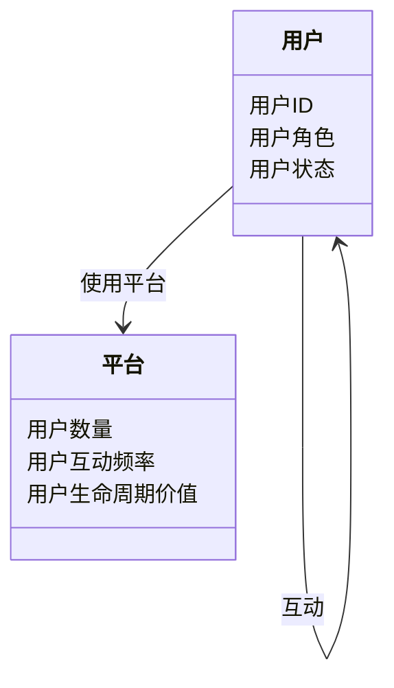
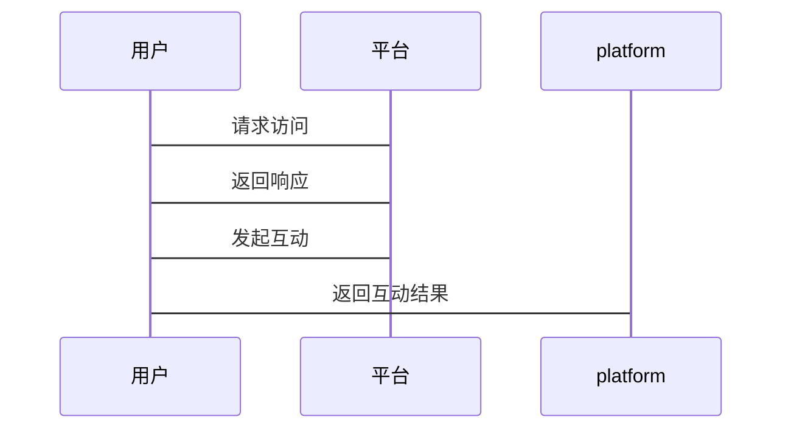

                 


# 企业估值中的网络效应价值评估

> 关键词：企业估值，网络效应，双边市场，用户生命周期价值，网络效应量化，平台经济

> 摘要：在当今数字化时代，网络效应已成为影响企业价值的重要因素。本文从网络效应的基本概念出发，分析其对企业和平台经济的影响，探讨如何量化网络效应对企业估值的价值贡献。通过实际案例分析和数学模型构建，深入剖析网络效应的评估方法，为企业估值提供新的视角和实践指南。

---

# 第1章: 网络效应的基本概念

## 1.1 网络效应的定义与特点

### 1.1.1 网络效应的定义

网络效应（Network Effect）是指随着用户数量的增加，产品或服务的价值也随之增加的现象。网络效应的核心在于用户之间的互动和信息共享，使得平台或产品的价值呈指数级增长。

### 1.1.2 网络效应的核心特点

- **正反馈效应**：用户数量的增加会吸引更多用户加入，形成正反馈循环。
- **双边性**：网络效应通常存在于双边市场，用户群体之间的互动是价值的核心来源。
- **平台依赖性**：网络效应往往依赖于一个中心平台，用户通过平台进行交互。

### 1.1.3 网络效应与企业价值的关系

网络效应能够显著提升企业的市场地位和盈利能力，尤其是在双边市场中。通过网络效应，企业可以降低用户的获取成本，同时提高用户粘性和忠诚度。

---

## 1.2 网络效应的类型

### 1.2.1 直接网络效应

直接网络效应是指用户从更多用户加入平台中直接获益。例如，社交媒体平台上的用户通过更多的社交互动获得价值。

### 1.2.2 间接网络效应

间接网络效应是指用户通过其他用户的活动间接获益。例如，电商平台上的卖家通过更多的买家获得更多的销售机会。

### 1.2.3 双边网络效应

双边网络效应是指平台同时连接两个或多个用户群体，用户群体之间的互动为双方创造价值。例如，滴滴出行连接司机和乘客，双方的互动创造了价值。

---

## 1.3 网络效应的数学模型

### 1.3.1 网络效应的基本公式

网络效应的价值可以用以下公式表示：

$$ V = a \times N + b \times N^2 $$

其中，\( V \) 表示平台的总价值，\( N \) 表示用户数量，\( a \) 和 \( b \) 是常数系数。

### 1.3.2 网络效应的量化方法

通过用户数量和用户互动频率的量化，可以评估网络效应的强弱。例如，用户每天的活跃度、用户之间的互动次数等都可以作为衡量网络效应的指标。

---

## 1.4 本章小结

本章介绍了网络效应的基本概念、类型和数学模型，为后续的企业估值分析奠定了基础。

---

# 第2章: 网络效应对企业估值的影响

## 2.1 网络效应的经济价值

### 2.1.1 网络效应的经济价值来源

网络效应的经济价值来源于用户之间的互动和信息共享。通过网络效应，企业可以降低用户的获取成本，同时提高用户粘性和忠诚度。

### 2.1.2 网络效应的经济价值量化

网络效应的经济价值可以通过以下公式进行量化：

$$ V_{\text{net}} = V_{\text{base}} + k \times V_{\text{network}} $$

其中，\( V_{\text{base}} \) 是基础价值，\( V_{\text{network}} \) 是网络效应带来的额外价值，\( k \) 是网络效应的强度系数。

### 2.1.3 网络效应与企业市场地位的关系

网络效应强的企业通常具有更强的市场地位和竞争优势。例如，苹果的App Store通过网络效应吸引了大量开发者和用户，形成了强大的生态系统。

---

## 2.2 网络效应对企业定价策略的影响

### 2.2.1 网络效应与定价策略

网络效应强的企业可以通过差异化定价策略（例如两部分定价）来最大化利润。例如，腾讯通过提供免费基础服务和付费增值服务，成功实现了用户数量和收入的双增长。

---

## 2.3 网络效应的市场影响

### 2.3.1 网络效应对企业市场占有率的影响

网络效应能够显著提高企业的市场占有率。例如，微信通过强大的网络效应，成为中国最大的即时通讯平台。

### 2.3.2 网络效应对企业长期盈利能力的影响

网络效应能够提高企业的长期盈利能力。例如，阿里巴巴通过淘宝平台的网络效应，形成了强大的生态系统，吸引了大量商家和消费者。

---

## 2.4 本章小结

本章分析了网络效应对企业估值的影响，包括经济价值、定价策略和市场占有率等方面。

---

# 第3章: 网络效应的量化方法

## 3.1 网络效应的量化指标

### 3.1.1 用户增长速度

用户增长速度是衡量网络效应的重要指标。例如，用户数量的快速增长通常意味着网络效应的增强。

### 3.1.2 用户互动频率

用户互动频率是衡量网络效应的另一个重要指标。例如，用户之间的高频互动通常意味着平台的网络效应较强。

### 3.1.3 用户留存率

用户留存率是衡量网络效应的重要指标。例如，高留存率通常意味着平台的网络效应较强。

---

## 3.2 双边市场的网络效应分析

### 3.2.1 双边市场的定义与特点

双边市场是指平台连接两个或多个用户群体，用户群体之间的互动为双方创造价值。例如，滴滴出行连接司机和乘客，双方的互动创造了价值。

### 3.2.2 双边市场的网络效应模型

双边市场的网络效应可以通过以下公式进行建模：

$$ V_{\text{total}} = a \times N_1 + b \times N_2 + c \times N_1 \times N_2 $$

其中，\( N_1 \) 和 \( N_2 \) 分别是两个用户群体的数量，\( a \)、\( b \) 和 \( c \) 是常数系数。

---

## 3.3 用户生命周期价值分析

### 3.3.1 用户生命周期的定义

用户生命周期是指用户从首次使用平台到最终流失的全过程。通常包括获取阶段、活跃阶段、留存阶段和流失阶段。

### 3.3.2 用户生命周期与网络效应的关系

网络效应能够提高用户的生命周期价值。例如，通过网络效应，用户在平台上获得更多的价值，从而更有可能长期使用平台。

---

## 3.4 本章小结

本章介绍了网络效应的量化方法，包括用户增长速度、用户互动频率、用户留存率等指标，并分析了双边市场的网络效应和用户生命周期价值。

---

# 第4章: 网络效应的数学模型与算法

## 4.1 网络效应的数学模型

### 4.1.1 网络效应的基本公式

网络效应的基本公式为：

$$ V = a \times N + b \times N^2 $$

其中，\( V \) 表示平台的总价值，\( N \) 表示用户数量，\( a \) 和 \( b \) 是常数系数。

### 4.1.2 网络效应的扩展模型

网络效应的扩展模型为：

$$ V = a \times N + b \times N^2 + c \times N^3 $$

其中，\( c \) 是更高阶的网络效应系数。

---

## 4.2 网络效应的算法实现

### 4.2.1 网络效应的计算步骤

1. 收集用户数据，包括用户数量、用户互动频率等。
2. 通过数学模型计算网络效应的贡献值。
3. 根据计算结果调整企业估值。

### 4.2.2 网络效应的算法实现代码

```python
def calculate_network_effect(value_base, user_count, coefficient):
    return value_base + coefficient * user_count ** 2
```

---

## 4.3 本章小结

本章通过数学模型和算法实现，详细讲解了网络效应的量化方法，为企业估值提供了理论依据。

---

# 第5章: 网络效应的系统分析与架构设计

## 5.1 问题场景介绍

网络效应的系统分析需要考虑用户数量、用户互动频率、平台架构等因素。

---

## 5.2 系统功能设计

### 5.2.1 领域模型（Mermaid 类图）



### 5.2.2 系统架构设计（Mermaid 架构图）

```mermaid
container 客户端 {
    用户
    应用程序
}
container 服务器端 {
    数据库
    业务逻辑
}
客户端 --> 服务器端: 请求
服务器端 --> 客户端: 响应
```

### 5.2.3 系统交互设计（Mermaid 序列图）



---

## 5.3 本章小结

本章通过系统分析和架构设计，详细讲解了网络效应在企业估值中的应用。

---

# 第6章: 网络效应的项目实战

## 6.1 环境安装

需要安装Python和相关开发工具。

---

## 6.2 核心实现源代码

```python
def calculate_network_value(user_count, value_base, coefficient):
    return value_base + coefficient * user_count ** 2

# 示例
user_count = 1000
value_base = 100
coefficient = 0.1
network_value = calculate_network_value(user_count, value_base, coefficient)
print(network_value)
```

---

## 6.3 案例分析

以滴滴出行为例，分析网络效应的实现和价值贡献。

---

## 6.4 本章小结

本章通过项目实战，详细讲解了网络效应的实现和应用。

---

# 第7章: 网络效应评估的最佳实践

## 7.1 小结

网络效应是企业估值的重要因素，通过量化网络效应，可以更准确地评估企业价值。

---

## 7.2 注意事项

- 网络效应的量化需要考虑多方面因素。
- 网络效应的实现需要结合企业实际情况。

---

## 7.3 拓展阅读

推荐阅读《网络效应与企业价值》等书籍，深入理解网络效应的理论与实践。

---

# 作者

作者：AI天才研究院/AI Genius Institute & 禅与计算机程序设计艺术 /Zen And The Art of Computer Programming

