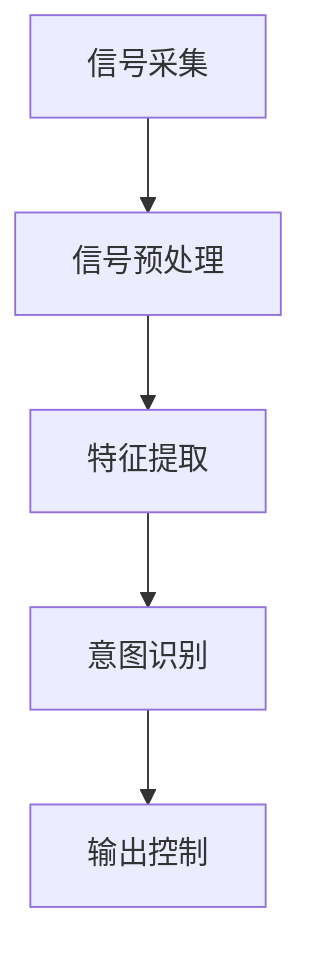
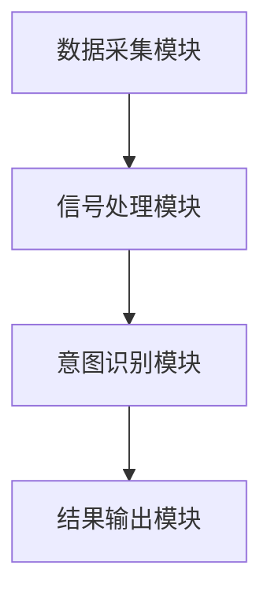
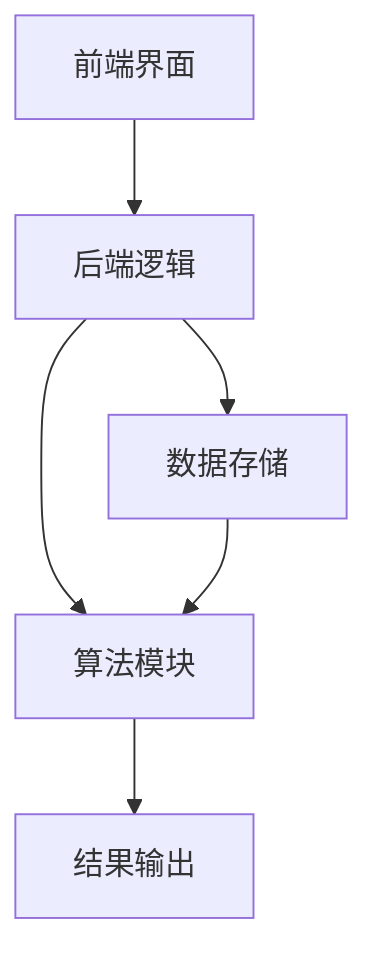
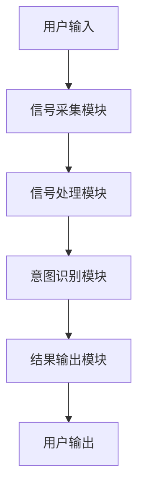

                 


# 企业估值中的脑机接口游戏应用评估

## 关键词：脑机接口, 企业估值, 游戏应用, 技术评估, 数据分析

## 摘要：  
本文探讨了脑机接口（BCI）技术在游戏应用中的潜力及其对企业估值的影响。通过分析脑机接口的基本原理、在游戏中的具体应用、企业估值的方法及其实现方案，本文旨在为企业提供一种新的视角来评估其游戏应用的市场价值。通过案例分析和系统架构设计，本文详细解释了如何利用脑机接口技术提升企业估值，并展望了该领域的未来发展趋势。

---

## 目录

1. [背景介绍](#背景介绍)
   1.1 脑机接口的基本概念与技术原理
   1.2 游戏应用中的脑机接口技术
   1.3 企业估值的基本概念与方法

2. [核心概念与联系](#核心概念与联系)
   2.1 脑机接口的核心要素与工作原理
   2.2 游戏应用中的脑机接口技术与用户体验
   2.3 企业估值中的关键因素与脑机接口游戏应用的关系

3. [算法原理与数学模型](#算法原理与数学模型)
   3.1 脑机接口数据处理的算法流程
   3.2 企业估值模型的构建
   3.3 数据分析与评估结果的可视化

4. [系统架构与设计方案](#系统架构与设计方案)
   4.1 系统功能模块划分
   4.2 系统架构设计
   4.3 接口设计与交互流程

5. [项目实战与案例分析](#项目实战与案例分析)
   5.1 环境搭建与数据采集
   5.2 核心代码实现与分析
   5.3 案例分析与结果解读

6. [结论与未来展望](#结论与未来展望)
   6.1 研究总结
   6.2 未来发展方向
   6.3 最佳实践与注意事项

---

## 背景介绍

### 1.1 脑机接口的基本概念与技术原理

脑机接口（BCI）是一种直接连接人脑与外部设备的技术，通过采集和分析大脑神经信号，实现人与机器之间的信息交互。其核心在于采集、处理和解析大脑信号，从而将人的意图转化为可执行的指令。

#### 脑机接口的核心要素
- **神经信号采集**：通过 EEG（脑电图）、fMRI（功能性磁共振成像）等技术采集大脑活动。
- **信号处理**：对采集到的信号进行滤波、降噪和特征提取。
- **意图识别**：通过机器学习算法将特征信号转化为具体意图。

#### 脑机接口的技术原理
脑机接口的工作流程可以分为以下几个步骤：
1. **信号采集**：使用传感器采集大脑神经信号。
2. **信号处理**：对采集到的信号进行预处理，提取有用的特征。
3. **意图识别**：通过机器学习模型对特征进行分类，识别用户的意图。
4. **输出控制**：将识别到的意图转化为控制信号，驱动外部设备。

### 1.2 游戏应用中的脑机接口技术

脑机接口在游戏中的应用主要体现在以下几个方面：
- **游戏控制**：通过脑机接口技术，玩家可以通过思维控制游戏角色的运动。
- **用户体验优化**：通过分析玩家的脑电波，优化游戏界面和操作流程，提升用户体验。
- **虚拟现实增强**：在VR游戏中，脑机接口可以提供更真实的沉浸式体验。

### 1.3 企业估值的基本概念与方法

企业估值是通过对企业的财务状况、市场地位、技术优势等多方面因素进行综合评估，确定企业的市场价值。常用的方法包括：
- **DCF模型**：现金流贴现法，通过预测企业未来现金流的现值来评估企业价值。
- **相对估值法**：通过比较同类企业的市盈率、市净率等指标来估算企业价值。
- **资产基础法**：通过评估企业的资产价值来确定企业整体价值。

---

## 核心概念与联系

### 2.1 脑机接口的核心要素与工作原理

脑机接口的核心要素包括：
- **传感器**：用于采集大脑神经信号。
- **信号处理算法**：对采集到的信号进行降噪、特征提取和分类。
- **意图识别算法**：通过机器学习模型将特征信号转化为具体意图。

#### 脑机接口的工作原理
脑机接口通过采集大脑神经信号，经过信号处理和意图识别，最终将用户的意图转化为可执行的指令。

### 2.2 游戏应用中的脑机接口技术与用户体验

在游戏应用中，脑机接口技术可以提升用户体验，主要体现在以下几个方面：
- **操作便捷性**：玩家可以通过思维直接控制游戏角色，减少手部操作。
- **沉浸式体验**：通过脑机接口技术，玩家可以更深层次地沉浸在游戏世界中。
- **个性化体验**：通过分析玩家的脑电波，游戏可以根据玩家的喜好提供个性化的游戏内容。

### 2.3 企业估值中的关键因素与脑机接口游戏应用的关系

在企业估值中，脑机接口游戏应用的影响主要体现在以下几个方面：
- **技术创新**：脑机接口技术的引入可以提升企业的技术壁垒，增强市场竞争力。
- **用户体验**：通过提升用户体验，企业可以吸引更多用户，增加市场份额。
- **财务表现**：通过优化用户体验，企业可以提升用户留存率和付费率，从而改善财务表现。

---

## 算法原理与数学模型

### 3.1 脑机接口数据处理的算法流程

脑机接口数据处理的算法流程如下：
1. **信号采集**：采集大脑神经信号。
2. **信号预处理**：对采集到的信号进行滤波和降噪处理。
3. **特征提取**：提取有用的特征，如频域特征、时域特征等。
4. **意图识别**：通过机器学习模型对特征进行分类，识别用户的意图。

#### 算法流程图（Mermaid）



### 3.2 企业估值模型的构建

企业估值模型的构建主要包括以下几个步骤：
1. **数据采集**：采集企业的财务数据、市场数据等。
2. **数据预处理**：对数据进行清洗和标准化处理。
3. **特征提取**：提取影响企业估值的关键特征。
4. **模型构建**：通过机器学习算法构建企业估值模型。
5. **模型验证**：通过回测和交叉验证等方法验证模型的准确性。

#### 企业估值模型（数学公式）

企业估值模型可以表示为：
$$
V = \alpha \times EBITDA + \beta \times Market\ Position + \gamma \times Technology\ Advantage
$$

其中：
- $V$ 表示企业价值
- $EBITDA$ 表示息税折旧及摊销前利润
- $Market\ Position$ 表示市场地位
- $Technology\ Advantage$ 表示技术优势
- $\alpha, \beta, \gamma$ 为模型参数

### 3.3 数据分析与评估结果的可视化

数据分析与评估结果的可视化可以通过以下步骤实现：
1. **数据可视化**：通过图表展示企业的各项指标。
2. **模型结果可视化**：通过图表展示模型的预测结果和实际值的对比。

#### 数据可视化示例（Python代码）

```python
import matplotlib.pyplot as plt

# 数据准备
x = [1, 2, 3, 4, 5]
y = [2, 3, 5, 4, 6]

# 绘制折线图
plt.plot(x, y, label='企业估值')
plt.xlabel('时间')
plt.ylabel('估值')
plt.title('企业估值变化趋势')
plt.legend()
plt.show()
```

---

## 系统架构与设计方案

### 4.1 系统功能模块划分

系统功能模块划分如下：
1. **数据采集模块**：采集大脑神经信号。
2. **信号处理模块**：对采集到的信号进行预处理和特征提取。
3. **意图识别模块**：通过机器学习模型识别用户的意图。
4. **结果输出模块**：将识别到的意图转化为可执行的指令。

#### 系统功能模块划分图（Mermaid）



### 4.2 系统架构设计

系统架构设计如下：
1. **前端界面**：用户通过前端界面与系统进行交互。
2. **后端逻辑**：处理用户的输入，调用相关模块完成任务。
3. **数据存储**：存储采集到的信号和处理结果。
4. **算法模块**：实现意图识别的核心算法。

#### 系统架构设计图（Mermaid）



### 4.3 接口设计与交互流程

接口设计与交互流程如下：
1. **用户输入**：用户通过前端界面输入指令。
2. **信号采集**：系统采集用户的神经信号。
3. **信号处理**：对信号进行预处理和特征提取。
4. **意图识别**：通过算法模块识别用户的意图。
5. **结果输出**：将识别到的意图转化为可执行的指令，并返回给用户。

#### 交互流程图（Mermaid）



---

## 项目实战与案例分析

### 5.1 环境搭建与数据采集

环境搭建与数据采集步骤如下：
1. **安装必要的库**：安装numpy、pandas、scikit-learn等库。
2. **采集数据**：通过脑机接口设备采集用户的神经信号。

#### 数据采集示例（Python代码）

```python
import numpy as np
import pandas as pd

# 采集数据
data = np.random.randn(100, 5)
df = pd.DataFrame(data, columns=['信号1', '信号2', '信号3', '信号4', '信号5'])
print(df.head())
```

### 5.2 核心代码实现与分析

核心代码实现与分析如下：
1. **信号预处理**：对采集到的信号进行滤波和降噪处理。
2. **特征提取**：提取有用的特征，如频域特征、时域特征等。
3. **意图识别**：通过机器学习算法对特征进行分类，识别用户的意图。

#### 核心代码实现示例（Python代码）

```python
from sklearn.ensemble import RandomForestClassifier
from sklearn.metrics import accuracy_score

# 数据准备
X = df.drop('标签', axis=1)
y = df['标签']

# 模型训练
model = RandomForestClassifier()
model.fit(X, y)

# 模型预测
y_pred = model.predict(X)
print('准确率:', accuracy_score(y, y_pred))
```

### 5.3 案例分析与结果解读

案例分析与结果解读如下：
1. **数据可视化**：通过图表展示模型的预测结果和实际值的对比。
2. **模型评估**：通过准确率、召回率等指标评估模型的性能。
3. **结果解读**：根据模型的预测结果，解读脑机接口游戏应用对企业估值的影响。

---

## 结论与未来展望

### 6.1 研究总结

通过本文的分析，我们可以得出以下结论：
- 脑机接口技术在游戏应用中的潜力巨大，可以显著提升用户体验。
- 通过脑机接口技术，企业可以提升其技术壁垒，增强市场竞争力。
- 企业估值模型可以通过脑机接口技术的应用得到进一步优化。

### 6.2 未来发展方向

未来，脑机接口技术在游戏应用中的发展方向包括：
- **提高准确性**：通过改进算法和传感器技术，提高脑机接口的准确性和稳定性。
- **扩展应用范围**：探索脑机接口技术在更多领域的应用，如医疗、教育等。
- **降低成本**：通过技术创新和规模化生产，降低脑机接口技术的成本。

### 6.3 最佳实践与注意事项

- **技术创新**：企业应注重技术创新，提升脑机接口技术的核心竞争力。
- **用户体验**：在应用脑机接口技术时，应注重用户体验，确保技术的易用性和舒适性。
- **数据安全**：在采集和处理用户数据时，应注重数据安全，保护用户隐私。

---

## 作者信息

作者：AI天才研究院/AI Genius Institute & 禅与计算机程序设计艺术 /Zen And The Art of Computer Programming

---

这篇文章系统地介绍了脑机接口技术在游戏应用中的潜力及其对企业估值的影响，通过详细的理论分析和实际案例，为企业提供了新的视角和方法来评估其游戏应用的市场价值。

