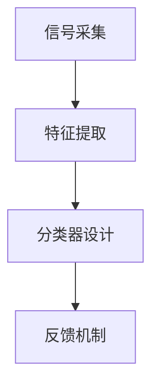

                 

# 企业估值中的脑机接口游戏开发平台评估

> **关键词**: 脑机接口, 游戏开发平台, 企业估值, 技术评估, 人工智能, 信号处理, 机器学习

> **摘要**: 本文详细探讨了脑机接口（BCI）技术在游戏开发平台中的应用及其对企业估值的影响。通过分析BCI的核心技术、游戏开发平台的系统架构以及基于机器学习的估值模型，本文为企业在评估此类平台时提供了深入的见解和方法。文章结合实际案例和详细的技术分析，为读者提供了从理论到实践的全面指导。

---

# 第1章: 脑机接口与游戏开发平台概述

## 1.1 脑机接口的基本概念

### 1.1.1 脑机接口的定义与基本原理

脑机接口（Brain-Computer Interface, BCI）是一种能够直接连接人脑与外部设备的技术，通过采集、处理和分析大脑神经信号，实现人与设备之间的信息交互。其基本原理包括信号采集、特征提取、分类器设计和反馈机制四个主要步骤。

**图1-1 脑机接口的基本原理流程图**

### 1.1.2 游戏开发平台的定义与分类

游戏开发平台是指用于创建和发布游戏的软件工具和技术框架。根据功能和目标用户，游戏开发平台可以分为独立游戏开发平台和大型游戏开发平台。独立平台通常面向小型开发者，而大型平台则支持AAA级游戏的开发。

### 1.1.3 脑机接口在游戏开发中的应用背景

随着技术的进步，脑机接口在游戏中的应用逐渐从实验室走向商业化。通过BCI技术，玩家可以直接通过脑电波控制游戏中的角色或物体，这种沉浸式体验为游戏行业带来了新的可能性。

---

## 1.2 脑机接口与游戏开发的结合

### 1.2.1 脑机接口在游戏中的潜在应用场景

- **游戏控制**: 通过脑电信号直接控制游戏中的角色动作或视角。
- **情感反馈**: 根据玩家的情感变化调整游戏难度或情节发展。
- **虚拟现实交互**: 在VR游戏中提供更自然的交互方式。

### 1.2.2 游戏开发平台的特点与优势

- **开放性**: 支持多种开发工具和接口，便于开发者进行二次开发。
- **易用性**: 提供用户友好的界面，降低开发门槛。
- **跨平台支持**: 支持多种操作系统和硬件设备。

### 1.2.3 脑机接口技术对企业估值的影响

脑机接口技术的引入可以显著提升游戏的用户体验和市场竞争力，从而提高企业的估值。具体表现包括用户留存率的提高、市场占有率的扩大以及收入的增长。

---

## 1.3 企业估值的基本概念

### 1.3.1 企业估值的定义与方法

企业估值是指对企业的价值进行评估的过程。常用的方法包括市场法、收益法和资产法。在脑机接口游戏开发平台的估值中，收益法尤为重要，因为其未来的盈利能力是核心评估指标。

### 1.3.2 游戏开发平台的估值挑战

- **技术不确定性**: BC

