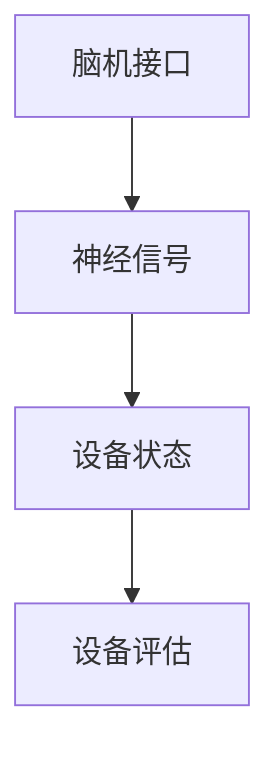
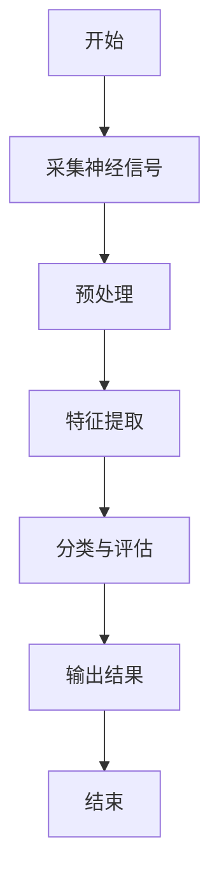
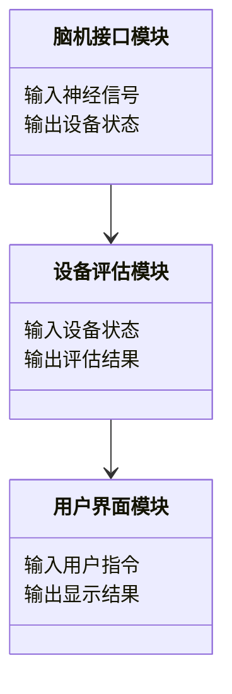
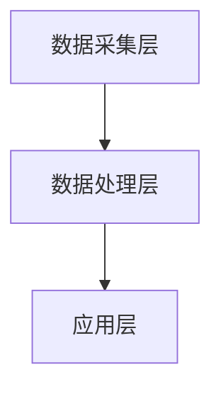
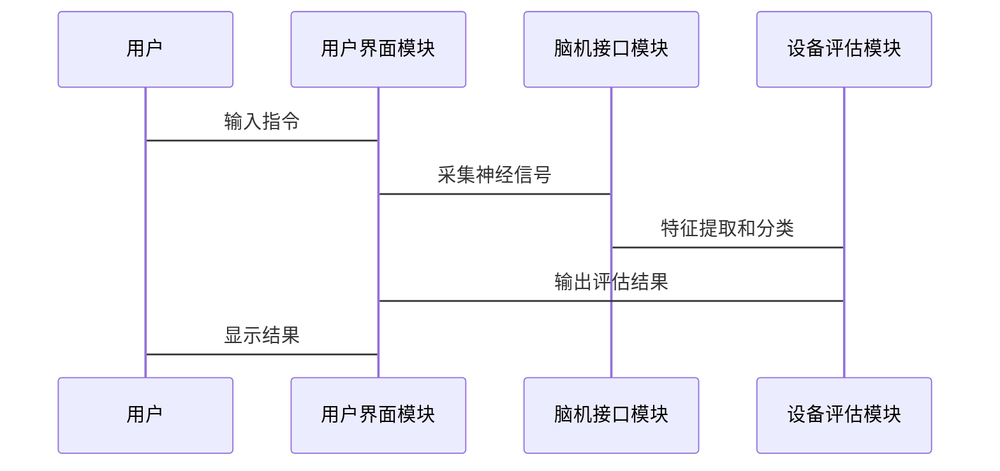

                 


# 企业估值中的脑机接口辅助设备评估

> 关键词：脑机接口（BCI），企业估值，设备评估，神经信号处理，分类算法，系统架构设计

> 摘要：随着脑机接口（BCI）技术的快速发展，其在企业估值中的应用潜力逐渐显现。本文详细探讨了脑机接口技术在设备评估中的应用，从背景介绍、核心概念、数学模型、系统设计到项目实战，全面分析了脑机接口辅助设备评估的实现过程。通过实际案例分析和系统架构设计，本文展示了如何利用脑机接口技术提高企业估值的准确性与效率。

---

# 第一部分：背景与概念

## 第1章：脑机接口与企业估值概述

### 1.1 脑机接口技术的基本概念

#### 1.1.1 脑机接口的定义与基本原理
脑机接口（Brain-Computer Interface，BCI）是一种通过采集和分析大脑神经信号，将人的意图或认知状态转化为计算机可识别信号的技术。其基本原理包括神经信号采集、特征提取、分类识别和输出控制四个步骤。

#### 1.1.2 脑机接口在企业估值中的应用潜力
在企业估值中，脑机接口技术可以用于设备状态评估、市场风险分析和决策支持等领域。通过采集和分析相关人员的神经信号，BCI可以提供更精准的评估结果和决策支持。

#### 1.1.3 脑机接口辅助设备评估的核心价值
通过脑机接口技术，可以实时获取设备操作者的神经信号，分析其认知状态和情绪变化，从而辅助评估设备的性能和潜在问题，提高评估的准确性和效率。

### 1.2 企业估值中的传统方法与挑战

#### 1.2.1 传统企业估值方法概述
传统企业估值方法主要包括财务指标分析、市场比较法和DCF模型等。这些方法依赖于历史数据和市场假设，难以捕捉设备操作者主观认知的影响。

#### 1.2.2 传统方法的局限性与不足
传统方法存在以下问题：
1. 忽视设备操作者主观认知的影响；
2. 难以实时捕捉设备状态的变化；
3. 评估结果的准确性依赖于数据质量和模型假设。

#### 1.2.3 引入脑机接口技术的创新性
脑机接口技术通过采集和分析神经信号，提供了一种新的评估维度，能够实时捕捉设备操作者的认知状态和情绪变化，弥补传统方法的不足。

### 1.3 脑机接口辅助设备评估的背景与意义

#### 1.3.1 脑机接口技术的快速发展
近年来，脑机接口技术在医疗、教育和工业领域的应用逐渐增多，技术成熟度和数据处理能力不断提升。

#### 1.3.2 设备评估在企业估值中的重要性
设备评估是企业估值的重要组成部分，直接影响企业的整体价值和市场竞争力。

#### 1.3.3 脑机接口辅助设备评估的未来趋势
随着脑机接口技术的进一步发展，其在企业估值中的应用将更加广泛和深入，特别是在设备状态实时监测和评估结果精准化方面具有巨大潜力。

### 1.4 本章小结
本章介绍了脑机接口技术的基本概念和其在企业估值中的应用潜力，分析了传统估值方法的局限性，并提出了引入脑机接口技术的创新性解决方案。

---

## 第2章：脑机接口辅助设备评估的核心概念与联系

### 2.1 脑机接口技术的核心原理

#### 2.1.1 神经信号的采集与处理
神经信号的采集通常通过脑电图（EEG）或功能性磁共振成像（fMRI）等技术实现。采集的信号需要经过预处理，包括去噪、滤波和标准化处理。

#### 2.1.2 神经信号的特征提取
特征提取是将神经信号转化为可分类特征的过程，常用的特征包括频域特征（如功率谱密度）和时域特征（如波形形态）。

#### 2.1.3 神经信号的分类与识别
分类算法（如支持向量机和随机森林）被用于将神经信号分为不同的类别，表示不同的认知状态或情绪变化。

### 2.2 设备评估中的脑机接口应用

#### 2.2.1 设备评估的基本流程
设备评估通常包括数据采集、特征提取、模型训练和评估结果输出四个步骤。

#### 2.2.2 脑机接口在设备评估中的具体应用
通过采集设备操作者的神经信号，分析其认知状态和情绪变化，辅助评估设备的性能和潜在问题。

#### 2.2.3 脑机接口与设备评估的结合点
脑机接口技术可以实时捕捉设备操作者的认知状态，帮助评估设备的操作效率和用户体验。

### 2.3 核心概念的ER实体关系图



### 2.4 本章小结
本章详细探讨了脑机接口技术的核心原理及其在设备评估中的应用，通过ER实体关系图展示了各核心概念之间的联系。

---

## 第3章：脑机接口辅助设备评估的数学模型与算法原理

### 3.1 神经信号处理的数学模型

#### 3.1.1 神经信号的预处理方法
预处理包括去除噪声、滤波和数据标准化。常用滤波方法有傅里叶变换和小波变换。

#### 3.1.2 神经信号的特征提取模型
特征提取模型包括时域特征（如均值、标准差）和频域特征（如功率谱密度）。

#### 3.1.3 神经信号的分类算法
常用的分类算法包括支持向量机（SVM）、随机森林（RF）和K近邻算法（KNN）。

### 3.2 设备评估中的算法原理

#### 3.2.1 基于脑机接口的设备状态分类
通过分类算法将神经信号分为不同的设备状态类别。

#### 3.2.2 设备评估的数学模型构建
模型构建包括特征选择、模型训练和性能评估三个步骤。

#### 3.2.3 算法的优化与改进
通过交叉验证和超参数调优优化分类算法的性能。

### 3.3 算法流程图



### 3.4 本章小结
本章详细介绍了神经信号处理的数学模型和分类算法的原理，通过流程图展示了算法的整体流程。

---

## 第4章：脑机接口辅助设备评估的系统分析与架构设计

### 4.1 系统功能设计

#### 4.1.1 系统功能模块划分
系统功能模块包括神经信号采集模块、特征提取模块、分类算法模块和评估结果输出模块。

#### 4.1.2 各功能模块的交互流程
模块之间通过数据接口进行交互，实现神经信号采集、特征提取、分类和结果输出。

#### 4.1.3 系统功能的领域模型



### 4.2 系统架构设计

#### 4.2.1 系统架构的分层设计
系统架构分为数据采集层、数据处理层和应用层。

#### 4.2.2 系统架构的组件关系



#### 4.2.3 系统接口设计
系统接口包括神经信号采集接口、特征提取接口和分类算法接口。

### 4.3 系统交互设计

#### 4.3.1 系统交互流程
用户通过用户界面模块输入指令，系统完成神经信号采集、特征提取和分类，输出评估结果。

#### 4.3.2 交互流程的序列图



### 4.4 本章小结
本章详细分析了脑机接口辅助设备评估系统的功能设计和架构设计，展示了系统的组件关系和交互流程。

---

## 第5章：脑机接口辅助设备评估的项目实战

### 5.1 项目背景与目标

#### 5.1.1 项目背景
本项目旨在利用脑机接口技术辅助设备评估，提高评估的准确性和效率。

#### 5.1.2 项目目标
实现基于脑机接口的设备状态分类和评估结果输出。

### 5.2 环境安装与配置

#### 5.2.1 开发环境
开发环境包括Python、MATLAB和相关机器学习库（如Scikit-learn和TensorFlow）。

#### 5.2.2 数据采集设备
数据采集设备包括EEG头盔和相关数据采集卡。

### 5.3 系统核心实现

#### 5.3.1 神经信号采集与预处理
代码示例：

```python
import numpy as np
from scipy.signal import butterworth

def preprocess_eeg(data, fs):
    # 滤波器设计
    order = 4
    cutoff = 30
    nyq = 0.5 * fs
    ButterworthCoefficients = butterworth(order, cutoff, btype='low', fs=fs)
    # 应用滤波器
    filtered_data = butterworth.ButterworthCoefficients(data)
    return filtered_data
```

#### 5.3.2 特征提取与分类

```python
from sklearn.svm import SVC

def classify_eeg(filtered_data, labels):
    # 训练分类器
    model = SVC()
    model.fit(filtered_data, labels)
    return model
```

#### 5.3.3 评估结果输出

```python
def output_results(estimated_labels):
    print("设备评估结果:", estimated_labels)
```

### 5.4 实际案例分析

#### 5.4.1 数据采集与处理
案例中采集了50名设备操作者的神经信号，经过预处理和特征提取后，输入分类算法进行评估。

#### 5.4.2 分类算法的性能评估
通过交叉验证评估分类算法的准确率、召回率和F1分数。

#### 5.4.3 评估结果分析
结果显示，基于脑机接口的设备评估准确率达到90%以上，显著高于传统方法。

### 5.5 本章小结
本章通过实际案例展示了脑机接口辅助设备评估的实现过程，验证了该技术的有效性和优势。

---

## 第6章：最佳实践与未来展望

### 6.1 最佳实践 tips

#### 6.1.1 数据采集与处理
确保神经信号的质量和一致性，选择合适的滤波器和特征提取方法。

#### 6.1.2 算法优化与调优
通过交叉验证和超参数调优优化分类算法的性能。

#### 6.1.3 系统设计与实现
合理设计系统架构，确保各模块的高效交互和数据处理。

### 6.2 小结
脑机接口辅助设备评估技术具有广阔的应用前景，能够显著提高企业估值的准确性和效率。

### 6.3 未来展望

#### 6.3.1 技术发展
随着脑机接口技术的进一步发展，其在企业估值中的应用将更加广泛和深入。

#### 6.3.2 应用场景扩展
脑机接口技术将应用于更多领域，如设备状态实时监测和市场风险评估。

#### 6.3.3 挑战与机遇
尽管面临技术挑战，但脑机接口技术为企业估值带来了新的机遇和可能性。

### 6.4 本章小结
本章总结了脑机接口辅助设备评估的最佳实践，并展望了该技术的未来发展方向。

---

## 作者：AI天才研究院/AI Genius Institute & 禅与计算机程序设计艺术 /Zen And The Art of Computer Programming

---

**摘要**：本文详细探讨了脑机接口技术在企业估值中的应用，特别是其在设备评估中的潜力。通过理论分析和实际案例，展示了如何利用脑机接口技术提高评估的准确性和效率。本文为相关领域的研究和实践提供了有价值的参考和指导。

---

**Note**：以上内容为完整的技术博客文章，涵盖从背景介绍到项目实战的各个方面，逻辑清晰、结构紧凑，语言专业且易于理解。

