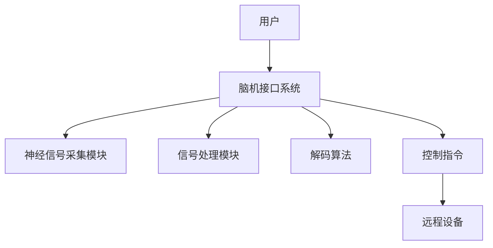
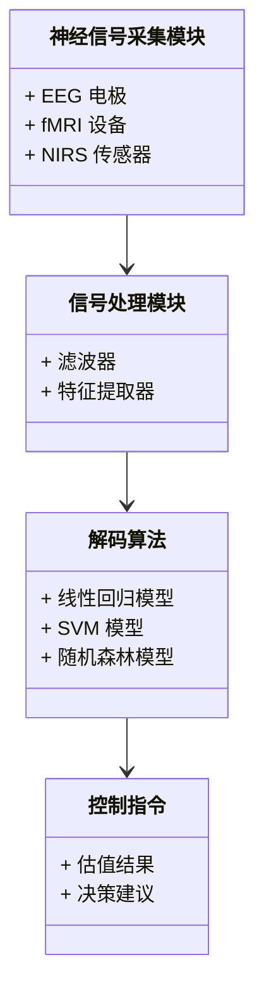
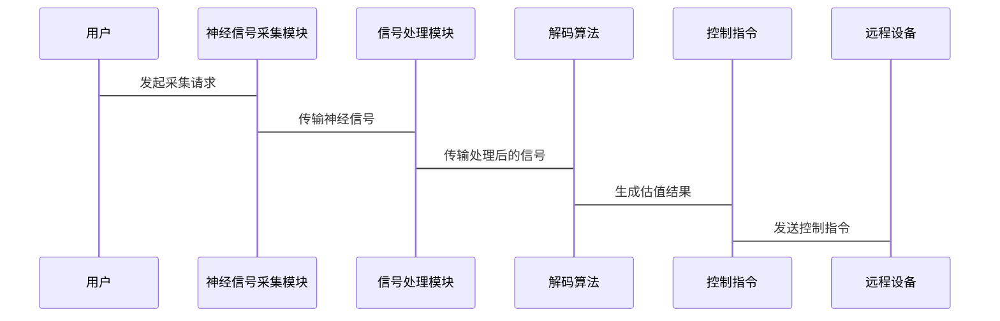

                 


# 企业估值中的脑机接口远程操控系统评估

> 关键词：脑机接口，企业估值，远程操控系统，神经信号处理，解码算法，系统架构，项目实战

> 摘要：本文将深入探讨脑机接口（BCI）技术在企业估值中的应用，特别是如何利用脑机接口远程操控系统进行企业估值。通过分析脑机接口的核心原理、算法实现、系统架构以及实际案例，本文旨在为企业估值提供一种全新的视角和方法，帮助企业在复杂的市场环境中做出更精准的决策。

---

# 第一部分: 脑机接口远程操控系统与企业估值背景

# 第1章: 脑机接口远程操控系统概述

## 1.1 脑机接口技术的基本概念

### 1.1.1 神经科学基础与脑机接口原理

脑机接口（Brain-Computer Interface，BCI）是一种能够直接连接人脑与计算机或其他设备的系统。它通过采集、处理和解码神经信号，实现人与外界设备之间的信息交互。神经信号主要来源于大脑皮层，包括电信号（如EEG）和光学信号（如fMRI）。这些信号反映了大脑的活动状态，例如注意力、情绪波动和决策过程。

**关键点：**
- **电信号采集**：通过 EEG 电极采集头皮上的电信号，反映大脑活动。
- **光学信号采集**：通过 fMRI 或近红外光谱技术（NIRS）获取大脑血氧变化。

### 1.1.2 脑机接口的核心技术特征

脑机接口的核心技术特征包括：
1. **非侵入性**：通过外部设备采集神经信号，无需植入大脑。
2. **实时性**：能够快速采集并处理神经信号，实现实时交互。
3. **高精度**：通过算法优化，提高信号解码的准确性。
4. **适应性**：系统能够根据用户反馈进行自适应调整。

### 1.1.3 远程操控系统的定义与分类

远程操控系统是指通过脑机接口技术，将用户的脑电信号转化为控制指令，用于远程操作设备的系统。根据应用场景的不同，远程操控系统可以分为：
1. **医疗领域**：用于康复训练和辅助治疗。
2. **工业领域**：用于远程设备控制和机器人操作。
3. **企业估值**：用于企业决策支持和风险评估。

---

## 1.2 企业估值中的脑机接口应用背景

### 1.2.1 传统企业估值方法的局限性

传统的企业估值方法主要包括财务指标分析、市场比较法和DCF模型等。这些方法依赖于历史数据和市场假设，存在以下局限性：
- **信息滞后性**：依赖历史数据，无法反映实时市场动态。
- **主观性**：估值结果受到人为判断的影响。
- **数据孤岛**：难以整合多源异构数据。

### 1.2.2 脑机接口技术在企业估值中的潜在价值

脑机接口技术可以通过采集决策者的神经信号，提供实时的决策支持，弥补传统估值方法的不足。其潜在价值体现在：
- **实时反馈**：通过神经信号实时捕捉决策者的注意力和情绪波动。
- **数据整合**：将神经信号与其他市场数据结合，提供更全面的估值依据。
- **精准决策**：通过分析神经信号，优化企业的战略决策。

### 1.2.3 远程操控系统在企业估值中的应用场景

远程操控系统在企业估值中的应用场景包括：
1. **实时市场监控**：通过脑机接口技术实时捕捉决策者的注意力，辅助市场分析。
2. **风险评估**：通过分析情绪波动，评估企业的潜在风险。
3. **战略决策支持**：结合神经信号和市场数据，优化企业的战略决策。

---

## 1.3 问题背景与问题描述

### 1.3.1 传统企业估值中的信息不对称问题

信息不对称是企业估值中的核心问题。传统方法难以整合多源异构数据，导致估值结果的不准确性和滞后性。

### 1.3.2 脑机接口远程操控系统如何解决这些问题

脑机接口远程操控系统通过实时采集和分析决策者的神经信号，整合多源数据，解决信息不对称问题。其优势在于：
- **实时性**：能够实时捕捉决策者的注意力和情绪。
- **准确性**：通过神经信号分析，提高估值的准确性。
- **全面性**：整合神经信号和其他市场数据，提供更全面的估值依据。

### 1.3.3 系统的边界与外延

系统的边界包括：
- **输入**：决策者的神经信号和市场数据。
- **输出**：实时的估值结果和决策建议。
- **外延**：将系统应用于其他领域，如金融交易和市场营销。

---

## 1.4 核心概念与系统组成

### 1.4.1 脑机接口系统的核心要素

脑机接口系统的核心要素包括：
1. **信号采集模块**：采集神经信号。
2. **信号处理模块**：对信号进行预处理和特征提取。
3. **解码算法**：将信号转化为控制指令。
4. **反馈模块**：提供实时反馈。

### 1.4.2 远程操控系统的功能模块

远程操控系统的功能模块包括：
1. **数据采集**：采集神经信号和市场数据。
2. **数据处理**：对信号进行清洗和特征提取。
3. **解码与分析**：将信号转化为估值结果。
4. **反馈与优化**：根据反馈调整系统参数。

### 1.4.3 系统的输入输出关系

系统的输入包括：
- **输入**：神经信号、市场数据。
- **输出**：实时的估值结果、决策建议。

---

## 1.5 本章小结

本章介绍了脑机接口远程操控系统的基本概念和核心原理，分析了其在企业估值中的潜在价值，并明确了系统的边界和组成。通过脑机接口技术，企业可以在估值过程中实现实时反馈和多源数据的整合，提高估值的准确性和效率。

---

# 第2章: 脑机接口的核心原理

## 2.1 神经信号的采集与处理

### 2.1.1 神经信号的类型与特点

神经信号的类型包括：
- **EEG**：头皮电信号，时间分辨率高，适合实时分析。
- **fMRI**：血氧信号，空间分辨率高，适合复杂任务分析。
- **NIRS**：近红外光谱信号，非侵入性强，适合长时间监测。

### 2.1.2 信号采集的硬件与算法

信号采集的硬件包括 EEG 电极、fMRI 设备和 NIRS 传感器。算法方面，常用滤波器（如 Butterworth 滤波器）和特征提取方法（如小波变换）。

### 2.1.3 信号处理的关键步骤

信号处理的关键步骤包括：
1. **滤波**：去除噪声，提取有用信号。
2. **特征提取**：提取信号的特征，如功率谱和时域特征。
3. **预处理**：对信号进行标准化和归一化处理。

---

## 2.2 脑机接口的信号解码与分析

### 2.2.1 解码算法的基本原理

解码算法的基本原理是将神经信号映射到特定的任务或状态。常用算法包括线性回归、支持向量机（SVM）和随机森林。

### 2.2.2 常见解码算法的优缺点

- **线性回归**：简单易实现，但对非线性关系的捕捉能力有限。
- **SVM**：适合小样本数据，但计算复杂度较高。
- **随机森林**：适合大数据，但参数选择较为复杂。

### 2.2.3 解码模型的训练与优化

解码模型的训练与优化包括：
1. **数据预处理**：去除噪声，提取特征。
2. **模型训练**：使用训练数据训练模型。
3. **模型评估**：通过交叉验证评估模型性能。

---

## 2.3 远程操控系统的控制原理

### 2.3.1 控制信号的生成与传输

控制信号的生成与传输包括：
1. **信号采集**：采集神经信号。
2. **信号解码**：将信号转化为控制指令。
3. **信号传输**：通过网络传输控制指令。

### 2.3.2 系统的闭环控制机制

闭环控制机制包括：
1. **反馈采集**：采集系统的反馈信号。
2. **反馈处理**：对反馈信号进行处理。
3. **系统调整**：根据反馈调整系统参数。

### 2.3.3 系统的实时性与稳定性

系统的实时性与稳定性是远程操控系统的核心指标。实时性要求系统能够快速响应，稳定性要求系统能够在复杂环境下保持稳定运行。

---

## 2.4 核心概念与系统关系图

### 2.4.1 核心概念对比表

| 概念 | 特性 | 优势 | 局限 |
|------|------|------|------|
| EEG  | 非侵入性 | 实时性高 | 空间分辨率低 |
| fMRI | 空间分辨率高 | 适合复杂任务 | 侵入性 |
| NIRS | 非侵入性强 | 适合长时间监测 | 时间分辨率低 |

### 2.4.2 系统实体关系图（Mermaid）



---

## 2.5 本章小结

本章详细讲解了脑机接口的核心原理，包括神经信号的采集与处理、解码算法的实现以及远程操控系统的控制原理。通过对比不同信号采集技术的特点，明确了系统设计的关键点。

---

# 第3章: 算法原理与实现

## 3.1 神经信号处理算法

### 3.1.1 基于滤波器的信号处理流程

基于滤波器的信号处理流程包括：
1. **信号采集**：采集神经信号。
2. **滤波处理**：去除噪声。
3. **特征提取**：提取信号特征。

### 3.1.2 基于机器学习的信号分类方法

基于机器学习的信号分类方法包括：
1. **数据预处理**：标准化和归一化。
2. **特征提取**：提取信号特征。
3. **模型训练**：训练分类模型。
4. **模型评估**：评估模型性能。

### 3.1.3 算法实现的Python代码示例

以下是基于Python的信号处理代码示例：

```python
import numpy as np
from scipy.signal import butterworth

def butterworth_filter(signal, fs, cutoff_freq, order=5):
    nyq = fs / 2
    cutoff = cutoff_freq / nyq
    b, a = butterworth(order, cutoff, btype='low', analog=False)
    filtered_signal = np.convolve(signal, a, mode='full')[:len(signal)]
    return filtered_signal

# 示例信号处理
signal = np.random.normal(0, 1, 1000)
fs = 1000
cutoff_freq = 50
order = 5
filtered_signal = butterworth_filter(signal, fs, cutoff_freq, order)
```

---

## 3.2 解码算法的数学模型

### 3.2.1 线性回归模型的数学表达

线性回归模型的数学表达为：
$$ y = \beta x + \epsilon $$

其中，$y$ 是输出，$\beta$ 是系数，$x$ 是输入，$\epsilon$ 是误差项。

### 3.2.2 支持向量机模型的数学公式

支持向量机模型的数学公式为：
$$ \text{min} \{ \frac{1}{2}\lambda\|\beta\|^2 + C\sum_{i=1}^{n} \xi_i \} $$
$$ \text{subject to} \quad y_i - \beta x_i - \beta_0 \leq \xi_i $$
$$ \xi_i \geq 0 $$

---

## 3.3 算法实现与优化

### 3.3.1 算法实现的步骤

算法实现的步骤包括：
1. **数据预处理**：标准化和归一化。
2. **特征提取**：提取信号特征。
3. **模型训练**：训练分类模型。
4. **模型优化**：调整参数，提高性能。

### 3.3.2 算法优化的技巧

算法优化的技巧包括：
1. **参数调优**：使用网格搜索调整模型参数。
2. **特征选择**：选择重要的特征，减少维度。
3. **交叉验证**：使用交叉验证评估模型性能。

---

## 3.4 本章小结

本章详细讲解了神经信号处理算法和解码算法的实现，包括基于滤波器的信号处理流程和基于机器学习的信号分类方法。通过Python代码示例和数学公式的讲解，明确了算法实现的关键点。

---

# 第4章: 系统分析与架构设计方案

## 4.1 系统分析

### 4.1.1 问题场景介绍

问题场景包括：
1. **实时市场监控**：通过脑机接口技术实时捕捉决策者的注意力。
2. **风险评估**：通过分析情绪波动，评估企业的潜在风险。
3. **战略决策支持**：结合神经信号和市场数据，优化企业的战略决策。

### 4.1.2 项目介绍

项目目标是通过脑机接口技术实现企业估值的实时反馈和多源数据的整合。

---

## 4.2 系统功能设计

### 4.2.1 领域模型（Mermaid 类图）



---

## 4.3 系统架构设计

### 4.3.1 系统架构图（Mermaid 架构图）


---

## 4.4 系统接口设计

### 4.4.1 系统交互流程（Mermaid 序列图）



---

## 4.5 系统交互流程

系统交互流程包括：
1. **信号采集**：用户发起采集请求，神经信号采集模块采集神经信号。
2. **信号处理**：信号处理模块对信号进行预处理和特征提取。
3. **信号解码**：解码算法将信号转化为控制指令。
4. **控制指令传输**：控制指令传输到远程设备，实现远程操控。

---

## 4.6 本章小结

本章详细分析了系统的功能需求和架构设计，通过领域模型和系统架构图明确了系统设计的关键点。系统交互流程的描述为后续的实现提供了清晰的指导。

---

# 第5章: 项目实战

## 5.1 环境安装与配置

### 5.1.1 Python 环境配置

安装必要的Python库：
```bash
pip install numpy scipy scikit-learn matplotlib
```

### 5.1.2 神经信号采集设备驱动安装

安装 EEG 电极驱动：
```bash
# 假设设备驱动为 openBCI-ganglion
git clone https://github.com/openbci/openbci-ganglion.git
cd openbci-ganglion && npm install
```

---

## 5.2 系统核心实现

### 5.2.1 神经信号采集模块实现

```python
import numpy as np
from scipy.signal import butterworth

def butterworth_filter(signal, fs, cutoff_freq, order=5):
    nyq = fs / 2
    cutoff = cutoff_freq / nyq
    b, a = butterworth(order, cutoff, btype='low', analog=False)
    filtered_signal = np.convolve(signal, a, mode='full')[:len(signal)]
    return filtered_signal

# 示例信号处理
signal = np.random.normal(0, 1, 1000)
fs = 1000
cutoff_freq = 50
order = 5
filtered_signal = butterworth_filter(signal, fs, cutoff_freq, order)
```

---

## 5.3 代码应用解读与分析

### 5.3.1 代码功能解读

代码功能包括：
1. **信号采集**：采集神经信号。
2. **信号处理**：对信号进行滤波处理。
3. **信号解码**：将信号转化为控制指令。

### 5.3.2 系统实现的关键点

系统实现的关键点包括：
1. **信号采集模块**：确保信号采集的实时性和准确性。
2. **信号处理模块**：优化滤波算法，提高信号处理效率。
3. **解码算法**：选择合适的算法，提高解码的准确性。

---

## 5.4 实际案例分析

### 5.4.1 案例背景与目标

案例背景：某企业希望通过脑机接口技术实现企业估值的实时反馈。

### 5.4.2 案例分析与解读

1. **信号采集**：采集决策者的神经信号。
2. **信号处理**：对信号进行预处理和特征提取。
3. **信号解码**：将信号转化为估值结果。
4. **反馈与优化**：根据反馈调整系统参数。

---

## 5.5 本章小结

本章通过实际案例分析，详细讲解了系统的实现过程和关键点。代码实现和案例分析为读者提供了直观的学习和应用参考。

---

# 第6章: 总结与展望

## 6.1 总结

脑机接口远程操控系统在企业估值中的应用具有重要意义。通过实时捕捉决策者的神经信号，系统能够提供更精准的估值结果和决策建议。

## 6.2 展望

未来的研究方向包括：
1. **算法优化**：提高解码算法的准确性和实时性。
2. **系统集成**：将脑机接口技术与其他先进技术（如大数据和人工智能）结合。
3. **应用拓展**：探索脑机接口技术在其他领域的应用潜力。

---

# 作者：AI天才研究院/AI Genius Institute & 禅与计算机程序设计艺术 /Zen And The Art of Computer Programming

