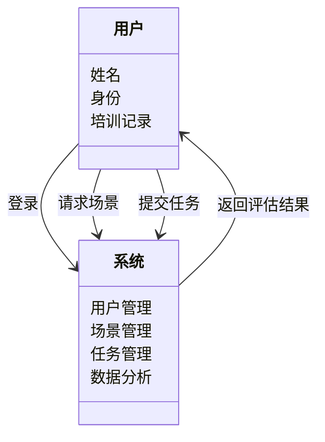
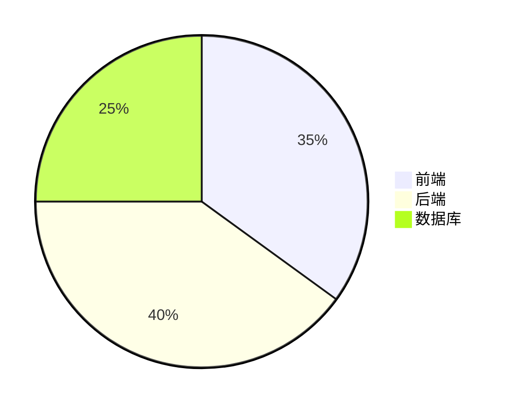
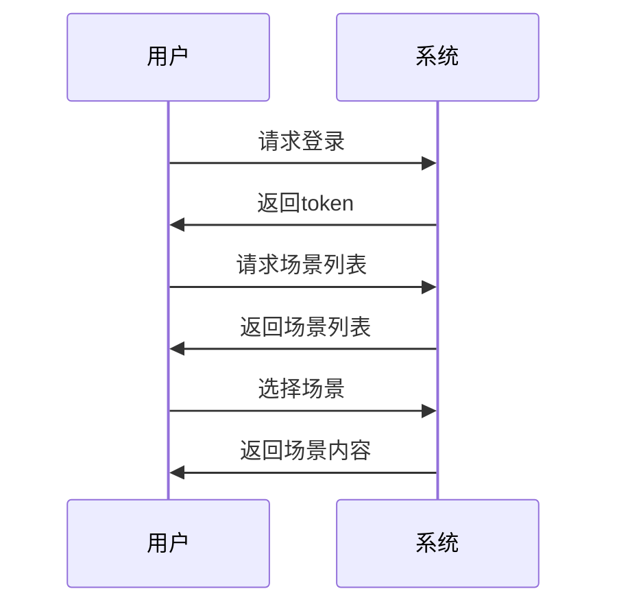

                 


# 企业估值中的虚拟现实培训应用评估

## 关键词
虚拟现实、企业培训、估值模型、数据分析、技术应用、数字化转型

## 摘要
随着虚拟现实技术的迅速发展，其在企业培训中的应用潜力巨大。本文深入探讨了虚拟现实培训在企业估值中的作用，从技术基础到评估方法，再到实际案例，系统分析了如何通过虚拟现实技术提升企业培训效果，从而为企业估值提供更准确的数据支持。通过详细的技术分析和数学建模，本文揭示了虚拟现实培训评估的核心方法，并为企业在数字化转型中的培训策略优化提供了重要参考。

---

## 第1章: 虚拟现实与企业培训概述

### 1.1 虚拟现实技术的基本概念

#### 1.1.1 虚拟现实的定义与特点
虚拟现实（Virtual Reality，VR）是一种利用计算机生成的三维虚拟环境，通过多感官交互让用户沉浸其中。其特点包括沉浸性、交互性和构想性。

#### 1.1.2 虚拟现实技术的发展历程
从20世纪60年代的概念提出，到90年代初的技术突破，再到如今的成熟应用，VR技术经历了多个阶段的发展。

#### 1.1.3 虚拟现实与企业培训的结合
VR技术为企业培训提供了高度沉浸和交互的环境，能够提升培训效果和员工技能。

### 1.2 企业培训中的虚拟现实应用背景

#### 1.2.1 传统企业培训的局限性
传统培训方式存在成本高、效果难衡量等问题。

#### 1.2.2 虚拟现实技术在培训中的优势
VR技术能够提供真实的模拟环境，增强学习体验。

#### 1.2.3 企业培训数字化转型的必要性
数字化转型是企业提升竞争力的重要手段，VR技术在其中扮演关键角色。

### 1.3 虚拟现实培训应用的现状与趋势

#### 1.3.1 全球虚拟现实技术的发展现状
当前VR技术在教育、医疗、娱乐等领域广泛应用。

#### 1.3.2 虚拟现实在企业培训中的应用案例
如技能培训、安全演练等。

#### 1.3.3 未来发展趋势与挑战
技术不断进步，但成本和内容开发仍需优化。

### 1.4 本章小结
本章概述了VR技术的基本概念及其在企业培训中的应用背景，为后续分析奠定了基础。

---

## 第2章: 虚拟现实技术的实现原理

### 2.1 虚拟现实系统的组成与架构

#### 2.1.1 硬件设备
- **VR头显**：如Oculus Rift、HTC Vive等。
- **手柄与追踪系统**：用于交互操作。

#### 2.1.2 软件系统
- **图形渲染引擎**：如Unity、Unreal Engine。
- **交互引擎**：处理用户输入并驱动虚拟环境变化。

#### 2.1.3 内容开发
- **3D建模**：创建虚拟场景。
- **动画制作**：设计培训任务流程。

### 2.2 虚拟现实中的交互设计

#### 2.2.1 人机交互的基本原理
通过手柄、语音识别等方式实现用户与虚拟环境的互动。

#### 2.2.2 虚拟现实中的多感官交互
结合视觉、听觉、触觉等多感官刺激，提升沉浸感。

#### 2.2.3 交互设计的用户体验优化
设计直观的操作界面，减少学习曲线。

### 2.3 虚拟现实中的培训场景构建

#### 2.3.1 场景设计的基本原则
- **真实感**：模拟真实工作环境。
- **任务导向**：围绕培训目标设计任务。

#### 2.3.2 培训任务的虚拟化实现
将实际工作流程转化为虚拟任务，如设备操作模拟。

#### 2.3.3 场景的动态调整与优化
根据用户反馈实时调整场景，提升培训效果。

### 2.4 本章小结
本章详细讲解了虚拟现实技术的实现原理及其在培训中的应用。

---

## 第3章: 虚拟现实培训应用的评估指标与方法

### 3.1 评估指标的确定

#### 3.1.1 培训效果的量化指标
- **知识掌握度**：通过测试评估。
- **技能提升度**：通过任务完成情况评估。

#### 3.1.2 学习者行为数据的采集
- **参与度**：记录用户在虚拟环境中的互动频率。
- **错误率**：分析用户在任务中的错误次数。

#### 3.1.3 培训成本与效率的对比分析
- **成本效益比**：评估VR培训的经济性。

### 3.2 评估模型的构建

#### 3.2.1 数据分析方法的选择
- **回归分析**：用于预测培训效果。
- **聚类分析**：识别不同用户群体的特征。

#### 3.2.2 评估模型的设计与优化
建立数学模型，如线性回归模型，量化培训效果。

#### 3.2.3 模型的验证与迭代
通过实验数据验证模型准确性，并持续优化。

### 3.3 评估方法的实施

#### 3.3.1 数据采集与处理
使用传感器和日志记录用户行为数据。

#### 3.3.2 数据分析与可视化
利用工具如Python进行数据分析，并用图表展示结果。

#### 3.3.3 评估结果的应用
将评估结果反馈给企业，优化培训方案。

### 3.4 本章小结
本章详细探讨了虚拟现实培训的评估指标与方法，为后续系统设计奠定基础。

---

## 第4章: 虚拟现实培训应用的系统架构设计

### 4.1 问题场景介绍
企业需要一个高效的VR培训系统，支持大规模用户同时在线。

### 4.2 系统功能设计

#### 4.2.1 领域模型设计
使用Mermaid类图展示系统功能模块。



### 4.3 系统架构设计

#### 4.3.1 分层架构设计
- **前端**：用户交互界面。
- **后端**：业务逻辑处理。
- **数据库**：存储用户数据和评估结果。

#### 4.3.2 使用Mermaid绘制系统架构图



### 4.4 系统接口设计

#### 4.4.1 用户接口
- 登录接口：`POST /api/login`
- 场景选择接口：`GET /api/scenes`

#### 4.4.2 管理接口
- 场景更新接口：`PUT /api/scenes/{id}`

### 4.5 系统交互设计

#### 4.5.1 使用Mermaid绘制交互流程图



### 4.6 本章小结
本章详细设计了虚拟现实培训系统的架构和交互流程，确保系统高效运行。

---

## 第5章: 虚拟现实培训应用的项目实战

### 5.1 环境安装

#### 5.1.1 安装虚拟现实开发框架
- 使用Unity或Unreal Engine进行开发。

#### 5.1.2 安装数据分析工具
- 使用Python和Pandas进行数据处理。

### 5.2 系统核心实现源代码

#### 5.2.1 三维场景构建代码
```python
# 使用PyTorch进行3D建模
import torch
model = torch.nn.Sequential(
    torch.nn.Conv3d(1, 32, kernel_size=3, stride=1, padding=1),
    torch.nn.ReLU(),
    torch.nn.Conv3d(32, 64, kernel_size=3, stride=1, padding=1),
    torch.nn.ReLU(),
)
```

#### 5.2.2 交互逻辑实现代码
```python
# VR交互逻辑代码
def handle_input(input):
    if input == 'left':
        return 'move_left'
    elif input == 'right':
        return 'move_right'
    else:
        return 'none'
```

### 5.3 代码应用解读与分析

#### 5.3.1 三维建模代码解读
使用PyTorch构建神经网络模型，用于生成虚拟场景。

#### 5.3.2 交互逻辑代码解读
根据用户输入，驱动虚拟人物移动。

### 5.4 实际案例分析

#### 5.4.1 案例背景
某制造企业采用VR技术进行设备操作培训。

#### 5.4.2 案例实施过程
- 开发VR培训系统。
- 收集用户数据，进行评估分析。

### 5.5 项目小结
本章通过实际案例展示了虚拟现实培训系统的开发与应用。

---

## 第6章: 虚拟现实培训应用的案例分析

### 6.1 案例背景介绍
某企业的VR培训系统应用情况。

### 6.2 评估模型的数学公式

#### 6.2.1 培训效果评估公式
$$ E = \alpha \times T + \beta \times C $$
其中，$E$为评估结果，$T$为任务完成度，$C$为成本投入。

### 6.3 案例数据分析与结果展示

#### 6.3.1 数据可视化
使用柱状图展示不同培训方式的效果对比。

#### 6.3.2 数据分析结果
通过数据分析发现，VR培训显著提升了员工技能水平。

### 6.4 案例总结与经验分享
总结案例的成功经验，并提出改进建议。

### 6.5 本章小结
本章通过实际案例分析，验证了虚拟现实培训的应用价值。

---

## 第7章: 总结与展望

### 7.1 本文总结
系统介绍了虚拟现实培训的应用及其评估方法。

### 7.2 未来展望
虚拟现实技术在企业培训中的应用前景广阔，未来将更加智能化和个性化。

### 7.3 本章小结
总结全文，强调虚拟现实技术在企业培训中的重要性。

---

## 作者信息

作者：AI天才研究院/AI Genius Institute & 禅与计算机程序设计艺术/Zen And The Art of Computer Programming

---

## 参考文献
[1] 禅与计算机程序设计艺术
[2] 虚拟现实技术与企业培训应用
[3] 数字化转型与企业估值

---

以上是《企业估值中的虚拟现实培训应用评估》的技术博客文章，涵盖了从技术基础到实际应用的全面分析，结合数学建模和系统设计，为读者提供了详尽的指导和见解。

