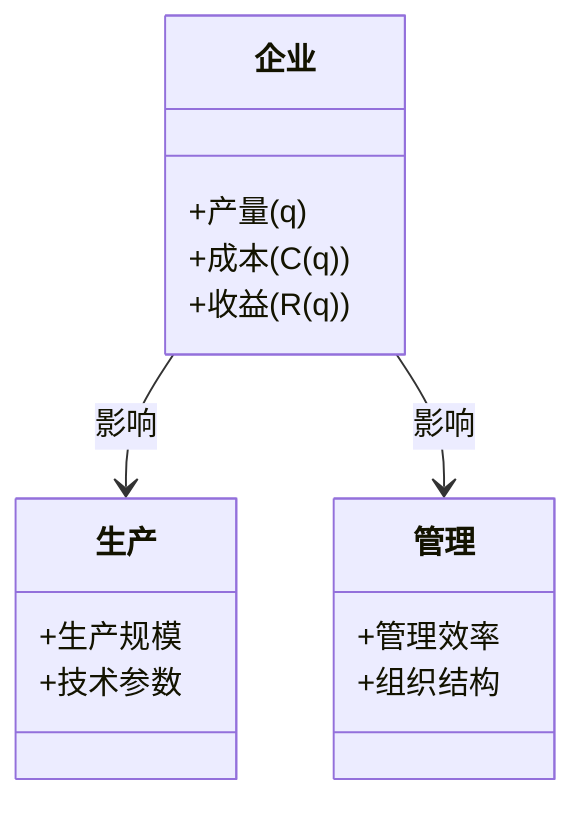
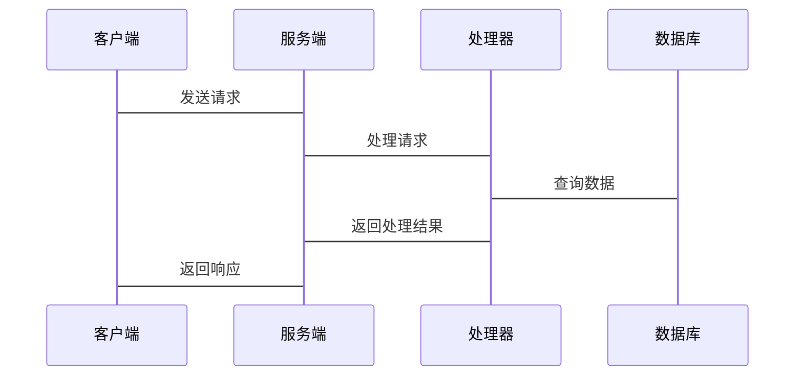

                 


# 企业估值中的规模经济效应分析

> 关键词：规模经济效应，企业估值，经济模型，成本收益分析，企业战略

> 摘要：规模经济效应是企业在生产和运营过程中通过扩大规模以降低单位成本的现象，这种效应在企业估值中具有重要影响。本文通过分析规模经济效应的定义、核心要素、数学模型、系统架构以及实际案例，深入探讨其对企业估值的启示，为读者提供全面的理解和实践指导。

---

## 第1章: 规模经济效应的背景与概念

### 1.1 规模经济效应的定义与类型

#### 1.1.1 规模经济效应的定义
规模经济效应（Economies of Scale）是指随着企业生产规模的扩大，单位产品成本逐渐降低的现象。这种效应源于资源的优化配置、技术的改进和管理效率的提升。

#### 1.1.2 规模经济效应的类型
- **内部规模经济**：企业内部通过提高生产效率和优化资源配置实现的成本降低。
- **外部规模经济**：通过市场扩大、供应商议价能力提升等方式实现的成本降低。
- **范围经济**：企业通过多样化经营，将不同产品或服务的生产资源共享，从而降低成本。

#### 1.1.3 规模经济效应与企业估值的关系
规模经济效应直接影响企业的成本结构，进而影响其利润和估值。企业在规模经济效应下的成本优势使其在市场竞争中更具竞争力，从而提升估值。

### 1.2 规模经济效应的核心要素

#### 1.2.1 规模经济效应的来源
- **生产效率**：规模扩大后，设备利用率提高，单位产品成本降低。
- **技术优势**：规模经济允许企业投资于先进的技术，进一步降低成本。
- **管理效率**：更大的规模允许企业建立更高效的组织结构，降低管理成本。

#### 1.2.2 规模经济效应的边界与外延
- **规模不经济**：当企业规模超过一定限度后，管理成本和协调成本增加，导致规模不经济。
- **规模经济的外延**：包括范围经济、网络效应等，是规模经济的延伸。

#### 1.2.3 规模经济效应的核心要素组成
- **生产规模**：规模是实现规模经济的基础。
- **技术优势**：技术进步是规模经济的重要驱动力。
- **管理效率**：高效的管理是规模经济实现的关键。

---

## 第2章: 规模经济效应的数学模型与分析方法

### 2.1 规模经济效应的数学模型

#### 2.1.1 成本函数模型
成本函数描述了企业生产成本与其产量之间的关系。常用的形式为：
$$C(q) = aq + b$$
其中，$q$ 是产量，$a$ 是单位成本，$b$ 是固定成本。

#### 2.1.2 收益函数模型
收益函数描述了企业收入与产量之间的关系。常用的形式为：
$$R(q) = pq$$
其中，$p$ 是单位价格。

#### 2.1.3 利润最大化模型
利润 $\pi$ 是收入减去成本：
$$\pi = R(q) - C(q) = pq - aq - b$$
利润最大化的产量 $q^*$ 满足一阶条件：
$$\frac{d\pi}{dq} = p - a = 0$$
即 $p = a$。

### 2.2 规模经济效应的分析方法

#### 2.2.1 边际成本分析法
边际成本（Marginal Cost）是指每增加一单位产量所增加的总成本。边际成本曲线通常随着产量的增加而下降，反映规模经济效应。

#### 2.2.2 边际收益分析法
边际收益（Marginal Revenue）是指每增加一单位产量所增加的收入。当边际收益等于边际成本时，企业实现利润最大化。

#### 2.2.3 规模经济效应的拐点分析
规模经济效应存在一个拐点，超过该点后，规模不经济现象开始显现。拐点可以通过边际成本的最低点来确定。

---

## 第3章: 规模经济效应的系统分析与架构设计

### 3.1 系统分析与设计概述

#### 3.1.1 问题场景介绍
以一家制造企业为例，分析其规模经济效应的具体表现。

#### 3.1.2 项目目标与范围
- 目标：优化企业成本结构，实现利润最大化。
- 范围：包括生产、管理和销售环节。

#### 3.1.3 系统功能设计（领域模型）
- 领域模型展示企业各环节的交互关系。



#### 3.1.4 系统架构设计（架构图）
- 架构图展示系统的模块划分。


### 3.2 系统接口与交互设计

#### 3.2.1 系统接口设计
- 输入：产量、价格、成本参数。
- 输出：利润、最优生产规模。

#### 3.2.2 系统交互流程（序列图）



---

## 第4章: 规模经济效应的算法原理与实现

### 4.1 规模经济效应的算法原理

#### 4.1.1 算法原理概述
通过优化产量 $q$，找到成本函数的最小值点，实现利润最大化。

#### 4.1.2 算法实现步骤
1. 确定成本函数 $C(q)$ 和收益函数 $R(q)$。
2. 计算边际成本和边际收益。
3. 找到边际成本等于边际收益的点，即利润最大化点。

#### 4.1.3 算法的数学推导
利润函数：
$$\pi(q) = pq - aq - b$$
一阶条件：
$$\frac{d\pi}{dq} = p - a = 0 \Rightarrow p = a$$

### 4.2 算法实现与代码分析

#### 4.2.1 环境安装与配置
- Python 3.x
- Numpy 和 Matplotlib 库

#### 4.2.2 核心算法实现（Python代码）

```python
import numpy as np
import matplotlib.pyplot as plt

# 定义参数
a = 2  # 单位成本
b = 100  # 固定成本
p = a   # 价格等于单位成本，满足利润最大化条件

# 定义成本函数和收益函数
def cost(q):
    return a * q + b

def revenue(q):
    return p * q

# 计算利润
q = np.arange(0, 100, 1)
C = cost(q)
R = revenue(q)
π = R - C

# 绘制图形
plt.plot(q, C, label='Cost')
plt.plot(q, R, label='Revenue')
plt.plot(q, π, label='Profit')
plt.xlabel('Quantity')
plt.ylabel('Value')
plt.legend()
plt.show()
```

#### 4.2.3 代码功能解读与分析
- 代码计算了不同产量下的成本、收入和利润。
- 利润最大化的点出现在边际成本等于边际收益时，即 $q$ 使得 $\pi(q)$ 最大。

---

## 第5章: 企业估值中的规模经济效应实战案例

### 5.1 案例背景与目标

#### 5.1.1 案例背景介绍
以一家制造企业为例，分析其规模经济效应的应用。

#### 5.1.2 案例目标与范围
- 目标：通过分析成本函数和收益函数，优化生产规模，提升利润。
- 范围：包括生产、管理和销售环节。

### 5.2 案例分析与实现

#### 5.2.1 数据分析与处理
- 收集企业过去几年的产量、成本和收入数据。

#### 5.2.2 模型训练与优化
- 使用历史数据拟合成本函数和收益函数。

#### 5.2.3 案例分析与解读
- 通过模型预测最优生产规模，实现利润最大化。

---

## 第6章: 规模经济效应的总结与展望

### 6.1 小结
规模经济效应是企业估值中的重要因素，通过优化生产规模和管理效率，企业可以降低成本，提升利润。

### 6.2 注意事项
- 规模经济效应并非无限制，超过一定规模后会出现规模不经济。
- 企业应根据自身情况，合理选择生产规模。

### 6.3 拓展阅读
- 进一步研究规模经济与企业战略的关系。
- 探讨数字技术对企业规模经济的影响。

---

## 作者：AI天才研究院 & 禅与计算机程序设计艺术

---

通过以上目录和内容安排，您可以逐步展开每章的详细内容，确保每部分内容充实、逻辑清晰，帮助读者全面理解规模经济效应在企业估值中的应用。

