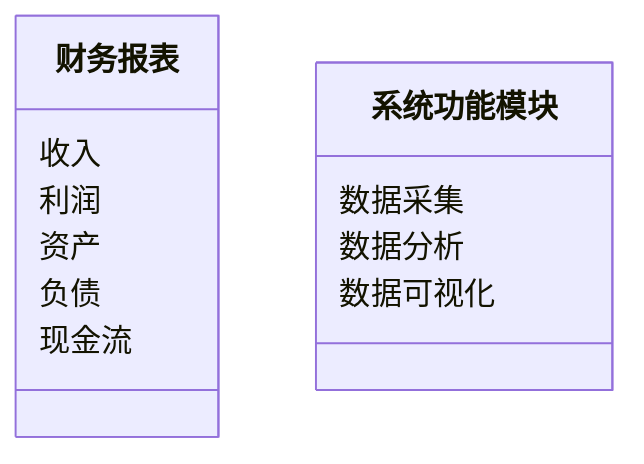
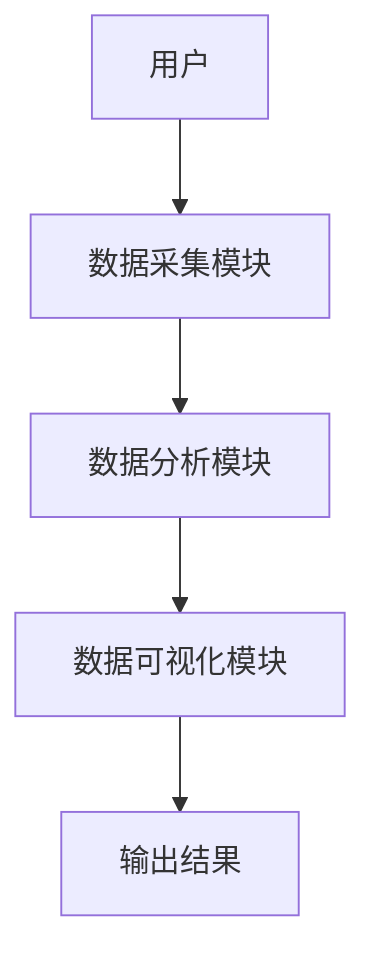
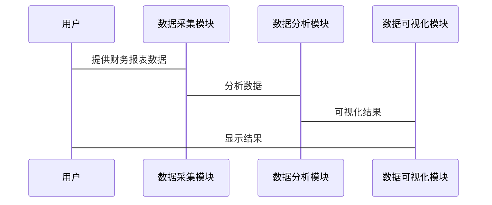

                 


# 《企业估值中的财务报表分析方法》

> 关键词：企业估值，财务报表分析，收入与利润，资产与负债，现金流分析，财务指标，企业价值评估

> 摘要：本文系统地探讨了企业估值中财务报表分析的核心方法，从基础概念到高级算法，结合实际案例，详细解读了如何通过财务报表数据进行企业价值评估。通过本文的学习，读者将能够掌握企业估值的关键指标和分析方法，提升在投资决策中的专业能力。

---

# 第一部分: 企业估值中的财务报表分析基础

## 第1章: 企业估值的基本概念与财务报表的作用

### 1.1 企业估值的定义与意义

- **企业估值的定义**：企业估值是指对企业的整体价值进行评估的过程，通常包括资产、负债、收入、利润等多方面的考量。
- **企业估值的意义**：在投资决策、并购交易、融资活动等场景中，企业估值是关键的决策依据。
- **财务报表在企业估值中的作用**：财务报表提供了企业的财务状况、经营成果和现金流量等核心信息，是估值的基础数据来源。

### 1.2 财务报表分析的基本方法

- **基本财务报表的构成**：
  - 资产负债表：记录企业在某一特定时点的资产、负债和所有者权益。
  - 利润表：展示企业在一定会计期间内的收入、费用和利润情况。
  - 现金流量表：反映企业在一定会计期间内的现金流入和流出情况。

- **财务报表分析的主要指标**：
  - 收入与利润：分析企业的收入来源和利润水平。
  - 资产与负债：评估企业的资产结构和负债情况。
  - 现金流：分析企业的现金流健康状况。

### 1.3 企业估值的核心要素

- **收入与利润的关系**：收入是企业经营的起点，利润是收入减去成本和费用的结果。
- **资产与负债的结构**：资产是企业的资源，负债是企业的债务，两者的结构影响企业的财务健康。
- **现金流的分析与预测**：现金流是企业运营的核心，预测现金流有助于评估企业的可持续发展能力。

---

# 第二部分: 财务报表分析的核心概念与联系

## 第2章: 财务报表分析的核心概念

### 2.1 收入与利润的分析

#### 2.1.1 收入的定义与分类

- **收入的定义**：收入是企业在销售商品或提供服务过程中获得的经济利益。
- **收入的分类**：
  - 营业收入：与企业核心业务相关的收入。
  - 其他收入：与企业核心业务无关的收入。

#### 2.1.2 利润的构成与影响因素

- **利润的构成**：
  - 营业利润：营业收入减去营业成本和费用。
  - 净利润：营业利润减去税费和利息支出。

#### 2.1.3 收入与利润的关系分析

- **收入与利润的关系**：
  - 收入是利润的来源，利润是收入减去成本和费用的结果。
  - 高收入不一定意味着高利润，取决于成本和费用的控制。

### 2.2 资产与负债的分析

#### 2.2.1 资产的分类与评估

- **资产的分类**：
  - 流动资产：可以在一年内变现的资产，如现金、应收账款、存货等。
  - 非流动资产：无法在一年内变现的资产，如固定资产、无形资产等。

#### 2.2.2 负债的分类与偿付能力

- **负债的分类**：
  - 流动负债：需要在一年内偿还的债务，如应付账款、短期借款等。
  - 非流动负债：需要在一年以上偿还的债务，如长期借款、债券等。

#### 2.2.3 资产负债表的平衡关系

- **资产负债表的平衡关系**：
  - 资产 = 负债 + 所有者权益
  - 通过分析资产负债表的平衡关系，可以评估企业的财务健康状况。

### 2.3 现金流的分析

#### 2.3.1 现金流的定义与分类

- **现金流的定义**：企业在一定会计期间内的现金流入和流出。
- **现金流的分类**：
  - 经营活动现金流：与企业日常经营相关的现金流入和流出。
  - 投资活动现金流：与企业投资活动相关的现金流入和流出。
  - 筹资活动现金流：与企业筹资活动相关的现金流入和流出。

#### 2.3.2 现金流的来源与用途

- **现金流的来源**：
  - 经营活动现金流：销售收入、服务收入等。
  - 投资活动现金流：出售资产、投资收益等。
  - 筹资活动现金流：借款、发行股票等。

#### 2.3.3 现金流对估值的影响

- **现金流对估值的影响**：
  - 现金流是企业价值的重要组成部分，现金流充裕的企业具有更高的估值。

### 2.4 核心概念对比分析

#### 2.4.1 收入与利润的对比分析

| **对比维度** | **收入** | **利润** |
|--------------|----------|----------|
| 定义          | 经济利益的流入 | 经济利益的净额 |
| 计算公式      | 收入 = 销售价格 × 销售量 | 利润 = 收入 - 成本 - 费用 |
| 时间范围      | 每一会计期间 | 每一会计期间 |
| 影响因素      | 销售量、价格 | 成本、费用 |

#### 2.4.2 资产与负债的对比分析

| **对比维度** | **资产** | **负债** |
|--------------|----------|----------|
| 定义          | 资源或权利 | 债务或义务 |
| 归属          | 属于企业所有者 | 属于债权人 |
| 时间范围      | 长期或短期 | 长期或短期 |
| 影响因素      | 资产价值、使用效率 | 债务规模、利率 |

---

# 第三部分: 财务报表分析的算法原理

## 第3章: 财务报表分析的核心算法

### 3.1 杜邦分析法

#### 3.1.1 杜邦分析法的定义

- **杜邦分析法**：一种用于评估企业财务状况的方法，通过分解ROE（净资产收益率）来分析企业的盈利能力和资本结构。

#### 3.1.2 杜邦分析法的公式

$$
ROE = \frac{净收益}{股东权益} = \frac{净收益}{收入} \times \frac{收入}{资产} \times \frac{资产}{股东权益}
$$

#### 3.1.3 杜邦分析法的步骤

1. 计算净收益。
2. 计算收入与资产的比率。
3. 计算资产与股东权益的比率。
4. 将上述三个比率相乘，得到ROE。

#### 3.1.4 杜邦分析法的代码实现

```python
def dupont_analysis(net_income, revenue, assets, equity):
    roe = net_income / equity
    profit_margin = net_income / revenue
    asset_turnover = revenue / assets
    equity_multiplier = assets / equity
    roe_decomposed = profit_margin * asset_turnover * equity_multiplier
    return roe, roe_decomposed

# 示例数据
net_income = 100
revenue = 500
assets = 200
equity = 100

roe, roe_decomposed = dupont_analysis(net_income, revenue, assets, equity)
print(f"ROE: {roe}")
print(f"Decomposed ROE: {roe_decomposed}")
```

### 3.2 现金流分析法

#### 3.2.1 现金流分析法的定义

- **现金流分析法**：通过分析企业的现金流入和流出情况，评估企业的财务健康状况和估值。

#### 3.2.2 现金流分析法的公式

$$
净现金流 = 现金流入 - 现金流出
$$

#### 3.2.3 现金流分析法的步骤

1. 收集企业的现金流量数据。
2. 计算净现金流。
3. 分析净现金流的趋势。

#### 3.2.4 现金流分析法的代码实现

```python
def cash_flow_analysis(operating_cash_flow, investing_cash_flow, financing_cash_flow):
    net_cash_flow = operating_cash_flow + investing_cash_flow + financing_cash_flow
    return net_cash_flow

# 示例数据
operating_cash_flow = 100
investing_cash_flow = -50
financing_cash_flow = 20

net_cash_flow = cash_flow_analysis(operating_cash_flow, investing_cash_flow, financing_cash_flow)
print(f"Net Cash Flow: {net_cash_flow}")
```

---

# 第四部分: 财务报表分析的系统设计与实现

## 第4章: 财务报表分析的系统架构设计

### 4.1 系统功能设计

#### 4.1.1 领域模型设计



#### 4.1.2 系统架构设计



### 4.2 系统接口设计

- **输入接口**：接收财务报表数据。
- **输出接口**：输出分析结果和可视化图表。

### 4.3 系统交互设计



---

# 第五部分: 财务报表分析的项目实战

## 第5章: 项目实战：企业估值分析

### 5.1 环境安装

- **工具安装**：安装Python、Pandas、Matplotlib等工具。

### 5.2 系统核心实现源代码

```python
import pandas as pd
import matplotlib.pyplot as plt

# 示例数据
data = {
    '收入': [100, 200, 300],
    '利润': [20, 30, 40],
    '资产': [500, 600, 700],
    '负债': [300, 400, 500]
}

df = pd.DataFrame(data)

# 计算净资产收益率(ROE)
equity = df['资产'] - df['负债']
roes = df['利润'] / equity

plt.plot(roes, 'r-')
plt.xlabel('年份')
plt.ylabel('ROE')
plt.title('企业ROE分析')
plt.show()
```

### 5.3 代码应用解读与分析

- **代码功能**：
  - 读取财务数据。
  - 计算净资产收益率(ROE)。
  - 绘制ROE趋势图。

### 5.4 实际案例分析

- **案例背景**：分析一家创业公司的估值。
- **数据收集**：收集公司过去三年的财务报表数据。
- **分析过程**：计算ROE、现金流等关键指标。
- **结果解读**：评估公司的估值。

---

# 第六部分: 总结与最佳实践

## 第6章: 总结与最佳实践

### 6.1 本章小结

- **核心内容回顾**：
  - 财务报表分析是企业估值的基础。
  - 杜邦分析法和现金流分析法是常用的分析方法。
  - 系统设计和项目实战是理论知识的实际应用。

### 6.2 最佳实践 tips

- **数据准确性**：确保财务数据的准确性和完整性。
- **方法选择**：根据具体情况选择合适的分析方法。
- **持续学习**：关注行业动态和新的分析方法。

### 6.3 未来趋势展望

- **智能化分析**：利用人工智能技术提高分析效率和准确性。
- **数据可视化**：通过数据可视化工具更好地展示分析结果。
- **实时监控**：实时监控企业的财务状况，及时调整估值策略。

---

# 作者：AI天才研究院/AI Genius Institute & 禅与计算机程序设计艺术 /Zen And The Art of Computer Programming

---

以上是《企业估值中的财务报表分析方法》的目录大纲，涵盖了从基础概念到高级算法的详细内容，并结合实际案例进行分析，帮助读者系统地掌握企业估值中的财务报表分析方法。

