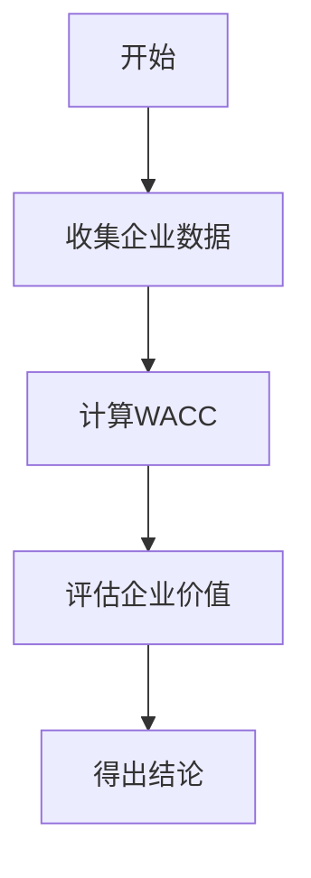

                 

# 企业估值中的资本结构分析

## 关键词：
- 企业估值
- 资本结构
- 资本成本
- 加权平均资本成本（WACC）
- 财务杠杆

## 摘要：
资本结构是企业财务管理中的核心问题之一，直接影响企业的价值和风险。本文通过分析资本结构的基本概念、理论基础、分析方法及其在企业估值中的应用，详细探讨如何通过优化资本结构来提升企业价值。结合实际案例和系统架构设计，本文为企业估值提供了系统的解决方案和实践指导。

---

## 第一部分：资本结构分析基础

### 第1章：资本结构概述

#### 1.1 资本结构的定义与核心要素

资本结构是指企业各种长期资本的构成及其比例，主要包括权益资本和债务资本。以下是资本结构的核心要素：

- **权益资本**：所有者对企业净资产的要求权，风险较低，回报通常为股息或资本增值。
- **债务资本**：企业通过借款或其他债务工具筹集的资金，风险较高，回报通常为固定利息。

资本结构与企业价值密切相关。通过合理配置权益和债务资本，企业可以在降低资本成本的同时，优化风险和收益的平衡。

#### 1.2 资本结构的重要性

资本结构的重要性体现在以下几个方面：

1. **影响企业价值**：资本结构决定了企业的加权平均资本成本（WACC），从而影响企业的整体价值。
2. **影响企业风险**：适当的债务资本可以提高企业杠杆效应，但也增加了财务风险。
3. **影响融资成本**：不同资本结构下的融资成本不同，选择最优资本结构可以降低整体融资成本。

---

## 第二部分：资本结构分析的理论基础

### 第2章：资本结构分析的理论基础

#### 2.1 Modigliani-Miller定理

Modigliani-Miller定理是资本结构理论的重要基础，分为无杠杆和有杠杆两种情况：

1. **无杠杆情况下的企业价值**：$V_U = V_L$
2. **有杠杆情况下的企业价值**：$V_L = V_U + T \cdot D$

其中，$D$为债务价值，$T$为税率。通过比较无杠杆和有杠杆下的企业价值，可以分析债务对价值的影响。

#### 2.2 加权平均资本成本（WACC）

WACC是企业整体资本成本的加权平均值，计算公式为：

$$WACC = \left( \frac{E}{V} \times R_e \right) + \left( \frac{D}{V} \times R_d \times (1 - T) \right)$$

其中，$E$为股权价值，$D$为债务价值，$V = E + D$，$R_e$为股权资本成本，$R_d$为债务资本成本，$T$为税率。

---

## 第三部分：资本结构分析方法

### 第3章：资本结构分析方法

#### 3.1 资本成本法

资本成本法通过计算不同资本结构下的资本成本，选择最优资本结构。例如，通过调整债务和股权的比例，找到使WACC最小化的资本结构。

#### 3.2 资本资产定价模型（CAPM）

CAPM用于计算股权资本成本：

$$R_e = R_f + \beta \times (R_m - R_f)$$

其中，$R_f$为无风险利率，$\beta$为贝塔系数，$R_m$为市场平均回报率。

---

## 第四部分：资本结构优化与企业估值

### 第4章：资本结构优化

#### 4.1 资本结构优化的目标

资本结构优化的目标是最大化企业价值，通常通过调整债务和股权的比例实现。

### 第5章：企业估值中的资本结构分析

#### 5.1 企业估值的基本方法

企业估值常用的方法包括：

1. **股权自由现金流模型**：基于未来现金流的现值计算企业价值。
2. **加权平均资本成本法**：使用WACC作为折现率计算企业价值。
3. **市场价值法**：参考可比企业的市场价值进行估值。

#### 5.2 资本结构对企业估值的影响

资本结构直接影响企业的资本成本和风险，从而影响企业价值。例如，适当的债务使用可以降低WACC，提高企业价值。

---

## 第五部分：资本结构分析的实践应用

### 第6章：行业案例分析

#### 6.1 高杠杆行业案例

以金融行业为例，分析其高杠杆的资本结构对企业估值的影响。通过Mermaid流程图展示分析步骤：

---

## 第六部分：总结与展望

### 第7章：总结与展望

#### 7.1 总结

资本结构分析是企业估值的核心内容，通过优化资本结构可以提升企业价值。本文结合理论和实践，详细讲解了资本结构分析的方法和应用。

#### 7.2 展望

未来研究可以进一步探讨动态资本结构优化和多因素模型在企业估值中的应用。

---

## 作者：AI天才研究院/AI Genius Institute & 禅与计算机程序设计艺术 /Zen And The Art of Computer Programming

