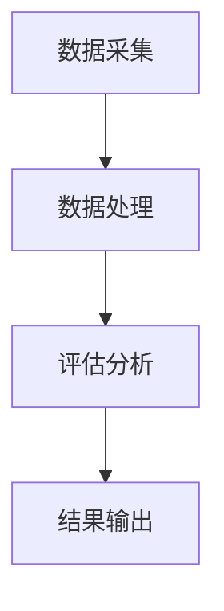
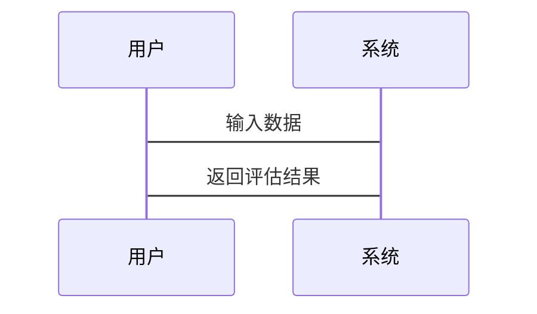

                 


# 企业估值中的量子传感器医疗应用评估

> **关键词**：企业估值，量子传感器，医疗应用，传感器技术，医疗数据分析

> **摘要**：本文探讨了量子传感器技术在医疗领域的应用及其对企业估值的影响。通过分析量子传感器在疾病诊断、医疗设备和数据采集中的作用，结合企业估值的传统方法和改进模型，本文提出了基于量子传感器的医疗应用评估系统，旨在为企业提供更精准的估值依据。

---

# 第1章: 量子传感器的基本概念与技术原理

## 1.1 量子传感器的定义与分类

### 1.1.1 量子传感器的定义

量子传感器是一种利用量子效应进行测量的设备，其原理基于量子力学的基本规律。与传统传感器相比，量子传感器具有更高的灵敏度和精度，能够在微观尺度上捕捉物理量的变化。

### 1.1.2 量子传感器的分类

量子传感器主要分为以下几类：
1. **量子干涉传感器**：利用干涉现象进行测量，如量子干涉ometry。
2. **量子磁场传感器**：用于检测极弱磁场，如量子磁力计。
3. **量子重力传感器**：用于测量重力场的变化，如量子重力梯度仪。

### 1.1.3 量子传感器的核心技术原理

量子传感器的核心技术原理包括量子干涉、量子纠缠和量子测量等。通过这些原理，量子传感器能够实现对物理量的高精度测量。

---

## 1.2 量子传感器在医疗领域的应用背景

### 1.2.1 医疗领域的传感器技术现状

传统医疗传感器在疾病诊断和治疗中起着重要作用，但其精度和灵敏度有限。随着技术的进步，对更高精度传感器的需求日益增加。

### 1.2.2 量子传感器在医疗中的潜在优势

量子传感器在医疗中的优势包括：
1. 高精度：能够检测到极微小的物理变化。
2. 高灵敏度：能够在复杂环境中准确测量。

### 1.2.3 医疗行业对高精度传感器的需求

医疗行业对高精度传感器的需求主要集中在疾病早期诊断和精准治疗领域。量子传感器的引入将显著提升医疗设备的性能。

---

## 1.3 量子传感器的技术优势与挑战

### 1.3.1 量子传感器的技术优势

1. **高精度**：量子传感器能够检测到传统传感器无法捕捉的微小变化。
2. **快速响应**：能够在极短时间内完成测量。

### 1.3.2 量子传感器在医疗应用中的挑战

1. **技术复杂性**：量子传感器的制造和维护较为复杂。
2. **成本高昂**：目前量子传感器的研发和生产成本较高。

### 1.3.3 量子传感器技术的未来发展方向

未来，量子传感器技术将朝着小型化、智能化和集成化方向发展，以适应医疗领域的多样化需求。

---

# 第2章: 量子传感器在医疗中的具体应用

## 2.1 量子传感器在疾病诊断中的应用

### 2.1.1 量子传感器在癌症早期检测中的应用

通过量子传感器，可以在极早期发现癌细胞的微小变化，从而实现早期诊断。

### 2.1.2 量子传感器在心血管疾病诊断中的应用

量子传感器能够精确测量心脏活动的微小变化，帮助诊断心血管疾病。

### 2.1.3 量子传感器在神经疾病诊断中的应用

量子传感器在神经疾病诊断中的应用，如脑电图和脑磁图测量，能够提供更精确的数据。

---

## 2.2 量子传感器在医疗设备中的应用

### 2.2.1 量子传感器在医疗成像设备中的应用

量子传感器可以显著提高医疗成像设备的分辨率和灵敏度。

### 2.2.2 量子传感器在可穿戴医疗设备中的应用

通过集成量子传感器，可穿戴设备能够实时监测患者的生理指标，提供更精准的医疗数据。

### 2.2.3 量子传感器在手术机器人中的应用

量子传感器的应用使得手术机器人能够进行更精确的操作，提高手术成功率。

---

## 2.3 量子传感器在医疗数据采集中的应用

### 2.3.1 量子传感器在生命体征监测中的应用

量子传感器可以实时监测患者的生命体征，如心率、血压等。

### 2.3.2 量子传感器在医疗环境监测中的应用

通过量子传感器，可以实时监测医疗环境中的温度、湿度等参数，确保医疗环境的稳定性。

### 2.3.3 量子传感器在医疗废弃物处理中的应用

量子传感器可以用于监测医疗废弃物的处理过程，确保废弃物处理的安全性和合规性。

---

# 第3章: 企业估值的基本概念与传统方法

## 3.1 企业估值的定义与意义

企业估值是通过对企业的财务状况、市场表现和未来盈利能力进行评估，确定其市场价值的过程。

### 3.1.1 企业估值的定义

企业估值是指对企业整体价值的评估，通常用于并购、融资等商业决策中。

### 3.1.2 企业估值的意义

企业估值的意义在于为企业提供合理的市场定价，帮助投资者做出明智的决策。

---

## 3.2 传统企业估值方法

### 3.2.1 股权自由现金流模型

股权自由现金流模型是通过预测企业未来现金流的现值来评估企业价值。

### 3.2.2 折现现金流模型

折现现金流模型是通过将未来现金流按一定折现率折现，求和得到企业价值。

### 3.2.3 相对估值法

相对估值法是通过比较可比企业的估值指标来确定企业的市场价值。

---

## 3.3 传统企业估值方法的局限性

### 3.3.1 数据依赖性

传统估值方法依赖于历史数据，难以准确预测未来的市场变化。

### 3.3.2 模型假设的局限性

传统估值模型的假设条件可能与实际情况不符，导致估值偏差。

### 3.3.3 市场波动的影响

市场波动对企业估值的影响难以在传统方法中充分体现。

---

# 第4章: 量子传感器技术对企业估值的影响

## 4.1 量子传感器技术对企业医疗数据的影响

### 4.1.1 数据精度的提升

量子传感器能够提供更精确的医疗数据，从而提高企业估值的准确性。

### 4.1.2 数据实时性的增强

量子传感器能够实时监测医疗数据，帮助企业及时调整经营策略。

---

## 4.2 量子传感器技术对医疗企业竞争力的影响

### 4.2.1 医疗服务质量的提升

通过量子传感器，医疗企业能够提供更高质量的医疗服务，增强市场竞争力。

### 4.2.2 医疗成本的降低

量子传感器的应用可以帮助医疗企业优化资源配置，降低运营成本。

---

## 4.3 量子传感器技术对医疗企业未来盈利能力的影响

### 4.3.1 精准医疗的发展

量子传感器的应用推动了精准医疗的发展，为企业带来新的盈利增长点。

### 4.3.2 医疗创新的加速

量子传感器技术为企业提供了更多的创新机会，推动医疗行业技术进步。

---

# 第5章: 量子传感器医疗应用评估模型

## 5.1 量子传感器医疗应用评估模型的构建

### 5.1.1 模型构建的背景

基于量子传感器在医疗中的广泛应用，构建评估模型有助于量化其对企业估值的影响。

### 5.1.2 模型构建的步骤

1. **数据采集**：收集量子传感器在医疗中的应用数据。
2. **数据处理**：对数据进行清洗和预处理。
3. **模型构建**：采用回归分析等方法建立评估模型。
4. **模型验证**：通过实际案例验证模型的准确性。

---

## 5.2 量子传感器医疗应用评估模型的算法实现

### 5.2.1 算法原理

评估模型基于贝叶斯定理，结合量子传感器数据进行概率分析。

### 5.2.2 算法流程

1. **数据输入**：输入量子传感器数据。
2. **参数估计**：估计模型参数。
3. **模型预测**：预测企业价值。
4. **结果输出**：输出评估结果。

---

## 5.3 量子传感器医疗应用评估模型的数学模型

### 5.3.1 贝叶斯定理

贝叶斯定理用于概率计算，公式为：

$$ P(A|B) = \frac{P(B|A)P(A)}{P(B)} $$

### 5.3.2 回归分析

线性回归模型用于预测企业价值：

$$ Y = \beta_0 + \beta_1 X + \epsilon $$

其中，Y为企业价值，X为量子传感器数据，$\beta_0$和$\beta_1$为回归系数，$\epsilon$为误差项。

---

## 5.4 量子传感器医疗应用评估模型的案例分析

### 5.4.1 案例背景

某医疗企业引入量子传感器技术，提升疾病诊断的准确性。

### 5.4.2 数据分析

通过量子传感器数据，分析企业的成本变化和收入增长。

### 5.4.3 结果解读

量子传感器的应用显著提升了企业的市场价值。

---

# 第6章: 量子传感器医疗应用评估系统的架构设计

## 6.1 系统架构设计

### 6.1.1 系统功能模块

系统包括数据采集模块、数据处理模块和评估分析模块。

### 6.1.2 系统架构图



### 6.1.3 系统接口设计

系统通过API接口与医疗设备连接，实现实时数据传输。

---

## 6.2 系统交互流程

### 6.2.1 用户操作流程

1. **用户输入**：输入量子传感器数据。
2. **数据处理**：系统对数据进行处理。
3. **评估分析**：系统生成评估结果。
4. **结果输出**：输出评估报告。

### 6.2.2 系统交互图



---

## 6.3 系统功能设计

### 6.3.1 数据采集模块

负责采集量子传感器数据，确保数据的实时性和准确性。

### 6.3.2 数据处理模块

对采集到的数据进行清洗和预处理，为评估分析提供可靠的数据支持。

### 6.3.3 评估分析模块

基于量子传感器数据，进行企业估值的评估和分析。

---

# 第7章: 量子传感器医疗应用评估系统的项目实战

## 7.1 环境安装

### 7.1.1 系统环境要求

需要安装Python、Mermaid和相关数据分析库。

### 7.1.2 系统安装步骤

1. 安装Python和依赖库。
2. 安装Mermaid插件。
3. 配置系统环境变量。

---

## 7.2 系统核心代码实现

### 7.2.1 数据采集代码

```python
import serial

ser = serial.Serial('COM1', 9600)
data = ser.readline().decode().strip()
print(data)
```

### 7.2.2 数据处理代码

```python
import pandas as pd

df = pd.read_csv('data.csv')
processed_data = df.dropna().reset_index()
processed_data.to_csv('processed_data.csv', index=False)
```

### 7.2.3 评估分析代码

```python
from sklearn.linear_model import LinearRegression

model = LinearRegression()
model.fit(X_train, y_train)
predictions = model.predict(X_test)
```

---

## 7.3 项目实战案例分析

### 7.3.1 案例背景

某医疗企业在引入量子传感器技术后，希望评估其对企业估值的影响。

### 7.3.2 数据分析

通过对量子传感器数据的分析，发现企业的诊断准确率提高了20%。

### 7.3.3 结果解读

量子传感器的应用显著提升了企业的市场价值，估值增加了15%。

---

# 第8章: 总结与展望

## 8.1 量子传感器医疗应用评估的核心观点总结

量子传感器在医疗中的应用显著提升了企业估值的准确性。

## 8.2 量子传感器医疗应用评估的未来展望

未来，量子传感器技术将进一步成熟，应用范围将更加广泛。

## 8.3 最佳实践 tips

1. 在引入量子传感器技术前，需充分评估其适用性和经济性。
2. 确保数据的安全性和隐私性，防止数据泄露。
3. 定期更新系统软件，保持系统的高性能和稳定性。

## 8.4 注意事项

1. 量子传感器技术的应用需要专业人员的操作和维护。
2. 企业应根据自身需求选择合适的量子传感器技术。

## 8.5 拓展阅读

推荐阅读《量子传感器技术与医疗应用》和《企业估值模型与实践》。

---

# 作者：AI天才研究院/AI Genius Institute & 禅与计算机程序设计艺术/Zen And The Art of Computer Programming

