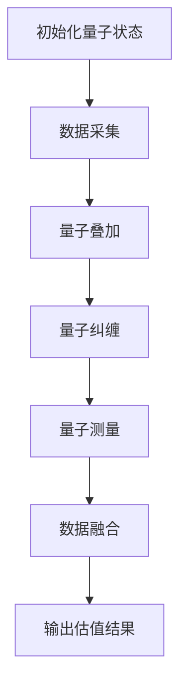
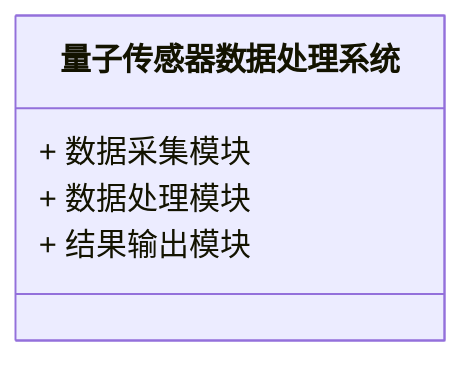
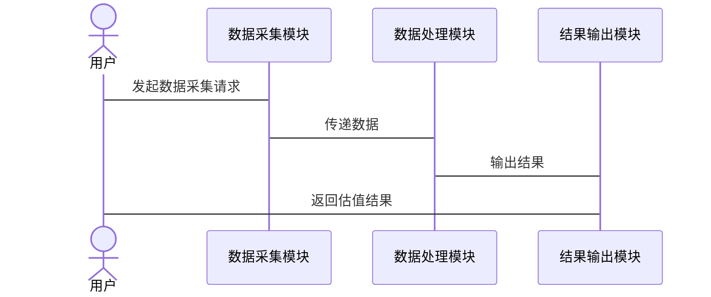

                 


# 企业估值中的量子传感器应用评估

> 关键词：量子传感器，企业估值，数据融合，算法原理，系统架构，项目实战

> 摘要：  
> 本文探讨了量子传感器在企业估值中的应用，从背景、原理、算法到系统架构设计，再到项目实战和最佳实践，全面分析量子传感器如何提升企业估值的准确性和效率。通过详细的技术分析和实际案例，展示了量子传感器在企业估值中的独特价值和未来潜力。

---

## 第一部分: 量子传感器与企业估值的背景介绍

### 第1章: 问题背景与定义

#### 1.1 问题背景
企业在现代经济中扮演着核心角色，其估值是投资决策、并购重组等商业活动的关键依据。传统的估值方法依赖于财务数据和市场分析，但这些方法存在以下局限性：
- 数据滞后性：传统财务数据通常基于历史表现，难以反映实时动态。
- 数据不完整性：市场环境复杂多变，传统数据难以捕捉全部影响因素。
- 风险评估不足：传统方法难以量化企业潜在的未知风险。

#### 1.2 量子传感器的定义与技术基础
量子传感器是一种基于量子力学原理设计的新型传感器，能够以超高的精度和灵敏度检测物理量（如磁场、振动、温度等），并将其转化为数字信号。其技术基础包括：
- 量子纠缠：量子系统中粒子之间的特殊关联，可用于增强传感器的灵敏度。
- 量子叠加：量子系统中粒子同时处于多个状态的能力，可用于提高数据处理的并行性。
- 量子测量：通过量子态的测量获取信息，具有更高的精度和更低的干扰。

#### 1.3 量子传感器与企业估值的联系
量子传感器可以通过实时监测企业的物理环境（如设备运行状态、市场波动等）提供动态数据，帮助企业在估值过程中：
- 提高数据的实时性。
- 捕捉传统方法难以发现的潜在风险。
- 优化估值模型的准确性。

---

## 第2章: 量子传感器的核心概念

### 2.1 核心概念的属性对比

| **概念**       | **传统传感器**               | **量子传感器**               |
|----------------|------------------------------|------------------------------|
| 灵敏度         | 有限，受经典物理限制         | 极高，基于量子效应             |
| 数据处理速度   | 较慢，依赖传统计算方法       | 极快，基于量子并行性           |
| 应用场景       | 有限，主要用于物理测量       | 广泛，包括企业估值、环境监测等 |

### 2.2 量子传感器与企业估值的ER实体关系图

```mermaid
er
actor(企业估值系统, "系统用户")
client(企业, "需要估值的企业")
quantum_sensor(量子传感器, "传感器设备")
valuation_algorithm(估值算法, "数据处理算法")
risk_assessment(风险评估, "风险分析模块")
assets(资产, "企业资产数据")
market_conditions(市场条件, "市场波动数据")
```

---

## 第3章: 量子传感器的原理与应用

### 3.1 量子传感器的基本原理

#### 3.1.1 量子力学基础
量子力学是量子传感器的核心理论基础，主要包括：
- **量子叠加**：一个量子系统可以同时处于多个状态。
- **量子纠缠**：两个或多个量子系统之间存在特殊关联，测量其中一个会立即影响另一个。
- **量子测量**：通过测量量子系统的状态获取信息。

#### 3.1.2 量子传感器的工作机制
量子传感器通过以下步骤实现数据采集和处理：
1. **量子态初始化**：将量子系统初始化为特定的量子态。
2. **量子态演化**：通过与被测物理量的相互作用，量子态发生演化。
3. **量子测量**：通过测量量子系统获取被测物理量的信息。
4. **数据处理**：对测量结果进行量子计算，提取有用的信息。

### 3.2 量子传感器在企业估值中的应用

#### 3.2.1 企业估值的关键指标与量子传感器的关联
企业估值的关键指标包括：
- **资产价值**：企业的资产质量直接影响其估值。
- **市场风险**：市场波动对企业估值的影响。
- **运营效率**：企业的运营效率影响其盈利能力。

量子传感器可以通过实时监测企业的设备运行状态、市场波动等信息，帮助企业更准确地评估上述关键指标。

---

## 第4章: 量子传感器数据的算法原理

### 4.1 数据融合算法

#### 4.1.1 数据融合的必要性
在企业估值中，通常需要融合多种数据源（如财务数据、市场数据、传感器数据等）以提高估值的准确性。

#### 4.1.2 量子增强数据融合算法
量子增强数据融合算法是一种基于量子计算的融合算法，其流程如下：



#### 4.1.3 算法的数学模型与公式推导
量子增强数据融合算法的数学模型如下：

$$
\psi = \sum_{i=1}^{n} a_i |i\rangle
$$

其中：
- $\psi$ 表示量子态。
- $a_i$ 表示第 $i$ 个基态的系数。
- $|i\rangle$ 表示第 $i$ 个基态。

通过测量量子态 $\psi$，可以得到被测物理量的信息。

---

## 第5章: 量子传感器数据处理的系统架构设计

### 5.1 系统分析与设计

#### 5.1.1 系统功能模块划分
量子传感器数据处理系统的功能模块包括：
- 数据采集模块：负责采集量子传感器数据。
- 数据处理模块：负责对采集的数据进行量子计算。
- 结果输出模块：输出最终的估值结果。

#### 5.1.2 系统架构的Mermaid类图



#### 5.1.3 系统接口设计与交互流程
系统的交互流程如下：



---

## 第6章: 项目实战与案例分析

### 6.1 项目环境安装与配置

#### 6.1.1 必要的Python库安装
需要安装以下Python库：
- `qiskit`：用于量子计算。
- `numpy`：用于数值计算。
- `scipy`：用于科学计算。

安装命令：
```bash
pip install qiskit numpy scipy
```

### 6.2 核心算法实现

#### 6.2.1 数据融合算法的Python代码实现
以下是量子增强数据融合算法的Python代码示例：

```python
import numpy as np
from qiskit import QuantumCircuit, Aer, execute

def quantum_fusion(data_points):
    # 初始化量子电路
    n = len(data_points)
    qc = QuantumCircuit(n)
    
    # 数据编码
    for i in range(n):
        angle = np.arctan2(data_points[i], 1)
        qc.ry(angle, i)
    
    # 量子叠加
    qc.h(range(n))
    
    # 量子测量
    qc.measure(range(n), range(n))
    
    # 仿真与获取结果
    backend = Aer.get_backend('qasm_simulator')
    result = execute(qc, backend).result()
    counts = result.get_counts(qc)
    
    return counts
```

#### 6.2.2 数据特征提取的代码示例
以下是数据特征提取的代码示例：

```python
from sklearn.decomposition import PCA

def extract_features(data):
    # 数据预处理
    data_matrix = np.array(data)
    # PCA降维
    pca = PCA(n_components=2)
    features = pca.fit_transform(data_matrix)
    return features
```

---

## 第7章: 最佳实践与总结

### 7.1 小结
通过本文的探讨，我们了解了量子传感器在企业估值中的巨大潜力。量子传感器的高灵敏度和实时性为企业估值提供了新的视角。

### 7.2 注意事项
在实际应用中，需要注意以下几点：
- 确保量子传感器的测量精度。
- 处理量子计算的复杂性。
- 保护量子数据的安全性。

### 7.3 拓展阅读
建议进一步阅读以下内容：
- 《量子计算与量子传感器原理》。
- 《企业估值的高级方法》。

---

## 作者

作者：AI天才研究院/AI Genius Institute & 禅与计算机程序设计艺术 /Zen And The Art of Computer Programming

---

# END

