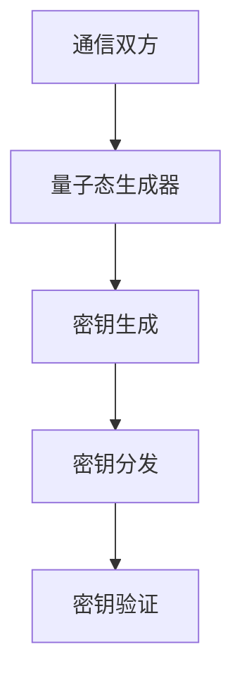
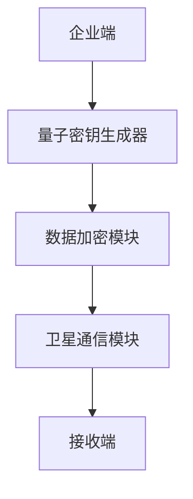
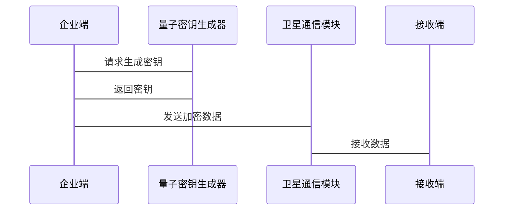

                 


# 《企业估值中的量子加密通信卫星系统评估》

> 关键词：量子加密通信，卫星系统，企业估值，数据安全，技术应用

> 摘要：本文探讨了量子加密通信技术在企业估值中的应用，特别是通过卫星通信系统进行评估的方法。文章从背景介绍、核心概念、算法原理、系统架构到项目实战，全面分析了量子加密通信卫星系统在企业估值中的重要性、实现过程和实际应用。

---

## 第一部分：量子加密通信卫星系统背景与基础

### 第1章：量子加密通信卫星系统概述

#### 1.1 量子加密通信卫星系统背景
企业估值是一个高度敏感的过程，涉及大量的财务和战略数据，这些数据的安全性至关重要。传统的加密技术虽然能够提供一定程度的安全保护，但随着计算能力的提升，其安全性逐渐受到挑战。量子加密通信技术作为一种不可破解的加密手段，为企业的数据安全提供了新的解决方案。量子加密通信卫星系统通过结合卫星通信的全球覆盖能力，能够在企业估值过程中实现高效、安全的数据传输。

#### 1.2 量子加密通信卫星系统的概念
量子加密通信卫星系统是一种结合了量子密钥分发（QKD）和卫星通信技术的系统。通过量子密钥分发，系统能够生成不可被破解的密钥，确保数据传输的安全性。卫星通信则为系统提供了全球覆盖的能力，使得企业在全球范围内的估值数据传输更加高效和可靠。

#### 1.3 量子加密通信的优势
量子加密通信技术的核心优势在于其不可破解的特性。与传统加密技术不同，量子密钥分发基于量子力学原理，任何对密钥的尝试性破解都会被检测到。此外，卫星通信的全球覆盖能力使得企业能够在任何地点进行估值数据的传输，不受地域限制。

---

## 第二部分：量子加密通信的核心概念与联系

### 第2章：量子加密通信原理

#### 2.1 量子密钥分发（QKD）原理
量子密钥分发是一种基于量子力学原理的加密技术。其基本原理是通过量子态的不可克隆性，确保只有合法的通信双方能够生成相同的密钥。以下是QKD的实现步骤：

1. **密钥生成**：通信双方使用量子态进行通信，生成随机的密钥。
2. **密钥分发**：通过经典通信渠道分发部分密钥信息。
3. **密钥验证**：通过比对分发的密钥信息，验证密钥的完整性。



#### 2.2 量子态与加密的关系
量子态是量子加密通信的核心要素。量子态的不可克隆性和不可预测性使得任何对量子态的测量都会破坏其状态，从而确保了密钥的安全性。

#### 2.3 量子加密与传统加密的对比
以下是量子加密与传统加密技术的对比表：

| 特性                | 量子加密         | 传统加密        |
|---------------------|------------------|-----------------|
| 加密安全性          | 不可被破解       | 可能被破解       |
| 密钥生成方式        | 基于量子态       | 基于算法        |
| 传输距离限制        | 无限制（通过卫星） | 受限            |

---

## 第三部分：量子加密通信卫星系统的架构与设计

### 第3章：系统架构设计

#### 3.1 系统功能模块设计
量子加密通信卫星系统主要包括以下几个功能模块：

1. **数据采集模块**：负责采集企业的估值数据。
2. **量子密钥生成模块**：通过量子态生成密钥。
3. **数据传输模块**：通过卫星通信传输加密数据。

#### 3.2 系统架构图
以下是量子加密通信卫星系统的架构图：



#### 3.3 接口设计与交互流程
量子加密通信卫星系统的接口设计如下：



---

## 第四部分：量子加密通信卫星系统在企业估值中的应用

### 第4章：项目实战

#### 4.1 环境安装
以下是量子加密通信卫星系统环境安装的步骤：

1. **量子密钥生成器安装**：安装量子密钥生成器硬件。
2. **卫星通信模块安装**：配置卫星通信模块。
3. **系统集成**：将各个模块集成到企业估值系统中。

#### 4.2 核心代码实现
以下是量子密钥生成的Python代码实现：

```python
import random
import math

def generate_quantum_key(length):
    key = []
    for _ in range(length):
        # 生成随机的量子态
        state = random.choice(['|0⟩', '|1⟩'])
        key.append(state)
    return ''.join(key)

# 生成10位的量子密钥
quantum_key = generate_quantum_key(10)
print(quantum_key)
```

#### 4.3 案例分析
以下是一个实际案例分析：

某企业在全球范围内进行估值，使用量子加密通信卫星系统进行数据传输。通过量子密钥生成器生成密钥，利用卫星通信模块传输数据，确保了估值数据的安全性。

---

## 第五部分：最佳实践与总结

### 第5章：最佳实践

#### 5.1 小结
量子加密通信卫星系统在企业估值中的应用，不仅提高了数据传输的安全性，还保证了企业在全球范围内的高效数据传输能力。

#### 5.2 注意事项
1. 量子密钥生成器的硬件配置需要符合标准。
2. 卫星通信模块的稳定性需要定期检查。
3. 系统的维护和更新需要及时进行。

#### 5.3 扩展阅读
1. 《量子密钥分发原理与应用》
2. 《卫星通信技术及其在企业中的应用》

---

## 作者信息

作者：AI天才研究院/AI Genius Institute & 禅与计算机程序设计艺术/Zen And The Art of Computer Programming

