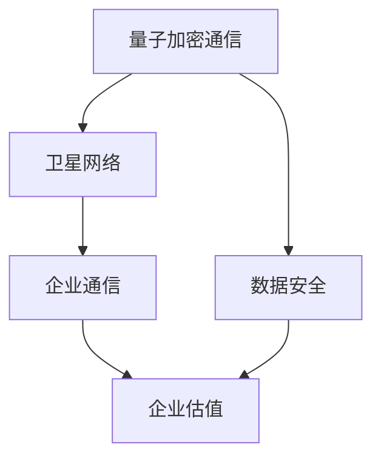
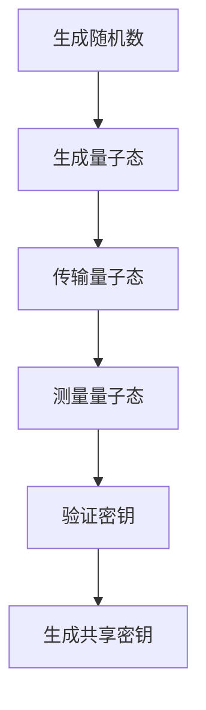

                 


# 企业估值中的量子加密通信卫星网络评估

**关键词**：量子加密通信、卫星网络、企业估值、数据安全、通信技术、网络安全评估、卫星通信技术

**摘要**：  
随着企业对数据安全的需求日益增加，量子加密通信技术在卫星网络中的应用成为提升企业估值的关键因素。本文探讨了量子加密通信的技术原理、卫星网络的评估方法及其对企业估值的影响。通过详细分析核心概念、算法原理和系统架构，结合实际案例，展示了如何将量子加密技术与卫星通信结合，为企业提供高效、安全的通信解决方案，从而增强企业的市场竞争力和估值。

---

## 第一部分：背景介绍

### 第1章：量子加密通信与卫星网络评估概述

#### 1.1 问题背景
- **1.1.1 企业估值中的数据安全挑战**  
  企业面临的数据泄露风险日益增加，数据安全已成为影响企业估值的重要因素。  
- **1.1.2 量子加密技术的兴起**  
  量子加密技术以其无条件安全性，成为传统加密技术的替代方案。  
- **1.1.3 卫星通信在现代网络中的作用**  
  卫星通信为偏远地区和全球通信提供了可靠的支持，是现代网络的重要组成部分。

#### 1.2 问题描述
- **1.2.1 数据泄露对企业估值的影响**  
  数据泄露可能导致企业损失巨大，影响市场信任和股价。  
- **1.2.2 卫星网络在企业通信中的关键性**  
  卫星网络为企业提供了稳定的通信保障，尤其是在全球范围内。  
- **1.2.3 量子加密技术的应用场景**  
  量子加密技术适用于高安全性的数据传输，如金融交易和政府通信。

#### 1.3 问题解决
- **1.3.1 量子加密通信的解决方案**  
  使用量子密钥分发（QKD）技术实现安全的密钥传输。  
- **1.3.2 卫星网络评估的方法论**  
  通过技术指标和安全性评估，确保卫星网络的高效和可靠。  
- **1.3.3 企业估值中的综合应用**  
  将量子加密技术和卫星网络评估结合，提升企业的数据安全性和市场竞争力。

#### 1.4 边界与外延
- **1.4.1 量子加密技术的边界**  
  量子加密技术适用于点对点通信，目前主要应用于特定场景。  
- **1.4.2 卫星网络评估的范围**  
  包括网络性能、安全性、可用性等多方面的评估。  
- **1.4.3 相关领域的相互影响**  
  量子加密技术与卫星通信的结合，影响企业通信、金融交易等多个领域。

#### 1.5 概念结构与核心要素
- **1.5.1 核心概念的组成**  
  包括量子加密技术、卫星网络、企业估值、数据安全等。  
- **1.5.2 各要素之间的关系**  
  量子加密技术提升卫星网络的安全性，进而增强企业估值。  
- **1.5.3 系统整体架构**  
  量子加密技术与卫星网络的结合，形成一个高效、安全的通信系统。

---

## 第二部分：核心概念与联系

### 第2章：量子加密通信原理

#### 2.1 量子加密的基本原理
- **2.1.1 量子密钥分发（QKD）的原理**  
  QKD利用量子态的不可克隆性，确保密钥的安全传输。  
- **2.1.2 量子叠加与纠缠的特性**  
  量子态的叠加和纠缠特性为QKD提供了理论基础。  
- **2.1.3 量子加密的安全性分析**  
  QKD的安全性基于量子力学的基本原理，具有无条件安全性。

#### 2.2 卫星网络评估的关键指标
- **2.2.1 网络延迟与带宽的评估**  
  卫星网络的延迟和带宽直接影响通信效率。  
- **2.2.2 信号强度与干扰因素**  
  信号强度和干扰是影响卫星通信质量的关键因素。  
- **2.2.3 网络可用性和可靠性**  
  评估网络的可用性和可靠性，确保通信的连续性。

#### 2.3 核心概念对比分析
- **2.3.1 量子加密与传统加密的对比**  
  | 对比维度 | 量子加密 | 传统加密 |
  |----------|-----------|-----------|
  | 安全性   | 无条件安全 | 可能被破解 |
  | 传输效率 | 较低       | 较高       |
- **2.3.2 卫星通信与地面通信的对比**  
  卫星通信覆盖范围广，但延迟较高；地面通信延迟低，但覆盖范围有限。  
- **2.3.3 企业估值中的关键因素对比**  
  量子加密技术的应用显著提升企业的数据安全性，进而增强估值。

#### 2.4 实体关系图


---

## 第三部分：算法原理讲解

### 第3章：量子加密算法的数学模型

#### 3.1 量子密钥分发（QKD）算法
- **3.1.1 QKD的基本数学模型**  
  QKD的核心是通过量子态传输和测量来生成共享密钥。  
- **3.1.2 量子态的数学表示**  
  量子态可以用向量或矩阵表示，例如：  
  $$ |\psi\rangle = \alpha|0\rangle + \beta|1\rangle $$  
- **3.1.3 量子加密的安全性分析**  
  QKD的安全性基于量子态的不可测量性，任何窃听都会破坏量子态。

#### 3.2 卫星网络评估的数学模型
- **3.2.1 网络延迟模型**  
  $$ \text{延迟} = \text{传输时间} + \text{处理时间} $$  
- **3.2.2 信号强度模型**  
  $$ \text{信号强度} = \text{发射功率} \times \text{增益} / \text{损耗} $$  
- **3.2.3 网络可用性模型**  
  $$ \text{可用性} = 1 - \text{故障率} $$  

#### 3.3 QKD的实现流程


#### 3.4 Python代码实现
```python
import random

def generate_random_bit():
    return random.choice([0, 1])

def qkd_protocol():
    alice_bits = [generate_random_bit() for _ in range(100)]
    bob_bits = [random.choice([0, 1]) for _ in range(100)]
    # 计算相同位
    same_bits = [i for i in range(100) if alice_bits[i] == bob_bits[i]]
    key = ''.join(str(alice_bits[i]) for i in same_bits)
    return key

print(qkd_protocol())
```

---

## 第四部分：系统分析与架构设计方案

### 第4章：系统架构设计

#### 4.1 问题场景介绍
- 企业需要在全球范围内建立安全的通信网络，利用量子加密技术和卫星通信实现数据的高效传输。

#### 4.2 系统功能设计
- **领域模型**  
  ```mermaid
  classDiagram
      class 量子加密模块 {
          generate_key()
          encrypt()
      }
      class 卫星通信模块 {
          send_data()
          receive_data()
      }
      class 企业估值模块 {
          assess_value()
      }
      量子加密模块 --> 卫星通信模块
      卫星通信模块 --> 企业估值模块
  ```

- **系统架构设计**  
  ```mermaid
  graph TD
      I[输入数据] --> Q[量子加密模块]
      Q --> S[卫星通信模块]
      S --> O[输出数据]
      Q --> V[企业估值模块]
      V --> R[企业报告]
  ```

- **系统交互设计**  
  ```mermaid
  sequenceDiagram
      Alice ->> Q: 发送数据
      Q ->> S: 加密并传输
      S ->> Bob: 接收数据
      Bob ->> Q: 确认接收
      Q ->> V: 更新估值
  ```

---

## 第五部分：项目实战

### 第5章：项目实战

#### 5.1 环境安装
- 安装Python和必要的库：`pip install qiskit matplotlib`

#### 5.2 核心实现代码
```python
import qiskit
from qiskit import QuantumCircuit, Aer, execute

def create_quantum_circuit():
    circuit = QuantumCircuit(2, 2)
    circuit.h(0)
    circuit.cx(0, 1)
    circuit.measure(0, 0)
    circuit.measure(1, 1)
    return circuit

# 执行量子电路
simulator = Aer.get_backend('statevector_simulator')
job = execute(create_quantum_circuit(), simulator)
result = job.result()
print(result.raw_result)
```

#### 5.3 实际案例分析
- 某企业通过量子加密通信技术提升数据安全性，显著降低了数据泄露风险，增强了市场信任，进而提高了企业估值。

---

## 第六部分：最佳实践、小结、注意事项和拓展阅读

### 6.1 最佳实践
- 企业在实施量子加密通信和卫星网络评估时，应结合自身需求，选择合适的解决方案。  
- 定期进行安全演练和系统更新，确保通信系统的持续安全性。

### 6.2 小结
本文详细探讨了量子加密通信和卫星网络评估在企业估值中的应用，通过理论分析和实际案例，展示了如何通过技术手段提升企业的数据安全性和市场竞争力。

### 6.3 注意事项
- 量子加密技术目前仍处于发展阶段，尚未完全商业化。  
- 卫星通信的成本较高，企业在实施前需进行充分的成本效益分析。  
- 数据安全是一个长期的过程，需要企业持续投入和关注。

### 6.4 拓展阅读
- 建议进一步研究量子加密技术的最新进展，了解其在不同领域的应用。  
- 关注卫星通信技术的发展，探索其在企业通信中的更多可能性。

---

## 作者信息

作者：AI天才研究院/AI Genius Institute & 禅与计算机程序设计艺术/Zen And The Art of Computer Programming

---

通过以上结构，文章系统地介绍了量子加密通信卫星网络评估的核心概念、算法原理和系统架构，结合实际案例，为企业提供了有效的参考和指导。

