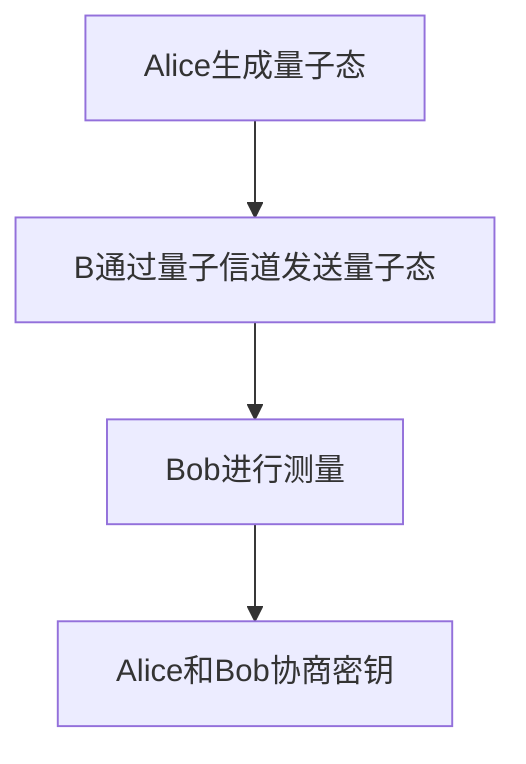
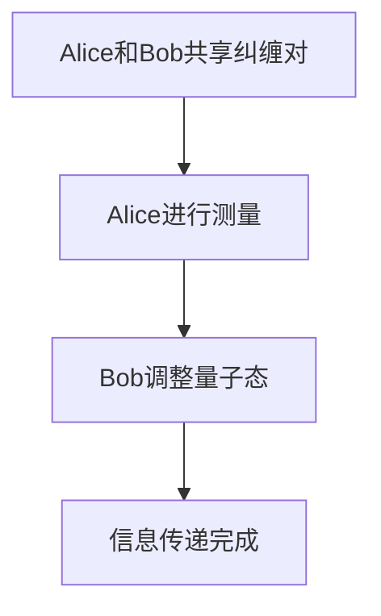
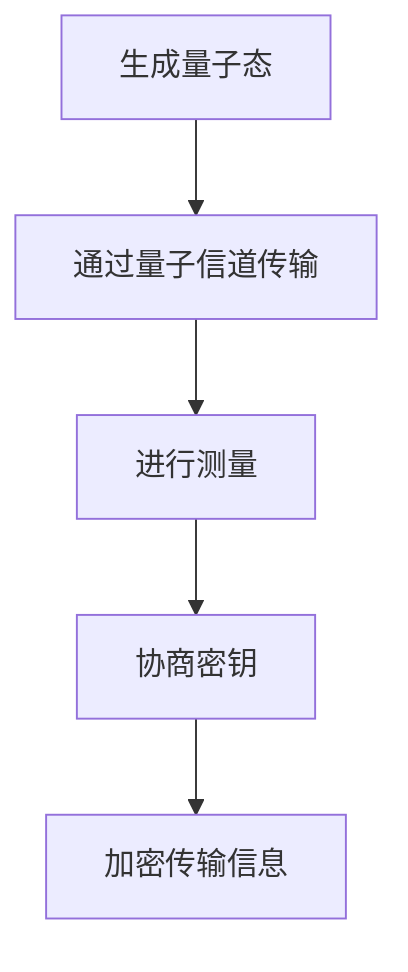
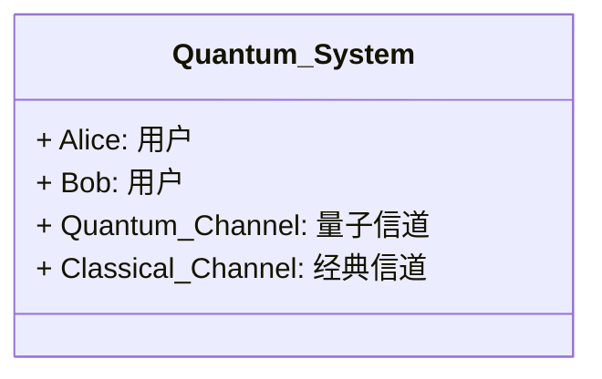
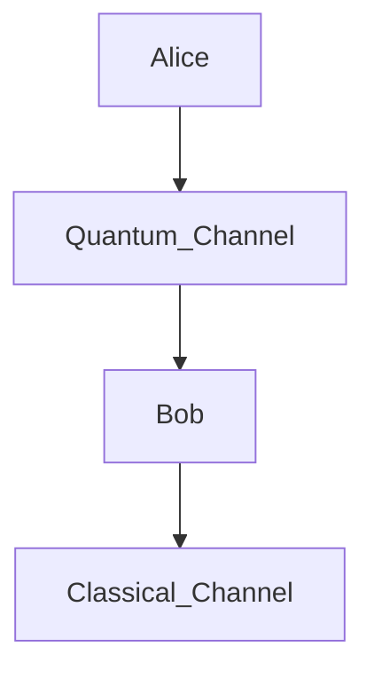
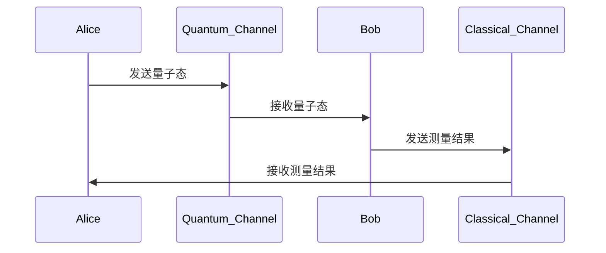

                 


# 企业估值中的量子加密通信网络系统评估

> 关键词：量子加密通信，企业估值，网络安全，量子密钥分发，量子隐形传态

> 摘要：随着量子技术的快速发展，量子加密通信网络系统在企业估值中的应用越来越重要。本文从量子加密通信的基本原理出发，分析其在企业安全中的作用，并结合实际案例，探讨如何通过量子加密通信网络系统评估来提升企业估值。

---

# 第一部分: 量子加密通信网络系统评估背景与基础

# 第1章: 量子加密通信网络系统概述

## 1.1 量子通信的基本概念

### 1.1.1 量子通信的定义
量子通信是一种利用量子力学原理进行信息传递的技术。它包括量子密钥分发（QKD）和量子隐形传态等核心技术，能够在理论上实现绝对安全的通信。

### 1.1.2 量子通信的核心技术
- **量子密钥分发（QKD）**：通过量子态传输密钥，确保密钥的分发过程不可被窃听。
- **量子隐形传态**：利用量子纠缠技术，将信息从一个地点瞬间传送到另一个地点。

### 1.1.3 量子通信与经典通信的区别
| 特性         | 量子通信                | 经典通信                |
|--------------|-------------------------|-------------------------|
| 安全性       | 理论上绝对安全           | 易受窃听和攻击           |
| 传输速度     | 受限于物理条件          | 不受限于物理条件          |
| 应用场景     | 高安全性需求场景         | 通用场景                |

## 1.2 量子加密通信的原理

### 1.2.1 量子密钥分发（QKD）的原理
QKD的核心在于利用量子态的不可克隆性，确保密钥的安全传输。Alice和Bob通过共享量子态来生成密钥，任何窃听都会破坏量子态，从而被发现。

### 1.2.2 量子隐形传态的概念
量子隐形传态是利用量子纠缠技术，将信息从一个地点瞬间传送到另一个地点，而不需要物理传输介质。

### 1.2.3 量子加密通信的安全性分析
量子加密通信的安全性基于量子力学的不确定性原理，任何窃听都会破坏量子态，从而确保通信的安全性。

## 1.3 量子加密通信在企业估值中的应用

### 1.3.1 企业估值的基本概念
企业估值是通过对企业的财务状况、市场地位、技术优势等多方面进行评估，确定企业的价值。

### 1.3.2 量子加密通信对企业安全的影响
量子加密通信能够提升企业的安全性，减少数据泄露的风险，从而提升企业的市场价值。

### 1.3.3 量子加密通信在企业估值中的具体应用
- 提升企业的核心竞争力
- 降低企业的安全风险
- 提高企业的市场估值

## 1.4 本章小结
本章介绍了量子通信的基本概念和原理，并分析了其在企业估值中的应用。通过量子加密通信，企业能够提升其安全性和市场竞争力，从而实现更高的估值。

---

# 第2章: 量子加密通信网络系统的核心概念与联系

## 2.1 核心概念原理

### 2.1.1 量子密钥分发（QKD）的数学模型
量子密钥分发的数学模型基于量子态的测量和纠缠原理。通过数学模型可以分析QKD的实现过程和安全性。

### 2.1.2 量子隐形传态的实现过程
量子隐形传态的实现过程涉及量子纠缠和测量技术，能够在不传输物理介质的情况下完成信息的传递。

### 2.1.3 量子加密通信的协议分析
量子加密通信的协议包括密钥生成、密钥分发和加密传输等步骤，确保通信的绝对安全。

## 2.2 核心概念属性对比

### 2.2.1 传统加密与量子加密的对比分析
| 特性         | 传统加密                | 量子加密                |
|--------------|-------------------------|-------------------------|
| 安全性       | 易受攻击                | 理论上绝对安全           |
| 计算复杂度   | 较低                    | 较高                    |
| 应用场景     | 通用场景                | 高安全性需求场景         |

### 2.2.2 量子加密通信的安全性对比
量子加密通信的安全性基于量子力学的不确定性原理，而传统加密的安全性依赖于计算复杂度。

### 2.2.3 量子加密通信的性能对比
量子加密通信在安全性上优于传统加密，但在传输速度和实现复杂度上存在一定的劣势。

## 2.3 ER实体关系图架构

### 2.3.1 实体关系图的定义
ER实体关系图用于描述系统中的实体及其关系，帮助理解系统的结构和功能。

### 2.3.2 量子加密通信系统中的实体关系
在量子加密通信系统中，主要实体包括Alice、Bob、量子信道、经典信道和窃听者Eve。

### 2.3.3 实体关系图的绘制
```mermaid
er
actor Alice
actor Bob
actor Eve
database Quantum_Channel
database Classical_Channel
```

---

# 第3章: 量子加密通信网络系统的算法原理

## 3.1 算法原理讲解

### 3.1.1 量子密钥分发（QKD）的实现流程
1. Alice生成随机的量子态。
2. Alice通过量子信道将量子态发送给Bob。
3. Bob对量子态进行测量。
4. Alice和Bob通过经典信道协商生成密钥。

### 3.1.2 量子隐形传态的实现步骤
1. Alice和Bob共享一个量子纠缠对。
2. Alice对她的部分进行测量。
3. Bob根据Alice的测量结果调整自己的量子态，完成信息的传递。

### 3.1.3 量子加密通信协议的实现细节
量子加密通信协议包括密钥生成、密钥分发和加密传输三个主要步骤。

## 3.2 算法流程图

### 3.2.1 量子密钥分发（QKD）流程图


### 3.2.2 量子隐形传态流程图


### 3.2.3 量子加密通信协议流程图


## 3.3 算法实现代码

### 3.3.1 量子密钥分发（QKD）的Python实现
```python
import random

def generate_key():
    key = random.randint(0, 2**10 - 1)
    return key

def send_quantum_state():
    pass

def measure_quantum_state():
    pass

def协商密钥():
    pass

# 示例代码
alice_key = generate_key()
print(f"Alice生成的密钥：{alice_key}")
```

### 3.3.2 量子隐形传态的Python实现
```python
import random

def generate_quantum_state():
    state = random.randint(0, 3)
    return state

def entangle_states():
    pass

def measure_state():
    pass

def adjust_state():
    pass

# 示例代码
alice_state = generate_quantum_state()
print(f"Alice的量子态：{alice_state}")
```

## 3.4 算法的数学模型

### 3.4.1 量子密钥分发的数学模型
量子密钥分发的数学模型基于量子态的测量和纠缠原理，可以通过概率论进行分析。

### 3.4.2 量子隐形传态的数学模型
量子隐形传态的数学模型基于量子纠缠和测量的数学表达，可以通过量子力学方程进行描述。

### 3.4.3 算法的数学公式
- 量子密钥分发的概率公式：$$P = \frac{1}{2} (1 - \cos^2(\theta))$$
- 量子隐形传态的纠缠公式：$$|\psi\rangle = \alpha|0\rangle + \beta|1\rangle$$

---

# 第4章: 量子加密通信网络系统的系统分析与架构设计

## 4.1 系统分析

### 4.1.1 问题场景介绍
在企业估值中，量子加密通信网络系统的安全性和稳定性是关键因素。

### 4.1.2 项目介绍
本项目旨在通过量子加密通信技术，提升企业的安全性，从而提升企业的市场估值。

## 4.2 系统功能设计

### 4.2.1 领域模型类图


### 4.2.2 系统架构设计


## 4.3 系统接口设计

### 4.3.1 系统接口
- 量子信道接口
- 经典信道接口
- 密钥管理接口

### 4.3.2 系统交互


---

# 第5章: 量子加密通信网络系统的项目实战

## 5.1 项目实战

### 5.1.1 环境搭建
安装必要的量子通信开发库和工具。

### 5.1.2 核心代码实现
```python
import random

def generate_quantum_key():
    key = random.randint(0, 2**10 - 1)
    return key

def send_quantum_state():
    pass

def measure_quantum_state():
    pass

# 示例代码
alice_key = generate_quantum_key()
print(f"Alice生成的密钥：{alice_key}")
```

### 5.1.3 代码解读与分析
解释代码的实现过程和功能。

### 5.1.4 实际案例分析
分析一个实际的企业案例，说明量子加密通信网络系统如何提升企业估值。

## 5.2 项目小结
通过项目实战，我们能够更好地理解量子加密通信网络系统的实现过程和应用价值。

---

# 第6章: 量子加密通信网络系统的最佳实践

## 6.1 最佳实践

### 6.1.1 实践技巧
- 确保量子通信设备的稳定性
- 定期更新密钥
- 加强人员培训

### 6.1.2 注意事项
- 避免过度依赖量子通信技术
- 注意量子通信的实现成本
- 加强与相关研究机构的合作

## 6.2 拓展阅读
推荐一些量子通信相关的书籍和论文，供读者进一步学习。

---

# 作者：AI天才研究院/AI Genius Institute & 禅与计算机程序设计艺术 /Zen And The Art of Computer Programming

