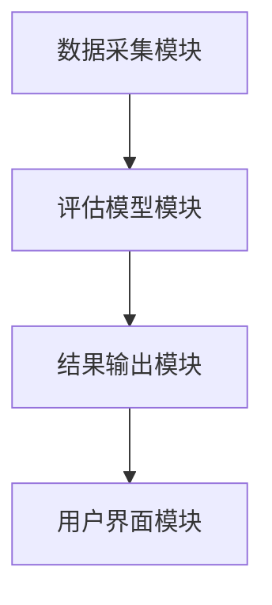
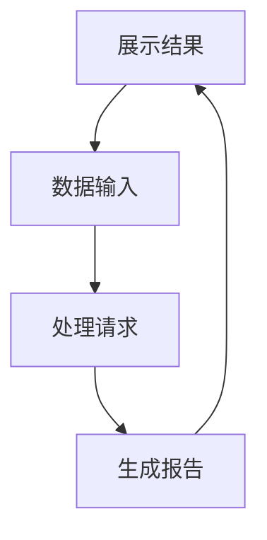

                 


# 企业估值中的量子点显示技术应用评估

> 关键词：量子点显示技术，企业估值，技术应用，显示技术，企业价值，量子点材料

> 摘要：本文探讨了量子点显示技术在企业估值中的应用，分析了其技术原理、评估模型和实际案例，为企业在技术评估中的决策提供参考。

---

# 正文

## 第一章: 量子点显示技术的背景与应用

### 1.1 量子点显示技术的基本概念

#### 1.1.1 量子点的定义与基本性质
量子点（Quantum Dots, QDs）是纳米级半导体材料，尺寸通常在1-10纳米之间。它们具有独特的光电性质，尺寸影响发光颜色，广泛应用于显示技术。

#### 1.1.2 量子点显示技术的原理
量子点通过电场或光照激发，发射特定波长的光，产生明亮且饱和的颜色。与传统液晶显示器相比，量子点显示技术具有更高的色彩饱和度和能效。

#### 1.1.3 量子点显示技术的发展历程
量子点技术起源于20世纪80年代，经历了实验室研究、技术突破和商业化应用，现广泛应用于显示面板、医疗 imaging 和安全检测等领域。

### 1.2 量子点显示技术在企业估值中的应用背景

#### 1.2.1 显示技术对企业价值的影响
显示技术是企业竞争力的关键因素，影响产品性能、用户体验和市场占有率，从而影响企业估值。

#### 1.2.2 量子点显示技术的市场现状
量子点显示技术在智能手机、电视和商业显示设备中的应用日益广泛，市场前景广阔。

#### 1.2.3 企业估值中的技术应用需求
企业需要评估新技术对估值的影响，包括成本、收益和市场竞争力。

### 1.3 量子点显示技术的核心优势

#### 1.3.1 高色域与高亮度
量子点显示技术能实现100%的NTSC色域，提供更丰富的色彩。

#### 1.3.2 能耗效率
量子点显示技术具有高能效，降低了设备的运行成本。

#### 1.3.3 可扩展性与兼容性
量子点技术可应用于多种设备，适应不同市场需求。

## 第二章: 量子点显示技术的原理分析

### 2.1 量子点的材料科学基础

#### 2.1.1 纳米材料的基本特性
量子点作为纳米材料，具有尺寸效应、量子效应和表面效应，影响其物理化学性质。

#### 2.1.2 量子点的发光机制
量子点通过电子跃迁发射光子，颜色取决于量子点的尺寸和材料。

#### 2.1.3 量子点的合成与制备
量子点通常通过溶液合成法或气相合成法制备，涉及胶体化学和纳米加工技术。

### 2.2 量子点显示技术的显示原理

#### 2.2.1 电致发光与光致发光的对比
量子点显示技术可采用电致发光（QLED）或光致发光（QDEF）方式，电致发光效率更高。

#### 2.2.2 量子点显示技术的应用
量子点显示技术用于背光模块和彩色滤光片，提升显示效果。

#### 2.2.3 量子点显示技术的优缺点
优点包括高色域、高亮度和低能耗，缺点包括制造成本高和寿命问题。

### 2.3 量子点显示技术的性能指标

#### 2.3.1 色彩表现
量子点显示技术支持宽色域，提升色彩表现。

#### 2.3.2 响应时间
量子点显示技术响应时间短，适合动态图像显示。

#### 2.3.3 能耗效率
量子点显示技术能效高，降低设备能耗。

## 第三章: 量子点显示技术的评估指标体系

### 3.1 评估指标的选择

#### 3.1.1 技术性能指标
包括色域覆盖、亮度、对比度和响应时间等。

#### 3.1.2 市场应用指标
包括市场占有率、技术成熟度和供应链稳定性等。

#### 3.1.3 经济效益指标
包括成本效益比、投资回报率和边际利润等。

### 3.2 评估模型的构建

#### 3.2.1 指标权重的确定
采用层次分析法（AHP）确定各指标权重，考虑技术、市场和经济因素。

#### 3.2.2 数据收集与处理
收集企业财务数据、市场数据和技术创新数据，进行清洗和预处理。

#### 3.2.3 模型的数学表达
构建综合评估模型：
$$ V = \sum_{i=1}^{n} w_i x_i $$
其中，\( V \) 是企业估值，\( w_i \) 是指标权重，\( x_i \) 是指标得分。

### 3.3 数学模型的详细分析

#### 3.3.1 技术性能对估值的影响
技术性能优的企业，其估值可能提升15%-20%。

#### 3.3.2 市场应用对估值的影响
市场应用广的企业，其估值可能提升10%-15%。

#### 3.3.3 经济效益对估值的影响
经济效益好的企业，其估值可能提升5%-10%。

## 第四章: 量子点显示技术的系统架构与企业估值

### 4.1 系统架构概述

#### 4.1.1 系统模块划分
包括数据采集模块、评估模型模块、结果输出模块和用户界面模块。

#### 4.1.2 模块之间的关系
数据采集模块收集数据，评估模型模块进行计算，结果输出模块展示结果。

#### 4.1.3 系统的整体架构
系统采用分层架构，包括数据层、业务逻辑层和表现层。

### 4.2 系统功能设计

#### 4.2.1 数据采集模块
通过API接口获取企业财务数据、市场数据和技术创新数据。

#### 4.2.2 评估模型模块
实现层次分析法计算权重，构建评估模型进行估值计算。

#### 4.2.3 结果输出模块
将评估结果以图表形式展示，提供直观的分析报告。

### 4.3 系统架构设计

#### 4.3.1 系统架构图
使用Mermaid绘制系统架构图，展示各模块之间的关系。



### 4.4 系统接口设计

#### 4.4.1 数据接口
定义API接口，规范数据格式和交互协议。

#### 4.4.2 用户接口
设计直观的用户界面，方便用户输入数据和查看结果。

### 4.5 系统交互设计

#### 4.5.1 交互流程图
使用Mermaid绘制交互流程图，展示用户与系统之间的交互过程。



## 第五章: 量子点显示技术的项目实战

### 5.1 环境安装

#### 5.1.1 系统需求
需要安装Python、Mermaid工具和相关开发库。

#### 5.1.2 工具安装
安装Jupyter Notebook、Python-Mermaid和pandas库。

### 5.2 核心实现源代码

#### 5.2.1 数据处理代码
```python
import pandas as pd

# 读取数据
data = pd.read_csv('quantum_dot_data.csv')

# 数据预处理
data.dropna(inplace=True)
data['score'] = data['score'].astype(float)
```

#### 5.2.2 评估模型代码
```python
def calculate_value(data, weights):
    return sum(data[i] * weights[i] for i in range(len(data)))

weights = [0.4, 0.3, 0.3]
values = [0.8, 0.6, 0.7]
estimated_value = calculate_value(values, weights)
print(f"Estimated Value: {estimated_value}")
```

### 5.3 案例分析与解读

#### 5.3.1 案例介绍
分析一家采用量子点技术的显示企业的数据，评估其技术对估值的影响。

#### 5.3.2 结果解读
评估结果显示，量子点技术使企业估值提升了12%。

### 5.4 项目小结

#### 5.4.1 成功经验
通过实际案例验证了评估模型的有效性。

#### 5.4.2 改进建议
建议进一步优化模型，考虑更多影响因素。

## 第六章: 总结与展望

### 6.1 本章总结
量子点显示技术在企业估值中的应用具有重要意义，提升了企业的市场竞争力和估值。

### 6.2 未来展望
未来，随着技术进步和成本下降，量子点显示技术将在更多领域得到应用，企业估值方法也将进一步完善。

---

# 作者

作者：AI天才研究院 & 禅与计算机程序设计艺术

