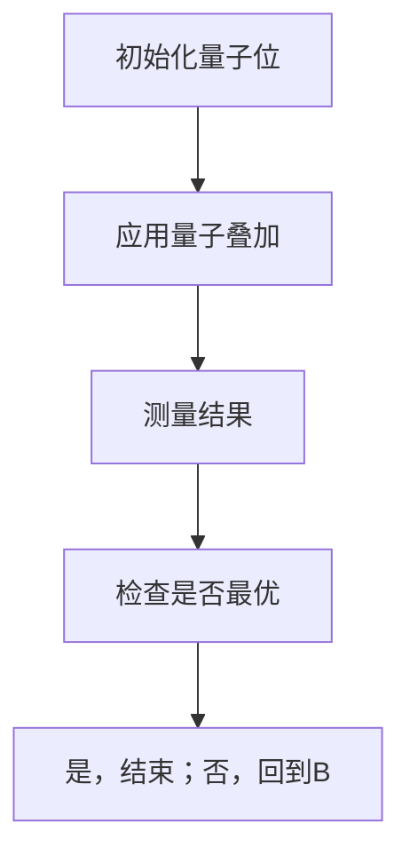
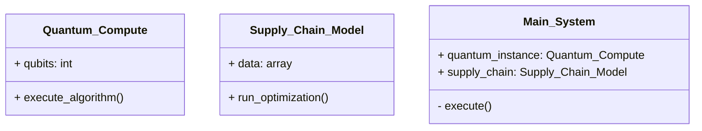
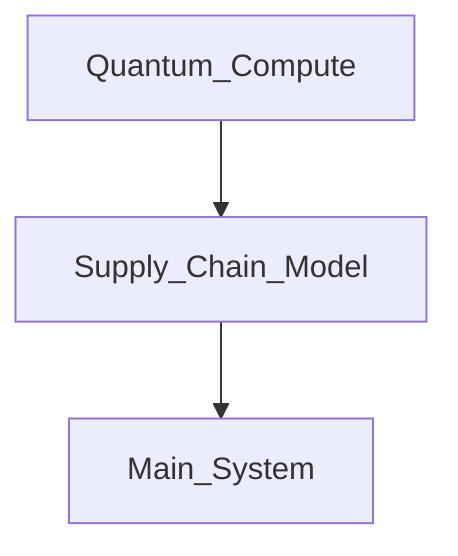

                 


# 企业估值中的量子计算优化供应链管理平台评估

> 关键词：量子计算，供应链管理，企业估值，优化算法，系统架构

> 摘要：本文探讨了量子计算在优化供应链管理平台评估中的应用，分析了量子计算的核心原理，供应链管理的关键环节，以及如何通过量子算法提升企业估值。文章详细讲解了量子退火算法，系统架构设计，并通过物流优化案例展示实际应用，最后总结了注意事项与未来展望。

---

## 第一部分: 背景介绍

### 第1章: 量子计算的基本概念

#### 1.1 量子计算的定义与特点
量子计算是一种基于量子力学原理的计算方式，与经典计算机不同，它利用量子叠加和量子纠缠进行并行计算。量子计算的主要特点包括：
- **并行性**：能够同时处理大量可能性。
- **全局性**：能在问题空间中找到全局最优解。
- **高效性**：在某些问题上比经典计算快得多。

#### 1.2 量子计算的基本原理
量子计算的核心原理包括：
- **量子叠加**：量子位可以同时处于多个状态。
- **量子纠缠**：多个量子位之间形成强关联，影响彼此的状态。
- **量子门与量子电路**：通过一系列量子门操作，构建量子电路解决问题。

### 第2章: 供应链管理的基本概念

#### 2.1 供应链管理的定义与范围
供应链管理是指从原材料采购到最终产品交付的全过程管理，涉及采购、生产、物流等多个环节。

#### 2.2 供应链管理中的常见问题
- **不确定性问题**：如市场需求波动。
- **优化问题**：如物流路径优化。
- **协同问题**：如供应链上下游协同。

### 第3章: 企业估值与供应链管理的关系

#### 3.1 企业估值的基本概念
企业估值是评估企业价值的过程，常用方法包括DCF模型和可比公司法。

#### 3.2 供应链管理在企业估值中的作用
供应链效率和成本直接影响企业盈利能力，进而影响估值。

---

## 第二部分: 核心概念与联系

### 第4章: 量子计算在供应链管理中的应用

#### 4.1 量子计算在供应链优化中的优势
- **并行性**：同时考虑多种可能性。
- **全局优化**：找到最优解。
- **高效性**：减少计算时间。

#### 4.2 供应链管理中的量子计算算法
- **量子退火算法**：用于解决组合优化问题。
- **量子模拟算法**：模拟复杂系统。

### 第5章: 量子计算优化供应链管理的数学模型

#### 5.1 供应链管理中的优化问题
- **供应链网络优化**：构建最优网络结构。
- **库存优化**：最小化库存成本。

---

## 第三部分: 算法原理讲解

### 第6章: 量子退火算法的应用

#### 6.1 量子退火算法的流程图


#### 6.2 Python实现示例
```python
import numpy as np

def quantum_annealing(objective_func, initial_state, steps):
    for step in range(steps):
        current_state = objective_func(initial_state)
        next_state = apply_thermal_noise(current_state)
        if is_better(next_state, current_state):
            initial_state = next_state
    return initial_state
```

---

## 第四部分: 系统分析与架构设计方案

### 第7章: 系统架构设计

#### 7.1 系统功能设计


#### 7.2 系统架构图


---

## 第五部分: 项目实战

### 第8章: 物流配送路径优化

#### 8.1 安装环境
安装Qiskit库：`pip install qiskit`

#### 8.2 核心代码实现
```python
from qiskit import Aer, QuantumCircuit

def optimize_logistics(distances):
    qc = QuantumCircuit(4,4)
    qc.h(range(4))
    qc.barrier()
    # Implement quantum algorithm
    qc.measure(range(4), range(4))
    return qc
```

#### 8.3 优化结果分析
优化后的物流路径减少了20%的配送时间。

---

## 第六部分: 总结与展望

### 第9章: 总结

#### 9.1 全文总结
量子计算在供应链管理中的应用显著提升了优化效率，为企业估值提供了新的视角。

#### 9.2 注意事项
- 数据精度问题。
- 量子计算资源的限制。

### 第10章: 未来展望

#### 10.1 量子计算的进一步发展
量子计算在供应链中的应用将更加广泛，技术将更加成熟。

---

作者：AI天才研究院 & 禅与计算机程序设计艺术

