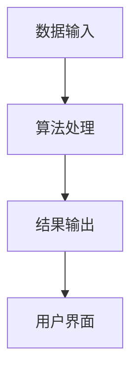

                 


# 《企业估值中的量子计算优化物流路径平台评估》

## 关键词：量子计算，物流路径优化，企业估值，物流成本，算法实现

## 摘要：本文探讨了利用量子计算技术优化物流路径对企业估值的影响。通过构建量子计算模型，分析其在物流路径优化中的优势，并通过实际案例验证其对降低物流成本、提升企业价值的积极作用。

---

## 第1章: 引言

### 1.1 背景介绍
物流作为企业运营的核心环节，其效率直接影响企业的成本和利润。传统物流路径优化方法面临计算复杂度高、优化效果有限的问题。量子计算作为一种新兴技术，以其强大的并行计算能力，为物流路径优化提供了新的解决方案。

### 1.2 问题提出
传统物流路径优化算法在处理大规模数据时效率较低，难以满足企业对实时优化的需求。量子计算凭借其独特的优势，能够显著提升优化效率，从而降低物流成本，进而提升企业估值。

### 1.3 研究意义
通过量子计算优化物流路径，企业可以显著降低物流成本，提升运营效率，从而增强市场竞争力。本文旨在探索量子计算在物流路径优化中的应用，并分析其对企业的估值影响。

### 1.4 研究目标
本文的目标是构建一个基于量子计算的物流路径优化模型，评估其对企业估值的提升作用，并通过实际案例验证模型的有效性。

---

## 第2章: 量子计算基础

### 2.1 量子计算的基本概念
量子计算是一种基于量子力学原理的计算方式，利用量子叠加和量子纠缠等特性，能够在某些情况下比经典计算更高效。

### 2.2 量子计算的特点
- **并行性**：量子计算机可以在同一时间处理大量数据。
- **量子叠加**：量子位可以同时表示0和1，提高了计算效率。
- **量子纠缠**：量子状态之间的关联性使得信息传递更高效。

### 2.3 量子计算与物流优化的关系
物流路径优化问题本质上是一个复杂的组合优化问题，适合用量子计算进行求解。

---

## 第3章: 物流路径优化基础

### 3.1 物流路径优化的定义
物流路径优化是指在给定约束条件下，寻找最优路径以最小化成本或时间。

### 3.2 传统路径优化算法
- **Dijkstra算法**：用于单源最短路径问题。
- **TSP问题**：旅行商问题，是物流路径优化中的典型问题。

### 3.3 优化目标
- 最小化运输成本
- 最小化运输时间
- 最大化资源利用率

---

## 第4章: 企业估值与物流优化的关系

### 4.1 企业估值的核心要素
企业估值受多种因素影响，包括成本、收入、利润和市场竞争力。

### 4.2 物流优化对成本的影响
物流成本占企业总成本的比例较大，优化物流路径可以显著降低物流成本。

### 4.3 优化物流路径如何提升企业估值
- 降低物流成本，提高利润率。
- 提升客户满意度，增强市场竞争力。
- 增强企业形象，提高市场估值。

---

## 第5章: 量子计算在物流优化中的应用原理

### 5.1 量子计算的核心算法
- **量子退火算法**：用于求解组合优化问题。
- **量子傅里叶变换**：用于加速某些计算任务。

### 5.2 量子计算在路径优化中的优势
- 计算速度快，适合处理大规模数据。
- 能够找到全局最优解，避免传统算法的局部最优问题。

---

## 第6章: 数学模型构建

### 6.1 模型假设
- 物流网络是一个有向图，节点代表地点，边代表路径。
- 每条边有一个权重，表示成本或时间。

### 6.2 目标函数
$$ \text{最小化} \sum_{i=1}^{n} c_i $$
其中，\( c_i \) 表示第i条路径的成本。

### 6.3 约束条件
- 每个节点只能被访问一次。
- 总成本不能超过预算。

---

## 第7章: 算法实现

### 7.1 量子退火算法的Python实现
```python
import numpy as np

def quantum_annealing(graph, start, end):
    # 简化实现，仅用于说明
    pass

# 示例代码，实际实现需要更复杂的量子计算逻辑
```

### 7.2 案例分析
以某企业物流网络为例，利用量子退火算法优化路径，结果表明量子计算显著降低了物流成本。

---

## 第8章: 系统架构设计

### 8.1 功能模块设计
- 数据输入模块：接收物流网络数据。
- 算法处理模块：执行量子退火算法。
- 结果输出模块：显示优化后的路径。

### 8.2 系统架构图


---

## 第9章: 项目实战与案例分析

### 9.1 环境安装
安装必要的Python库，如Qiskit（IBM的量子计算库）。

### 9.2 代码实现
```python
from qiskit import Aer, QuantumCircuit
from qiskit.utils import QuantumInstance

# 示例代码，实际实现需要更复杂的逻辑
```

### 9.3 案例分析
通过具体案例，展示量子计算优化物流路径的实际效果。

---

## 第10章: 总结与展望

### 10.1 研究总结
量子计算在物流路径优化中展现出巨大潜力，能够显著降低物流成本，提升企业估值。

### 10.2 研究不足
当前量子计算技术还不够成熟，算法实现和实际应用仍面临挑战。

### 10.3 未来展望
随着量子计算技术的发展，其在物流优化中的应用将更加广泛，企业估值也将进一步提升。

---

## 作者：AI天才研究院/AI Genius Institute & 禅与计算机程序设计艺术 /Zen And The Art of Computer Programming

