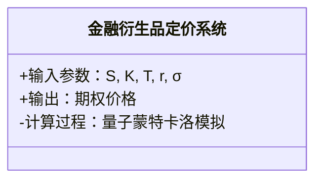

                 


# 企业估值中的量子计算金融衍生品定价评估

## 关键词：量子计算，金融衍生品定价，企业估值，期权定价，量子算法

## 摘要：本文探讨了量子计算在金融衍生品定价中的应用，特别是在企业估值中的潜在优势。通过分析传统金融衍生品定价方法的局限性，结合量子计算的基本原理，阐述了量子蒙特卡洛模拟和量子优化算法在金融建模中的应用。本文还提供了详细的数学模型和系统架构设计，以及实际项目案例分析，展示了如何利用量子计算提升金融衍生品定价的准确性和效率。

---

# 第1章: 量子计算与金融衍生品定价的背景

## 1.1 量子计算的基本概念

### 1.1.1 量子计算的定义

量子计算是一种利用量子力学原理进行计算的新型计算方式。与传统计算机使用的二进制位（bit）不同，量子计算机使用量子位（qubit）来进行计算。量子位可以同时处于0和1的叠加态，这种特性使得量子计算机在某些特定问题上具有远超经典计算机的计算能力。

$$
|\psi\rangle = \alpha|0\rangle + \beta|1\rangle
$$

其中，$\alpha$ 和 $\beta$ 是概率幅，满足 $|\alpha|^2 + |\beta|^2 = 1$。

### 1.1.2 量子计算的核心原理

量子计算的核心原理包括量子叠加、量子纠缠和量子测量。这些特性使得量子计算机能够并行处理大量可能性，从而在某些复杂问题上表现出显著的优势。

- 量子叠加：一个量子位可以同时表示多个状态。
- 量子纠缠：两个或多个量子位之间形成强烈的量子相关性，使得对其中一个量子位的测量会立即影响另一个量子位的状态。
- 量子测量：对量子系统的测量会将量子叠加态坍塌到一个确定的状态。

### 1.1.3 量子计算在金融领域的应用潜力

金融领域的许多问题，如金融衍生品定价、风险评估和资产配置，都需要处理大量复杂的数据和模型。传统计算机在处理这些问题时效率较低，而量子计算机由于其并行计算能力，可以在这些领域展现出巨大的潜力。

---

## 1.2 金融衍生品定价的基本概念

### 1.2.1 金融衍生品的定义

金融衍生品是一种基于基础资产（如股票、债券、商品等）的金融工具，其价值来源于基础资产的价格变动。常见的金融衍生品包括期权、期货、掉期和远期合约。

### 1.2.2 金融衍生品定价的挑战

金融衍生品定价的核心在于对标的资产价格波动的建模。传统方法通常依赖于随机过程和偏微分方程（如Black-Scholes方程），但在处理高维问题（如多资产期权定价）时，计算复杂度会急剧上升。

$$
\frac{\partial V}{\partial t} + \frac{1}{2}\sigma^2 S^2 \frac{\partial^2 V}{\partial S^2} = rV
$$

其中，$V$ 是期权的价值，$S$ 是标的资产价格，$\sigma$ 是波动率，$r$ 是无风险利率。

### 1.2.3 传统金融衍生品定价方法的局限性

传统定价方法在处理高维问题和复杂模型时效率较低，且难以捕捉市场的非线性行为。此外，传统方法通常假设资产价格服从几何布朗运动，这在实际市场中可能并不成立。

---

## 1.3 量子计算在金融衍生品定价中的应用前景

### 1.3.1 量子计算在金融建模中的优势

量子计算机可以通过量子叠加和量子纠缠，同时处理大量可能的市场状态，从而显著提高金融建模的效率。

### 1.3.2 量子计算在金融衍生品定价中的潜在应用

量子计算可以用于优化金融模型中的参数估计、风险管理和定价问题。例如，量子蒙特卡洛模拟可以在量子计算机上高效地计算期权的期望值。

### 1.3.3 量子计算与企业估值的结合

企业估值通常涉及对多个不确定因素的建模，如市场需求、成本和竞争环境。量子计算可以提供更高效的解决方案，帮助企业在复杂市场环境中做出更准确的估值。

---

## 1.4 本章小结

本章介绍了量子计算的基本概念及其在金融领域的潜在应用。通过分析传统金融衍生品定价方法的局限性，阐述了量子计算在提升定价效率和准确性的潜力。下一章将深入探讨量子计算与金融衍生品定价的核心概念及其相互关系。

---

# 第2章: 量子计算与金融衍生品定价的核心概念

## 2.1 量子计算的基本原理

### 2.1.1 量子叠加

量子叠加是量子计算的核心原理之一，使得量子计算机能够同时处理多个状态。

$$
|q\rangle = \sum_{i=0}^{n-1} \alpha_i |i\rangle
$$

其中，$|i\rangle$ 是基态，$\alpha_i$ 是叠加系数。

### 2.1.2 量子纠缠

量子纠缠使得两个或多个量子位之间形成强烈的相关性，从而可以在不直接观察的情况下传递信息。

### 2.1.3 量子测量

量子测量是量子计算中的基本操作，通过测量量子态可以得到确定的结果。

---

## 2.2 金融衍生品定价的核心原理

### 2.2.1 随机过程与金融建模

金融市场的价格波动通常可以用随机过程来描述，如布朗运动和跳跃过程。

$$
dS_t = \mu S_t dt + \sigma S_t dW_t
$$

其中，$S_t$ 是资产价格，$\mu$ 是期望回报率，$\sigma$ 是波动率，$dW_t$ 是标准布朗运动。

### 2.2.2 布朗运动与随机微分方程

布朗运动是一种描述随机过程的数学模型，广泛应用于金融建模中。

### 2.2.3 期权定价模型（如Black-Scholes模型）

Black-Scholes模型是金融衍生品定价中最常用的模型之一，用于计算欧式期权的理论价格。

$$
C = S_0 N(d_1) - K e^{-rT} N(d_2)
$$

其中，$C$ 是期权价格，$S_0$ 是初始资产价格，$K$ 是行权价，$r$ 是无风险利率，$T$ 是到期时间，$N(d)$ 是标准正态分布的累积分布函数。

---

## 2.3 量子计算与金融衍生品定价的结合

### 2.3.1 量子计算在金融建模中的优势

量子计算可以同时处理大量市场状态，从而显著提高金融建模的效率。

### 2.3.2 量子计算在期权定价中的应用

量子计算机可以通过量子蒙特卡洛模拟高效地计算期权的期望值。

### 2.3.3 量子计算与企业估值的结合

企业估值涉及多个不确定因素，量子计算可以帮助企业在复杂市场环境中做出更准确的估值。

---

## 2.4 本章小结

本章深入探讨了量子计算与金融衍生品定价的核心概念及其相互关系。通过分析量子计算的基本原理和金融衍生品定价的核心模型，阐述了量子计算在金融建模中的潜在优势。下一章将详细讲解量子计算在金融衍生品定价中的算法原理。

---

# 第3章: 量子计算在金融衍生品定价中的算法原理

## 3.1 量子蒙特卡洛模拟

### 3.1.1 传统蒙特卡洛模拟的原理

蒙特卡洛模拟是一种通过随机采样来估计复杂问题的方法，广泛应用于金融建模中。

### 3.1.2 量子蒙特卡洛模拟的原理

量子蒙特卡洛模拟利用量子叠加和量子纠缠的特性，显著提高了计算效率。

### 3.1.3 量子蒙特卡洛模拟在金融衍生品定价中的应用

量子蒙特卡洛模拟可以用于高效地计算期权的期望值。

---

## 3.2 量子优化算法

### 3.2.1 量子优化算法的原理

量子优化算法通过量子叠加和量子纠缠，可以在优化问题中找到全局最优解。

### 3.2.2 量子优化算法在金融衍生品定价中的应用

量子优化算法可以用于优化金融模型中的参数估计和风险控制。

---

## 3.3 本章小结

本章详细讲解了量子计算在金融衍生品定价中的算法原理，包括量子蒙特卡洛模拟和量子优化算法。通过分析这些算法的数学模型和实际应用，展示了量子计算在金融建模中的巨大潜力。

---

# 第4章: 数学模型与量子计算的结合

## 4.1 量子计算的数学模型

### 4.1.1 量子态的表示

量子态可以通过向量空间中的单位向量来表示。

$$
|\psi\rangle = \alpha|0\rangle + \beta|1\rangle
$$

其中，$\alpha$ 和 $\beta$ 是概率幅，满足 $|\alpha|^2 + |\beta|^2 = 1$。

### 4.1.2 量子门的表示

量子门可以通过矩阵来表示，如Hadamard门和Pauli门。

---

## 4.2 金融衍生品定价的数学模型

### 4.2.1 期权定价的数学模型

Black-Scholes模型是金融衍生品定价中最常用的模型之一。

$$
C = S_0 N(d_1) - K e^{-rT} N(d_2)
$$

其中，$N(d)$ 是标准正态分布的累积分布函数。

### 4.2.2 量子计算在金融衍生品定价中的数学模型

量子计算可以通过量子叠加和量子纠缠来高效地计算金融衍生品的定价。

---

## 4.3 本章小结

本章详细探讨了量子计算与金融衍生品定价的数学模型，展示了量子计算在金融建模中的巨大潜力。下一章将介绍系统架构设计。

---

# 第5章: 系统架构与实现

## 5.1 问题场景介绍

金融衍生品定价通常涉及大量的复杂计算，传统方法效率较低，而量子计算可以提供更高效的解决方案。

---

## 5.2 系统功能设计

### 5.2.1 领域模型设计

金融衍生品定价系统的领域模型可以通过Mermaid类图来表示。



### 5.2.2 系统架构设计

金融衍生品定价系统的架构可以通过Mermaid架构图来表示。


---

## 5.3 系统接口设计

金融衍生品定价系统的接口设计需要考虑输入参数和输出结果的格式。

---

## 5.4 本章小结

本章介绍了金融衍生品定价系统的架构设计，展示了如何利用量子计算来提高金融建模的效率。下一章将介绍项目实战。

---

# 第6章: 项目实战与案例分析

## 6.1 环境安装

### 6.1.1 量子计算环境的搭建

需要安装量子计算相关的库和工具，如Qiskit和Cirq。

### 6.1.2 传统计算环境的搭建

需要安装Python和相关的金融建模库，如NumPy和Pandas。

---

## 6.2 系统核心实现

### 6.2.1 量子蒙特卡洛模拟的实现

以下是量子蒙特卡洛模拟的Python代码示例：

```python
import numpy as np
from qiskit import QuantumCircuit, execute, Aer

def quantum_monte_carlo(n_qubits):
    circuit = QuantumCircuit(n_qubits)
    circuit.h(range(n_qubits))
    circuit.measure_all()
    backend = Aer.get_backend('qasm_simulator')
    result = execute(circuit, backend).result()
    return result.get_counts()

n_qubits = 10
counts = quantum_monte_carlo(n_qubits)
print(counts)
```

### 6.2.2 期权定价的实现

以下是基于Black-Scholes模型的期权定价代码示例：

```python
import numpy as np
from scipy.stats import norm

def black_scholes(S, K, T, r, sigma):
    d1 = (np.log(S/K) + (r + 0.5*sigma**2)*T) / (sigma*np.sqrt(T))
    d2 = d1 - sigma*np.sqrt(T)
    return S * norm.cdf(d1) - K * np.exp(-r*T) * norm.cdf(d2)

S = 100
K = 100
T = 1
r = 0.05
sigma = 0.2

price = black_scholes(S, K, T, r, sigma)
print(price)
```

---

## 6.3 案例分析

### 6.3.1 案例背景

假设我们有一个欧式期权，标的资产价格为100，行权价为100，到期时间为1年，无风险利率为5%，波动率为20%。

### 6.3.2 案例分析

使用Black-Scholes模型计算期权价格：

$$
C = 100 \times N(d_1) - 100 \times e^{-0.05} \times N(d_2)
$$

其中，$d_1 = \frac{\log(1) + (0.05 + 0.2^2/2) \times 1}{0.2 \times 1} = 0.5$，$d_2 = 0.5 - 0.2 = 0.3$。

$N(0.5) \approx 0.6915$，$N(0.3) \approx 0.6179$。

因此，期权价格为：

$$
C = 100 \times 0.6915 - 100 \times e^{-0.05} \times 0.6179 \approx 69.15 - 61.79 \approx 7.36
$$

---

## 6.4 本章小结

本章通过实际案例分析，展示了如何利用量子计算和传统算法结合来提高金融衍生品定价的效率。通过代码实现和案例分析，读者可以更好地理解量子计算在金融建模中的应用。

---

# 第7章: 最佳实践与总结

## 7.1 最佳实践

在实际应用中，需要注意以下几点：

- 量子计算目前仍处于发展阶段，尚未完全成熟。
- 在实际应用中，需要结合传统算法和量子算法的优势。
- 在实际应用中，需要考虑量子计算的硬件限制。

---

## 7.2 小结

通过本文的探讨，我们了解了量子计算在金融衍生品定价中的潜在优势，特别是在企业估值中的应用。通过量子计算的并行计算能力，我们可以更高效地解决复杂的金融建模问题。

---

## 7.3 注意事项

在实际应用中，需要考虑量子计算的硬件限制和算法的适用性。同时，需要注意量子计算的伦理和法律问题。

---

## 7.4 拓展阅读

建议读者进一步阅读以下内容：

- 量子计算与金融建模的结合
- 量子优化算法在金融中的应用
- 量子计算在风险管理中的应用

---

# 作者：AI天才研究院/AI Genius Institute & 禅与计算机程序设计艺术 /Zen And The Art of Computer Programming

---

通过本文的探讨，我们深入分析了量子计算在金融衍生品定价中的应用，特别是在企业估值中的潜在优势。通过量子计算的并行计算能力，我们可以更高效地解决复杂的金融建模问题，为金融行业带来新的发展机遇。

