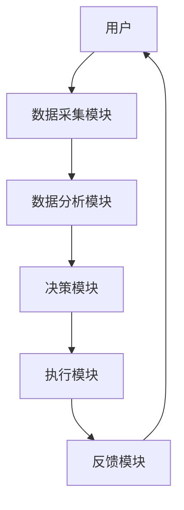

                 


# 企业决策支持系统中的AI Agent角色

> 关键词：AI Agent，企业决策支持系统，决策模型，强化学习，决策树，系统架构

> 摘要：AI Agent在企业决策支持系统中扮演着越来越重要的角色。本文将详细探讨AI Agent的核心概念、算法原理、系统架构以及实际应用。通过案例分析和代码实现，帮助读者理解AI Agent如何提升企业决策效率和准确性。

---

## 第一部分：AI Agent与企业决策支持系统概述

### 第1章：AI Agent的基本概念

#### 1.1 AI Agent的定义与特点
AI Agent（人工智能代理）是一种能够感知环境、自主决策并执行任务的智能实体。其特点包括：
- **自主性**：能够独立运行，无需人工干预。
- **反应性**：能实时感知环境变化并做出反应。
- **目标导向**：基于目标进行决策和行动。
- **学习能力**：通过数据和经验不断优化自身性能。

#### 1.2 企业决策支持系统的基本原理
企业决策支持系统（DSS）是一种利用技术手段辅助企业决策的系统，通常包括数据采集、分析、建模和可视化等模块。其核心功能是通过数据分析提供决策支持，帮助企业做出更明智的选择。

#### 1.3 AI Agent在企业决策支持系统中的作用
AI Agent通过其智能特性，能够显著提升企业决策支持系统的效率和准确性。具体表现在：
- **数据处理**：快速采集、分析和处理大量数据。
- **决策优化**：利用算法优化决策过程，提高决策质量。
- **实时反馈**：实时监控决策效果并提供反馈，确保决策的动态调整。

---

## 第二部分：AI Agent的核心概念与原理

### 第2章：AI Agent的感知模块

#### 2.1 数据采集与处理
AI Agent通过传感器、数据库等多种途径采集数据，并进行清洗、转换和存储。例如，使用Python的Pandas库进行数据清洗：

```python
import pandas as pd
data = pd.read_csv('data.csv')
data.dropna(inplace=True)  # 删除缺失值
data['date'] = pd.to_datetime(data['date'])  # 转换日期格式
```

#### 2.2 数据分析与特征提取
通过数据分析工具（如Python的Scikit-learn库）提取特征，为后续决策提供依据。例如，使用特征选择方法：

```python
from sklearn.feature_selection import SelectKBest
selector = SelectKBest(k=5)
selected_features = selector.fit_transform(data, labels)
```

#### 2.3 数据存储与管理
AI Agent通常使用数据库或大数据平台（如Hadoop、Spark）进行数据存储和管理。例如，使用MySQL存储数据：

```sql
CREATE TABLE sensor_data (
    id INT AUTO_INCREMENT,
    temperature FLOAT,
    timestamp DATETIME,
    PRIMARY KEY (id)
);
```

### 第3章：AI Agent的决策模块

#### 3.1 决策模型的构建
决策模型是AI Agent的核心，常用算法包括强化学习和决策树。例如，使用强化学习中的Q-learning算法：

```python
import numpy as np
from collections import defaultdict

class QLearningAgent:
    def __init__(self, state_space_size, action_space_size):
        self.Q = defaultdict(lambda: np.zeros(action_space_size))
    
    def act(self, state):
        return np.argmax(self.Q[state])
    
    def update(self, state, action, reward, next_state):
        self.Q[state][action] += reward + np.max(self.Q[next_state])
```

#### 3.2 决策逻辑的优化
通过不断训练和优化，提升决策模型的准确性和效率。例如，使用梯度下降优化决策树模型：

```python
from sklearn.tree import DecisionTreeClassifier
from sklearn.model_selection import GridSearchCV

param_grid = {'max_depth': [2, 3, 4]}
grid_search = GridSearchCV(DecisionTreeClassifier(), param_grid)
grid_search.fit(X_train, y_train)
best_model = grid_search.best_estimator_
```

### 第4章：AI Agent的执行模块

#### 4.1 执行策略的制定
根据决策模块的结果制定执行策略。例如，使用规则引擎（如Drools）定义执行规则：

```java
rule "Sales Prediction"
    when
        $salePrediction: SalesPrediction(percentageIncrease > 10)
    then
        sendAlert("Sales prediction exceeds target");
end
```

#### 4.2 执行过程的监控
实时监控执行过程，确保决策的正确性和效率。例如，使用Prometheus监控系统性能：

```yaml
 scrape_configs:
   - job_name: 'agent_metrics'
     scrape_interval: 10s
     target_url: 'http://localhost:8080/metrics'
```

#### 4.3 执行结果的反馈
将执行结果反馈给决策模块，形成闭环。例如，使用Kafka处理实时反馈数据：

```scala
import org.apache.kafka.clients.producers.KafkaProducer
import org.apache.kafka.clients.producers.ProducerRecord

val producer = new KafkaProducer[String, String](config)
val record = new ProducerRecord("feedback-topic", "key", "result")
producer.send(record)
```

---

## 第三部分：AI Agent在企业决策支持系统中的应用

### 第5章：AI Agent的实际案例分析

#### 5.1 销售预测项目
**环境安装**：
```bash
pip install numpy pandas scikit-learn matplotlib
```

**数据预处理**：
```python
import pandas as pd
data = pd.read_csv('sales.csv')
data['date'] = pd.to_datetime(data['date'])
data.set_index('date', inplace=True)
```

**模型训练与预测**：
```python
from sklearn.ensemble import RandomForestRegressor
model = RandomForestRegressor(n_estimators=100)
model.fit(data[['price', 'inventory']], data['sales'])
prediction = model.predict(data[['price', 'inventory']].iloc[-1])
```

**结果分析**：
```python
print(f"预测销售额：{prediction[0]}")
```

---

## 第四部分：系统架构与设计

### 第6章：系统架构设计

#### 6.1 系统功能设计
- 数据采集模块：负责数据的实时采集和预处理。
- 数据分析模块：利用机器学习算法进行数据分析和建模。
- 决策模块：基于模型输出制定决策。
- 执行模块：根据决策结果执行操作并反馈结果。

#### 6.2 系统架构图



---

## 第五部分：总结与展望

### 第7章：最佳实践与注意事项

#### 7.1 小结
本文详细探讨了AI Agent在企业决策支持系统中的角色和应用，从感知、决策到执行的全过程进行了深入分析，并通过实际案例展示了AI Agent的强大能力。

#### 7.2 注意事项
- 数据质量：确保数据的准确性和完整性。
- 模型优化：定期更新模型，避免过时。
- 系统安全：确保系统安全，防止数据泄露。

#### 7.3 拓展阅读
- 《机器学习实战》
- 《深度学习》
- 《企业架构设计》

---

作者：AI天才研究院/AI Genius Institute & 禅与计算机程序设计艺术 /Zen And The Art of Computer Programming

