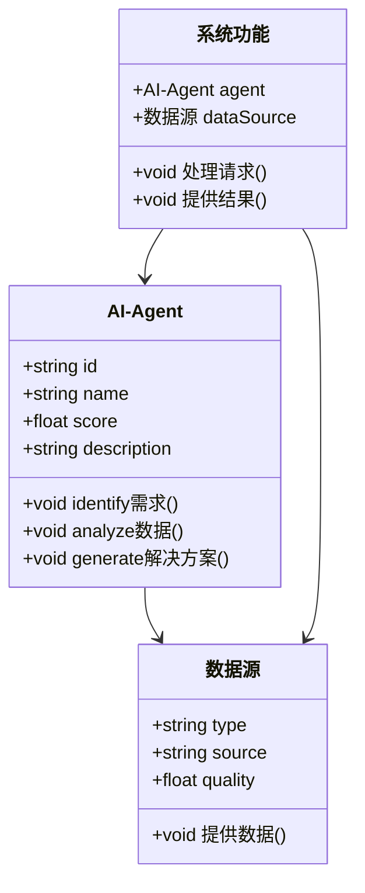
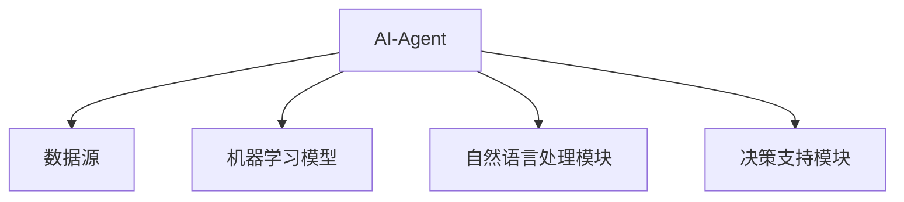
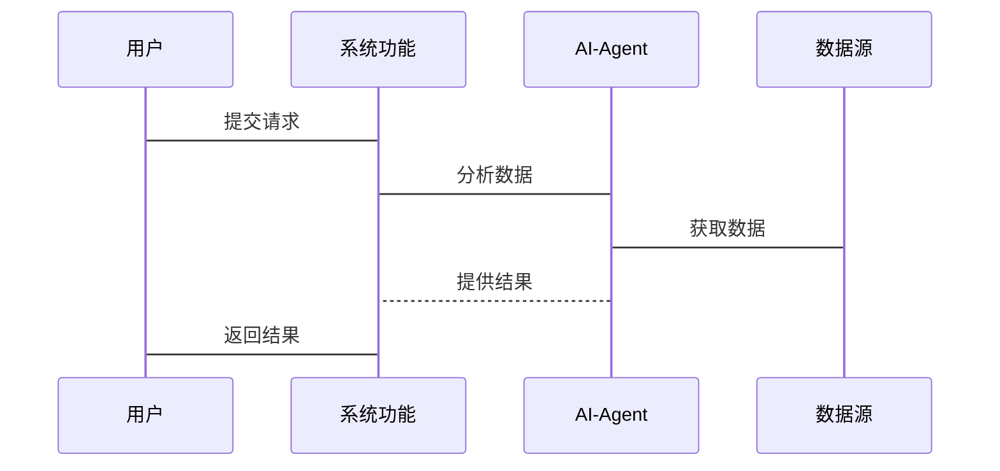

                 


# 《企业如何识别AI Agent的应用需求》

## 关键词：AI Agent，企业需求识别，人工智能，技术博客，算法原理，系统架构

## 摘要：本文详细探讨了企业在识别AI Agent应用需求时的关键步骤和方法。通过分析AI Agent的核心概念、算法原理、系统架构及项目实战，为企业提供了一套完整的解决方案，帮助企业在数字化转型中高效识别和利用AI Agent的应用需求。

---

# 第一部分: AI Agent与企业需求识别的背景介绍

## 第1章: AI Agent的核心概念与问题背景

### 1.1 问题背景

#### 1.1.1 企业数字化转型中的AI Agent需求
企业正面临数字化转型的浪潮，AI Agent作为人工智能技术的重要组成部分，能够帮助企业实现自动化决策和智能交互。然而，企业在实际应用中，往往难以准确识别AI Agent的需求，导致资源浪费和效率低下。

#### 1.1.2 当前企业应用中的痛点与挑战
- 数据量庞大，难以高效处理。
- 业务需求多样化，AI Agent的应用场景复杂。
- 技术门槛高，企业缺乏专业人才。
- 需求识别不准确，导致AI Agent的应用效果不佳。

#### 1.1.3 AI Agent在企业中的潜在价值
通过AI Agent，企业可以实现智能化的客户交互、自动化决策、精准营销和高效运营，从而提升竞争力和利润率。

### 1.2 问题描述

#### 1.2.1 AI Agent的定义与基本特征
AI Agent是一种能够感知环境、自主决策并执行任务的智能体。它具有学习能力、适应性和自主性，能够在复杂环境中完成特定任务。

#### 1.2.2 企业需求识别中的关键问题
企业在识别AI Agent需求时，常常面临以下问题：
- 需求不明确，缺乏清晰的目标。
- 缺乏对AI Agent技术的理解，难以匹配实际应用场景。
- 数据不足或质量不高，影响AI Agent的性能。

#### 1.2.3 AI Agent在需求识别中的作用
AI Agent可以通过分析企业数据、理解业务流程和预测市场需求，帮助企业准确识别AI Agent的应用需求。

### 1.3 问题解决

#### 1.3.1 AI Agent如何解决企业需求识别问题
AI Agent可以通过以下方式解决企业需求识别问题：
- 通过自然语言处理技术，帮助企业从海量数据中提取关键信息。
- 利用机器学习算法，预测市场需求和趋势。
- 提供个性化的解决方案，满足企业的多样化需求。

#### 1.3.2 企业需求识别的流程与方法
企业需求识别的流程包括：
1. 确定目标：明确识别AI Agent需求的目的。
2. 收集数据：获取与需求相关的数据。
3. 分析数据：利用AI技术进行数据挖掘和分析。
4. 提出解决方案：根据分析结果，制定AI Agent的应用方案。

#### 1.3.3 AI Agent在需求识别中的具体应用场景
- 客户服务：通过AI Agent实现智能客服，提高客户满意度。
- 营销：利用AI Agent进行精准营销，提升转化率。
- 运营：通过AI Agent优化企业运营流程，降低成本。

### 1.4 边界与外延

#### 1.4.1 AI Agent的边界条件
- AI Agent的应用范围有限，需要在特定场景下使用。
- 依赖于高质量的数据和先进的算法。

#### 1.4.2 企业需求识别的范围界定
- 需求识别的范围应与企业目标一致，避免超出实际需求。
- 需求识别的范围应涵盖企业内外部因素。

#### 1.4.3 AI Agent与其他技术的区分与联系
- 区分：AI Agent是一种智能体，而其他技术如机器学习、自然语言处理是其组成部分。
- 联系：AI Agent依赖于这些技术实现其功能。

### 1.5 概念结构与核心要素

#### 1.5.1 AI Agent的核心要素分析
- 感知能力：通过传感器或数据源获取环境信息。
- 决策能力：基于感知信息做出决策。
- 执行能力：根据决策执行任务。

#### 1.5.2 企业需求识别的关键因素
- 企业目标：明确识别AI Agent需求的目的。
- 业务流程：了解企业的业务流程和痛点。
- 数据资源：企业的数据质量和可用性。

#### 1.5.3 AI Agent与企业需求的关联模型
通过构建关联模型，可以明确AI Agent在企业需求识别中的作用和价值。

### 1.6 本章小结
本章通过分析AI Agent的核心概念和企业需求识别的关键问题，明确了AI Agent在企业中的潜在价值和应用场景，为后续章节的深入探讨奠定了基础。

---

## 第2章: AI Agent的核心概念与原理

### 2.1 AI Agent的基本原理

#### 2.1.1 AI Agent的定义与分类
- AI Agent是一种能够感知环境、自主决策并执行任务的智能体。
- 分为基于规则的AI Agent和基于学习的AI Agent。

#### 2.1.2 AI Agent的核心算法与技术
- 机器学习：用于训练AI Agent的决策模型。
- 自然语言处理：用于理解和生成自然语言文本。
- 强化学习：用于优化AI Agent的决策策略。

#### 2.1.3 AI Agent的决策机制
- 基于规则的决策：通过预定义的规则进行决策。
- 基于学习的决策：通过机器学习模型进行预测和决策。

### 2.2 AI Agent与企业需求识别的联系

#### 2.2.1 企业需求识别的关键环节
- 数据收集：获取与需求相关的数据。
- 数据分析：利用AI技术进行数据挖掘和分析。
- 需求提取：从数据中提取关键需求信息。

#### 2.2.2 AI Agent在需求识别中的具体应用
- 数据清洗：通过AI Agent自动清理数据中的噪声。
- 数据分析：利用AI Agent进行数据挖掘和预测。
- 需求生成：基于分析结果生成需求文档。

#### 2.2.3 AI Agent如何优化企业需求识别流程
- 提高效率：通过自动化技术减少人工干预。
- 提高准确性：利用AI技术提升需求识别的准确性。
- 提高灵活性：适应不同的业务需求和变化。

### 2.3 AI Agent的核心算法解析

#### 2.3.1 机器学习算法在AI Agent中的应用
- 决策树：用于分类和回归任务。
- 支持向量机：用于分类和回归任务。
- 随机森林：用于分类、回归和聚类任务。

#### 2.3.2 自然语言处理技术在需求识别中的作用
- 分词：将文本分割成词语。
- 词性标注：标注词语的词性。
- 句法分析：分析句子的语法结构。
- 情感分析：分析文本的情感倾向。

#### 2.3.3 强化学习在AI Agent决策中的应用
- 状态空间：AI Agent所处的环境状态。
- 行动空间：AI Agent可以采取的行动。
- 奖励函数：定义AI Agent的奖励机制。

### 2.4 AI Agent的属性特征对比

#### 2.4.1 不同AI Agent模型的对比分析
- 基于规则的AI Agent vs. 基于学习的AI Agent
- 简单AI Agent vs. 复杂AI Agent

#### 2.4.2 企业需求识别中的AI Agent选择
- 根据需求复杂度选择合适的AI Agent模型。
- 根据数据量和数据质量选择合适的算法。

### 2.5 本章小结
本章详细介绍了AI Agent的核心概念和基本原理，并分析了其在企业需求识别中的具体应用，为后续章节的系统设计和项目实战奠定了理论基础。

---

## 第3章: AI Agent的算法原理与实现

### 3.1 AI Agent的算法原理

#### 3.1.1 机器学习算法的实现步骤
1. 数据预处理：清洗数据，提取特征。
2. 模型训练：选择合适的算法，训练模型。
3. 模型评估：通过测试数据评估模型性能。
4. 模型优化：调整参数，提高模型性能。

#### 3.1.2 自然语言处理技术的实现步骤
1. 分词：将文本分割成词语。
2. 词性标注：标注词语的词性。
3. 句法分析：分析句子的语法结构。
4. 实体识别：识别文本中的实体。

#### 3.1.3 强化学习算法的实现步骤
1. 状态空间定义：明确AI Agent所处的环境状态。
2. 行动空间定义：明确AI Agent可以采取的行动。
3. 奖励机制设计：定义奖励函数，指导AI Agent的学习方向。
4. 策略优化：通过强化学习算法优化AI Agent的策略。

### 3.2 AI Agent的实现过程

#### 3.2.1 算法选择与实现
- 根据需求选择合适的算法，例如决策树、支持向量机、随机森林等。
- 使用Python的机器学习库（如scikit-learn）实现算法。

#### 3.2.2 数据处理与特征工程
- 数据清洗：处理缺失值、异常值。
- 特征提取：选择对目标变量有较大影响的特征。
- 数据标准化：对数据进行标准化或归一化处理。

#### 3.2.3 模型训练与评估
- 使用训练数据训练模型。
- 通过测试数据评估模型的性能，例如准确率、召回率、F1值等。

### 3.3 代码实现与解读

#### 3.3.1 环境安装
```bash
pip install numpy scikit-learn matplotlib
```

#### 3.3.2 核心代码实现
```python
from sklearn.tree import DecisionTreeClassifier
from sklearn.model_selection import train_test_split
from sklearn.metrics import accuracy_score

# 数据加载与预处理
data = [...]  # 加载数据
X = data.drop(columns=['target'])  # 特征数据
y = data['target']  # 标签数据

# 数据分割
X_train, X_test, y_train, y_test = train_test_split(X, y, test_size=0.2)

# 模型训练
model = DecisionTreeClassifier()
model.fit(X_train, y_train)

# 模型预测
y_pred = model.predict(X_test)

# 模型评估
print("Accuracy:", accuracy_score(y_test, y_pred))
```

#### 3.3.3 代码解读
- 数据加载与预处理：加载数据并进行必要的清洗和特征提取。
- 数据分割：将数据分为训练集和测试集。
- 模型训练：使用决策树算法训练模型。
- 模型预测：使用测试数据进行预测。
- 模型评估：计算模型的准确率。

### 3.4 本章小结
本章通过详细讲解AI Agent的算法原理和实现过程，帮助读者理解如何通过代码实现AI Agent的需求识别功能，为后续章节的系统设计和项目实战提供了技术支持。

---

## 第4章: AI Agent的系统分析与架构设计

### 4.1 问题场景介绍

#### 4.1.1 企业需求识别的典型场景
- 客户服务：通过AI Agent实现智能客服。
- 营销：利用AI Agent进行精准营销。
- 运营：通过AI Agent优化企业运营流程。

#### 4.1.2 AI Agent在企业中的具体应用场景
- 客户交互：通过AI Agent实现智能对话。
- 数据分析：利用AI Agent进行数据挖掘和预测。
- 决策支持：通过AI Agent提供决策支持。

### 4.2 系统功能设计

#### 4.2.1 领域模型类图


#### 4.2.2 系统架构图


#### 4.2.3 接口设计
- 数据接口：提供数据输入和输出接口。
- 模型接口：提供机器学习模型的调用接口。
- 用户接口：提供与用户的交互接口。

#### 4.2.4 交互流程图


### 4.3 本章小结
本章通过系统分析和架构设计，明确了AI Agent在企业需求识别中的具体实现方式，为后续章节的项目实战奠定了基础。

---

## 第5章: AI Agent的项目实战

### 5.1 环境安装与配置

#### 5.1.1 Python环境安装
```bash
python --version
pip install numpy scikit-learn pandas
```

#### 5.1.2 项目依赖安装
```bash
pip install -r requirements.txt
```

### 5.2 核心代码实现

#### 5.2.1 数据预处理
```python
import pandas as pd
import numpy as np

# 数据加载
data = pd.read_csv('需求数据.csv')

# 数据清洗
data.dropna(inplace=True)
data = data[~data.duplicated()]

# 特征提取
X = data.drop(columns=['target'])
y = data['target']
```

#### 5.2.2 模型训练
```python
from sklearn.tree import DecisionTreeClassifier
from sklearn.model_selection import train_test_split
from sklearn.metrics import accuracy_score

X_train, X_test, y_train, y_test = train_test_split(X, y, test_size=0.2)

model = DecisionTreeClassifier()
model.fit(X_train, y_train)
```

#### 5.2.3 模型预测与评估
```python
y_pred = model.predict(X_test)
print("Accuracy:", accuracy_score(y_test, y_pred))
```

### 5.3 代码解读与分析

#### 5.3.1 数据预处理
- 数据清洗：去除缺失值和重复值。
- 特征提取：选择与目标变量相关的特征。

#### 5.3.2 模型训练
- 使用决策树算法训练模型。
- 调整模型参数，优化模型性能。

#### 5.3.3 模型预测与评估
- 使用测试数据进行预测。
- 通过准确率评估模型性能。

### 5.4 案例分析与详细讲解

#### 5.4.1 案例背景
假设某企业需要识别AI Agent在客户服务中的应用需求。

#### 5.4.2 数据分析
- 数据来源：客户咨询记录。
- 数据预处理：去除重复记录和缺失值。
- 特征提取：提取客户咨询内容、时间戳等特征。

#### 5.4.3 模型选择与实现
- 选择决策树算法进行分类任务。
- 模型训练：训练AI Agent识别客户需求。
- 模型预测：预测客户需求并生成解决方案。

### 5.5 项目小结

#### 5.5.1 项目总结
- 通过AI Agent实现了客户需求识别。
- 提高了企业的客户满意度和效率。

#### 5.5.2 经验总结
- 数据质量对企业需求识别至关重要。
- 模型选择和调优直接影响AI Agent的性能。
- 与业务需求紧密结合，确保AI Agent的应用效果。

---

## 第6章: AI Agent的最佳实践与注意事项

### 6.1 最佳实践

#### 6.1.1 数据质量管理
- 确保数据的完整性和准确性。
- 处理数据中的噪声和异常值。

#### 6.1.2 模型选择与调优
- 根据需求选择合适的算法。
- 通过交叉验证优化模型参数。

#### 6.1.3 与业务需求结合
- 理解企业的具体需求和应用场景。
- 确保AI Agent的应用与企业目标一致。

### 6.2 小结

#### 6.2.1 总结
AI Agent的应用需求识别是一个复杂而重要的过程，需要企业充分理解需求，合理选择和优化算法，并与业务需求紧密结合。

#### 6.2.2 注意事项
- 数据质量直接影响AI Agent的性能。
- 模型选择和调优是关键。
- 与业务需求结合是确保应用效果的前提。

### 6.3 拓展阅读

#### 6.3.1 推荐书籍
- 《机器学习实战》
- 《自然语言处理入门》

#### 6.3.2 推荐博客
- 知乎专栏：人工智能入门
- 博客园：机器学习笔记

---

## 第7章: 总结与展望

### 7.1 总结
本文详细探讨了企业如何识别AI Agent的应用需求，通过分析AI Agent的核心概念、算法原理、系统架构和项目实战，为企业提供了一套完整的解决方案。

### 7.2 展望
未来，随着人工智能技术的不断发展，AI Agent将在企业需求识别中发挥更大的作用。企业需要紧跟技术趋势，不断提升自身的技术能力和业务能力，以更好地利用AI Agent实现数字化转型。

---

## 作者：AI天才研究院/AI Genius Institute & 禅与计算机程序设计艺术 /Zen And The Art of Computer Programming

---

### 结语
通过本文的详细讲解，读者可以全面理解企业如何识别AI Agent的应用需求，并能够在实际工作中应用这些方法和技巧。希望本文能够为企业在数字化转型中提供有价值的参考和指导。

