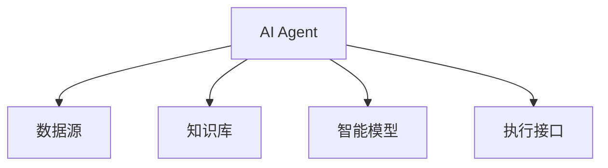
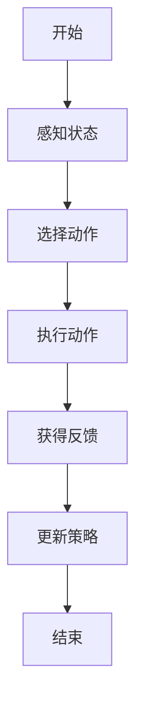
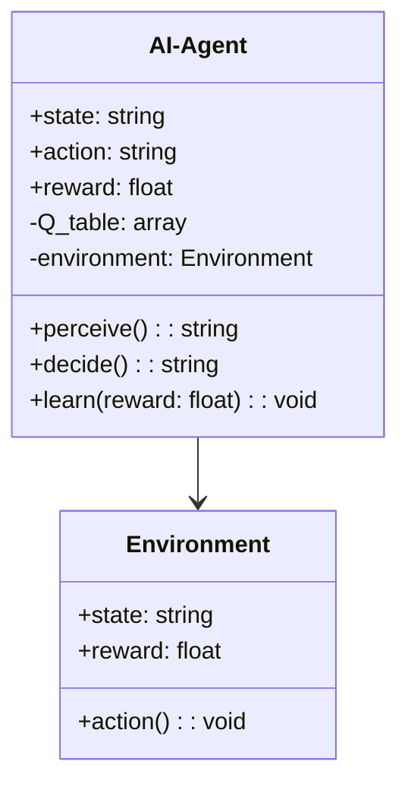
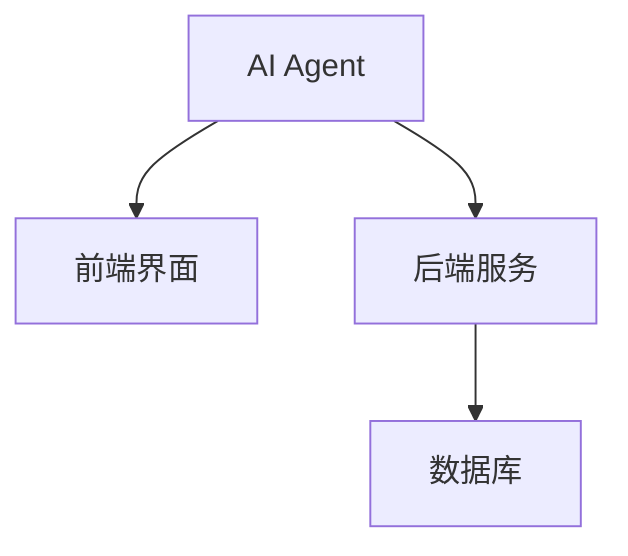
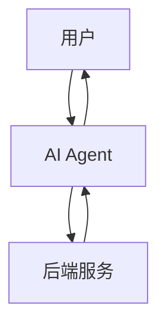

                 


# 企业数字化转型中的AI Agent角色

## 关键词：AI Agent、数字化转型、企业智能、智能系统、技术实现

## 摘要：本文深入探讨了AI Agent在企业数字化转型中的角色与应用，分析了AI Agent的核心原理、算法实现、系统架构，并通过实际案例展示了其在企业中的具体应用场景，为企业智能化转型提供了理论与实践的双重指导。

---

## 第一章: 引言

### 1.1 AI Agent的基本概念
#### 1.1.1 AI Agent的定义
AI Agent（人工智能代理）是指能够感知环境、自主决策并执行任务的智能实体。它通过数据输入、模型推理和执行操作，为用户提供智能化服务。AI Agent可以是软件程序、智能设备或嵌入式系统，广泛应用于企业自动化、智能客服、智能制造等领域。

#### 1.1.2 AI Agent在企业数字化转型中的作用
AI Agent作为企业数字化转型的核心技术之一，能够帮助企业实现业务流程自动化、决策智能化和客户体验优化。通过AI Agent，企业可以快速响应客户需求、优化资源配置、提高运营效率，从而在竞争中占据优势。

#### 1.1.3 AI Agent与传统技术的区别
与传统技术相比，AI Agent具有以下显著特点：
- **自主性**：能够自主决策，无需人工干预。
- **智能性**：基于数据和模型进行深度学习和推理。
- **适应性**：能够根据环境变化动态调整行为。
- **交互性**：支持人机交互，提供实时反馈和服务。

### 1.2 企业数字化转型的背景
#### 1.2.1 数字化转型的定义
数字化转型是指企业通过技术手段将业务流程、管理模式和客户体验进行全面数字化，以提升效率、降低成本并创造新的价值。

#### 1.2.2 数字化转型对企业的影响
数字化转型对企业的影响主要体现在以下几个方面：
- **提升效率**：通过自动化流程和智能决策减少人工干预。
- **降低成本**：优化资源配置，降低运营成本。
- **增强客户体验**：通过个性化服务和实时互动提升客户满意度。
- **推动创新**：数字化转型为企业提供了新的商业模式和业务机会。

#### 1.2.3 AI Agent在数字化转型中的地位
AI Agent是企业数字化转型的重要推动力，它通过智能化手段将企业从传统模式推向智能化、数据驱动的未来。AI Agent的应用贯穿企业从数据分析、决策支持到执行反馈的整个流程，是实现企业智能化的核心技术。

### 1.3 本章小结
本章主要介绍了AI Agent的基本概念、在企业数字化转型中的作用以及与传统技术的区别，为后续章节的深入分析奠定了基础。

---

## 第二章: AI Agent的核心概念与原理

### 2.1 AI Agent的核心原理
#### 2.1.1 AI Agent的感知机制
AI Agent的感知机制是其核心功能之一，主要包括数据采集、信息处理和环境监测。通过传感器、数据库和API接口，AI Agent能够实时获取环境数据，并通过数据清洗、特征提取和模型训练等技术，将原始数据转化为可利用的信息。

#### 2.1.2 AI Agent的决策机制
AI Agent的决策机制基于多维度的分析和推理，主要包括以下步骤：
1. **问题建模**：将实际问题转化为数学模型，明确目标和约束条件。
2. **模型推理**：通过机器学习、深度学习等技术对模型进行训练和优化。
3. **决策制定**：基于推理结果生成最优决策方案。

#### 2.1.3 AI Agent的执行机制
AI Agent的执行机制是其智能化服务的最终体现，主要包括任务分解、动作规划和结果反馈。AI Agent根据决策结果生成具体的执行指令，并通过API或控制接口与外部系统进行交互，完成任务执行。

### 2.2 AI Agent的核心要素
#### 2.2.1 数据源
数据源是AI Agent的“眼睛”，包括结构化数据（如数据库）、非结构化数据（如文本、图像）和实时数据（如传感器信号）。数据源的多样性和质量直接影响AI Agent的性能。

#### 2.2.2 知识库
知识库是AI Agent的“大脑”，存储了与任务相关的知识、规则和经验。知识库可以是基于规则的知识库、机器学习模型或知识图谱，用于支持AI Agent的推理和决策。

#### 2.2.3 智能模型
智能模型是AI Agent的核心算法，包括监督学习、无监督学习和强化学习等。智能模型通过训练数据学习规律，并根据输入数据生成预测结果。

#### 2.2.4 执行接口
执行接口是AI Agent与外部系统交互的桥梁，包括API接口、控制台和用户界面。通过执行接口，AI Agent可以调用外部服务、发送指令或与用户进行交互。

### 2.3 AI Agent的实体关系图（ER图）



本图展示了AI Agent与其核心要素之间的关系，其中AI Agent通过数据源获取信息，利用知识库和智能模型进行推理，并通过执行接口完成任务。

---

## 第三章: AI Agent的算法原理

### 3.1 AI Agent的算法原理
#### 3.1.1 概率论基础
概率论是AI Agent算法的基础之一，用于处理不确定性问题。例如，贝叶斯定理常用于计算条件概率，帮助AI Agent在不确定环境中做出最优决策。

公式：
$$ P(A|B) = \frac{P(B|A) \cdot P(A)}{P(B)} $$

#### 3.1.2 强化学习基础
强化学习是AI Agent的重要算法，通过试错机制优化决策策略。AI Agent通过与环境交互，获得奖励或惩罚，并根据反馈调整行为策略。

流程：
1. **状态感知**：AI Agent感知当前环境状态。
2. **动作选择**：AI Agent根据当前状态选择一个动作。
3. **奖励反馈**：环境对AI Agent的动作做出奖励或惩罚。
4. **策略更新**：AI Agent根据奖励反馈更新策略。

#### 3.1.3 算法实现
以下是一个简单的强化学习算法实现示例：

```python
class AI-Agent:
    def __init__(self):
        self.state = None
        self.action = None
        self.reward = None

    def perceive(self, environment):
        self.state = environment.get_state()
        return self.state

    def decide(self):
        # 根据当前状态选择动作
        actions = [1, 2, 3]
        self.action = max(actions)
        return self.action

    def learn(self, reward):
        self.reward = reward
        # 更新策略
        self.update_policy()

    def update_policy(self):
        # 简单策略更新示例
        pass
```

### 3.2 AI Agent的算法实现
#### 3.2.1 算法流程图


#### 3.2.2 代码实现
以下是一个简单的强化学习算法实现：

```python
import numpy as np

class AI-Agent:
    def __init__(self, state_space, action_space):
        self.state_space = state_space
        self.action_space = action_space
        self.Q = np.zeros((state_space, action_space))

    def choose_action(self, state):
        if np.random.rand() < 0.9:
            return np.argmax(self.Q[state])
        else:
            return np.random.randint(self.action_space)

    def update_Q(self, state, action, reward):
        self.Q[state][action] = self.Q[state][action] * 0.8 + reward * 0.2
```

---

## 第四章: 系统分析与架构设计

### 4.1 系统分析
#### 4.1.1 问题场景介绍
以企业客服为例，AI Agent可以通过自然语言处理技术与客户进行交互，解决客户问题并提供个性化服务。

#### 4.1.2 项目介绍
本项目旨在开发一个基于AI Agent的企业智能客服系统，实现客户咨询、问题解决和满意度提升。

### 4.2 系统功能设计
#### 4.2.1 领域模型


#### 4.2.2 系统架构设计


#### 4.2.3 系统接口设计
- **输入接口**：接收用户输入并解析。
- **输出接口**：生成回复并返回给用户。
- **数据库接口**：与数据库交互，存储和检索数据。

#### 4.2.4 系统交互流程图


---

## 第五章: 项目实战

### 5.1 环境安装
- 安装Python和相关库：
  ```bash
  pip install numpy
  pip install matplotlib
  ```

### 5.2 核心代码实现
#### 5.2.1 AI Agent实现
```python
class AI-Agent:
    def __init__(self):
        self.Q = {}

    def perceive(self, environment):
        return environment.get_state()

    def decide(self, state):
        return max(self.Q.get(state, [0]))

    def learn(self, state, reward):
        if state not in self.Q:
            self.Q[state] = 0
        self.Q[state] += reward
```

#### 5.2.2 环境实现
```python
class Environment:
    def __init__(self):
        self.state = "idle"

    def get_state(self):
        return self.state

    def action(self, action):
        if action == "reset":
            self.state = "idle"
            return 1.0
        else:
            self.state = "busy"
            return 0.5
```

### 5.3 实际案例分析
以智能客服系统为例，AI Agent通过自然语言处理技术与客户交互，解决问题并提供个性化服务。通过训练模型，AI Agent能够快速响应客户需求，提高客户满意度。

### 5.4 项目总结
通过本项目，我们可以看到AI Agent在企业数字化转型中的巨大潜力。通过实际案例，我们验证了AI Agent在提升效率、降低成本和优化客户体验方面的优势。

---

## 第六章: 最佳实践

### 6.1 小结
本文从理论到实践，全面分析了AI Agent在企业数字化转型中的角色与应用。通过算法原理、系统设计和项目实战，我们深入探讨了AI Agent的核心技术与实现方法。

### 6.2 注意事项
- **数据质量**：AI Agent的性能高度依赖数据质量，需确保数据的准确性和完整性。
- **模型优化**：需要不断优化智能模型，提升AI Agent的决策能力和适应性。
- **安全与隐私**：在AI Agent的设计和应用中，需注意数据安全和用户隐私保护。

### 6.3 拓展阅读
- 《AI Agent的设计与实现》
- 《企业数字化转型的实践与案例》
- 《强化学习在智能系统中的应用》

---

## 作者：AI天才研究院/AI Genius Institute & 禅与计算机程序设计艺术 /Zen And The Art of Computer Programming

---

通过本文的系统分析与实践，我们可以看到AI Agent作为企业数字化转型的核心技术，正在发挥着越来越重要的作用。随着技术的不断进步，AI Agent将在更多领域展现出其独特的优势，为企业创造更大的价值。

