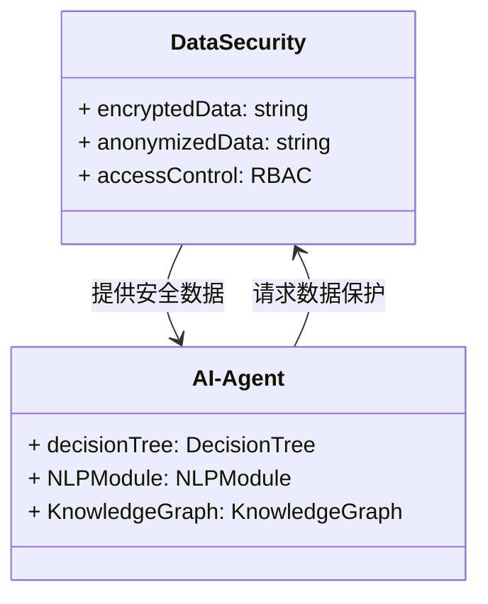
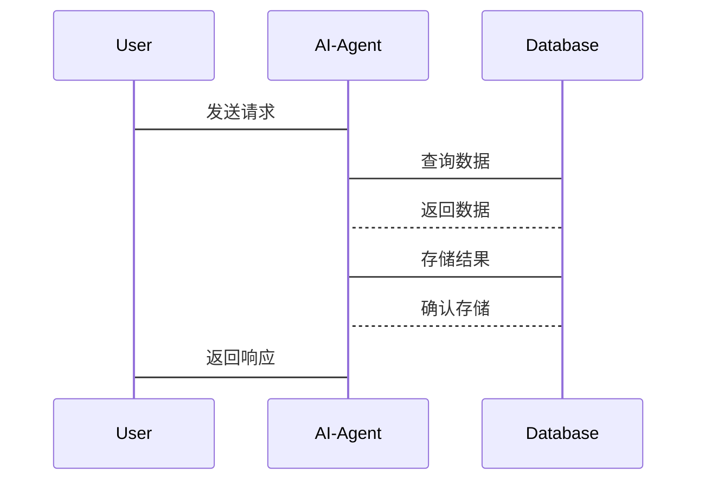

                 


# 企业数据安全与AI Agent开发：平衡创新与风险

## 关键词：企业数据安全，AI Agent，数据隐私，人工智能，系统架构，数据加密，自然语言处理

## 摘要：  
随着人工智能技术的快速发展，AI Agent在企业中的应用越来越广泛，但随之而来的是数据安全的风险。本文将深入探讨企业数据安全与AI Agent开发之间的关系，分析如何在创新与风险之间找到平衡点。通过详细的技术分析和实际案例，本文将为企业提供数据安全与AI Agent开发的最佳实践建议。

---

# 第一章: 企业数据安全与AI Agent开发概述

## 1.1 企业数据安全的重要性

### 1.1.1 数据安全的定义与核心要素  
数据安全是指通过技术手段和管理措施，保护数据的机密性、完整性和可用性。核心要素包括：  
- **机密性**：防止未经授权的访问。  
- **完整性**：确保数据未被篡改。  
- **可用性**：保证合法用户能访问数据。  

### 1.1.2 企业数据安全的挑战与风险  
- **内部威胁**：员工误操作或恶意行为。  
- **外部攻击**：黑客攻击、钓鱼攻击等。  
- **数据泄露**：未经授权的数据暴露风险。  

### 1.1.3 数据安全对企业业务的影响  
数据是企业的核心资产，数据泄露可能导致巨大的经济损失、声誉损害以及法律责任。

## 1.2 AI Agent开发的背景与趋势

### 1.2.1 AI Agent的定义与特点  
AI Agent是一种能够感知环境并自主决策的智能体，具备以下特点：  
- **自主性**：无需人工干预。  
- **反应性**：能实时感知环境变化。  
- **学习能力**：通过数据不断优化性能。  

### 1.2.2 AI Agent在企业中的应用场景  
- **智能客服**：提供24/7的客户支持。  
- **自动化运维**：监控系统并自动修复问题。  
- **数据分析助手**：辅助数据科学家进行复杂分析。  

### 1.2.3 AI Agent开发的技术挑战  
- **数据隐私问题**：AI Agent需要处理大量敏感数据。  
- **算法复杂性**：复杂算法对计算资源要求高。  
- **可靠性问题**：AI Agent的决策必须高度可靠。  

## 1.3 企业数据安全与AI Agent开发的关联性

### 1.3.1 数据安全对AI Agent开发的影响  
- **数据隐私保护**：AI Agent需要处理的数据可能涉及用户隐私，必须确保数据加密和脱敏。  
- **安全合规**：企业需要遵守数据保护法规（如GDPR）。  

### 1.3.2 AI Agent在数据安全中的潜在应用  
- **异常检测**：通过AI Agent分析日志，发现潜在的安全威胁。  
- **身份验证**：利用AI Agent进行多因素身份验证。  

### 1.3.3 平衡创新与风险的核心理念  
在AI Agent开发中，企业需要在创新和数据安全之间找到平衡点，既要推动技术进步，又要确保数据安全。

---

# 第二章: 企业数据安全的体系架构

## 2.1 数据分类与分级管理

### 2.1.1 数据分类的常见方法  
- **按用途分类**：如交易数据、用户数据。  
- **按敏感程度分类**：如高敏感数据、低敏感数据。  

### 2.1.2 数据分级的策略与实施  
数据分级基于其敏感性和业务影响，分为：  
- **机密级**：最高敏感性数据。  
- **秘密级**：次高敏感性数据。  
- **公用级**：非敏感性数据。  

### 2.1.3 数据分类分级对安全策略的影响  
- 数据分类分级决定了访问权限和保护措施。  

## 2.2 数据访问控制机制

### 2.2.1 基于角色的访问控制（RBAC）  
- **角色定义**：如管理员、普通用户。  
- **权限分配**：基于角色分配访问权限。  

### 2.2.2 最小权限原则  
- 用户只能访问完成任务所需的最小权限。  

### 2.2.3 数据加密与脱敏技术  
- **加密技术**：如AES加密。  
- **脱敏技术**：如数据掩码。  

## 2.3 数据安全监控与应急响应

### 2.3.1 数据安全事件的监测方法  
- **日志分析**：监控系统日志，发现异常行为。  
- **行为分析**：基于机器学习的异常检测。  

### 2.3.2 应急响应流程与预案  
- **应急预案**：制定数据泄露后的应对步骤。  
- **团队协作**：明确团队成员的职责分工。  

### 2.3.3 数据安全监控的工具与技术  
- **SIEM（安全信息和事件管理）**：如Splunk、ELK。  
- **机器学习模型**：用于预测安全威胁。  

---

# 第三章: AI Agent的核心算法与技术

## 3.1 AI Agent的感知与决策算法

### 3.1.1 机器学习算法在AI Agent中的应用  
- **决策树**：用于分类和回归问题。  
- **随机森林**：用于特征选择和模型优化。  
- **支持向量机（SVM）**：用于分类任务。  

### 3.1.2 自然语言处理技术在AI Agent中的应用  
- **分词**：将文本分割成词语。  
- **实体识别**：识别文本中的实体。  
- **情感分析**：分析文本情感倾向。  

### 3.1.3 决策树与强化学习在AI Agent中的应用  
- **决策树**：用于分类和回归问题。  
- **强化学习**：通过奖励机制优化决策策略。  

## 3.2 AI Agent的交互与推理机制

### 3.2.1 人机交互的核心技术  
- **语音识别**：通过语音指令与AI Agent交互。  
- **自然语言理解（NLU）**：理解用户意图。  

### 3.2.2 知识图谱构建与推理  
- **知识图谱**：构建领域知识图谱。  
- **推理引擎**：基于知识图谱进行推理。  

### 3.2.3 对话系统的设计与优化  
- **对话管理**：管理对话流程。  
- **上下文理解**：理解对话上下文。  

## 3.3 AI Agent的系统架构与设计

### 3.3.1 AI Agent的分层架构设计  
- **感知层**：负责数据采集和处理。  
- **决策层**：负责策略制定和决策。  
- **执行层**：负责任务执行和反馈。  

### 3.3.2 微服务架构在AI Agent中的应用  
- **服务拆分**：将功能模块化为微服务。  
- **服务通信**：通过API进行服务间通信。  

### 3.3.3 AI Agent的可扩展性设计  
- **模块化设计**：便于功能扩展。  
- **动态加载**：支持动态加载新模块。  

---

# 第四章: 企业数据安全与AI Agent开发的结合

## 4.1 AI Agent开发中的数据隐私保护

### 4.1.1 数据加密与脱敏技术  
- **数据加密**：在传输和存储过程中加密数据。  
- **数据脱敏**：在处理过程中隐藏敏感信息。  

### 4.1.2 数据匿名化技术  
- **数据匿名化**：通过技术手段去除数据中的个人身份信息。  

### 4.1.3 数据共享与隐私保护  
- **联邦学习**：在数据不离开本地的情况下进行模型训练。  
- **安全多方计算**：在不泄露数据的情况下进行计算。  

## 4.2 AI Agent开发中的数据安全合规

### 4.2.1 数据保护法规与合规要求  
- **GDPR**：欧盟《通用数据保护条例》。  
- **CCPA**：美国《加州消费者隐私法案》。  

### 4.2.2 数据安全审计与合规性检查  
- **定期审计**：检查数据处理过程是否符合法规要求。  
- **合规性检查**：确保系统设计符合数据保护要求。  

---

# 第五章: 系统分析与架构设计方案

## 5.1 项目介绍

### 5.1.1 项目背景  
开发一个具备数据安全保护的AI Agent系统。  

### 5.1.2 项目目标  
实现一个支持数据加密、脱敏和匿名化的AI Agent系统。  

## 5.2 系统功能设计

### 5.2.1 领域模型设计  


### 5.2.2 系统架构设计  


### 5.2.3 系统接口设计  
- **API接口**：提供RESTful API，供前端调用。  
- **数据接口**：与数据库进行交互。  

### 5.2.4 系统交互设计  


---

# 第六章: 项目实战

## 6.1 环境安装

### 6.1.1 安装Python环境  
- 使用Anaconda安装Python 3.9及以上版本。  

### 6.1.2 安装依赖库  
- **机器学习库**：scikit-learn、xgboost。  
- **自然语言处理库**：spaCy、NLTK。  
- **数据加密库**：cryptography、bcrypt。  

## 6.2 系统核心实现源代码

### 6.2.1 数据加密模块  
```python
from cryptography.fernet import Fernet

class DataEncryptor:
    def __init__(self):
        self.key = Fernet.generate_key()
        self.cipher = Fernet(self.key)
    
    def encrypt(self, data):
        return self.cipher.encrypt(data.encode())
    
    def decrypt(self, encrypted_data):
        return self.cipher.decrypt(encrypted_data).decode()
```

### 6.2.2 自然语言处理模块  
```python
import spacy

nlp = spacy.load("en_core_web_sm")

def process_text(text):
    doc = nlp(text)
    entities = [(ent.text, ent.label_) for ent in doc.ents]
    return entities
```

### 6.2.3 AI Agent决策树实现  
```python
from sklearn.tree import DecisionTreeClassifier

class AIAgent:
    def __init__(self):
        self.model = DecisionTreeClassifier()
    
    def train(self, X, y):
        self.model.fit(X, y)
    
    def predict(self, X):
        return self.model.predict(X)
```

## 6.3 实际案例分析

### 6.3.1 数据分类案例  
- **输入数据**：用户行为日志。  
- **处理步骤**：使用决策树进行用户行为分类。  
- **结果**：识别异常行为并进行报警。  

### 6.3.2 自然语言处理案例  
- **输入数据**：用户反馈文本。  
- **处理步骤**：使用NLP模块提取关键实体。  
- **结果**：生成结构化数据供AI Agent决策。  

---

# 第七章: 总结与展望

## 7.1 总结

### 7.1.1 数据安全的核心作用  
数据安全是AI Agent开发的基础，必须优先考虑。  

### 7.1.2 AI Agent开发的技术挑战  
AI Agent开发需要平衡创新与风险，确保数据安全。  

## 7.2 展望

### 7.2.1 未来技术趋势  
- **AI Agent与区块链结合**：实现更高效的数据安全保护。  
- **AI Agent与边缘计算结合**：提高数据处理的实时性。  

### 7.2.2 数据安全与AI Agent的协同发展  
随着技术的进步，数据安全与AI Agent将更加紧密地结合，推动企业智能化发展。  

---

# 作者  
作者：AI天才研究院 & 禅与计算机程序设计艺术

